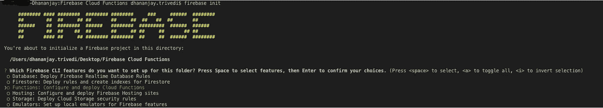
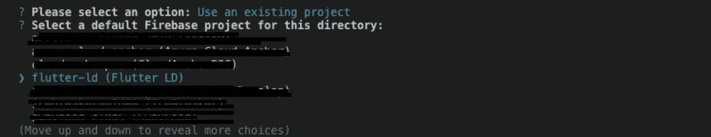
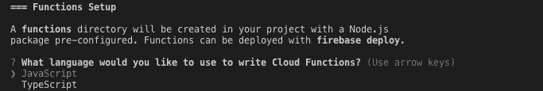
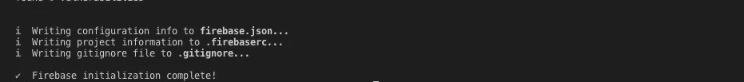
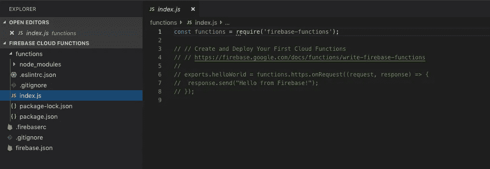
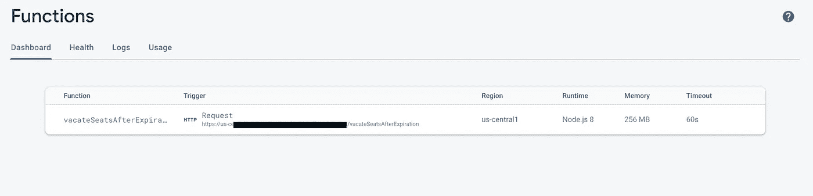
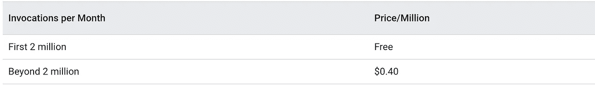
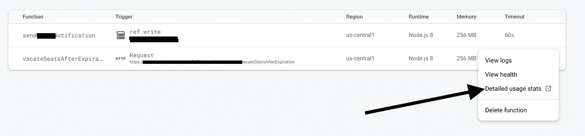
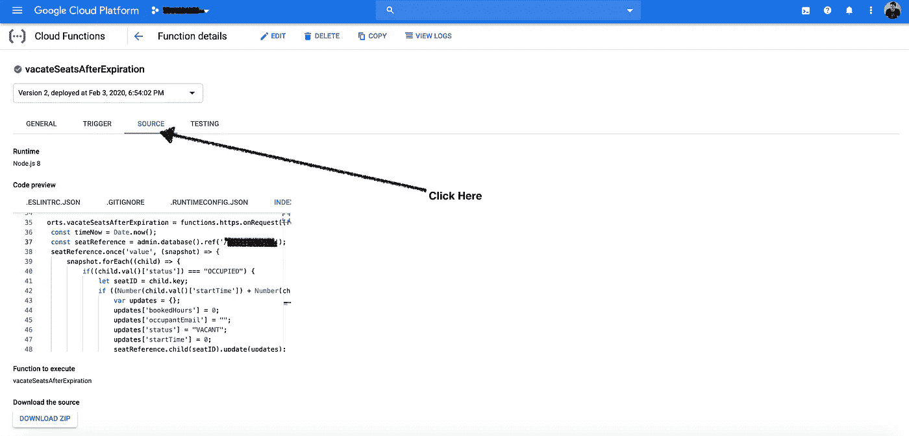

# 如何编写和部署 Firebase 云函数

> 原文：<https://betterprogramming.pub/how-to-write-and-deploy-firebase-cloud-functions-e5bf5270a5be>

## 消防基地 101


[NESA 摄制作者](https://unsplash.com/@nesabymakers?utm_source=unsplash&utm_medium=referral&utm_content=creditCopyText)在 [Unsplash](https://unsplash.com/s/photos/teach?utm_source=unsplash&utm_medium=referral&utm_content=creditCopyText)

我已经使用 [Firebase 数据库](https://firebase.google.com/docs/database)为后端构建移动应用程序有一段时间了，虽然有很好的文档和支持来帮助我使用数据库和大多数其他服务，但我在部署 Firebase 云功能时面临一些挑战。

我将教授如何编写和部署 Firebase 云函数，并尝试涵盖一些有用的场景。

我们今天将讨论的内容:

1.  设置项目。
2.  写云函数。
3.  部署云功能。
4.  如何部署多个功能？
5.  如何通过可视化编辑器查看和编辑云函数？

让我们从编写和部署我们的第一个云函数开始。

# 1.设置项目


[张家瑜](https://unsplash.com/@danielkcheung?utm_source=medium&utm_medium=referral)在 [Unsplash](https://unsplash.com?utm_source=medium&utm_medium=referral) 上的照片

Firebase Cloud 函数，像 [AWS Lambda](https://aws.amazon.com/lambda/) 一样，不提供可以直接编写函数逻辑的 UI。你必须通过 CLI(命令行界面)来完成，这并不困难。

1.  打开 VS 代码或者你喜欢的代码编辑器。
2.  选择并打开一个文件夹，您将在其中保存您的云功能代码。
3.  在同一文件夹中打开终端，并执行以下操作:

```
sudo npm install -g firebase-tools
```

这将初始化配置 Firebase 云项目所需的工具。

4.与...做`firebase init`:

```
firebase init
```



5.然后选择你想用这个项目做什么，这个项目就是
`Configure and Deploy Cloud Functions`。

按空格键选择一个选项，然后按 enter 键确认。

6.如果你已经建立了一个 Firebase 项目，选择
`use existing project`。

7.然后，选择要为其部署该功能的 Firebase 项目。



8.选择您的编程语言。我更喜欢 JS，所以我将继续使用 JavaScript 中的例子。



9.然后，它会要求您使用 [ESLint](https://eslint.org/) ，以遵循最佳实践。是啊，为什么不呢！


10.它会询问您 npm 依赖项。去做吧。



耶！我们已经完成了项目设置。

# 2.编写我们的云函数


照片由[张家瑜](https://unsplash.com/@danielkcheung?utm_source=medium&utm_medium=referral)在 [Unsplash](https://unsplash.com?utm_source=medium&utm_medium=referral) 上拍摄

如您所见，我们已经设置好了一个默认项目，并准备好编写一些杀手级代码。



继续在这里写你的函数逻辑。

你不知道具体怎么做？我抓住你了！

Firebase 团队提供了一些 Firebase 云功能的优秀示例，以及您可以用它做什么。

[](https://github.com/firebase/functions-samples) [## fire base/功能-示例

### 示例应用程序集，展示了使用云函数的 Firebase 的流行用例- firebase/functions-samples

github.com](https://github.com/firebase/functions-samples) 

这是我举的一个例子。

要求是用户可以从应用程序预订他们的座位，他们可以选择他们预订座位的小时数。

数据保存在 Firebase 实时数据库中。一切都很好。

挑战在于，我必须在他们的预订到期后腾出这些座位。当当前时间超过
`starting time + number of hours the seat was booked for`时，预订过期。

解决方案是拥有一个每分钟运行并执行以下操作的云功能:

1.  检查座椅状态是否为`OCCUPIED`。
2.  检查`currentTimeStamp`是否大于`(bookingTimeStamp + numberOfHoursBookedForInMilliSeconds)`。
3.  如果上述条件成立，那么就通过更新座位数据来空出上述座位，让其他人预订。

下面是云函数的样子:

需要了解的关键事项:

*   在第 5 行，`exports`后面的名字将是你的云函数名。
*   在第 5 行，`function.https.onRequest`告诉我们这个云函数将如何被触发。

```
functions.database.ref('/messages').onWrite 
**// This is an example of 'onWrite' trigger**
```

*   有各种各样的触发器，你可以从你的应用程序中触发一个函数，在数据库中进行写操作，等等。

与 AWS Lambda 相比，在 Firebase 中触发云功能非常容易，因为它们需要您设置 AWS API 网关。

# 3.让我们部署该功能


照片由[将](https://unsplash.com/@will0629?utm_source=medium&utm_medium=referral)放在 [Unsplash](https://unsplash.com?utm_source=medium&utm_medium=referral) 上拍摄

回到你的终端。做:

```
firebase deploy --only functions
```

在您部署之后，根据触发器，对我来说是`function.https.onRequest`,所以我得到一个 URL，您也可以通过控制台得到这个 URL。



## **回到我的例子**

我们需要每分钟运行这个函数来查看是否有座位预订过期，为此这个 HTTP URL 需要被一次又一次地调用。

我们如何每分钟自动点击这个网址？

如果你需要的话，你可以想出一些自己定制的解决方案。但是对于那些寻找更简单方法的人来说:

[](https://cron-job.org/en/) [## cron-job.org-免费 cronjobs -从每分钟一次到每年一次。

### 设置尽可能多的 cronjobs。您的每个作业每小时最多可以执行 60 次。灵活配置…

cron-job.org](https://cron-job.org/en/) 

你可以添加你的 cron 作业的 URL(我们刚刚创建的云函数)，指定你希望它被调用的频率，对我来说，是每分钟，然后点击 save。

Cron-job.org 会负责调用你的函数。

## 要记住的事情

1.  你依赖于 Cron-job.org，这是一个免费的服务，因此，如果你的功能是做一些关键的事情，你会更好地拥有自己的定制服务器。
2.  你每个月有两百万次免费调用。之后，每百万次调用只需 0.4 美元。这里是[定价](https://cloud.google.com/functions/pricing)。



# 4.如何部署多个云功能？


照片由[詹姆斯·庞德](https://unsplash.com/@jamesponddotco?utm_source=medium&utm_medium=referral)在 [Unsplash](https://unsplash.com?utm_source=medium&utm_medium=referral) 上拍摄

这是我花了大量时间，自己想出来的，而且很简单。

只需简单地将另一个`exports.functionName = ...`添加到您的`index.js`文件中，如下所示。

您可以通过在不同的文件中创建提取函数来重构它，并像在 JavaScript 中一样将它们导入到这里。

只需使用以下命令再次部署即可:

```
firebase deploy --only functions
```

如果你去你的控制台，你应该可以看到这两个功能

# 5.我们如何通过可视化编辑器查看和编辑云函数？


照片由[张家瑜](https://unsplash.com/@danielkcheung?utm_source=medium&utm_medium=referral)在 [Unsplash](https://unsplash.com?utm_source=medium&utm_medium=referral) 上拍摄

Firebase Cloud Functions 确实缺少 AWS Lambda 提供的可视化编辑器，但是有一种方法可以让你进入可视化控制台。

那是通过你的 GCP 控制台。点击`Detailed usage stats`。



这将打开下面的页面。点击`source`。



你可以通过这个可视化编辑器来查看和编辑你的云函数。

# 结论

就是这样，这就是你如何使用 Firebase 云功能。如果您有任何问题或改进建议，请告诉我。

非常感谢您的阅读！

# 有用的链接

[](https://codelabs.developers.google.com/codelabs/firebase-cloud-functions/#0) [## Firebase 的云函数

### 在这个 codelab 中，您将了解如何使用 Firebase SDK for Google Cloud 函数来改进聊天 Web 应用程序，以及如何…

codelabs.developers.google.com](https://codelabs.developers.google.com/codelabs/firebase-cloud-functions/#0) [](https://firebase.google.com/docs/functions/write-firebase-functions) [## 开始:编写和部署您的第一个函数| Firebase

### 编辑描述

firebase.google.com](https://firebase.google.com/docs/functions/write-firebase-functions) [](https://cloud.google.com/functions/pricing) [## 定价|云功能文档|谷歌云

### 本文档中列出的价格可能会发生变化。云功能根据您的功能时长定价…

cloud.google.com](https://cloud.google.com/functions/pricing)