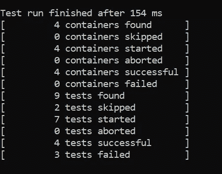

# 如何用 Java 编写自动化测试

> 原文：<https://betterprogramming.pub/how-to-write-automation-tests-with-java-ed468e0af305>

## 利用 JUnit5，Java 和 JVM 的测试框架


照片由 [NeONBRAND](https://unsplash.com/@neonbrand?utm_source=unsplash&utm_medium=referral&utm_content=creditCopyText) 在 [Unsplash](/s/photos/automation?utm_source=unsplash&utm_medium=referral&utm_content=creditCopyText) 上拍摄

今天的主题是用 Java 编写自动化测试脚本。供您参考，测试自动化是一种利用自动化工具来控制测试执行的技术。这很方便，因为它使您能够在每次提交时或者在一次大的更新之后执行测试。

[测试自动化](https://www.perfecto.io/blog/what-is-test-automation)有助于提高系统的效率和准确性。此外，它还减轻了您手动调试和测试应用程序的大部分繁琐工作。

本教程关注于 [JUnit5](https://junit.org/junit5/) ，这是一个成熟的测试框架，由来自三个不同子项目的几个不同模块组成:

*   JUnit 平台:在 JVM 上启动测试框架的基础。它支持大多数流行的 ide(IntelliJ IDEA、Eclipse、NetBeans 和 Visual Studio 代码)和构建工具(Gradle、Maven 和 Ant)。
*   JUnit Jupiter:JUnit 5 中测试自动化的新编程模型
*   JUnit Vintage:一个向后兼容的测试引擎，支持运行 JUnit3 和 JUnit4 测试

让我们继续下一节，开始用 Java 编写测试。

# 编写测试脚本

确保您的本地计算机运行在 JDK8 或更新版本上。创建一个名为`SimpleTest.java`的新 Java 文件。

## 导入

首先，您需要将一些 JUnit Jupiter 核心模块导入到您的 Java 文件中。最简单的测试用例至少需要以下模块:

```
import static org.junit.jupiter.api.Assertions.assertEquals;
import org.junit.jupiter.api.Test;
```

## 注释

接下来，您可以用`Test`注释您的测试函数，并在其中调用所需的断言。例如:

```
@Test
void singleAssertion() {
    assertEquals(2, 1 + 1);
}
```

当你运行测试时，用`Test`标注的函数将被调用。

## 断言

除了`assertEquals`，您还可以在测试中使用更多的 assert 函数。这包括:

*   `assertNotEquals`
*   `assertNull`
*   `assertNotNull`
*   `assertTimeout`
*   `assertTrue`
*   `assertAll`

你可以在网上找到[完整的断言列表](https://junit.org/junit5/docs/current/api/org.junit.jupiter.api/org/junit/jupiter/api/Assertions.html)。

最有用的断言之一是`assertAll`，它有助于对所有断言进行分组:

```
@Test
void groupedAssertions() {
    assertAll("names",
        () -> assertEquals("Jane", "John"),
        () -> assertEquals("Doe", "Doe")
    );
}
```

您的第一个测试文件的完整代码如下:

## 显示名称

事实上，您可以通过`DisplayName`模块在测试报告中显示自定义名称。它接受字符串输入，可以使用字母数字字符、特殊字符甚至表情符号来表示:

```
@Test
@DisplayName("Test function")
void singleAssertion() {
    assertEquals(2, 1 + 1);
}
```

## 初始化和拆卸

您可以为函数定义以下注释，以便在测试函数之前或之后执行它:

*   `BeforeAll`
*   `BeforeEach`
*   `AfterAll`
*   `AfterEach`

请看下面的例子，它说明了注释:

```
@BeforeAll
static void initAll() {
}@BeforeEach
void init() {
}@AfterEach
void tearDown() {
}@AfterAll
static void tearDownAll() {
}
```

## 禁用/启用测试

禁用一个测试就像给一个方法添加注释`Disable`一样简单。例如:

```
@Test
@Disabled("Disable this test")
void skippedTest() {
}
```

此外，您可以基于某些条件禁用测试。假设您希望禁用 Windows 操作系统上的测试。您应该使用注释`DisableOnOs`，它在函数顶部接受一个 [Enum OS 对象](https://junit.org/junit5/docs/current/api/org.junit.jupiter.api/org/junit/jupiter/api/condition/OS.html):

```
@Test
@DisabledOnOs(OS.WINDOWS)
void notOnWindows() {
}
```

你可以在网上找到[所有可用条件](https://junit.org/junit5/docs/current/api/org.junit.jupiter.api/org/junit/jupiter/api/condition/package-summary.html)的完整列表。

除此之外，您甚至可以根据测试是否满足自定义条件来轻松启用测试。只需在测试函数的顶部添加`EnableIf`,并传入一个表示自定义条件名称的字符串参数:

```
@Test
@EnabledIf("customCondition")
void enabled() {        
}boolean customCondition() {
    return true;
}
```

## 参数化测试

此外，JUnit5 通过注释`ParameterizedTest`支持参数化测试。以下示例说明了如何创建一个测试来验证输入值是否为正:

```
@ParameterizedTest
@ValueSource(ints = { -2, -1, 1, 2 })
void if_it_is_positive(int num) {
    assertTrue(num > 0);
}
```

与`Test`注释不同，您需要提供相应的`ValueSource`，它表示测试函数的所有输入参数。

# 运行测试

大多数流行的 ide 已经与 JUnit 集成在一起，成为其系统的一部分。

如果您在运行测试时遇到问题，请考虑下面的示例项目:

*   Gradle 和 Java:[JUnit 5-Jupiter-starter-gradle](https://github.com/junit-team/junit5-samples/tree/r5.7.1/junit5-jupiter-starter-gradle)。
*   格拉德和科特林:[JUnit 5-Jupiter-starter-格拉德-科特林](https://github.com/junit-team/junit5-samples/tree/r5.7.1/junit5-jupiter-starter-gradle-kotlin)。
*   Gradle 和 Groovy:[JUnit 5-Jupiter-starter-gradle-Groovy](https://github.com/junit-team/junit5-samples/tree/r5.7.1/junit5-jupiter-starter-gradle-groovy)。
*   maven:[JUnit 5-Jupiter-starter-maven](https://github.com/junit-team/junit5-samples/tree/r5.7.1/junit5-jupiter-starter-maven)。
*   蚂蚁:[JUnit 5-Jupiter-starter-蚂蚁](https://github.com/junit-team/junit5-samples/tree/r5.7.1/junit5-jupiter-starter-ant)。

## 控制台发射器

在本教程中，将使用[独立控制台启动器](https://repo1.maven.org/maven2/org/junit/platform/junit-platform-console-standalone/)。

本教程使用版本 1.7.1 作为测试的 jar 文件的一部分。只需将相应的 [jar 文件](https://repo1.maven.org/maven2/org/junit/platform/junit-platform-console-standalone/1.7.1/junit-platform-console-standalone-1.7.1-all.jar)下载到您的本地机器。

## 构建 Java 类

完成后，在工作目录中创建一个名为`out`的新文件夹。然后在您的终端中运行以下命令来构建相应的 Java 类:

```
javac -d out -cp junit-platform-console-standalone-1.7.1.jar out/SimpleTest.java
```

在`out`文件夹中会创建一个名为`SimpleTest.class`的新 Java 类文件。如果出现错误，这表明您的 Java 文件包含错误。

## 运行测试

成功构建 Java 类后，运行以下命令开始测试它:

```
java -jar junit-platform-console-standalone-1.7.1.jar --class-path out --scan-class-path
```

它将扫描`out`文件夹中的所有 Java 类，并运行相应的测试。您应该在控制台上看到以下结果。



作者图片

# 结论

让我们回顾一下今天所学的内容。

本教程首先简要解释了测试自动化和 JUnit5 背后的基本概念。

接下来，它解释了如何使用 JUnit Jupiter 模块编写测试脚本。这包括基本的断言和参数化测试。

稍后，它介绍了如何将 Java 测试文件构建到 Java 类中，以及如何通过独立的控制台启动器直接运行测试。

感谢你阅读这篇文章。希望你会回来看我的其他文章！

# 参考

1.  [6 月 5 日用户指南](https://junit.org/junit5/docs/current/user-guide)
2.  [6 月 5 日 GitHub](https://github.com/junit-team/junit5)
3.  [堆栈溢出:如何从命令行启动 JUnit5】](https://stackoverflow.com/questions/52373469/how-to-launch-junit-5-platform-from-the-command-line-without-maven-gradle)