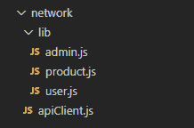

# 如何用 Axios 编写干净的 API 调用

> 原文：<https://betterprogramming.pub/how-to-write-clean-api-calls-with-axios-ddbc7df4256c>

## 使用 Axios 编写更好、更可读的前端 API


莎拉·多维勒在 [Unsplash](https://unsplash.com?utm_source=medium&utm_medium=referral) 上拍摄的照片。

做前端应用不像以前那么简单了。像 React 和 Vue.js 这样的前端框架严重依赖 API。这增加了我们应用程序的复杂性，因为我们需要管理如何调用这些 API。一个解决方案是通过编写干净的 API 调用来简化这个过程。

但是等等，什么是“干净的 API 调用”？对我来说，这意味着 API 调用的适当结构，使它们易于阅读和维护。首先，我利用单一责任原则来做到这一点。每个功能必须有一个单一的职责，记住这个原则，我们需要为每个端点分离逻辑。

我尝试考虑的另一件事是干原则(“不要重复自己”)。这一点非常重要——对于前端 API 提供者来说更是如此——因为它给人一种代码整洁的感觉，从而提高了可读性。我使用 [Axios](https://www.npmjs.com/package/axios) ，因为它提供了诸如拦截器、默认值等特性。它减少了您需要为每个 API 端点编写的样板代码的数量。

# 使用 Axios 的利与弊

有许多方法可以实现这一点。您可以使用 Fetch API，也可以使用名为 Axios 的第三方库。通过这篇文章的标题，你可以猜到我更喜欢 Axios。为什么？让我们权衡利弊。

## **亲:简单**

我最喜欢 Axios 的一点是，它使用起来非常简单。编程 API 非常容易使用，我已经完全习惯了。嗯，这可能是过于个人化的偏好，但你可以自己尝试一下。我使用过 jQuery 的 AJAX 和 Fetch API，我会把 Axios 排在所有这些 API 之上——尽管差距不是很大，因为这三个 API 都很好使用。

## **Pro:向后兼容性**

老实说，你不会想到这个功能，直到你需要它。我的意思是，大多数人都有现代浏览器，但如果你的一些客户不是大多数人，他们可能无法使用你的应用程序，如果它不是向后兼容的。Fetch API 相对较新，旧的浏览器不能使用它。否则，像 Axios 和 jQuery 的 AJAX 这样的库是建立在 JavaScript 的 XMLHttpRequest 之上的。对于那些想知道的人，XMLHttpRequest 是 JavaScript 内置 HTTP 调用机制的旧版本。

## **Pro:具有大量特性的成熟库**

你可以用 Axios 做很多事情——很多事情。例如，在撰写本文时，Fetch API 还没有内置的请求/响应拦截器。你必须使用第三方。与 Fetch 相比，使用 Axios 编写干净的 API 非常简单。Axios 已经有了如此多的内置便利。举几个例子，您可以使用 Axios 设置默认的头和默认的基本 URL。

## **缺点:对小型应用来说太复杂**

我使用 Axios 已经很长时间了，我明白这个库对于小应用程序来说可能是多余的。如果您只需要使用它的 GET 和 POST-API，那么无论如何，使用 Fetch API 可能会更好。Fetch 是 JavaScript 自带的，而 Axios 不是。这就把我们带到了下一点。

## **缺点:Axios 增加了您的包大小**

这第二点与第一点完全一致。我避免在小型应用中使用 Axios 的一个主要原因是它会增加你的生产规模。当然，你可能没有注意到像电子商务等大型应用程序的大小峰值。但是如果你做一个简单的投资组合网站，你会注意到一个巨大的增长。要吸取的教训？为正确的工作使用正确的工具。

## **弊:是第三方**

听着，让我先说第三点是非常主观的，有些人可能会有相反的观点。Axios 是第三方。是的，你没看错。与 Fetch 不同，它不是浏览器固有的。你依靠社区来维护你宝贵的应用。话说回来，如今大多数应用程序都使用开源产品。所以这会是个问题吗？不完全是。同样，这是一个偏好。我不是建议你重新发明轮子。只要明白你并不拥有*方向盘。*

# 安装 Axios

Axios 在多个 JavaScript 存储库中可用。你可以使用纱线和 NPM 来访问它。如果您使用的是常规 HTML，可以从 jsDelivr、Unpkg 或 Cloudflare 等 cdn 导入。

假设您使用的是 NPM，我们需要使用以下命令安装 Axios:

```
npm install -S axios
```

如果安装中没有错误，您可以继续下一步。您可以在 GitHub 上查看替代安装方法[。](https://github.com/axios/axios#installing)

# 制作单独的 Axios 客户端

什么是 Axios 客户端？客户端是我们为每个 API 调用设置默认参数的方式。我们在 Axios 客户端中设置默认值，然后使用 JavaScript 的`export default`导出客户端。之后，我们可以从应用程序的其余部分引用客户端。

首先，创建一个新文件，最好命名为`apiClient.js`，并导入 Axios:

导入 Axios。

然后使用`axios.create`制作客户端:

Axios 客户端 JS 示例。

如您所见，我们为所有 HTTP 调用初始化了基本 URL 和默认头。

# 使用拦截器进行干净的重定向

当调用交互 API 时——特别是当涉及身份验证时——您需要定义调用未经授权时的条件，并使您的应用程序做出适当的反应。拦截器非常适合这个用例。

比方说，当我们的 cookie 过期时，我们需要应用程序将我们重定向到我们的主页，当我们的 cookie 过期时，API 将返回 401 状态代码。你应该这样做:

使用 Axios 拦截器的例子。

简单吧？在定义了客户机并附加了拦截器之后，您只需要导出客户机以便在其他页面上使用。

# 导出 Axios 客户端

配置完 Axios 客户端后，您需要将其导出，以使其可用于整个项目。您可以通过使用`export default`功能来实现:

导出 Axios 客户端。

现在，我们已经使 Axios 客户端可用于整个项目。接下来，我们将为每个端点制作 API 处理程序。

# 文件夹结构

在我们继续之前，我认为向您展示如何排列子文件夹是有用的。与其写一个冗长全面的解释，我想我不如给你一个我正在谈论的东西的形象:



我会如何安排我的文件夹。

这假设我们将有管理、用户和产品端点。我们将把`apiClient.js`文件放在网络文件夹的根目录下。文件夹的命名甚至结构都只是我个人的喜好。

端点将被放在一个`lib`文件夹中，并由每个文件中的关注点分开。例如，出于身份验证的目的，用户端点将被放在用户文件中。与产品相关的端点将放在产品文件中。

# 编写 API 处理程序

现在我们将编写 API 处理程序。每个端点都有自己的带有自定义参数的异步函数。所有端点都将使用我们之前定义的客户端。在下面的例子中，我将编写两个 API 处理程序来获取新产品和添加新产品:

产品端点提供商示例。

这基本上概括了我将如何编写 API 处理程序，正如你所看到的，每个 API 调用都是干净的，并且都应用了单一责任原则。现在，您可以在主页上引用这些处理程序。

# 在 Web 应用程序中使用处理程序

假设您使用一个 NPM 项目来完成所有这些，那么您可以使用`import`方法轻松地引用您的 JavaScript API 处理程序。在这种情况下，我将使用`getProduct`端点:

使用获取产品端点。

这就是:一个简洁的 API 处理程序。你已经成功地使你的应用程序可读性更强，更易于维护。

# 最后的话

有一个可用的应用程序是很棒的。你得到了所有的功能，你几乎完成了。然而，人们往往会忘记他们需要维护这个应用程序。因此，迟早，你将不得不重新阅读这些代码。如果它可读性强，易于理解，并且关注点分离得很好，那不是更好吗？我想我们都希望这样，我甚至可以说，如果我们能够阅读我们一年前编写的代码，我们会感到非常自豪。

快速并不能保证成功，但是持续和负责能保证成功。写出更好的代码，帮助你的团队成长！感谢阅读。

*原载于 2021 年 3 月 9 日*[*https://daily . dev*](https://daily.dev/blog/a-guide-to-writing-clean-api-calls-using-axios)*。*

*编辑注:我说错了，说 Fetch API 是 Javascript 原生的，而实际上，* [*不是，是浏览器*](https://stackoverflow.com/questions/44058726/is-the-fetch-api-an-ecmascript-feature) *原生的，老浏览器不支持。你可以在这里* *了解更多* [*。感谢评论*](https://developer.mozilla.org/en-US/docs/Web/API/Fetch_API) [*尼克·霍华德*](https://medium.com/u/52e936b1a62b?source=post_page-----ddbc7df4256c--------------------------------) *！*