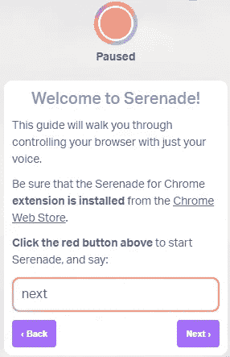
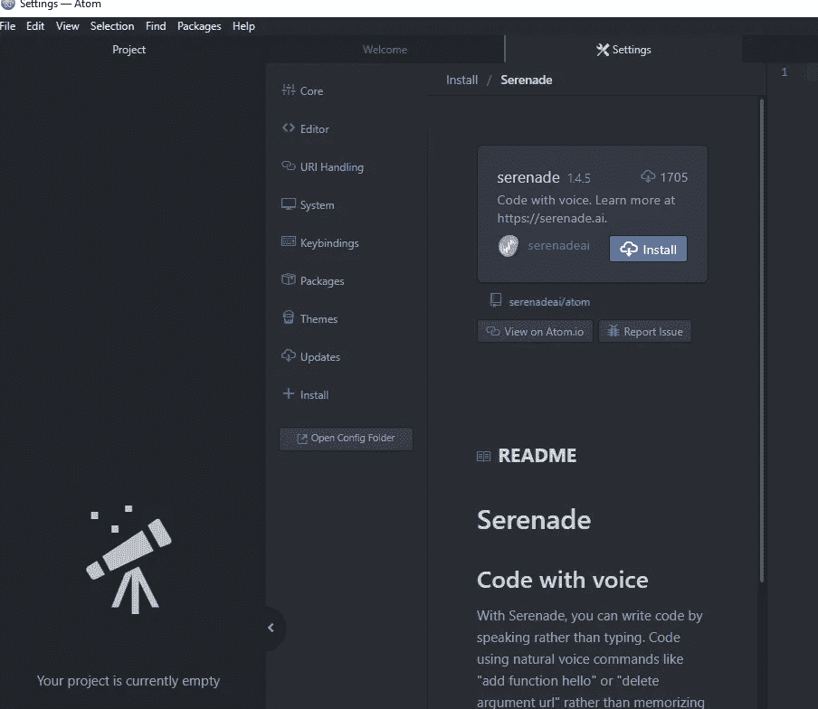
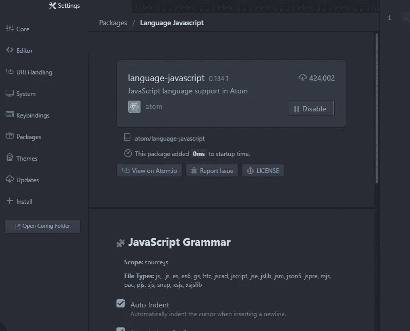

# 如何用你的声音写代码

> 原文：<https://betterprogramming.pub/how-to-write-code-using-your-voice-f1bf42952075>

## 现状、优点和缺点

威尔·弗朗西斯在 [Unsplash](https://unsplash.com?utm_source=medium&utm_medium=referral) 上拍摄的照片。

几天前，我和一个视障女孩进行了一次有趣的对话。当我回到家，我花了一些时间思考如果我有那些问题或者其他问题阻止我使用键盘会发生什么。如果我从自行车上摔下来摔断了胳膊会怎么样？我还能编码吗？

听写软件已经存在很长时间了，但它通常纯粹用于转录语音。编写代码是不同的，因为有许多非字典单词和语法规则。

现在很多工具像 Google Assistant 或者 Alexa 都可以用语音，但是我们能用语音编码吗？令我惊讶的是，答案是肯定的。这并不容易(记得你用了多少年键盘)，但仅用语音编码是可能的。

在本文中，我将讨论我一直在研究的几个工具以及我对它们的结论。

# 小夜曲

[小夜曲](https://serenade.ai/)是马特·威特霍夫和汤米·麦克威廉创造的一个工具，它允许你使用语音命令编写代码。这一切都始于 Wiethoff 被诊断出手部严重受伤，无法使用键盘。为了克服这一点，在麦克威廉的帮助下，他们开发了这个工具。

Serenade 有一个专门开发的语音到文本转换引擎，可以根据我们选择的编程语言(使用不同的插件)识别代码并将其转录为有效的语法。

要开始使用它，您需要在电脑上安装 Serenade。

它会问你的第一件事是指出你感兴趣的编程语言和你想使用的插件。为了测试它，我开始使用谷歌浏览器的插件。这个扩展有助于您熟悉小夜曲。最后，我使用 Serenade Atom 的插件和 JavaScript 语言实用程序用 JavaScript 编写了一个简单的函数。

## 铬延伸

来源:[小夜曲向导](https://serenade.ai/) 1/1

一旦安装了插件(在本例中，是一个 Google Chrome 扩展)，您就可以继续使用向导。该向导非常简单，它将教我们如何使用不同的基本命令。

来源:[小夜曲向导](https://serenade.ai/) 1/2

## Atom 插件

要在 Atom 编辑器中使用它，首先需要在 Atom 中安装 Serenade 插件:

带有小夜曲插件的 Atom 编辑器

一旦你选择了你想在 Serenade 中使用的编程语言，就需要在 Atom 中安装 JavaScript 插件:

支持 JavaScript 的 Atom 编辑器

安装好一切后，您将能够使用语音命令用您的声音编写代码:

原子编辑器

用 Serenade 创建的代码

Serenade 为我们提供了许多语音命令，我们需要学习这些命令来有效地使用这个应用程序。例如:

1.  `add`命令用于添加预定义的代码块，所以如果您使用语音命令“add function hello”，我们会告诉它添加一个带有名为 hello 的括号的函数。
2.  `insert`命令用于添加代码指令。在这种情况下，我使用“insert console dot log quotes hello world”来告诉 Serenade 插入语句`console.log(“hello world”)`。

这是一个超级基本的例子，说明你几乎可以马上用小夜曲做什么。

# 塔隆

[塔龙](https://talonvoice.com/)追求与小夜曲相同的目标，但方法不同。Talon 由四个主要元素组成:语音识别系统、噪音控制系统、眼球追踪系统和 Python 脚本。作为一个亮点，噪点控制和眼球追踪完全取代了鼠标。

开始使用 Talon 比使用 Serenade 稍微复杂一点。首先，你必须添加一系列控制所有 Talon 语音命令的脚本。没有它们，塔龙不会识别任何命令。

有许多带有现成命令的公共脚本，但它也允许您创建自己的脚本来定义自己的规则(当我说“A”时，请做“B”)。它提供了与操作系统交互和输出字符的 API 集合。

Talon 有两种工作模式:听写模式和命令模式，后者是默认模式，也是常用模式。

# 小夜曲对塔龙

小夜曲允许用更自然的方式说代码，而塔龙有更精确的命令。Serenade 自动完成一些任务。例如,“add class”命令生成一个类，使您不必口述所有相关的样板文件。

另一方面，Talon 可以在没有键盘和鼠标的情况下使用，也可以用于实时视频游戏、命令行和全桌面计算机。Talon 允许你以多种方式控制你的电脑——不仅仅是编码。

Serenade 的文档和简单的教程可以让你很容易地开始使用这个工具。这肯定比用塔龙容易。

Serenade 只需要你下载可执行文件，点击几下，你就可以开始使用它了。另一方面，Talon 需要你下载它的可执行文件，在你的电脑上改变一些路径，并安装一些带有有用命令的脚本来开始使用它。

小夜曲和 Talon 都有免费版本。不同之处在于，如果你使用云中的版本，Serenade 会为你提供所有的功能，而 Talon 只为你提供专业版的所有功能。

# 结论

Wiethoff 纯粹出于需要开发了 Serenade 工具，但多亏了像他这样的人，现在可以只用你的声音来编写代码了。

处于安静的环境中是很重要的。我现在在家远程办公，在安静的环境下，效果很好。但是，如果家里有其他人或者在使用它时听音乐，就不要使用它了。

最初的学习曲线可能很高，但很容易想象，一旦你掌握了所有的命令，你就可以只使用你的声音高效地编写代码。如果你不是一个完美的英语演讲者，你会发现这要复杂得多，直到你学会完美地发出你使用的命令。你必须考虑到你口述的内容和屏幕上显示的内容之间有一定的延迟，所以你必须考虑你将口述的内容。

这个想法很好，即使我们没有任何问题或残疾，它在某些时候也是有用的。一个重要的改进将是在识别语音命令时增加除英语之外的语言。在未来，我希望看到更自然、更智能的方法。例如，“创建一个返回前五个阶乘数之和的函数，并将其存储在一个名为`factorial.js`的文件中。”但这，目前来看，还是科幻小说。

在某些情况下，这是一种有效的编码方式，但前提是你在一个安静的地方。在一个满是开发人员的办公室里，每个人都在同时交谈，我们如何使用这些工具呢？

谁知道呢？在未来，当我们许多人在家工作，人工智能得到改善时，这也许是可能的。你怎么想呢?