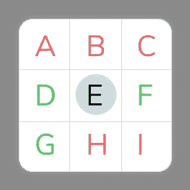
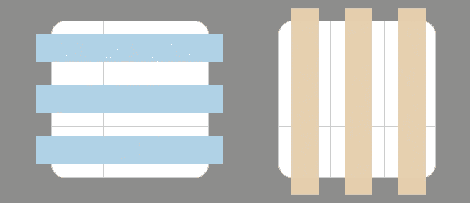
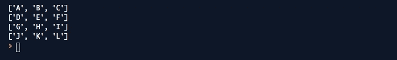
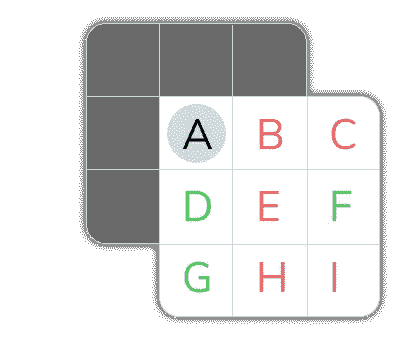
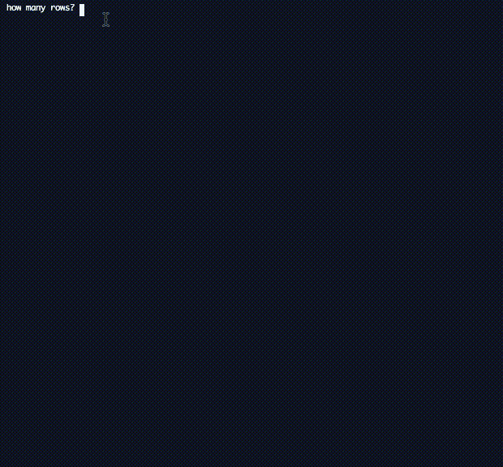

# 如何用 Python 写康威的《生命的游戏》

> 原文：<https://betterprogramming.pub/how-to-write-conwells-game-of-life-in-python-c6eca19c4676>

## 一个有趣的网格游戏的例子，为您建立


[迈克尔·希弗](https://unsplash.com/@michael_schiffer_design?utm_source=medium&utm_medium=referral)在 [Unsplash](https://unsplash.com?utm_source=medium&utm_medium=referral) 上拍照

# 介绍

在这篇文章中，我将指导你编写约翰·何顿·康威在 1970 年发明的“生活游戏”。

如果你是这个游戏的新手，你可以在这里了解更多:[维基百科——生活游戏](https://en.wikipedia.org/wiki/Conway%27s_Game_of_Life)

# 游戏的简要总结

你有一个包含细胞的网格。它们可以生也可以死。

相邻细胞的状态决定了该细胞是死亡、繁殖还是存活到下一代。



检查单元格“E”。它有五个死去的邻居(A，B，C，H，I)和三个活着的邻居(D，F，G)

如果一个单元是**活的**，它将:

*   如果活着的邻居少于两个，就会死去。
*   如果正好有两三个活着的邻居，继续生活。
*   如果有三个以上活着的邻居，就会死去。

如果细胞**死亡**，它将:

*   如果正好有三个活着的邻居，复活。

在上面的例子中，如果 E 死了，它会复活——因为它有三个活着的邻居——如果它活着，它会保持活着——因为它正好有两三个活着的邻居

# 分解 Python 部分

这个游戏最大的两个部分是*细胞*和*棋盘*。我们将为这些创建两个类:`cell.py`和`board.py`。

## 单元格. py

先说细胞。所有细胞最初都会死亡。我们将随机生成第一代的死亡或活着状态。对于下一代，上述规则适用。

我们还需要检查细胞是否存活的能力，我们将创建一个方法函数，根据细胞状态告诉电路板打印什么。以下是方法:

```
#set status to dead
def set_dead(self):#set status to alive
def set_alive(self):#is the cell alive?
def is_alive(self):#what the board should print.
def get_print_character(self):
```

细胞可能是最容易写的东西。代码如下:

## board.py

这个类更难写，有几个复杂的解决方案。

对于主板，我们需要:

*   定义行和列来设置大小(构造函数将处理这一点)
*   一种画板的方法
*   检查所有单元的所有邻居的方法
*   一种基于邻居状态更新板的方法

```
#initial generation based on randomness.
def _generate_board(self):#draw the board in the terminal
def draw_board(self):#update for the next generation of cells
def update_board(self):#find all the neighbours of a cell
def find_neighbour(self,row,column):
```

# 写网格

构造函数负责创建我们需要的所有变量。它还根据用户需要的行数创建网格列表。请注意，构造函数还调用了 generate 方法来立即生成电路板。

## 生成 _ 板(自己)

这种方法使每个细胞有 33%的机会成为活细胞。
幸运细胞将通过使用细胞方法`.set_alive()`获得生存状态。

## 画板(自己)

首先，它打印许多行，以确保我们打印一个干净的终端。根据您的设置，数量会有所不同。

然后我们使用一个嵌套循环来检查我们必须为那个方块打印什么样的字符。我们通过使用单元方法`.get_print_character()`来实现。

## check _ neighbour(自身，check_row，check_column)

在我们真正解决这个问题之前，我们需要看看它是如何构建的，以及我们如何检查邻居。这些对游戏至关重要，我们 ***必须*** 搞定他们！

我将在`table_check.py`中编写一个名为`Tablecheck`的测试类和一个用于测试代码的`main.py`。这样我们就可以一起研究这个理论了。实际的网格是用列表理解来制作的，因为它可以是用户想要的任何大小。


用 python 构建这个网格

如果我们分解网格，我们可以看到有行和列。如果我们把它转换成 Python，你可以在列表中放置列表来模仿这种行为。a，B，C 是第一个列表(自我。_grid[0])，D，E，F 是第二个列表(self。_grid[1])和 G，H，I 是第三个列表(self。_grid[2])。

要访问这些列表中的字母，我们需要进入它们。语法应该是:

```
self._grid[X][Y]
```

a 生活在自我中。_grid[0][0]
E 活在自我中。_grid[1][1]
G 活在自我中。_grid[2][0]

诸如此类。



蓝色代表行，橙色代表列

我们可以用 Python 编写这样的网格布局:

`self._grid`是一个列表，里面有三个列表，创建一个类似网格的模式。为了画这样的板，我把它添加到我的`main.py`:

这会打印以下内容:



照片由[阿里·叶海亚](https://unsplash.com/@ayahya09?utm_source=medium&utm_medium=referral)在 [Unsplash](https://unsplash.com?utm_source=medium&utm_medium=referral) 上拍摄

## check _ neighbours(自身，check_row，check_column)

好了，现在我认为这是整个代码中最棘手的部分:检查所有邻居。

使用`check_neighbours()`,我们必须传入我们想要检查的坐标，然后我们必须在我们的列表中遍历以检查所有周围的邻居。

这意味着我们必须跳回一行(-1)，检查我们自己的行(0)和下一行(1)。用 Python 的术语来说，这意味着遍历从-1 到 2 的范围，range(-1，2)。我们必须对柱子做同样的事情。

如果我想忠实于我的作品，[记录您的 Python 代码而不写文档](https://medium.com/better-programming/document-your-python-code-without-writing-documentation-2d8bf3a42e1a)，我必须将开始和结束范围设置为变量，并弄清楚它们会受到怎样的影响。

```
# how deep I will search around the current square.
search_min = -1
search_max = 2
```

在一个范围内骑自行车很容易，但你可能已经在想我们如何处理走出棋盘。



当我们检查“A”时，我们不想浪费时间检查棋盘之外的内容。其他角元素也是如此。

我们在这里要做的是检查我们是否在任何角落或任何边缘工作。

对于检查本身，我们需要根据程序输入到`check_row`和`check_column`(`check_neighbour`的参数)的内容循环遍历列表。

我们将在设定的范围内循环，`search_min —search_max`。因为范围从-1 开始，通常我们加 1，所以我们检查正确的行。我们想跳回 1 个单位，但我们还想在正确的索引上工作。Python 中的列表从 0 开始

循环中的条件是忽略棋盘外的方块和自身。

下面是该函数中发生的情况:

*   `search depth`:我想向后跳一行，检查我自己的行，然后向前跳一行——就像我们已经讨论过的那样。
*   我将创建一个空列表来放置所有的邻居。我们一次更新所有单元是很重要的，所以在检查完所有内容之前，我们不能更改任何单元的状态。这将是细胞的临时容器。
*   我们进入行循环，并遍历行中的列。
*   `neighbour_row`和`neighbour_column`是确保我们在条件中检查正确的行和列的变量。
*   `valid_neighbour`默认为真。如果一个邻居在棋盘内而不是它自己，它是一个有效的邻居。这就是所有 if 语句的目的。
*   当我们完成检查时，我们返回有效邻居的列表。

## 更新 _ 板(自己)

另一个硬功能是更新板功能。这将遍历所有的单元，检查邻居，并根据找到的活单元的数量，将当前检查的单元存储在死亡列表或生命列表中。

然后，检查完所有单元格后，它们会改变状态。

*   首先，我们创建两个空列表来保存将要被杀死的细胞和将要存活或变得存活的细胞。
*   我们通过嵌套循环遍历网格
*   我们在要检查的单元格上使用`check_neighbour`函数
*   我们从支票中创建一个包含活细胞的列表。
*   我们遍历函数返回的列表，看看有多少邻居还活着
*   根据游戏规则，当前单元格被放入要杀死的列表或要存活/变得存活的列表中。


由[弗雷德·穆恩](https://unsplash.com/@fwed?utm_source=medium&utm_medium=referral)在 [Unsplash](https://unsplash.com?utm_source=medium&utm_medium=referral) 拍摄的照片

**唷！最困难的部分已经过去——是时候把它们缝合在一起了。**

## main.py

我们希望用户决定我们正在处理多少行和列。

*   进口委员会
*   请求行和列
*   创建一个以用户行和列作为参数的 board 对象。
*   `.draw_board()`在终端中绘制它
*   创建一个菜单，用户可以按 enter 键创建另一个生成，或者按“q”键退出。

这里是完整的 Python 文件。

## 单元格. py

## board.py

## main.py



行动中的计划

如果有任何不清楚的地方，请让我知道——我总是努力提高自己。如果你读过我的其他 Python 文章，我使用了许多相同的技术。也许你会在其中找到一些答案。

感谢阅读！