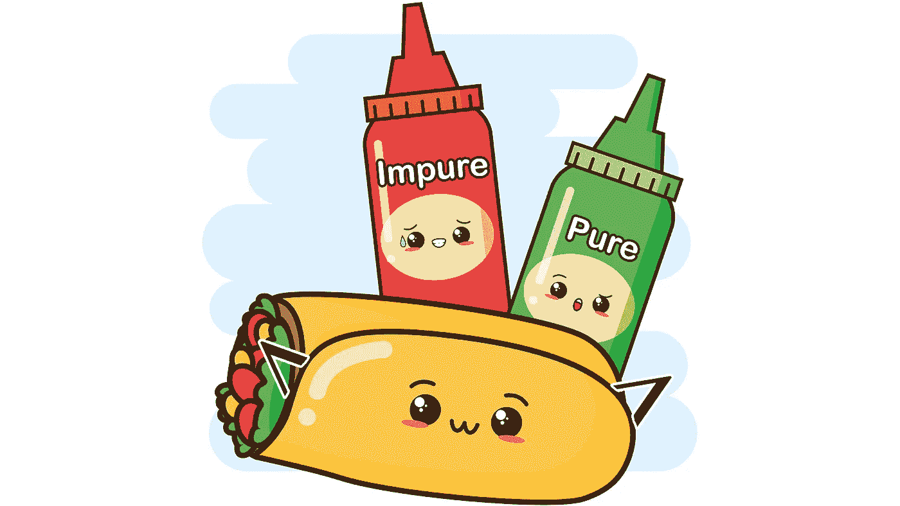

# 如何用纯函数包装器编写灵活的 JavaScript 代码

> 原文：<https://betterprogramming.pub/how-to-write-flexible-javascript-code-with-pure-functional-wrappers-ad1cb39b2630>

## 和测试，而不改变现有的代码

食物矢量由 [gstudioimagen](https://www.freepik.com/free-vector/kawaii-fast-food-cute-burrito-sauces-illustration_5769151.htm#page=1&query=Burrito&position=20) 创建，[作者](http://www.arnoldcode.com)编辑

使用高阶函数(HOF ),可以编写更具声明性、灵活性和紧凑性的代码。

软件开发的一个规则是*不要碰任何工作上的东西*。如果您要增强现有的功能，您应该设计一个包装类。但是要注意，创建这样的类会带来新的问题，比如不灵活、副作用，甚至是约束。

您应该考虑编写适当的函数包装函数，以获得干净的包装函数，从而获得更高的代码灵活性和更好的测试能力。

# 一些包装用例

包装一个函数意味着保持原来的函数不变。已经给定的代码可能会影响其他对象，如果您更改它，可能会引起连锁反应。—你也可以说包装器是装饰器。

以下是一些使用案例:

1.  向函数添加日志记录
2.  从函数中获取计时信息
3.  使用缓存(*内存化*)来提高函数的性能

# 经典实现—记录器

您可能已经多次遇到过这种用例，是的，除了日志记录，您可以只使用断点。但是这是关于更深层次的理解，所以你可以采用这种技术。

如果不使用包装器，就必须修改函数的代码——入口和出口，以产生一些日志输出。

这可能是您的原始代码:

更进一步，没有包装意味着您必须添加一个`auxiliaryVar`来存储您想要记录和返回的值。

如果函数有几个`return`语句，考虑一下开销。如果您只是在运行中计算返回表达式，您将需要一个辅助变量来捕获该值。

因此，必须有一种更好的方法，也是一种不容易发生事故且不违反以下规则的技术:

如果有用…不要碰它。

# 功能实现—记录器

首先，你有一个函数，它实现了某种功能，你想知道它的 I/O——输入的参数和输出的参数。

编写一个具有单个参数的高阶函数(原始函数)，并返回一个新函数，该函数将依次执行以下操作:

1.  记录收到的参数
2.  调用原始函数，捕捉其返回值
3.  记录该值
4.  把它还给呼叫者

实现此过程，您将得出以下可能的代码作为解决方案:

`loggingWrap()`返回的函数具有以下特点:

1.  `console.log()`显示原始函数的名称及其参数。
2.  调用原始函数(`fn()`)，并存储返回值。
3.  第二行`console.log()`显示了函数名及其返回值。
4.  返回`fn()`计算的值。

> 提示:对于节点应用程序，您可能会选择更好的日志记录方式。大概用的是 [Winston](https://www.npmjs.com/package/winston) (通用日志器) [Morgan](https://www.npmjs.com/package/morgan) (适合 http-logging)，或者 [Bunyan](https://www.npmjs.com/package/bunyan) (专门用于 JSON 日志记录)。我的重点在于向你展示如何包装原始函数。使用这些库所需的改动很小，您将在本文末尾看到这一点。

所示的方法适用于您的大多数函数。一个你可能已经想到的问题:

抛出异常的函数会给这种光明的包装技术带来黑暗吗？

# 例外注定

为了检查这种情况，我们应该稍微增强一下您的日志功能。当您的原始函数抛出异常时，`try/catch`块是一个更好的想法。

无论您的包装函数是否抛出错误，这一更改都会产生一个适当的日志记录语句。每次你都会收到一条消息，告诉你一切顺利或不顺利。除此之外，还会再次抛出错误进行处理。

提示:为了获得更好的日志输出，您可以添加日期和时间。增强列出参数的方式，等等。

尽管如此，这个实现仍然不是完美的。它有一个重要的缺陷。

# 创建一个纯包装

提到纯功能意味着没有副作用。`Console.log()`就是这样的副作用。

像这样使用固定语句会使您失去灵活性——您无法选择另一种形式的日志记录——并使测试变得更加复杂。

你打算怎么测试它？刺探`console.log()`方法？

这也不是很干净。了解特定函数的内部行为对于测试它是必不可少的。事实并非如此。你想设计你的测试。你想要的是黑盒测试。

检查以下测试:

该测试将向您展示`loggingWrap()`确实如预期的那样运行。第一个验证日志记录是否被正确调用。第二个测试检查错误抛出，以验证产生了正确的输出。因此，这是对一段工作代码的有效解决方案。

尽管它没有解决灵活性的缺乏，但是您应该将日志记录函数作为参数传递给包装函数。如果你有或者希望的话，导致随需应变的变化。

如果你不传递任何东西，默认的包装器将产生与版本`loggingWrapCatcher`相同的结果。但是您现在能够提供不同的日志记录系统。简单地将它存储到一个变量中，并将其传递给包装函数。

像这样写函数，我们可以利用存根。测试的代码几乎和以前一样，但是因为您可以使用一个存根(stub)，没有提供功能或副作用，所以总体来说更安全。

在这种情况下，最初调用的真正函数`console.log()`不会造成任何伤害，但情况并不总是如此，所以建议使用存根。

新测试的工作方式和以前的一样，但是使用并检查`stubby.logger`而不是处理原来的`console.log`调用。这为您带来了更多的灵活性，因为您不再需要监视特定的硬编码函数——一种通用的方法。

此外，它避免了所有因副作用而可能出现的问题，因此更加清洁和安全。

# 结论

我想说的是，当你使用功能技术时，永远记住，如果你正在使你自己的工作复杂化，那么你一定是做错了。

函数`loggingWrap()`是不纯的，这应该让你警惕了。

您可能会认为代码的简单性不足以决定它是否值得修复。您甚至可以不经过测试就完成，并且您不需要能够改变日志产生的方式。但迟早你会对那种决定后悔的。

你应该总是尝试使用更清洁的解决方案。

因为这种方式通过添加一个包装类为您带来了高度的灵活性，并且您可以使用任何您想要的记录器——记录器代表了您想要的任何更改。

此外，您现在已经完成了对任何期望的实现的测试。

获取 26 份备忘单，只研究你真正需要的东西，以获得你的第一份网络开发工作！

[Arnold Code Academy 26 Web 开发人员备忘单](https://arnoldcodeacademy.ck.page/26-web-dev-cheat-sheets)

# 参考

*   [学习 JavaScript:高阶函数和迭代器](https://www.codecademy.com/learn/game-dev-learn-javascript-higher-order-functions-and-iterators/modules/game-dev-learn-javascript-iterators/cheatsheet)
*   [声明式编程:它是真的吗？](https://www.toptal.com/software/declarative-programming)
*   [Javascript:谓词](https://dev.to/deogadkarravina/javascript-predicate-and-uses-8pl)
*   [掌握 JavaScript 函数式编程](https://amzn.to/3ziF8cL)