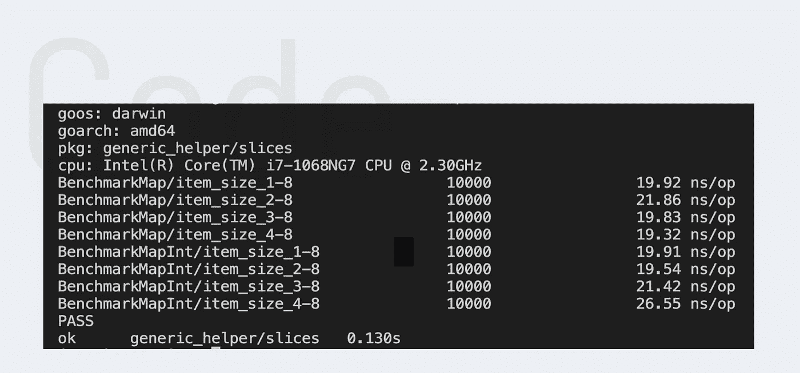

# 如何用 Go 1.18 编写通用助手函数—第 2 部分

> 原文：<https://betterprogramming.pub/how-to-write-generic-helper-functions-with-go-1-18-part-2-19e3d2ab45f5>

## 让我们创建一个 map 函数，它调用数组/切片中每个元素的回调


地鼠是由埃贡·厄尔布尔画的。

今天，我们将创建一个函数，为数组/片的每个元素调用一个回调函数来调整各自的值并返回它。现在，你可能会问自己，“管它呢！我为什么要这么做？”。想象一下，如果你必须将数组中的每个单词都大写，反转布尔值，或者将每个数字相乘。

在许多类似的情况下，这样的函数会很有用。可惜在围棋中，你得自己开发这样的地图功能。但是不用担心。今天我们来看看如何自己实现这种功能。所以系好安全带，我们开始吧。

> 这是我新系列的第三篇文章。在第一部分的[中，我已经谈了一点关于泛型的内容。这不是必需的，但可能会有所帮助。](https://henrysteinhauer.medium.com/how-to-write-generic-helper-functions-with-go-d47c52986016)

# 介绍

开始前有一件事。对于我们的解决方案，我们需要泛型。这意味着我们必须再次使用 Golang 版本。

# 方法

我们想要的非常简单，可以分为三个步骤:

1.  我们希望对数组/切片中的每个元素调用回调。
2.  调整后的值应该存储在新的切片中。
3.  最后，该函数应该返回调整后的值。

# 解决办法

为此，我们的函数需要两个参数。第一个是我们的数组，第二个是回调。下面，你可以看到我们主要的`Map`功能。我们遍历数组，用每个项目调用回调函数，并将调整后的值追加到新的切片中。最后，我们要做的就是返回我们的新切片。

如果我们只需要调整一种类型的数组/切片的值，这个解决方案就足够了。但是如果有不同类型的数组，我们需要为每种类型实现相同的函数。这导致了完全笨拙和重复的代码库。为了避免这种情况，我们可以像第一篇文章一样使用泛型。但是这一次，我们使用了不同的泛型类型。

# 丰富

上次，我们使用了“可比较的”泛型类型。这一次，我们需要通用类型“any”正如您在下面看到的，我们需要将我们的类名`T`写在函数名后面的括号中，并将其类型设为“any”我们还给出了两个参数类型`T`以及临时结果片。这允许我们指定我们的函数所期望的数组类型以及结果片应该是什么类型。

要使用它，我们必须进行以下函数调用:
`Map[int]([1, 2], func(num int){return num + 1})`。
括号中的单词“int”指定了我们的泛型类型。

# 基准

最后，我们对每个解决方案运行表基准测试，以证明我们在使用通用版本时没有任何关键的性能问题。下面你可以看到测试命令以及测试结果。

```
go test -bench="BenchmarkMap" -run=^# -benchtime=10000x
```



基准映射函数

和上次一样，与通用版本相比，静态版本的每个操作的纳秒数几乎相同。事实上，如果你看第四个样本，情况正好相反。`MapInt`函数的第四个例子有点突出，但这只发生在这次运行中。我又运行了几个测试，总的来说，两个测试每次操作花费的时间是一样的。

# 结论

我希望对数组中的每个元素调用回调的方法是有趣且有帮助的。如果你有其他的解决方案，一些要提及的事情，或者问题，如果你能在评论中留下它们，那就太好了。回头见。

附:这是我计划的新系列的第三篇文章。在接下来的几周里，我将研究各种通用的助手函数、有趣的基准和有用的特性。

如果你和我一样兴奋，敬请期待！