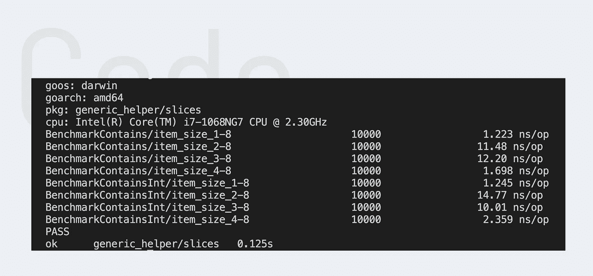

# 如何用 Go 1.18 编写通用助手函数

> 原文：<https://betterprogramming.pub/how-to-write-generic-helper-functions-with-go-d47c52986016>

## 检查数组/切片中是否存在元素的通用方法


地鼠是由埃贡·厄尔布尔画的。

几天前，我需要检查一个数组是否包含特定的值。通常这是一个简单的任务，你可以使用编程语言本身的预定义函数。在围棋中，很不幸，你得自己创造。但是不用担心。今天我们将构建一个函数来检查数组中是否存在元素。所以系好安全带，我们走吧。

# 介绍

开始前还有最后一件事。在我们的解决方案中我们需要泛型。因此，我们至少需要使用 Golang 版本。幸运的是，Golang 在几周前发布了正式版 1.18，其中包含了泛型🙌。

# 方法

我们的意图应该是明确的。那么我们的目标是什么？这很简单。我们需要一个函数，它被传递一个数组和一个值，如果数组包含值，则返回 true，如果值缺失，则返回 false。

# 解决办法

一种解决方案是创建一个函数，在其中静态地设置属性类型。在函数中，我们简单地迭代数组，看看数组中是否有值等于我们的元素。

它工作正常。我们对这种方法只有一个问题。想象一下，对于许多不同类型的数组，我们需要检查数组是否包含值。为了存档，我们需要为每种类型创建一个新的函数。这导致了非常冗长和重复的代码库。幸运的是，Golang 在几个月前引入了许多不同的泛型类型。在下一章中，我们可以使用其中的一个来使我们的解决方案更加灵活。

# 丰富

对于我们的用例，我们需要“可比的”泛型类型。
*(如果想了解更多关于仿制药的知识，我可以推荐以下* [*篇*](https://bitfieldconsulting.com/golang/generics) *。)*正如您在下面看到的，我们需要将泛型 T 的名字写在函数名后面的括号中，并将它的类型指定为“comparable”。我们也给两个参数 t 类型。这样，当我们调用函数时，我们可以指定我们想要比较的数组和元素的类型。

要使用它，我们必须进行以下函数调用:
`Contains[string](["bar", "foo"], "foo")`。

括号前的括号中的单词“string”是我们指定数组和值的类型的地方。

# 基准

现在我们有两种不同的解决方案。一种是在函数中设置两个参数的类型。另一个是在函数调用中设置类型。但是哪种解决方案性能更好呢？这种差异明显吗？

为了简化泛型，您可以将它们视为一种易于使用的反射。通常，这会导致这两个函数之间的性能差异。但是让我们看看:

```
go test -bench=”BenchmarkContains” -run=^# -benchtime=10000x
```



基准包含函数

为了获得更有意义的结果，我决定编写表基准测试。上述命令将两个测试运行 10.000 次。结果是显著的。通用版本没有时间问题。从上面的图片中可以看出，两个测试每次操作花费的时间基本相同。

# 最后的想法

我希望检查一个数组是否包含某个值的方法是有趣且有帮助的。如果你有其他的解决方案，一些要提及的事情或者问题，如果你能在评论中留下来，那就太好了。回头见。

PS: 这是我策划的一个新系列的第一篇文章。在接下来的几周里，我将会关注围棋世界中的各种通用助手函数、有趣的基准和有用的特性。