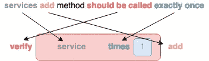
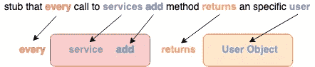
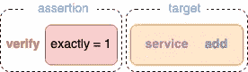

# 如何用 Kotest 和 MockK 在 Kotlin 中编写人类可读的测试

> 原文：<https://betterprogramming.pub/how-to-write-human-readable-tests-in-kotlin-with-kotest-and-mockk-1b614da32148>

## 用 Kotlin 编写测试的完整工具箱，易于理解和维护

照片由 [ThisIsEngineering](https://www.pexels.com/@thisisengineering?utm_content=attributionCopyText&utm_medium=referral&utm_source=pexels) 从 [Pexels](https://www.pexels.com/photo/female-software-engineer-coding-on-computer-3861972/?utm_content=attributionCopyText&utm_medium=referral&utm_source=pexels) 拍摄。

十有八九，每个使用过 Java 的人都知道 Mockito 和 Hamcrest。这些框架通过隔离依赖组件和编写断言，在测试代码时帮助很大，但是在可读性方面它们没有给我们带来很多好处。

在这篇文章中，我想讨论为什么在[我离开 Java 去 Kotlin](/why-i-switched-from-java-to-kotlin-and-never-looked-back-8c061209ea8) 后，我决定改用 Kotest 和 MockK。

# 我们来自哪里

让我们看看使用 Mockito 和 Hamcrest 的常规简单单元测试是什么样的:

这个片段中使用了什么:

*   为两个相互依赖的服务创建模拟的初始化方法。
*   为方法分配模拟响应。
*   创建一个捕获器来验证传递的参数。
*   关于方法调用次数的断言。

我们的代码通常不像我们习惯的那样“从左到右”(反之亦然)可读。即使我们经常接触这种语法，认知负荷仍然更高。我们应该永远记住，单元测试最重要的一个方面是*易于阅读*和*理解*。这意味着，为了知道发生了什么而减少的每一点努力都是值得整合的。

如果我们把我们例子中的`verify`断言写成一个句子，我们会发现与实际代码相比有一些混淆。是的，我们可以换一种更合适的说法，但是我将必须满足的条件(`verify`和`times` =我们的方法应该被调用一次)和目标(`services.add`)分开。

看看哈姆克雷斯特的`assertThat`断言，我们已经可以看到一些改进，但它仍然不是完美的。

让我们深入研究一下 MockK 和 Kotest，了解我们如何进一步改进这一点。

# 嘲笑嘲笑

[mock](https://mockk.io)提供了我们所知道的使用 Mockito 的所有特性，但是具有更好的可读性和 Kotlin 兼容性。

## 嘲弄的

当创建模拟对象来隔离测试中的系统时，从语法角度来看，与 Mockito 没有太大的区别。有趣且与众不同的部分是我们如何用`every`定义我们的存根响应。

默认的模拟要求您为所有接收的调用指定响应。如果有一个调用，但没有存根响应，测试将会失败(例如，在这个例子中，调用除了`add`之外的任何其他方法都会导致测试失败)。如果您想明确忽略这些，您可以创建一个宽松的模拟。

从方法存根的可读性来看，我们看到了它的伟大之处。

## 发现

与间谍合作同样容易。

`verify`现在看起来也干净了很多。类和方法被绑定在一起，预期调用的次数就在断言关键字本身的旁边。

对我来说，MockK 的语法少了很多“噪音”，更容易掌握。

## 占领

通过`CapuringSlot`或`MutableList`通过捕获来验证传递的参数。第一个选项是为了更容易匹配单个呼叫。

## 弹簧架

作为一名 Kotlin 开发人员，您很可能也在使用 Spring Boot，并且想知道 MockK 与它的兼容性。springmock 提供了与 Spring Boot 集成测试的兼容性。

它提供了与基于 Mockito 的 Spring Boot 模拟 beans 相同的功能。刚开始用`@MockkBean`和`@SpykBean`。

*注意:这是一个不完整的 MockK 特性集列表。关于*[*mock . io*](https://mockk.io/)*还有更多值得探索。还有，* [*奥列彭科*](https://medium.com/u/1f9f77b4b3d1?source=post_page-----1b614da32148--------------------------------) *写了* [*一个很棒的关于莫克的特性的综合系列*](https://blog.kotlin-academy.com/mocking-is-not-rocket-science-basics-ae55d0aadf2b) *。*

# 断言的 Kotest

Kotest 使我们能够以简单明了的方式编写断言。

## 火柴人

Kotest 带来了一个很大的核心匹配器列表，其语法类似于 JavaScript 的 Jest。匹配器既可以用作扩展，也可以用作 inflix 函数。

扩展函数具有您喜欢的 IDE 的自动完成特性的优势。我仍然喜欢使用 inflix 风格，因为它严格区分了实际值和期望值。

## 例外

可以使用`shouldThrow`来检查异常及其验证。您可以只验证是否抛出了异常，也可以对捕获的异常进行额外的检查。

## 线索

为了在处理失败的测试时不沮丧，立即知道是什么导致了错误也是非常重要的。Kotest 通过引入`withClue`对此有所帮助，它使您能够向断言添加更多的细节，或者避免由于空值而导致的混淆的断言消息。

Kotest 不仅是一个断言库，也是一个属性测试库。此外，它还提供了许多本文中没有描述的特性。我强烈推荐在 [kotest.io](https://kotest.io/docs/quickstart) 上浏览它的文档。

# 把所有的放在一起

让我们更新我们最初的例子:

这看起来已经好多了，尽管这只是一个非常简单的例子。对于具有复杂得多的存根设置和断言的测试，使用 MockK 和 Kotest 对理解您很久以前编写的测试或其他人编写的测试的速度有更大的影响。

# 关键要点

测试被设计成定期中断，所以你知道你可能已经引起了意想不到的副作用——这就是为什么你会经常阅读它们。使用 MockK 和 Kotest，您可以获得用 Kotlin 编写可读性很好的测试所需的完整工具。

一如既往，不要只听我的意见。今天就亲自尝试一下吧。

感谢您的阅读。