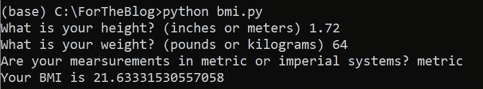
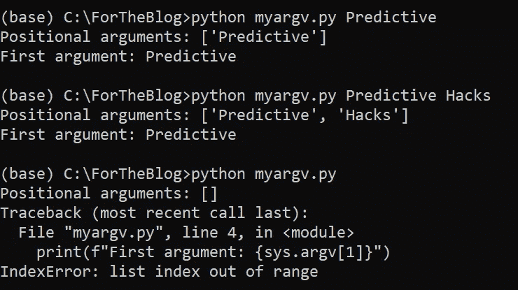
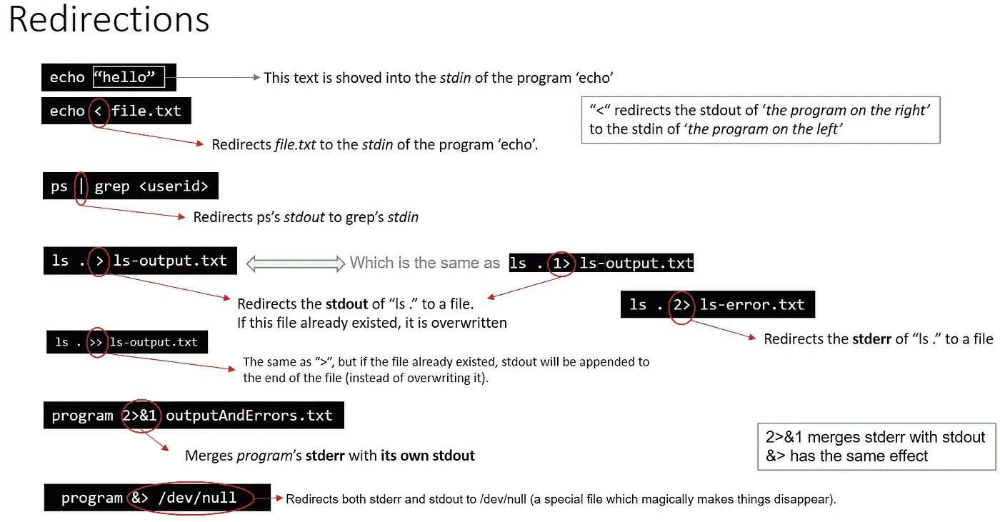
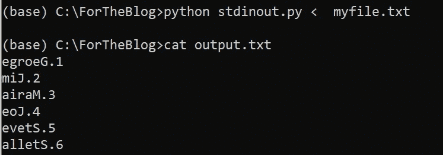

# 如何编写交互式 Python 脚本

> 原文：<https://betterprogramming.pub/how-to-write-interactive-python-scripts-fc7ca6f8ff31>

## 如何编写脚本以接受用户输入和/或标准输入的示例


在 [Unsplash](https://unsplash.com?utm_source=medium&utm_medium=referral) 上 [Henar Langa](https://unsplash.com/@henarlanga?utm_source=medium&utm_medium=referral) 拍摄的照片。

[](https://jorgepit-14189.medium.com/membership) [## 用我的推荐链接加入媒体-乔治皮皮斯

### 阅读乔治·皮皮斯(以及媒体上成千上万的其他作家)的每一个故事。您的会员费直接支持…

jorgepit-14189.medium.com](https://jorgepit-14189.medium.com/membership) 

# Python 中带有用户输入的函数

下面，我们展示一个例子，说明如何通过请求用户输入来构建一个与用户交互的功能。我们将构建一个函数，通过将公制和英制作为输入，返回他们的身体质量指数(身体质量指数)。让我们开始吧。下面是`bmi.py`文件:

我们将提供以下信息作为输入:

*   身高:1.72 米
*   重量:64kg
*   测量系统:公制

我们得到的身体质量指数是 21.63:



# 在 Python 中使用环境变量

配置脚本的一种常见方式是使用环境变量，如凭据等，而不是要求用户输入密码。 [os](https://docs.python.org/3/library/os.html) 包使我们能够与环境变量交互。

## **如何获取所有环境变量**

```
**import** os
os.environ
```

## **我们如何创建一个新的环境变量**

```
os.environ['MyBlogPassword'] **=** 'MyPassword'
```

## **如何获取环境变量**

```
os.environ.get('MyBlogPassword', 'give_your_default_value')
```

## **如何删除环境变量**

```
# using pop
os.environ.pop("MyBlogPassword")# using del
**del** os.environ["MyBlogPassword"]
```

# 解析命令行参数

我们将展示如何通过命令行在脚本中传递参数，而不是获取用户输入。最简单的方法是使用 [sys](https://docs.python.org/3/library/sys.html) 模块和 [](https://docs.python.org/3/library/sys.html#sys.argv) `[sys.argv](https://docs.python.org/3/library/sys.html#sys.argv)`属性。更高级的方法是使用 [argparse](https://docs.python.org/3/library/argparse.html) 模块和`[argparse.ArgumentParser](https://docs.python.org/3/library/argparse.html#argparse.ArgumentParser)`类。

## `sys.argv`举例

传递给 Python 脚本的命令行参数列表。`argv[0]`是脚本名(取决于这是否是完整路径名)。如果使用解释器的`[-c](https://docs.python.org/3/using/cmdline.html#cmdoption-c)`命令行选项执行命令，`argv[0]`被设置为字符串`'-c'`。如果没有脚本名被传递给 Python 解释器，`argv[0]`就是空字符串。

让我们提供一个`myargv.py`脚本的例子。注意，输入参数从索引`1`开始，而不是从`0`开始:

```
**import** sysprint(f"Positional arguments: {sys.argv[1:]}")
print(f"First argument: {sys.argv[1]}")
```

现在，我们将运行脚本三次。第一次，我们会给出一个论点(“预测性”)。第二次，我们将给出两个论点(“预测性”和“黑客”)。第三次，我们不会给出任何论点。



正如我们所看到的，在前两种情况下，它的工作与我们预期的一样。但是对于第三种情况，当我们请求获得第一个参数时，我们收到了一个错误(`IndexError`)。然而，当我们要求位置参数时，我们收到了一个空列表(`[]`)。最后，请记住，位置参数是基于空格的，除非我们显式地用引号将参数括起来。

## `**argparse**` **用 add_argument()方法的例子**

`ArgumentParser.add_argument(*name or flags...*[, *action*][, *nargs*][, *const*][, *default*][, *type*][, *choices*][, *required*][, *help*][, *metavar*][, *dest*])`

定义如何解析单个命令行参数。每个参数在下面都有更详细的描述，简而言之，它们是:

*   `[name or flags](https://docs.python.org/3/library/argparse.html#name-or-flags)` —名称或选项字符串列表(如`foo`或`-f, --foo`)。
*   `[action](https://docs.python.org/3/library/argparse.html#action)` —在命令行中遇到此参数时要采取的基本操作类型。
*   `[nargs](https://docs.python.org/3/library/argparse.html#nargs)` —应该使用的命令行参数的数量。
*   `[const](https://docs.python.org/3/library/argparse.html#const)` —某些[动作](https://docs.python.org/3/library/argparse.html#action)和[报警](https://docs.python.org/3/library/argparse.html#nargs)选择所需的常数值。
*   `[default](https://docs.python.org/3/library/argparse.html#default)` —如果命令行中没有参数，并且名称空间对象中也没有参数，则生成的值。
*   `[type](https://docs.python.org/3/library/argparse.html#type)` —命令行参数应转换成的类型。
*   `[choices](https://docs.python.org/3/library/argparse.html#choices)` —参数允许值的容器。
*   `[required](https://docs.python.org/3/library/argparse.html#required)` —是否可以省略命令行选项(仅选项)。
*   `[help](https://docs.python.org/3/library/argparse.html#help)` —对参数作用的简要描述。
*   `[metavar](https://docs.python.org/3/library/argparse.html#metavar)` —用法消息中参数的名称。
*   `[dest](https://docs.python.org/3/library/argparse.html#dest)` —添加到由`[parse_args()](https://docs.python.org/3/library/argparse.html#argparse.ArgumentParser.parse_args)`返回的对象的属性的名称。

## **名称或标志**

`[add_argument()](https://docs.python.org/3/library/argparse.html#argparse.ArgumentParser.add_argument)`方法必须知道是否需要一个可选参数(如`-f`或`--foo`)或一个位置参数(如文件名列表)。因此，传递给`[add_argument()](https://docs.python.org/3/library/argparse.html#argparse.ArgumentParser.add_argument)`的第一个参数必须是一系列标志或一个简单的参数名。

我们将提供一个`argparse`的例子，其中脚本将文件名和打印行数作为输入，并以相反的顺序返回这些行。

`myfile.txt`如下所示:

```
1.George
2.Jim
3.Maria
4.Joe
5.Steve
6.Stella
```

`myargparse.py`脚本如下:

我们将给出`myfile.txt`和`limit 3`作为参数:


# Python 中的标准输入和标准输出

我们将提供一个例子，说明如何用标准输入读取文件，以及如何用 Python 编写标准输出的文件。我们可以为标准输入和输出提供以下描述:

*   标准输入—是读取和输入的“I/O 流”。
*   标准输出—它将输出写入“I/O 流”

下图提供了一些重定向示例:



来源:[堆栈溢出](https://stackoverflow.com/questions/3385201/confused-about-stdin-stdout-and-stderr)

让我们提供一个例子，说明如何使用标准输入从文件中获取输入，并使用标准输出编写文件。任务如下:

*   编写一个将文件作为标准输入的 Python 脚本。
*   它反转每行的文本。
*   它将标准输出保存到一个名为`output.txt`的新文件中。

我的`stdinout.py`是下面这个:

假设名为`myfile.txt`的示例输入如下:

```
1.George
2.Jim
3.Maria
4.Joe
5.Steve
6.Stella
```

现在，我们可以使用以下命令运行我们的脚本:

```
python stdinout.py < myfile.txt
```

注意`<`，这意味着我们重定向了标准输入。最后，我们得到名为`output.txt`的以下输出:

```
egroeG.1
miJ.2
airaM.3
eoJ.4
evetS.5
alletS.6
```

正如我们所料，它反转了每一行！



干得好！

# 参考

*   [预测黑客](https://predictivehacks.com/)
*   [Linux 学院](https://acloudguru.com/?utm_source=legacyla&utm_medium=redirect&utm_campaign=one_platform)

*原贴* [*预测性黑客*](https://predictivehacks.com/how-to-write-interactive-python-scripts/) *。*