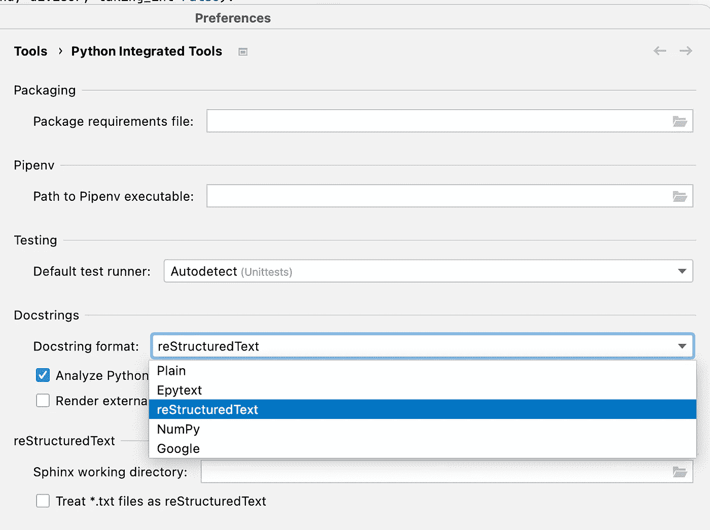

# 如何为 Python 函数编写正确的文档字符串

> 原文：<https://betterprogramming.pub/how-to-write-proper-docstrings-for-a-python-function-7c40b8d2e153>

## 了解定义函数的文档字符串的最佳实践


由[凯利·西克玛](https://unsplash.com/@kellysikkema?utm_source=medium&utm_medium=referral)在 [Unsplash](https://unsplash.com?utm_source=medium&utm_medium=referral) 上拍摄的照片

当我们遇到一个新的函数时，我们经常需要查阅它的文档来弄清楚如何使用它。例如，我们遇到了内置的`id`函数，我们知道我们可以检查一个对象的内存地址。然而，很可能我们不知道如何调用这个函数。除了在网上查资料，还有什么方法可以获取相关信息？

```
>>> help(id)
Help on built-in function id in module builtins:id(obj, /)
    Return the identity of an object.

    This is guaranteed to be unique among simultaneously existing objects.
    (CPython uses the object's memory address.)
```

在 Python 中，我们可以使用`help`函数来检索`id`函数的文档字符串。从一般的角度来看，我们使用文档字符串来引用函数、类或模块的文档。在我们的例子中，我们正在查看函数的文档字符串，它提供了关于如何使用`id`的具体说明。重要的是，可以在 Python 控制台中通过简单的帮助调用来访问文档字符串，而不需要依赖任何外部资源。因此，文档字符串不仅可以提供关于函数用法的信息，而且可以方便地访问。在本文中，我们将学习如何为 Python 中的函数编写合适的文档字符串。

# 基本结构

函数的 docstring 是位于函数头部下方的多行字符串。按照惯例，我们使用三重引号将字符串括起来。只要匹配，您可以使用双引号或单引号来构成三重引号。

```
def the_function():
    """the docstring
    goes here, as a multi-line string
    below the head
    """
```

对于这个多行字符串，需要三个关键元素和第四个可选元素。

*   **功能总结。**功能是做什么的？它应该提供该函数执行的操作的高级摘要。
*   **参数。**函数中使用了哪些参数？
*   **返回值。**函数返回哪种数据？
*   **异常(可选)。**该函数会引发哪些可能的异常？

# 文档字符串的样式

关于 Python 中 docstring 的样式还没有达成共识。例如，如下图所示，最流行的 Python IDEs 之一提供了 5 种不同的格式:Plain、Epytext、reStructuredText(也称为 reST)、NumPy 和 Google。



PyCharm 支持不同的文档字符串格式

在这些格式中，默认格式是 reST。下面的代码片段向您展示了使用 reST 的函数的 docstring。

reST 格式的 Docstring

另一种常见的风格是谷歌 one，因为它得到了谷歌的认可。下面是一个例子。

Google 格式的文档字符串

尽管不同的格式使文档字符串看起来不同，但基本元素是相同的。在实践中，选择偏好的风格或遵循公司的惯例是程序员个人的事。对于本文，我将坚持 reST 风格来展示相关的例子。

# 文档参数和返回值

一个函数的概要应该是简单明了的。本质上，你应该简洁地告诉用户这个功能是做什么的。之后，下一步是记录函数使用的每个参数。使用 reST 风格，每个参数都以`:param`开始，不同的参数应该作为单独的行列出。对于每个参数，我们需要提供以下信息:

*   **Name** :应该和函数头中使用的完全匹配。
*   **Type** :你希望参数是什么类型的数据？指定它。
*   **描述**:根据参数的直观程度，提供有用的描述，帮助用户理解这个参数是什么，或者如果目的不太清楚，为什么需要这个参数。
*   **默认值**(可选):如果参数有默认值，请指定。值得注意的是，如果用户不清楚为什么选择一个特定的值作为默认值，我们需要提供一个简短的理由。

遵循这个原则，让我们看一个带有简单示例的 docstring。

文档字符串中的参数和返回值

上面的例子提供了三个参数所需的 docstring，包括它们各自的名称、类型和解释。另外，因为`taking_int`有默认值，所以在 docstring 中也提到了。当一个参数的 docstring 扩展到多行时，记得在第二行插入一些缩进，这样不同参数之间的界限就很清楚了。

对于函数的返回值，docstring 使用`:return`来表示返回值的类型和解释。解释应该简明易懂。

# 指定任何可能的例外

当您的函数引发任何异常时，您应该在 docstring 中指定它们，以便当用户读取 docstring 时，他们知道可能会遇到的异常，从而可以避免或处理它们。

让我们仍然考虑`quotient`函数，它包括除法运算:`dividend / divisor`。我们知道，如果除数为 0，则除法是未定义的，并且我们可以看到，如果我们试图将一个数除以 0，会发生什么:

```
>>> 1 / 0
Traceback (most recent call last):
  File “<stdin>”, line 1, in <module>
ZeroDivisionError: division by zero
```

因此，我们应该在 docstring 中指定这样一个异常，如下所示。

指定异常

如上所示，我们显式地检查 divisor 是否为 0，并在它为 0 时提高`ZeroDivisionError`。请注意，即使我们没有显式地引发这个异常，当我们调用类似于`quotient(1, 0)`的东西时，这样的异常仍然会被引发，因为 Python 在任何适用的时候都会引发`ZeroDivisionError`。在这里，我明确地提出了这个异常，因为我想向您展示由函数提出的异常应该如何记录在 docstring 中。

# 结论

在本文中，我们学习了如何为函数提供文档字符串，这将有助于用户更好地理解您的函数。他们可以简单地调用`help(the_function)`来检索函数的文档。或者，一个函数有一个名为`__doc__`的特殊属性，您可以调用`print(the_function.__doc__)`来显示该函数的文档字符串。

对于一个函数，它的文档字符串应该由三个基本部分组成:一句话的摘要、参数(名称、类型、解释和默认值，如果设置的话)和返回值(类型和解释)。如果函数可以引发异常，也应该指定它。

创建函数的文档字符串有不同的方式。关键是始终坚持一种特定的风格。例如，如果你在一个团队中工作，使用你的团队已经同意的风格。如果你只是为自己编写函数/模块，采用你最习惯的风格。