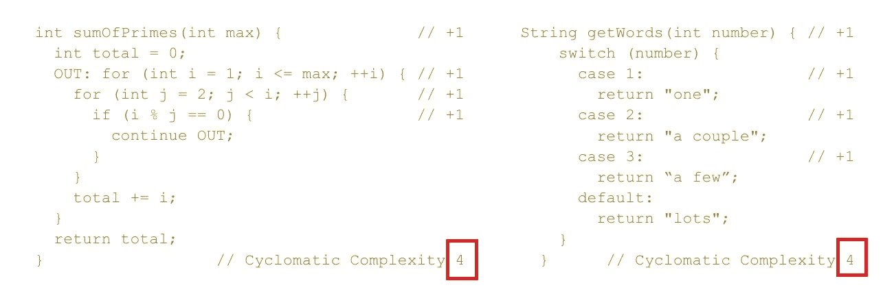
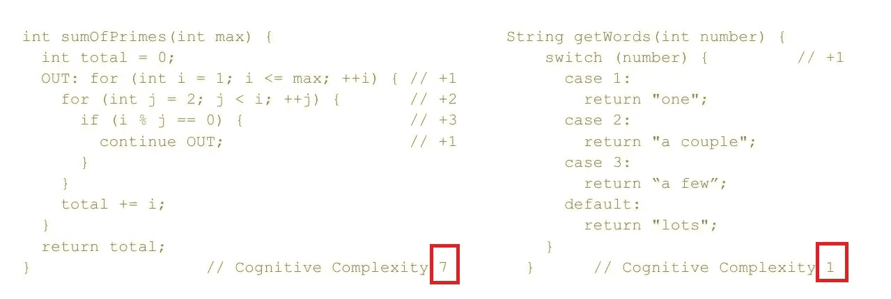
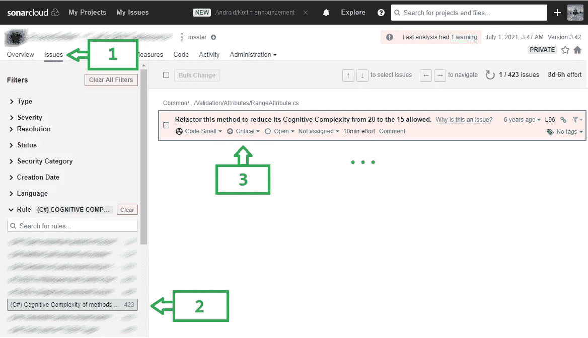
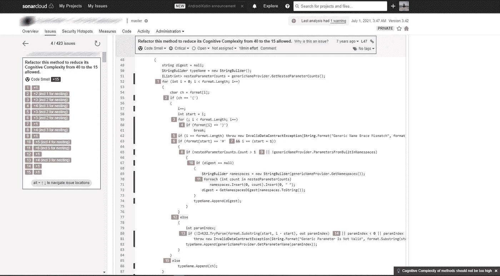
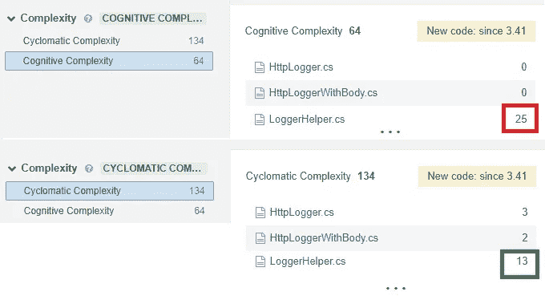

# 如何编写低认知复杂度的自文档代码

> 原文：<https://betterprogramming.pub/how-to-write-self-documented-code-with-low-cognitive-complexity-84d3e0bc53ad>

## 帮助您的团队编写自我记录的代码、生产更好的软件并改善程序员生活的指南

克里斯里德在 [Unsplash](https://unsplash.com?utm_source=medium&utm_medium=referral) 上的照片

在本文中，我将分享停止圣战的实用而直接的建议，关于代码质量的争论，以及重构、简化和添加代码注释或文档的必要性。虽然我将在本文的后半部分提到确切的商业工具，但我想说我与该工具的作者没有关系。这些工具可以通过免费的社区许可和商业许可获得。

本文的目标不是工具本身，而是告诉您有用的度量标准，这些标准将允许您的团队编写自我记录的代码，生产更好的软件，并改善程序员的生活。

# 自我记录的代码

当我要求开发人员提供文档或解释他们的代码时，我经常得到的回答是*“去读代码吧”*。我相信我不是一个人。许多开发人员认为他们的代码默认是自文档化的。没有多少人理解创建自文档化的代码是一项复杂的设计任务。

这是为什么呢？让我们来看看我们阅读代码的方式:

1.  首先，我们试图找出这段代码的目的:任务和目标是什么(真正的专家也试图探究原因)。
2.  接下来，知道了什么，我们正在阅读代码，以了解作者是如何实现这一点的。

虽然反过来也是可能的，但这在任何生产解决方案中都是困难的。由于与其他系统组件(如监控、日志记录或安全性)集成的额外需求，生产代码往往很复杂。它们还必须具有弹性、可伸缩性、可配置性，支持多平台、多版本等。

有些人声称 SQL 和 HTML 同时回答了如何和做什么。我将在这里忽略这个注释，集中讨论通用语言。

做反过来分析，软件工程师应该弄清楚这段代码的目的是什么，它主要做什么，以及(最后)它缺少什么。这通常被称为心智模型。无论多么简单或复杂，代码背后总有一些心理模型(甚至是坏的模型)。它可能是一个领域模型，或者是表达思维过程的另一种方式。有许多具体的规则可以遵循，以使您的代码更加清晰、易读和易懂。

众所周知，许多书都是关于这个主题的。但是总结所有这些，只有一种方法来编写自文档化的代码:开发人员应该编写代码来揭示心智模型并表达重要的模型部分，同时隐藏不必要的实现细节。开发人员经常关注实现细节，如框架、数据库、协议和语言，这使得理解模型变得困难。

像“如何”和“什么”这样的问题是正交的，因为有几种方法可以达到相同的目标。想象登山者分析通过不同的路径到达山顶的更好的方法。他们考虑各个方面，总结自己的经验和关于山区地形、天气和空气条件、一年中的时间、小组的准备水平等的常识。最后，他们选择最佳路径攀登。最佳路径没有解释所有这些方面，但允许团队将旗帜放在顶峰。

[图片通过 freepik](https://www.freepik.com/premium-vector/mountain-paths-progress-success-hiking-path-business-metaphor-journey-climb-peak-route-mission-progressive-career-way-vector-illustration-mountain-goal-progress-career-business_18144991.htm)

在我看来，心智模型显示了作者的设计技巧对自文档代码的明确依赖，允许他们使代码更具可读性。

> 心智模型回答什么，而代码告诉我们如何做。

# 衡量代码的可读性

Frederick Brooks 在他的著名论文[没有银弹——软件工程中的本质和意外](https://en.wikipedia.org/wiki/No_Silver_Bullet)中指定了两种类型的复杂性:

*   本质复杂性——由要解决的问题引起，没有什么可以消除它
*   意外复杂性——与工程师创造的可以解决的问题相关

许多年过去了，但我们仍然不能精确地测量它。众所周知的度量标准圈复杂度(1976 年发明)与代码行紧密相关。虽然这是测量代码覆盖率的一个很好的方法，但它不是测量圈复杂度的方法。这里是问题展示区:

正如你所看到的，圈复杂度从左到右显示了相同的数字。然而，从开发人员的角度来看，左边和右边的代码并不完全一样复杂。左边的更难阅读和理解。我们可能认为代码在寻找素数之和，这是一个众所周知的问题，但是一个有经验的开发人员永远不会认为它解决了这个问题，直到他们验证了这是真的:

*   方法的名字是否清楚地说明了代码的作用？
*   代码是否实现了任务？
*   代码是否遗漏了一些用例，它们是什么？(即守则的局限性是什么？)

现在，想象一下，对于那些不为他人所知的领域，理解一些更具体的东西有多难。声纳源在 2017 年发布了认知复杂性度量，知道的人并不多。然而，我相信这是一项开创性的工作，必须被广泛采用。正如我们所看到的，它非常适合所描述的例子:

你可以在[他们的论文](https://redirect.sonarsource.com/doc/cognitive-complexity.html)和 [YouTube](https://www.youtube.com/watch?v=x5V2nvxco90) 上找到所有细节。该指标基于三条规则:

1.  忽略允许将多个语句缩写成一个语句的结构。
2.  代码线性流程中的每一个断点递增(加一):循环结构(for，while，do-while)，条件，三元运算(if，#if，#ifdef)。
3.  当断流结构嵌套时递增。

您可以使用 Sonar Source 生产的静态代码分析工具(SonarQube、SonarCloud 及其免费提供的 SonarLint IDE 扩展)找到这个度量。SonarQube 在[免费社区版](https://www.sonarsource.com/plans-and-pricing)中有售。

在声纳云中，查看项目->问题->规则->认知复杂性。

很容易找到完整的报告，其中逐行解释了惩罚分配。下面是如何做到这一点:

代码质量的默认阈值是:

认知复杂性

*   15(大多数语言)
*   25 (C 系列语言)

圈复杂度

*   10(所有语言)

了解圈复杂度和认知复杂度阈值是很重要的，因为一个度量可能比另一个大，反之亦然。让我们看一个简单的生产示例。要找到它，您可以执行以下操作:声纳云->测量->选择复杂性过滤器

您可以在左侧找到文件组(文件夹)的总复杂性度量。在这里，我们可以看到数字翻倍:134 对 64。您还可以看到文件与文件之间的差异。

`LoggerHelper`文件在圈复杂度方面还不错，但是有一些方法可以提高它的认知复杂度。对于其他文件，我们可能会看到一个有争议的图片——圈复杂度大于认知复杂度。

# 结果

看起来我们有了一种度量代码复杂性的方法，我希望有更多的工具来实现这一点，但是我们已经可以快速直接地开始使用它了。认知复杂性度量仍然没有告诉我们好的代码是如何表达心智模型的，但是它已经是迈向好软件的优秀数据了。使用这些指标，您可以开始在开发和业务之间建立透明的对话，讨论必要的资源和路线图，以获得更好的代码和产品质量:

*   度量代码库所有部分的认知复杂性，以评估引入新开发人员、实现和交付新变更等的难度。
*   在规划开发周期和任何改进代码的活动(如重构)时，使用可度量的目标。
*   优先改进代码库最关键的部分。
*   查看应包含附加文档的地方。
*   停止争论和警告，停止冲突，停止和同事强调代码质量。
*   让你同事的生活更有成果(每个人都想尽快完成任务，然后与朋友和家人见面)。

我希望我分享了令人兴奋的食物，让你深入了解这一点，并向你展示认知复杂性如何应用于你的日常生活。