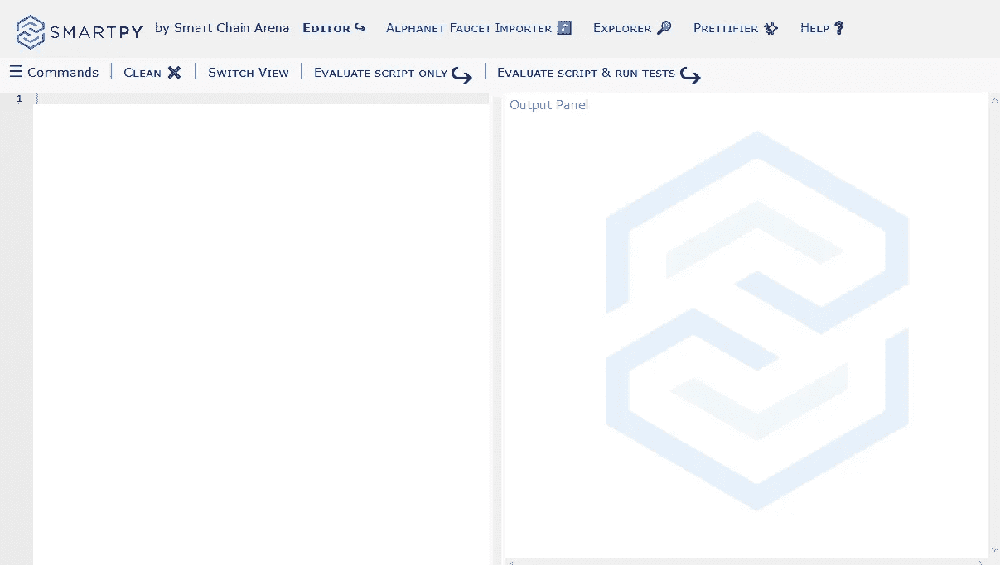
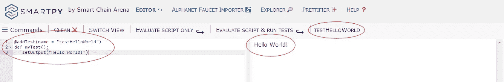
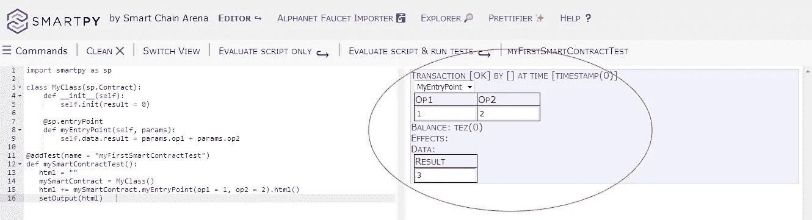

# 如何使用 Python 编写区块链智能合约——第二部分

> 原文：<https://betterprogramming.pub/how-to-write-smart-contracts-for-blockchain-using-python-part-2-99fc0cd43c37>

## 入门分步指南


在 [Unsplash](https://unsplash.com?utm_source=medium&utm_medium=referral) 上由 [Hitesh Choudhary](https://unsplash.com/@hiteshchoudhary?utm_source=medium&utm_medium=referral) 拍摄的照片

在这一系列教程中，我们将使用智能链领域的 [SmartPy](https://smartpy.io/) 语言。SmartPy 提供了一个完整的集成开发环境来在线编写智能合同、测试它们、调试它们并在区块链中部署它们。

要求

*   计算机编程经验
*   基本的 Python 编程知识
*   区块链技术熟人
*   网络浏览器

# 欢迎来到 SmartPy！

SmartPy 基于 Python 3 语言，需要 Python 代码语法。Python 开发人员在开始用 SmartPy 编写智能契约时会感觉很自在。

但是，请注意，虽然可以通过 import 指令导入 Python 库，但是有些特性只能在开发环境中工作。例如，当部署到区块链时，就有这方面的具体情况。

## **首先要做的事情**

对于那些不太了解 Python 的人来说，记住缩进是很重要的。它影响代码的正确性。

对于智能合约编程的新手来说，注意智能合约总是有一个*入口点*，通过这个入口点，它将通过一个事务从外部世界被调用。

智能合同发布后，驻留在区块链中，分散并分布在计算机节点网络上。每个节点上都有智能合约的副本。

## 第一课

让我们先来认识一下[开发环境](https://smartpy.io/demo)。您将被授予访问 SmartPy IDE 的权限:



智能 IDE 一览

再简单不过了。屏幕左侧是编辑器，您可以在其中键入智能合约源代码。右边是输出面板；它将显示您编程的结果输出。

# **你好世界！**

古希腊有句谚语说，如果你用一种新语言编写的第一个程序不是“Hello World！”那你以后编程会有很多麻烦。所以…

## **我们的第一次 SmartPy 体验**

单击屏幕的编辑器部分，并键入:

```
alert("Hello World!")
```

现在，只需点击*评估脚本&运行测试*(输出面板上的按钮)。瞧啊。出现一个显示“Hello World！”在屏幕上。这是一个公平的开始，只是为了打破僵局。

## **再往前一点**

好的，很高兴看到屏幕上的提示信息。但是，让我们稍微修改一下我们的代码，通过向我们的智能契约脚本添加一个测试来改变消息的显示方式。

只需将下面的代码复制并粘贴到编辑器中。注意缩进，因为它很重要:

```
[@addTest](http://twitter.com/addTest)(name = "testHelloWorld")
def myTest():
   setOutput("Hello World!")
```

现在，再次点击按钮*评估脚本&运行测试*。您将在输出面板上看到结果，您还会注意到一个名为 *testHelloWorld* 的新按钮出现在它的上方:



新脚本的输出结果

该测试非常重要，因为我们需要在将智能合约发布到区块链之前模拟它的行为。

到目前为止，一切顺利。尽管如此，目前还没有太多与智能合约相关的东西。

## **创建我们的首个智能合同**

所以，让我们认真起来。我们现在将创建我们的第一个智能合同。首先，我们将`import`这个`smartpy`库。清除编辑器并将下面的代码粘贴到其中:

```
import smartpy as sp
```

现在我们已经导入了库，我们将能够基于继承的契约定义一个类。将此添加到您的代码中:

```
class MyClass(sp.Contract):
    def __init__(self):
        self.init(result = 0)
```

我们在这里做的是定义一个新类并声明它的构造器方法(init)。这就是这个类的新实例(对象)将被初始化的方式。

## **定义智能合同入口点**

智能合约至少有一个*入口点*。那么，让我们为我们的契约声明入口点。将以下文本添加到您的代码中:

```
 @sp.entryPoint
    def myEntryPoint(self, params):
        self.data.result = params.op1 + params.op2
```

如果您现在尝试通过点击*评估脚本&运行测试*按钮来运行代码，什么也不会发生。这是因为我们需要在代码中添加一个测试。

所以，我们开始吧。复制下面的文本并粘贴到您的代码中:

```
@addTest(name = "myFirstSmartContractTest")
def mySmartContractTest():
   html = ""
   mySmartContract = MyClass()
   html += mySmartContract.myEntryPoint(op1 = 1, op2 = 2).html()
   setOutput(html)
```

让我们分解一下我们添加的测试。这里正在做什么？

我们正在定义一个名为`html`的字符串，我们将使用它在屏幕上呈现我们的输出。然后我们创建一个类`MyClass`的对象`mySmartContract`实例，它是`sp.Contract`类型的派生。这就是我们如何在 Tezos smart 契约中有效地转变该类别。这个派生构造，以及构造函数和初始化，都是纯标准的 Python 语法。

此外，上面的`@`方法/函数声明是 Python *装饰器*，用于指导编译器执行某些操作。它们就是所谓的*语法糖*，它提供了一种方便的方式来给函数定义添加一点魔力。你可以把它想象成一个把你写的 Python 函数转换成另一个 Python 函数的函数。

例如，`sp.entryPoint`是一个函数，它接受一个 Python 函数，并将其转换成一个将成为实际的迈克尔逊入口点的函数。

现在，尝试再次运行代码，看看会发生什么。您应该会得到如下结果:



如果你有错误，首先检查你的代码是否有不正确的缩进。通常，你必须用四个空格或制表符来缩进代码。此外，检查逻辑缩进，即哪个定义属于每个父声明。

第一个例子是一个智能契约，它将通过参数传递给类`myClass`的方法`myEntryPoint`的两个数字相加，并将结果放在契约的存储器`result`中。

为了便于理解和测试，下面是完整的注释代码:

这是与 SmartPy 环境的一次非常简短的初次接触，目的是让您熟悉它。随着我们在未来作品中的进展，我们将致力于更多真实世界的用例。

第三部见！别忘了阅读[第一部](https://medium.com/@lmilfont/how-to-write-smart-contracts-for-blockchain-using-python-8f645d485bf7)！