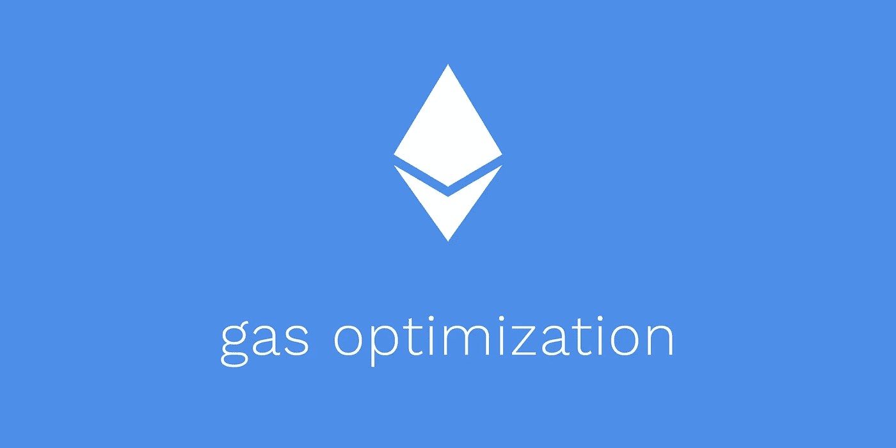

# 如何撰写智能合同来优化以太坊的汽油支出

> 原文：<https://betterprogramming.pub/how-to-write-smart-contracts-that-optimize-gas-spent-on-ethereum-30b5e9c5db85>

## 在可靠性方面写更便宜的合同

图片来源:Kaden Zipfel

在以太坊区块链，天然气是一种执行费用，用于补偿矿工为智能合同提供动力所需的计算资源。随着目前每天数百万美元的天然气成本，网络的使用逐渐增加。随着生态系统的不断发展，气体优化的价值也将不断提升。下面几节将介绍一些常见的气体优化模式。

**查看** [**github repo，获取最新的气体优化列表**](https://github.com/KadenZipfel/gas-optimizations) **。**

# 省油模式

以下是您可以在代码中使用的模式，以减少气体消耗。

## 短路

当操作使用`||`或`&&`时，短路是我们可以利用的一种策略。这种模式的工作原理是首先安排低成本的操作，这样如果第一个操作评估为`true`，高成本的操作可以被跳过(短路)。

来自[堆栈交换](https://ethereum.stackexchange.com/questions/28813/how-to-write-an-optimized-gas-cost-smart-contract)的示例。

## 不必要的库

库通常只为少量用途而导入，这意味着它们可能包含大量对您的合同来说多余的代码。如果您可以在合同中安全有效地实现从库中导入的功能，那么这样做是最好的。

冗余库示例

不带库的示例

## 显式函数可见性

显式函数可见性通常可以在智能合约安全性以及 gas 优化方面提供好处。比如，显式标注外部函数，强制将函数参数存储位置设置为`calldata`，这样每次执行函数都比较省气。

## 正确的数据类型

在[可靠性](https://solidity.readthedocs.io/en/v0.6.1/)中，一些数据类型比其他数据类型更昂贵。知道可以使用的最有效的类型是很重要的。以下是一些关于数据类型的规则。

*   只要有可能，应使用`uint`型代替`string`型。
*   类型`uint256`比`uint8`需要储存更少的汽油([看为什么](https://ethereum.stackexchange.com/questions/3067/why-does-uint8-cost-more-gas-than-uint256))。
*   类型`bytes`应在`byte[]`之上使用。
*   如果`bytes`的长度有限，那么从`bytes1`到`bytes32`使用尽可能少的长度。
*   `bytes32`型比`string`型更便宜。

# 昂贵的天然气模式

以下模式摘自文章“[优化不足的智能合同吞噬你的金钱](https://arxiv.org/pdf/1703.03994.pdf)”这些模式增加了天然气成本，应该避免。

## 死代码

死代码是永远不会运行的代码，因为它的评估是基于一个总是返回`false`的条件。

如果 x 小于 1，它就不能大于 2，所以第 4 行永远不会被执行。

## 不透明谓词

有些条件的结果不需要执行就可以知道，因此不需要评估。

如果 x 大于 1，那么肯定大于 0，所以第 3 行是多余的。

## 循环中昂贵的操作

由于昂贵的 SLOAD 和 SSTORE 操作码，管理存储中的变量比管理内存中的变量要昂贵得多。因此，存储变量不应该在循环中使用。

循环的每次迭代都需要成本高昂的存储管理。

对这种模式的修正是创建一个临时变量来表示全局变量，一旦循环完成，就将临时变量的值重新分配给全局变量。

将值赋给临时变量。

## 循环的恒定结果

如果循环的结果是可以在编译过程中推断出来的常数，就不应该使用它。

返回值总是相同的。

## 环路融合

偶尔在智能合约中，你可能会发现有两个参数相同的循环。在循环参数相同的情况下，没有理由使用单独的循环。

这些循环是相同的，因此可以合并。

## 循环中的重复计算

如果循环中的表达式在每次迭代中产生相同的结果，则可以将其移出循环。当表达式中使用的变量存储在存储器中时，这尤其重要。

`a * b`的乘积可以在循环之外计算。

## 与循环中的单边结果进行比较

当在循环的每次迭代中执行比较，但每次结果都相同时，应该从循环中删除比较。

第 4 行的条件每次都有相同的结果，所以应该从循环中删除。

# 参考

*   [https://medium . com/coin monks/optimizing-your-solidity-contracts-gas-usage-9d 65334 db6c 7](https://medium.com/coinmonks/optimizing-your-solidity-contracts-gas-usage-9d65334db6c7)
*   [https://ether eum . stack exchange . com/questions/28813/how-to-write-an-optimized-gas-cost-smart-contract](https://ethereum.stackexchange.com/questions/28813/how-to-write-an-optimized-gas-cost-smart-contract)
*   https://arxiv.org/pdf/1703.03994.pdf
*   [https://以太坊. stack exchange . com/questions/3067/why-uint 8-cost-more-gas than-uint 256](https://ethereum.stackexchange.com/questions/3067/why-does-uint8-cost-more-gas-than-uint256)
*   [https://www.youtube.com/watch?v=qwBkeJ84d2g&feature = youtu . be&t = 68](https://www.youtube.com/watch?v=qwBkeJ84d2g&feature=youtu.be&t=68)
*   [https://ether eum . stack exchange . com/questions/11556/use-string-type-or-bytes 32](https://ethereum.stackexchange.com/questions/11556/use-string-type-or-bytes32)