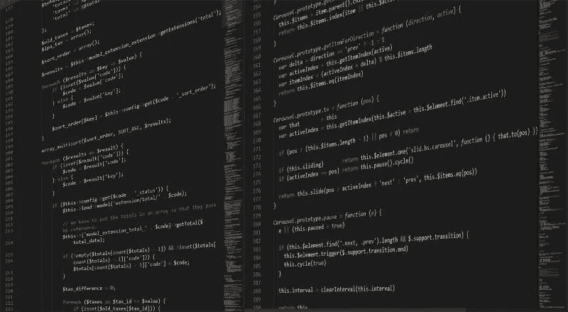

# 如何在最后负责任的时刻写软件

> 原文：<https://betterprogramming.pub/how-to-write-software-at-the-last-responsible-moment-96a152217103>

## 构建一个新的应用程序既令人兴奋又令人害怕。但这也很有挑战性

巴渝安五郎在 [Unsplash](https://unsplash.com/s/photos/cliff?utm_source=unsplash&utm_medium=referral&utm_content=creditCopyText) 上的照片。

那么多东西需要建设。你从哪里开始？你想象了所有很酷的特性，并且预见了未来的问题，但是你现在适应它们了吗？

这使得[绿地开发](https://medium.com/better-programming/the-greenfield-paradox-why-is-building-a-new-app-so-easy-and-also-so-hard-b3cc58552ab)成为开发者职业生涯中最具挑战性的经历之一。抑制住想要现在就全部完成的冲动。

但是你不应该。而且看完这篇文章，希望你不会。

# 最后负责任的时刻

[*最后负责时刻*](https://innolution.com/resources/glossary/last-responsible-moment-lrm) 中的关键词是*负责*二字。不要读了这句话就想“把一切都推迟到最后！”

这不是它的意思。

它的意思是建立你现在需要的东西。不要为预期的问题开发软件。

开发软件来解决你的问题。

推迟重要的决定，直到你的应用程序建立起来。您将对实现的体系结构有一个更清晰的理解，并且更好地理解您的客户想要什么。你永远不会比现在知道得更少。

我们举个例子。

你在建立一个修船论坛，多孔船。您还没有构建任何东西，但是根据以前的经验，您知道人们会滥用您的站点。他们会进来，诘问，提供不好的建议，并降低社区的士气。

所以你知道你必须建立一个用户禁止机制来防止这种情况发生。

你开始建立你的禁止机制，结果比你想象的要困难(专业提示:它总是如此)。你花了大量的时间去弄清楚如何禁止一个用户，结果却发现你没有办法添加用户。你连一个让用户在论坛发帖的办法都没有！

虽然这可能是一个*优先级排序不佳的例子*，但这也是一个解决你没有的问题的例子。

*图片由*[*StartupStockPhotos*](https://pixabay.com/users/startupstockphotos-690514/?utm_source=link-attribution&utm_medium=referral&utm_campaign=image&utm_content=3267505)*发自*[*Pixabay*](https://pixabay.com/?utm_source=link-attribution&utm_medium=referral&utm_campaign=image&utm_content=3267505)*。*

# 先解决业务问题

把你的优先权放在解决商业问题上。对于 Holey Ship，我们必须添加用户并允许他们发布消息。

解决主要业务问题之前的最后负责任的时刻是第一天。

虽然禁止用户肯定是您在某个时候可能需要的一个功能，但还有许多其他事情需要事先完成:

*   向系统添加新用户。
*   允许用户发布新主题。
*   允许用户对主题发表评论。
*   设置版主。
*   将主题分类到元组中。
*   排名热门话题的能见度。

这个清单还在继续。记住，在开始时，你需要专注于提供商业价值——而不是节制。

除非你解决了业务问题，否则其他什么都不重要。

再一次，找到最后一个负责任的时刻归结为一个优先级的练习。如果你知道如何根据客户的需求对你的特性进行优先排序，那么知道什么该推迟就变得简单了。

*图像由*[*Boskampi*](https://pixabay.com/users/boskampi-3788146/?utm_source=link-attribution&utm_medium=referral&utm_campaign=image&utm_content=1873831)*来源于*[*Pixabay*](https://pixabay.com/?utm_source=link-attribution&utm_medium=referral&utm_campaign=image&utm_content=1873831)*。*

# 就硬编码吧

我在 2019 年发表了一篇文章[对硬编码](https://medium.com/better-programming/new-project-just-hardcode-it-bac72e1a231e)采取了极端的立场。在这篇文章中，我说你应该硬编码所有东西，直到你需要它可配置。

我袖手旁观这句口头禅。而且它和整个*最后责任时刻*的事情很搭。

有了 Holey Ship，如果我们论坛上的每个人都相处得很好会怎么样？没人起哄。这只是一个由真正善良、勤劳的人组成的社区。

如果你把所有的时间都花在了构建禁止机制上，那就是浪费了时间。但是如果你已经在这个领域进行了硬编码，那么恭喜你——你在一个没有的*问题上花费了最少的时间。*

如果你把重点放在业务问题上，并把其他的都硬编码(在合理的范围内)，你的上市时间将会大大缩短，你也不会构建任何你不需要的东西。

*图片由* [*伊戈尔*](https://pixabay.com/users/igorovsyannykov-6222956/?utm_source=link-attribution&utm_medium=referral&utm_campaign=image&utm_content=2693054) *转自*[*Pixabay*](https://pixabay.com/?utm_source=link-attribution&utm_medium=referral&utm_campaign=image&utm_content=2693054)*。*

# 寻找最后负责任的时刻

那么，在不负责任的情况下，你能把复杂性推迟多久呢？

下次您决定何时构建新功能时，问自己以下问题:

*   这解决了什么问题？
*   我现在需要来解决这个问题吗？
*   支持该特性所需的所有部分都已经构建好了吗？
*   我什么时候需要这个？
*   需要多长时间建造？
*   有哪些未知数？

这些问题作为一个小小的责任试金石。如果这些答案中的大部分让人感觉不确定或犹豫不决，那么可能就不是构建这个特性的时候了。

如果你有强有力的、自信的答案，也许是时候扣动扳机开始建造了。

记住，你(负责任地)拖延得越久，你知道的就越多，你的解决方案就越强。

# 结论

在构建软件时，你不想过早地做出任何不可逆转的决定。使用敏捷开发，您的计划可能会在每次冲刺时有一点点变化。

让您的应用程序成型。更好地理解你已经建立的东西。建造房屋时，你不会从橱柜上的把手开始。首先，你浇注地基，然后给它装框，然后你添加橱柜，安装地板，粉刷墙壁，然后装上把手。

在软件的早期做一个不必要的决定就像在没有瓷砖的时候挑选橱柜把手来匹配瓷砖。先弄进去，再决定。

从第一天起就与拥有一个完整设计的应用程序的强烈愿望作斗争。我保证，它不会那样建造。

找到*最后负责的时刻*将帮助你在需要的时候只制造必要的东西。