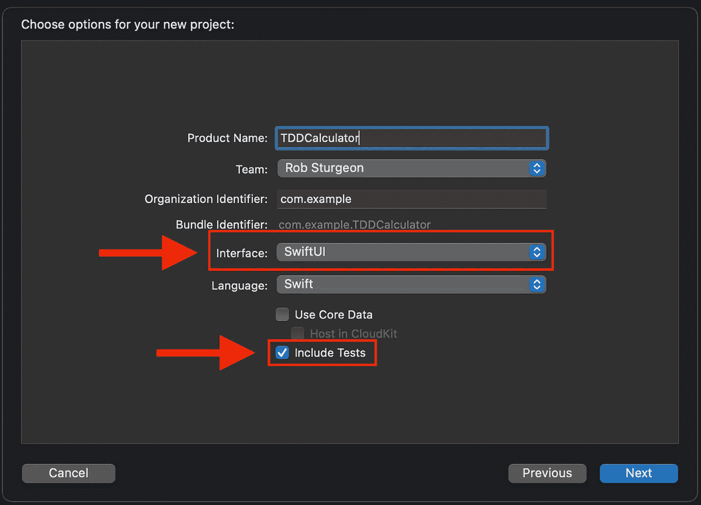
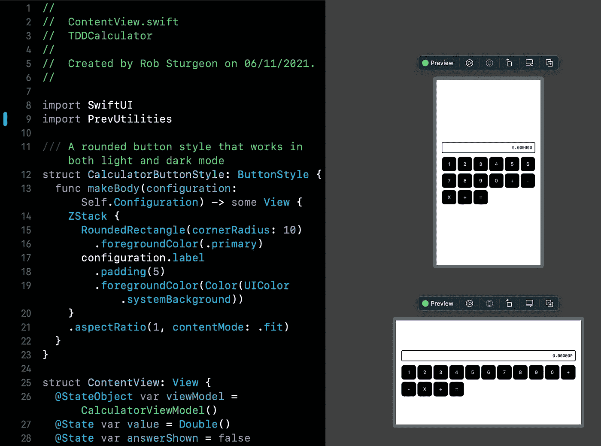

# 如何使用测试驱动开发编写 SwiftUI

> 原文：<https://betterprogramming.pub/how-to-write-swiftui-using-test-driven-development-ace8e2f6132b>

## 为一个简单的计算器应用程序编写单元和 UI 测试…然后制作应用程序

由 [Unsplash](https://unsplash.com?utm_source=medium&utm_medium=referral) 上的 [Element5 数码](https://unsplash.com/@element5digital?utm_source=medium&utm_medium=referral)拍摄

[1945 年，Jean Jennings Bartik](https://en.wikipedia.org/wiki/Jean_Bartik) 被选为从事电子数字积分器和计算机(也称为 ENIAC)工作的首批六名程序员之一。

机器花了 15 分钟来计算 60 秒的炮弹轨迹，而人类要花 40 小时来完成同样的任务。作为早期的计算机，ENIAC 很容易以各种机械方式出现故障，导致它输出不正确的数据。

在纪录片《绝密玫瑰》中，她解释了他们采用的测试过程:

> Ruth【Teitelbaum】和[Marlyn【Meltzer】](https://en.wikipedia.org/wiki/Marlyn_Meltzer)被分配了计算轨迹的工作，其方式与 ENIAC 完全相同。所以我们有测试程序…我们将运行测试程序，如果结果正常，那么我们将运行真实轨迹，然后我们将再次运行测试轨迹…如果两个测试轨迹都正常，我们假设中间的轨迹会。Marlyn 和 Ruth 所做的轨迹在工程师眼中给了我们有用的东西，因为有了这个程序，我们可以将 ENIAC 调试成真空管！

任何曾经编写过单元测试的人都应该熟悉这个过程。

如果你知道一个函数被设计用来做什么，你应该能够输入带有已知结果的数据，并最终得到你期望的结果。

> 测试驱动开发(TDD)得出了它的逻辑结论:如果你不知道如何测试你的代码，你甚至不应该写它。

TDD 要求您在编写允许那些相同的测试通过的代码之前，编写那些没有通过*的测试。不要试图在现有的代码上改造测试，在那里**它所做的**可能与**它打算做的**不同，当你的意图还在你的脑海中时，你就开始。一开始就完美地编写测试可能是不可能的，因为您看不到一路上可能遇到的所有陷阱。*

在为这个简单的计算器应用程序编写测试时，我忘记了一个事实，即一个`Double`用一个带有 6 个尾随零的`String`来表示。当我的测试失败时，我喜欢这个样子，所以我回去修改了我的测试，期望有 6 个小数位。尽管在 TDD 中许多这样的小调整是必要的，但是测试的大部分结构和逻辑是不变的。

修改现有的测试比从头开始编写测试要容易得多。

如果你等到你的应用程序完成后才写测试，可能就没有时间或动力去正确地或广泛地写测试了。

# 我们开始吧

我创建了一个名为`TDDCalculator`的新 Xcode 项目，但是你可以随意命名你的项目。

确保您勾选了“包含测试”,这样 Xcode 就会为您生成测试目标

组织标识符也无关紧要，因为我们不会尝试将此应用程序提交到应用程序商店。

但是，确保 SwiftUI 是选定的接口，并且勾选了 Include Tests，这一点很重要。测试可以在以后添加，但是更容易的是勾选这个框，并在项目创建时准备好并等待 Apple 的示例测试。默认情况下，该项目应该附带一个名为 *ContentView.swift* 的文件，其中包含一个基本的“Hello world”用户界面。

直到所有的(失败的)测试都被写完，我们才会修改用户界面。

# 编写 UI 测试

Apple 提供的示例 UI 测试类中有许多不必要的样板代码。我们真正需要做的是获得一个应用程序的引用，并使用该引用来启动它。

您不需要默认情况下得到的 tearDownWithError 函数

如果你不熟悉 UI 测试，这是一种“黑盒”方法，测试无法访问代码。

在你的模拟器或设备上安装了一个名为 test runner 的独立应用程序，这个测试运行程序通过像人类用户一样点击或滑动来与你的应用程序进行交互。

我们简单的计算器应用程序不会有小数点按钮，但它将能够在答案不是整数的情况下进行计算。

它将能够执行加、减、乘、除的运算，从下面代码示例开头的`enum`可以看出。这个`enum`的每一种情况都有一个将操作符表示为`String`的原始值，它们用文字描述主要是因为在 Swift 的标识符中不能使用'+'和'-'操作符。

这里我们还有一个函数，它执行一个相当简单的任务。当我们给它一个数字时，它会把这个数字分解成单个的数字。每个数字都是通过调用`app.buttons[String(digit)].tap()`打出来的。由于每个数字只是一个`String`的一部分，所以需要显式地转换回来。然后我们依靠`XCUIElementQuery`，它将在视图层次结构中搜索一个按钮，这个按钮的可访问性标签是这个数字。默认情况下，任何带有标题的按钮都将该标题作为其辅助功能标签，而不是自定义形状或图像。

我们所有的按钮都将以这种方式创建，所以我们将在所有的查询中使用这种格式。

这个函数允许 UI 测试运行者点击计算器数字按钮

输入数字只是计算过程的一部分。

我们想要一个测试函数，它知道当给定两个数字和一个操作符时，点击什么按钮以及我们可以期望什么结果。已经用对应于按钮的原始`String`值创建了`Operator enum`，所以我们可以将其中一个值传递给函数，并使用该原始值来定位按钮。equals 按钮不是操作符之一，因为我们不希望出现像`2 = 2`那样请求“计算”结果的情况。

如果你对操作数这个术语不熟悉，这仅仅意味着我们在运算符两边的计算中使用的数字(加号、减号、乘号或除号)。

现在，我们可以键入整个计算结果，并自己进行计算，以便比较结果

最后，使用`switch`执行计算并返回结果，该结果将用于与屏幕上显示的内容进行比较。

与我们到目前为止所做的相比，UI 测试本身相对简单。我们使用`XCTAssertTrue`要求应用程序启动时显示一个零，我们进行计算，并检查结果是否显示。

每个测试都有一个一位数和多位数的例子，因为我们可能会在实现更长的数字时出错。

每个测试中都包含一个多位数计算，以确保这些计算正确

如果您想要在此时运行测试以确认它们失败，通过按下 **Cmd + 6** 打开测试导航器。

如果您还没有在这里看到您的测试，通过按下 **Cmd + Shift + U** 来构建用于测试的项目。以测试为目的的构建包括从应用中构建完全独立的目标，因此构建项目通常不会刷新测试列表或消除测试代码中陈旧的错误消息。

现在您可以看到所有的测试，您可以将鼠标悬停在左侧面板中的单个测试或类本身上，然后按 play 按钮来运行它。

代码带中也有菱形按钮，如第 10 行的截图所示。

这些功能与左侧面板中的 Test Navigator 功能完全相同，同样，为了使它们保持最新，它们可能需要您为测试而构建。

右侧面板中的 Test Navigator 允许您运行测试，并显示测试是通过还是失败

# 编写单元测试

说到`calculate(_,_,_)`功能，没有必要重新发明轮子。有了单元测试，我们可以直接在代码中调用函数，所以没有必要(或者实际上不可能)自己点击屏幕输入操作数和运算符。

需要注意的是，我们将`TDDCalculator`(或者你的项目名称)作为`@testable`导入，因为没有这个，类和函数将无法访问。

如果没有它，类将被视为`internal`，即使它们被标记为`public`。

现在，我们已经达到了在不产生构建错误的情况下可以编写的测试的极限。这是因为我们想要创建一个名为`CalculatorViewModel`的类的实例。

为了尽快回到编写测试上来，我尽可能定义了最简单的形式。

在应用程序的主文件夹中创建一个名为*calculatorviewmodel . swift*的文件，而不是你的任何测试所在的位置。我们需要再次创建 Operator enum，因为主应用程序目标不知道 UI 测试目标中的那个。

接下来我添加了`Calculatable`协议，它定义了属性是什么以及函数签名是什么样子。

该协议也符合`ObservableObject`协议，这意味着当`CalculatorViewModel`中的数据改变时，我们的用户界面将自动刷新。我提供的`CalculatorViewModel`使用了`@Published`装饰来表明我们希望 SwiftUI 注意这些属性的变化。

协议是为一个类或结构设置最低要求的好方法

我提供的`calculate(_,_,_)`函数将总是返回`-1`，原因很简单。

我想在这里做最少的工作，这样我就可以写我的(失败的)测试，这正是我接下来要做的。

由于不需要点击或滑动，我们所要做的就是将`CalculatorViewModel.calculate(_,_,_)`的结果与`TDDCalculatorTests.calculate(_,_,_)`的结果进行比较。我们可以用`XCTAssertEqual`来做到这一点，它接受两个值，如果它们不同，测试就会失败。

如果您想运行单元测试并看到它们失败，请继续。没有一个答案是`-1`，我们写了`CalculatorViewModel`来返回这个值。当你准备好制作一个实际运行的 calculate 函数版本时，请查看下面的内容。该函数与之前的迭代之间的主要区别在于，它将`operatorType`设置为零，将`operand1`设置为答案(以防您想要进行更多操作),并将`operand2`重置为零。

将返回答案，以便可以更新用户界面。

*“什么用户界面？”你可能会问。*

我们要创造它了！

# 创建用户界面

每个计算器都有一个显示屏，显示最近输入的数字。我们不会提供一个 *C* 或 *AC 按钮*来清除输入，所以在我们指定一个操作之前，数字将一直保留在屏幕上。这个视图所做的只是用圆角矩形轮廓显示与屏幕右侧对齐的数字。字体是 Menlo，这是一种等宽字体，以相同的宽度显示所有数字。

通过使用`Color.primary`，我们避免了黑暗模式的问题，因为这将在明亮模式下显示为黑色，在黑暗模式下显示为白色。

最后一段代码相当长，但它基本上包含了整个用户界面。

我们从`CalculatorButtonStyle`开始，它将应用于界面中的每一个按钮。就`Color`而言，这基本上与`DisplayView`相反，利用`UIColor.systemBackground`在亮模式下给我们白色，在暗模式下给我们黑色。按钮的纵横比被设置为 1，以便强制它们显示为圆形方形。

如果你不介意每个按钮都是一个宽大于高的矩形，你可以删除那一行。

定义了一个自适应的`GridItem`来指定我们的列应该是什么样子。

因为它们是自适应的，所以列的数量可以根据所提供的空间而变化。在横向模式下，计算器将是宽的，而在纵向模式下，计算器将是高的。每次点击一个数字按钮，我们都会使用一个名为`appendDigit(_:)`的功能。

当点击一个操作员时，显示被清除，因此可以输入一个新的数字。

但是当显示一个答案时会发生什么呢？

输入一个新的数字应该可以清除答案，因为我们不想添加新的数字。

我已经用一个名为`answerShown`的布尔值粗略地完成了这项工作，只要输入一个新数字，它就会被设置为 false。

它应该是这样的:

自适应网格根据设备的大小改变计算器的形状

[如果你需要看到完整的代码，可以在 GitHub](https://github.com/sturdysturge/TDDCalculator) 上找到。

如果代码样本中有错误，或者如果你有问题，请在下面的回复中告诉我。

# 后续步骤

你知道一个计算器通常能做什么，TDD 不止于此。无论您是想要添加小数点按钮、C/AC 按钮，还是 M+/M-/MRC 按钮，该功能都是从测试开始的。

当你按下这些按钮时，你希望用户界面做什么？

您的单元测试将如何确保代码以您期望的方式计算或返回值？

无论您是在 ENIAC 上计算 shell 轨迹，还是使用 M1 Max MacBook Pro 构建跨平台 Swift 应用程序，在您开始编程之前，测试已经存在，因此测试您的代码要容易得多。