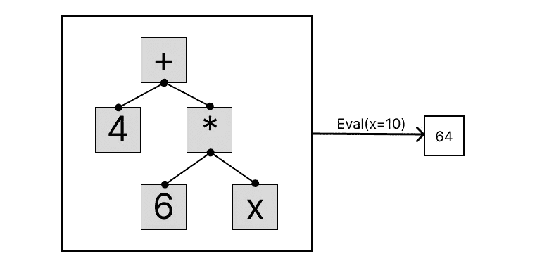

# 如何在 Go 中编写基于语法树的特定领域语言

> 原文：<https://betterprogramming.pub/how-to-write-syntax-tree-based-domain-specific-languages-in-go-b15537f0d2f3>

## 基于 AST 的 DSL 在表示递归结构方面的能力


杰里米·毕晓普在 [Unsplash](https://unsplash.com?utm_source=medium&utm_medium=referral) 上的照片

大约一年来，我一直在写 Go，同样长的时间里，我一直在实现语法树。现在进行的还可以，但是当我开始的时候，由于我没有找到任何初学者友好的内容，所以这是一场真正的斗争。所以，这是我在做年轻时的自己，也希望是你们中的一些人，帮个忙。

基于语法树的特定领域语言的一个有用特性是它们的递归性质，这使得它们在表示数学领域(如逻辑和代数)方面非常出色。作为一个工作示例，我们将编写一个程序，它可以象征性地表示基本的代数表达式，并对它们进行操作和求值。如果你不是像我一样的数学呆子；放心吧！我将主要关注我们计划的实施细节，而不是数学。

# 先决条件

## 特定领域语言(DSL)

你不必成为[领域特定语言](https://en.wikipedia.org/wiki/Domain-specific_language)(DSL)的专家。事实上，除了知道它是一种比通用语言(GPR)范围更小的语言之外，你真的不需要了解它的任何东西，比如 Go。这意味着 DSL 被优化以非常有效地解决一个特定领域的问题(在计算和实现方面)，它甚至可能不支持该领域之外的任何事情。

因为 DSL 的功能非常有限，所以通常用其他语言来实现。因此，用于构建 SQL 查询的包可以被认为是 DSL，其中域是 SQL 查询。在我们的工作示例中，域将是代数表达式，并作为 Go 包实现。

## 抽象语法树


**图 1:** 表达式 4+6x 的树形表示。

[抽象语法树](https://en.wikipedia.org/wiki/Abstract_syntax_tree) (AST)是一种数据结构，用于表示某些数据的[抽象语法](https://en.wikipedia.org/wiki/Abstract_syntax)结构。这对我们来说意味着，顾名思义，AST 将一些数据的结构和含义表示为一棵树。易于通过 ASTs 建模的数据类型通常是递归的，例如代数表达式或源代码。ast 通常在编译器中使用，因为它们可以表示含义。

对于我们的意图和目的来说，认识到一个代数表达式，例如图 1 中呈现的`4 + 6x`,非常适合树结构就足够了。更准确地说，每个操作符(`+`、`-`、`*`、`/`、`Const`、`x`)都由一个节点来表示，而它的参数(如果有的话)则由子节点来表示。

## 结合 DSL 和 AST



**图 2:** 评估过程的可视化；从 AST 到数字。

有了 DSL 和 AST 是什么的概念，我们可以将它们拼凑在一起，以形成我们的工作示例背后的思想，即用于简单代数表达式的基于语法树的领域特定语言。

我们希望能够表示包含任何或所有基本算术运算符(`+`、`-`、`*`、`/`)的一个变量的任何代数表达式，并且我们希望以某种方式在某个指定值对给定表达式求值。所有这些都在图 2 中举例说明，其中表达式`4 + 6x`被表示为 AST，并且在`x = 10`对其求值的过程被可视化，从而产生`4 + 6*10 = 64`。

# 履行

## 使用结构的树建模

创建这种基于语法的 DSL 时，最重要的工具是 Go 的类型系统。然而，在开始构建我们的 AST 的树结构之前，我们将查看图 1 中的每个节点，并意识到似乎有两大类不同的节点；有孩子的和没有孩子的。前者包括基本的算术运算(`+`、`-`、`*`、`/`)。它们都有两个参数，在我们的树结构中，这两个参数对应于它的子节点。没有子节点的节点是我们的树结构的叶子，可以被看作由常量和变量组成。

接下来，我们认识到，每一种不同的节点类型都可以，单独地或连接起来形成一棵树，被认为是代数表达式。因此，我们将接口定义为:

为了更好地打印代数表达式，我们让这个接口实现了`String`方法。

现在，有了不同类型的节点和捕获它们相似性的接口，我们可以在[类型嵌入](https://go101.org/article/type-embedding.html)的帮助下将所有不同类型的节点定义为结构:

这里，类型嵌入指的是每个结构顶部的类型为`Expr`的未命名结构字段。这基本上是 Go 对继承的模拟，并且说每个节点类型也是一个`Expr`。这使得将节点的子节点或参数定义为嵌入接口`Expr`的任何类型成为可能。

下面是`String`方法实现的细节:

实现了所有这些之后，我们可以构建如图 1 所示的表达式，并用下面的程序打印出来。

```
> go run main.go
( 4 ) + ( ( 6 ) * ( X ))
```

# 评估函数

能够使用结构和类型嵌入在 Go 中表示一个代数表达式是很酷的，但是我们也想对给定的值`x`进行评估。为此，我们扩展了接口`Expr`以包含一个名为`Eval`的函数:

该函数的行为如图 2 所示；它接受一个语法树和一个值`x`,并返回以该值计算的表达式。为了实现这一点，我们利用递归，给每个节点类型它自己的`Eval`实现，两种类型的叶节点(`Const`和`x`)作为递归的基本情况，因为它们没有子节点。在非叶节点的情况下，`Eval`函数用 Go 中实际使用的语法操作替换语法操作，例如`Add`变成了`+`，然后递归地对节点的子节点执行同样的操作。在实践中，这看起来如下:

除了表示一个代数表达式并把它打印到终端，我们现在还可以计算它的一个特定值。下面的程序显示了如何执行此操作的示例:

```
> go run main.go
( 4 ) + ( ( 6 ) * ( X )) = 64
```

## 转换语法树

好的，我们可以在程序中把一个代数表达式表示成一个树形数据结构，对给定值求值，那又怎么样？为什么我们不直接把表达式写成 lambda 函数，去掉树和递归的麻烦？我希望你会问，因为我们还没有看到语法表示最令人惊奇的地方。

比方说，出于某种原因，你需要计算我们的示例表达式`4 + 6x`的导数。如果我们将该表达式表示为 lambda 函数，我们只能近似计算给定值`x`的导数，但是使用我们基于 AST 的 DSL，我们实际上可以根据我们在数学课上学到的所有规则进行微分，从而获得精确的导数，然后我们可以在任何点对其进行求值。

为了使这成为可能，我们需要用微分函数`D`扩展我们的`Expr`接口:

然后，就像对`Eval`-函数一样，我们可以递归地实现每个不同操作符的微分规则:

然后，我们可以通过运行下面的简单程序来区分我们的表达式:

```
> go run main.go
D(( 4 ) + ( ( 6 ) * ( X ) )) = ( 0 ) + ( ( ( 0 ) * ( X ) ) + ( ( 6 ) * ( 1 ) ) )
```

输出有很多冗余项，这是由于我们从来不简化表达，而是变成了我们所期望的；`D(4 + 6x) = 0 + 0*x + 6*1 = 6`。

# 结论

我们现在已经看到了基于 AST 的 DSL 在表示递归结构，特别是代数表达式时是多么有用，以及如何在 Go 中实现它们。我们还看到了在进行符号转换(如微分)时，语法表示是多么有用。

如果你觉得这很有趣，那么你很幸运，因为你可以用 ASTs 和 DSL 做更多的事情。我第一次遇到这个话题是在查默斯科技大学的数学领域特定语言课程中，这是一门开源课程，其内容可以在 G [ithub repo](https://github.com/DSLsofMath/DSLsofMath) 中找到。然而，该课程的内容相当数学化，但回购的自述文件中的参考资料包含一些涵盖该主题的文献，但没有太多数学内容。