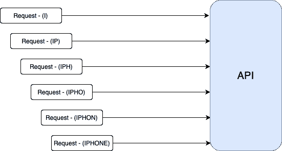
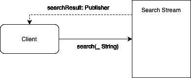
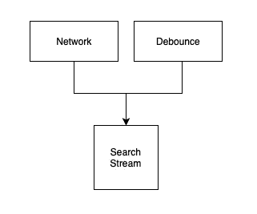
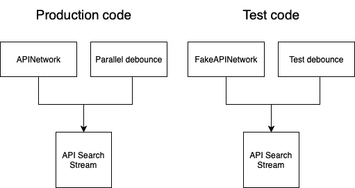

# 如何在 iOS 中为 Combine 的去抖方法编写单元测试

> 原文：<https://betterprogramming.pub/how-to-write-unit-tests-for-combines-debounce-method-in-ios-2257f1523002>

## 测试很容易。编写可测试的代码不是。

# 关于组合测试的几句话

编写可测试的代码可能很难。编写需要异步工作的可测试代码更加困难。

大部分实现 combine 的应用程序主要使用它来支持并发代码，而不是同步代码。显然，采用合并操作来支持异步和同步操作是可能的，但是在我看来，使用合并来执行与以下任何一项都不相关的工作:

*   执行后台工作
*   组合多个来源
*   异步初始化

这是对可读性的浪费。

在这篇文章中，我想告诉你如何正确地测试`debounce`方法，以避免长时间的代码执行和不稳定的测试。

# 去抖

先从`debounce`开始，我简单提醒一下这个方法是什么，定义是什么:

根据 Apple 文档:

> 仅在事件之间经过指定的时间间隔后发布元素。

基本上，`debounce`会在收到每个值后暂停一段时间，然后在暂停结束时发送最后一个值。

什么时候可以用？基本上，每当您试图限制发送事件的数量时，并不是每个事件都是重要的，相反，知道特定事件序列的最后结果是至关重要的。最常见的情况是在用户输入查询时限制对 API 的请求数量。

在一个假设的情况下，假设一个用户正在寻找一个特定的产品(iPhone ),并且在每次击键之后请求被发送到一个 API。下图显示了每个请求是如何发送到服务器的。如您所见，在简单的实现中，每个字母都会触发一个新的 API 请求。

发送一个无关紧要的请求是低效的，还会导致不一致。例如，在前面的一个请求在最后一个请求之前执行的情况下。显然，您可以在执行下一个请求之前取消每个请求。但是它给代码库带来了一部分新的代码，必须对其进行测试和维护。这就是`debounce`帮助我们的地方。

通过提供有效的参数，您可以确保创建新的请求会延迟到预定的时间过去之后。在上面的例子中，大约 0.5 秒的延迟时间足够大多数用户输入下一个字符，只创建一个请求:`Request — (IPHONE)`。显然，如果用户打字速度很慢，请求将被多次创建，在运行下一个之前取消它是开发人员的责任。

现在让我们把它做好，确保可测试性和良好的抽象水平，使代码可测试、可读和可维护。

# 现实生活中的例子

从一个图表开始，它描述了我想要创建的东西:

每个访问 SearchStream 的客户端都能够`subscribe`搜索结果并从中接收最新数据。用户还可以使用`search`方法搜索特定的查询。每当客户机(用户)运行一个搜索函数时，搜索到的字符串被传递给`SearchStream`，后者产生一个发布者，将搜索到的值传递回客户机。

让我们做两个对编写本模块至关重要的假设:

1.  `SearchStream`必须在同步测试中可测试，不需要使用`XCTest.waitForExpectations`。
2.  客户端能够忽略去抖方法，并期望立即得到结果。

首先让我们从协议开始，它描述了一个`SearchStream`:

*   `associatedtype ResponseType` —返回的类型
*   `var searchResult: AnyPublisher<ResponseType, Never>` —发布下一个搜索结果的流
*   `func search(_ query: String)` —每次文本更改后运行的方法

使 SearchStream 协议不是一个类会导致代码有另一个抽象层，并且可以适应不同的需求。例如，一个流可以从后端返回值，第二个流可以在数据库中搜索以前保存的结果。

同样，让我们来看看去抖方法的定义:

测试期间有两件重要的事情:

`scheduler` : 这是一个定义何时以及如何执行闭包的协议。我们需要其中的两个:

*   `RunLoop.main` —这是主线程上的运行循环，它将用于生产代码以接收主线程上的值。
*   `ImmediateScheduler` —特殊调度程序，执行同步动作。

正确设置调度程序可以满足第一个假设:

> SearchStream 在同步测试中必须是可测试的，不需要使用`XCTest.waitForExpectations`。

`dueTime` : 指定发布元素前等待多长时间。

将该值设置为 0.0 以满足第二个假设:

> 客户端能够忽略去抖方法，并期望立即得到结果

为了处理这些参数，让我们把它包装成一个方便的结构:

添加一个扩展是一个好主意，它支持对上述每个调度程序的访问。

这是一个关于样品`SearchStream`外观的示例。我想让你注意构造函数是如何设计的，以及测试它有多容易。

# 怎么考？

最容易测试的类是没有外部依赖的类。很少，大多数类支持基本的逻辑操作，如字符串修改、数学方程、数据转换或类似的操作。

事实上，大多数类都有外部依赖性，比如网络、文件系统或其他内部逻辑。这也适用于`SearchStream`类。

搜索流依赖关系图

这是生产和测试目标的实现情况。

虽然`SearchStream`是同一个类，但是依赖关系是不同的，这允许您控制`SearchStream`应该如何表现并设置预期的结果。

测试代码可能如下所示:

*   由于`ImmediateScheduler`每个测试用例都是独立的，所以没有期望或`waitForExpectations`代码，它们经常被添加来支持并发性。
*   因为`APISearchStream`已经注入了依赖关系，测试用例也能够验证搜索流是否执行了注入代码中的方法。

# 结论

让我们从这篇文章中总结出最重要的内容:

*   尽量避免使用`waitForExpectations`方法，它会减慢你的测试速度。测试代码中等待的时间越长，等待所有测试用例的时间就越长，并且会给 CI 带来不必要的压力。
*   总是试图将你的代码分割成独立的、弱依赖的部分，这使得你的代码更小、更简单、更易测试。