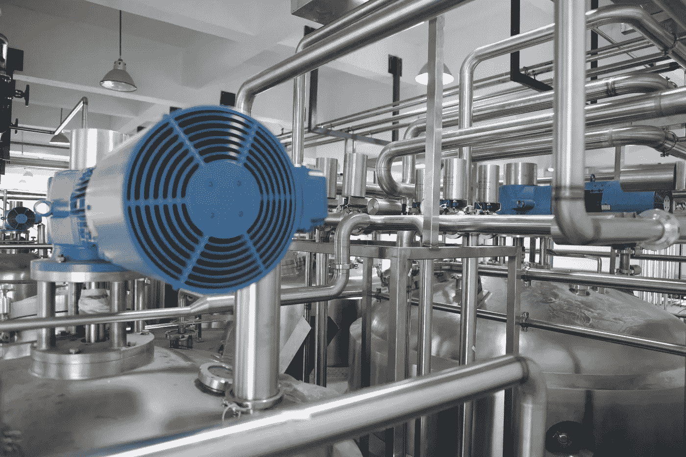
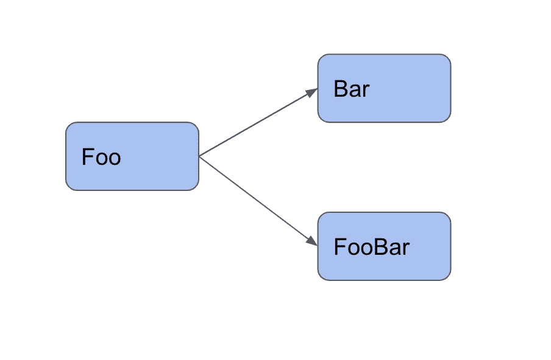
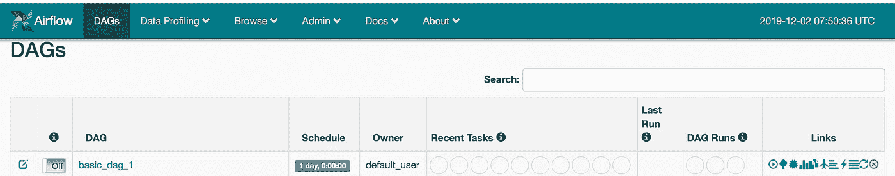

# 如何在气流中写出你的第一条管道

> 原文：<https://betterprogramming.pub/how-to-write-your-first-pipeline-in-airflow-a51141c3f4dd>

## 使用 Python 自动化您的第一个工作流



照片由[郭锦恩](https://unsplash.com/@spacexuan?utm_source=unsplash&utm_medium=referral&utm_content=creditCopyText)在 [Unsplash](https://unsplash.com/s/photos/pipes?utm_source=unsplash&utm_medium=referral&utm_content=creditCopyText) 上拍摄

本教程讨论了使用 [Apache Airflow](https://airflow.apache.org/) 创建第一个工作流的基本步骤。

在开始之前，您需要设置一个气流环境，以便能够遵循本文中讨论的每个步骤。如果你还没有这样做，我们发现这篇文章是我们个人最喜欢的文章之一。

# 为什么是气流？

你可能会问为什么要使用气流？Airflow 通过自动化工作流和管理枯燥和冗余的手动任务来帮助解决许多问题。

根据定义，Apache Airflow 是一个以编程方式创作、调度和监控工作流的平台，也称为 Dag(参见 [Github](https://github.com/apache/airflow) )。

您可以使用 Airflow 来编写 ETL、机器学习管道和通用作业调度(例如 Cron)，包括数据库备份和代码/配置部署的调度。

我们在气流和 Luigi 的比较中讨论了使用[气流的一些好处。](https://medium.com/better-programming/airbnbs-airflow-versus-spotify-s-luigi-bd4c7c2c0791)

# **了解气流管道**

气流管道本质上是用 Python 编写的一组参数，定义了气流有向无环图(DAG)对象。工作流中的各种任务形成一个图，这个图是由*引导的*，因为任务是有序的。为了避免陷入无限循环，这个图没有任何循环，因此*是非循环的*。

例如，如果我们有三个名为`Foo`、`Bar`和`FooBar`的任务，可能会出现这样的情况:`Foo`先运行，`Bar`和`FooBar`依赖于`Foo`完成。

这将创建一个如下图所示的基本图形。如你所见，有一条清晰的路径。现在想象一下，有成百上千的任务。对于这些任务如何运行以及顺序有一个清晰的结构是很重要的。



有了基本的解释，让我们创建你的第一个 DAG。

如果您按照上面的链接设置气流，那么您应该已经设置了一个目录，将`AIRFLOW_HOME`变量指向一个文件夹。默认情况下，这应该是一个名为 *airflow* 的文件夹。在那个文件夹中，你需要创建一个 DAGs 文件夹。您希望在 DAGs 文件夹中创建您的第一个 DAG，如下所示。

# **设置 default_args**

分解一下，我们需要建立一个 Python 字典，其中包含应用于工作流中所有任务的所有参数。如果您看一下下面的代码，会发现有一些基本的参数，包括`owner`(基本上只是 DAG 所有者的名字)，以及任务的`start_date`(确定第一个 DAG 任务瞬间的执行日期)

气流设计用于处理增量和历史运行。有时您只是不想安排工作流，而只是运行今天的任务。您可能还希望从过去的某一天(例如，一天前)开始运行任务，这就是下面第一个代码片段中设置的内容。

在这种情况下，`start_date`是一天前。您的第一个 DAG 将运行昨天的数据，然后是之后的任何一天。

以下是一些其他关键参数。

*   `end_date`中的代码将确定最后的执行日期。指定结束日期会限制气流超过该日期。如果你不输入这个结束日期，那么气流将永远保持运行。
*   `depends_on_past`是一个布尔值。如果将其设置为 true，当前运行的测试实例将依赖于前一个任务的状态。例如，假设您将此参数设置为 true，在这种情况下，为每日工作流。如果昨天的任务运行失败，则不会触发为期两天的任务，因为它取决于前一天的状态。
*   `email`是您接收电子邮件通知的地方。您可以在配置文件中设置您的私人电子邮件。
*   `email on failure`用于定义如果发生故障，您是否希望收到通知。
*   `email on retry`用于定义您是否希望在每次重试时收到电子邮件。
*   `retries`指示气流尝试重试失败任务的次数
*   `retry-delay`是连续重试之间的持续时间。

在示例中，气流将每五分钟重试一次。

一个高质量的工作流程应该能够提醒/报告失败，这也是我们在这一步要达到的目标之一。Airflow 是专门为简化这方面的编码而设计的。这就是电子邮件对失败有帮助的地方。

# **配置 DAG 计划**

这一步是实例化一个 DAG，方法是给它一个名称，并在这里将默认参数传递给 DAG:`default_args=default_args`。

然后设置计划间隔，以指定 DAG 的触发和执行频率。在这种情况下，它只是每天一次。

以下是设置 DAG 的一种方法。

如果您想每天运行您的计划，那么使用下面的代码参数:`schedule_interval=’@daily’`。或者你可以用 cron 代替，就像这样:`schedule_interval=’0 0 * * *’`。

# **布置所有任务**

在下面的例子中，我们有三个使用`PythonOperator`、`DummyOperator`和`BashOperator`的任务。

这些任务都非常简单。您会注意到，每一个都有不同的功能，需要不同的参数。

`DummyOperator`只是一个空白操作符，您可以使用它来创建一个步骤，除了表示管道已经完成之外，它实际上不做任何事情。

`PythonOperator`允许你调用一个 Python 函数，甚至给它传递参数。

`BashOperator`允许您调用 bash 命令。

下面我们将只写任务。直到你把所有的部分加在一起，它才会起作用。

使用这些基本任务，您现在可以开始定义依赖项，即任务应该执行的顺序。

# **定义依赖关系**

有两种方法来定义任务之间的依赖关系。

第一种方式是使用`set_downstream`和`set_upstream`。在这种情况下，您可以使用`set_upstream`使`python_task`依赖于 BASH 任务，或者对下游版本做同样的事情。

使用这个基本设置，如果 BASH 任务成功，那么 Python 任务将运行。类似地，`dummy_task`依赖于 BASH 任务的完成。

定义依赖关系的第二种方法是使用位移运算符。对于那些不熟悉位移运算符的人来说，它看起来像>>或<

例如，如果您想引用依赖于 BASH 任务的 Python 任务，您可以将其写成`bashtask >> python_task`。

现在，如果你有几个任务依赖于一个呢？

然后你可以把它们列成一个列表。在这种情况下，Python 任务和`dummy_task` 都依赖于 BASH 任务，并在 BASH 任务完成后并行执行。您可以使用`set_downstream`方法或位移运算符。

`bashtask.set_downstream([python_task, dummy_task])`

# 你的第一条气流管道

既然我们已经检查了每一个不同的部分，我们可以把它们放在一起。下面是你的第一个基本气流管道。

# 添加 DAG 气流计划程序

假设您已经初始化了气流数据库，那么您可以使用 web 服务器添加新的 DAG。使用以下命令，您可以在管道中添加。

```
> airflow webserver
> airflow scheduler
```

最终结果将显示在您的气流仪表板上，如下所示。



感谢您的阅读，并祝您好运创造您未来的管道！