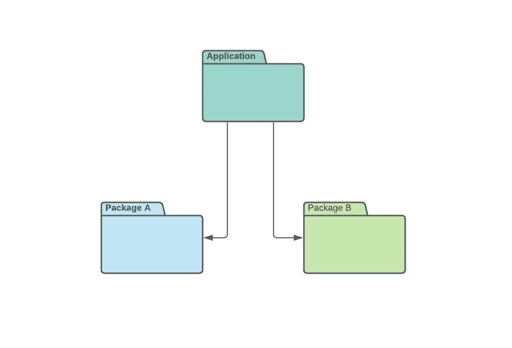
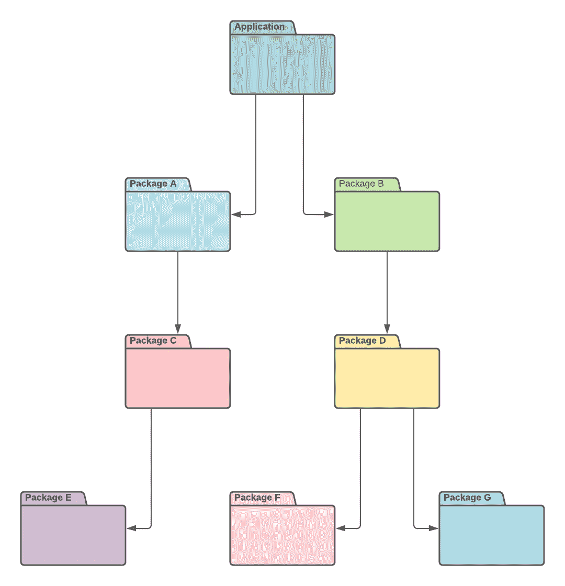

# 如何编写自己的 Go 模块代理

> 原文：<https://betterprogramming.pub/how-to-write-your-own-go-module-proxy-ed2d861c577a>

## 为您的私有存储库去掉所有烦人的“替换”指令


[布鲁诺·纳西门托](https://unsplash.com/@bruno_nascimento?utm_source=medium&utm_medium=referral)在 [Unsplash](https://unsplash.com?utm_source=medium&utm_medium=referral) 上拍照

管理项目中的依赖关系总是一枚双面硬币。我们使用的编程语言和工具无关紧要。使用这些工具总是[流血](https://www.npmjs.com/package/npm)、[流汗](https://yarnpkg.com/)和[流泪](https://getcomposer.org/)。

我有点害怕围棋的可能解法。几年前，我们用 [Dep](https://github.com/golang/dep) 。它友好且易于使用，有许多可能性来精确定义依赖关系。

Go 社区还不是很大，所以不太可能出现依赖性。这可能是我的机器没有像几年前运行时那样爆炸的主要原因。

过了一段时间，[围棋模块](https://go.dev/blog/using-go-modules)来到了晚会现场。这是一个超级酷的、合乎逻辑的解决方案，正是我期望从谷歌得到的(抱歉，但我永远不会忘记我的初恋，谷歌是我的初恋)。

*然后，我开始用私人包。*

# “替换”指令的激增

让我们假设我们在私有的、自我管理的 [Gitlab](https://about.gitlab.com/install/) 上有多个 git 存储库，充满了不同的 Go 模块。这可能不是一个可以想象的复杂场景，因为它是当今许多 It 公司的设置。

*注:本文发布时，* [*Gitlab Go 代理*](https://docs.gitlab.com/ee/user/packages/go_proxy/) *仍然默认未启用，性能可疑，每个包都有一个特定的代理 URL。*

此外，让我们假设我们的项目共享相同的代码，不仅来自公共包，还来自我们的代码库。开发团队希望交换他们的解决方案，而不用每天重新发明热水。



简单依赖图

在某种程度上，我们的应用程序的依赖图可能看起来像上面的图表。除了只依赖公共包之外，我们的应用程序还可以依赖私有 git 存储库中的包 A 和包 B。

由于我们的包可能在嵌套的子组中，实际的 git 存储库将有一个类似于`[https://gitlab.company.com/group/sub-group/package-a](https://gitlab.company.com/group/sub-group/package-a.)` [的 URL。](https://gitlab.company.com/group/sub-group/package-a.)所以，不可避免的是在我们的`go.mod`文件中使用`replace`指令。

在这种情况下，我使用模块名`company.com/package-a`，因为无论如何，我需要有`replace`指令——所以，我们的包最好使用更短的。

如果我使用`[gitlab.company.com/group/sub-group/package-a](https://gitlab.company.com/group/sub-group/package-a.)`作为包名，唯一的区别就是少了一个。git "后缀在`replace`指令的末尾。

应用程序的`go.mod`文件示例

在这里，我们可以接受自己的选择，因为我们的应用程序只依赖于解决我们问题的那两个包，所以不时更新依赖关系是我们愿意做的权衡。

毕竟，更新几个依赖项并不是什么大不了的事情，尤其是如果我们已经存储了一些命令来完成这项工作，比如在 Makefile 中。

用于更新相关性的命令

到目前为止，一切顺利。我们仍然能够轻松地更新我们的依赖关系。但是，当我们的依赖项开始从我们的私有 git 库获取依赖项时，问题就开始出现了。

让我们假设我们有和下图一样的包结构。我们的应用程序只直接依赖于包 A 和包 B，但间接依赖于许多其他私有包。



复杂依赖图

在所有包都是公共的典型情况下，这不是问题。但是现在，当所有这些包都是私有的时，我们需要在应用程序的`go.mod`文件中添加一个`replace`指令，即使你没有直接使用这些包中的任何代码。

“替换”指令的激增

现在，这开始令人讨厌了。我们现在需要更新所有的间接依赖关系，而不是更新我们的主要依赖关系，让 Go 模块依赖关系算法来解决剩下的问题。

即使使用 Makefile，这也不会很愉快，在此期间，您将开始质疑您的依赖策略。

*做依赖关系的工作不能这么蠢。*

# Go 模块代理

Go 模块代理是一个包含 Go 模块实际来源数据库的服务。在大多数情况下，源名称是公共 git 存储库的 URL，因此 Go 模块代理执行简单的请求转发。

但是，在某些情况下，模块的名称可以不同于 git URL，这是 Go 模块代理的主要目的。在这里，代理找到模块的实际源，并将请求转发到那里。

您可以通过从控制台设置环境变量`GOPROXY`来指定 Go 模块代理的用法。如果`GOPROXY`变量为空或者等于`direct`，你将不会使用代理，而是直接从它们的源下载包。

```
$ go env | grep GOPROXY
GOPROXY="[https://proxy.golang.org,direct](https://proxy.golang.org,direct)"
```

从 [Go 版本 1.13](https://golang.org/doc/go1.13#modules) 开始，环境变量 GOPROXY 默认为`[https://proxy.golang.org,direct](https://proxy.golang.org,direct)`。这意味着，当你需要某个库时，算法会首先联系来自谷歌的公共[代理](https://proxy.golang.org/)。

如果它不能从代理中找到一个源，下一次尝试将是直接的，发送一个请求到等于包名的 URL。GOPROXY 值中单词`direct`后面的一切都是不相关的，算法不会搜索源。

Go 模块代理有一个简单的 HTTP 接口，要检查它提供哪种类型的 URL，可以在控制台中运行以下命令:

```
$ go help goproxy....GET $GOPROXY/<module>/@v/list returns a list of known versions of the given module, one per line.GET $GOPROXY/<module>/@v/<version>.info returns JSON-formatted metadata about that version of the given module.GET $GOPROXY/<module>/@v/<version>.mod returns the go.mod file for that version of the given module.GET $GOPROXY/<module>/@v/<version>.zip returns the zip archive for that version of the given module.GET $GOPROXY/<module>/@latest returns JSON-formatted metadata about the latest known version of the given module in the same format as <module>/@v/<version>.info. The latest version should be the version of the module the go command may use if <module>/@v/list is empty or no listed version is suitable. <module>/@latest is optional and may not be implemented by a module proxy.
....
```

因此，理论上，如果你能够在你的公司内部提供一个内部服务，支持来自上面的 URL，你就能够为你的私人项目摆脱所有的`replace`指令。

好的，可能有解决办法。

# Go 模块代理的简单实现

对于本文，我在这个 [Github Gist](https://gist.github.com/Ompluscator/9bd4b552b0bd900ddf3f24c011fd244f) 中编写了超小型 Go 模块代理。也可以使用雅典[软件包中的 SDK 来创建您的存储。](https://github.com/gomods/athens)

简单服务器

在上面的代码片段中，一个 kickstarted 应用程序提供了一个带有三个端点的简单 HTTP 服务器。为了让这段代码更加简单，我使用了来自 [Gorilla](https://github.com/gorilla) 的 [Mux](https://github.com/gorilla/mux) 包。

为了展示一些具体的用例，我通过使用来自 [Xanzy](https://github.com/xanzy) 的[包](https://github.com/xanzy/go-gitlab)添加了与 Gitlab API 的集成。在 init 函数中，一个新的 Gitlab `client`被初始化，带有模块名和 Gitlab 项目 id 的映射。

Yaml 文件定义了项目 id 和模块名之间的联系

我们应该提供的第一个端点是`info`端点。这个端点为特定的标签提供包的版本信息或者提交散列。例如，Mux 包的输出如下所示:

```
[https://proxy.golang.org/github.com/gorilla/mux/@v/3cf0d013.info](https://proxy.golang.org/github.com/gorilla/mux/@v/3cf0d013.info)**{** "Version": "v1.8.1-0.20210914121219-3cf0d013e53d",
  "Time": "2021-09-14T12:12:19Z"
**}**
```

这里最简单的解决方案是假设我们将被要求提交版本，以便我们可以查询 Gitlab API 来检索关于所需提交的信息并呈现信息，如下面的代码片段所示:

覆盖“信息”端点的函数“版本”

`version`功能覆盖了`info`端点。它检索一个版本名，并从所需的项目 ID 中搜索该版本表示的提交散列。最后，它将响应呈现为 JSON，带有最终的版本名称和时间。

我们应该对`mod`端点使用类似的方法。这个端点返回给我们属于那个确切版本的`go.mod`文件的内容。

当请求这个端点时，Go 模块算法发送在`info`端点中提供的完整版本名。为此，函数`mod`稍微复杂一些。

覆盖“mod”端点的函数“mod”

最后，我们应该实现的最后一个端点是`zip`端点。此端点返回包的存档版本。但是，为了拥有有效的存档，我们的端点必须遵守一些规则。

```
Expected folder structure in ZIP archive by Go Module Algorithm:
**company.com
  |--project-a@v0.0.0-2021111111111-abcdef**Actual folder strcuter in ZIP archive provided by Gitlab:
**project-a-2021111111111-abcdef**
```

正如您在上面的例子中可能注意到的，Go 模块算法期望 ZIP 存档中有一个特定的文件夹结构。一个将分裂成文件夹和子文件夹的模块网址。

但是，在我们的例子中，Gitlab 返回一个具有不同文件夹结构的归档文件，因此为了支持这一需求，我们需要在内存中解压缩该归档文件，在新的归档文件中更改文件夹，并将其作为输出返回，如下面的代码片段所示:

涵盖“zip”端点的功能“归档”

仅此而已。我们需要做的最后一点是运行我们的 Go 代理，将其添加为环境变量，并获取我们的包:

```
$ go env -w GOPROXY='[http://localhost:8080,https://proxy.golang.org,direct'](http://localhost:8080,https://proxy.golang.org,direct')$ go get company.com/package-a@abcdef
...
$ go get company.com/package-b@abcdef
...
```

过了一段时间后，`go.mod`文件看起来好多了:

go.mod 文件的最终外观

这个例子只是许多可能性的开始。它给出了为我们的私有存储库添加代理的一般想法，但是我们可以为更复杂的需求添加许多其他特性。

例如，可以在不使用任何地图的情况下自动抓取 Gitlab。或者 Gitlab 管道的钩子来刷新我们的映射。我们也可以为 [Bitbucket](https://pkg.go.dev/github.com/ktrysmt/go-bitbucket) 做集成。诸如此类。

# 结论

Go Module Proxy 可以作为将私有存储库用作项目包的替代方案。它们提供了避免使用`replace`指令的可能性。

特别是当自我管理的 git 服务器越来越流行时，拥有一些可以使我们的依赖性更干净的解决方案是非常有价值的。

您对`replace`指令有什么体验？如何管理私有存储库中的依赖关系？