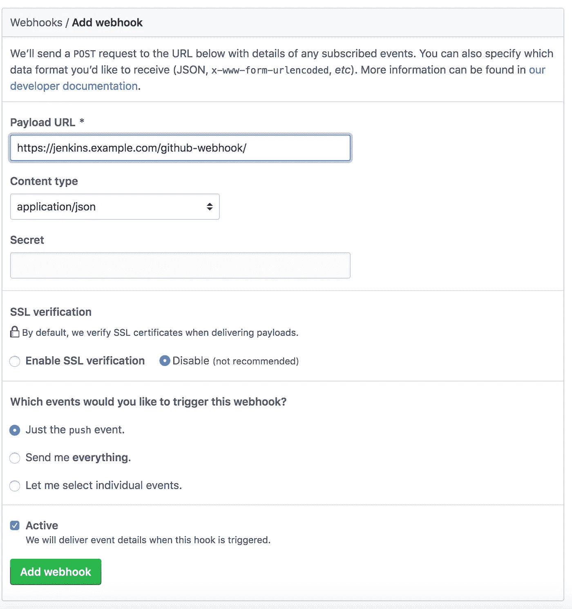
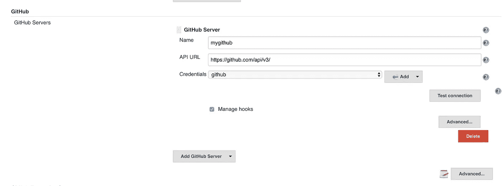

# 如何将 Github Webhooks 添加到 Jenkins 管道中

> 原文：<https://betterprogramming.pub/how-too-add-github-webhook-to-a-jenkins-pipeline-62b0be84e006>

## 基于 GitHub 事件触发 Jenkins 作业的执行


照片由在 [Unsplash](https://unsplash.com?utm_source=medium&utm_medium=referral) 上拍摄

当某些事件被触发时，Github 提供了一种调用 webhooks 的 URL 的简便方法。这些事件的列表很长，包括:推送到存储库时，打开、关闭和重新打开拉请求时，创建发布时，等等。你可以在这里 *查看完整列表 [*。*](https://developer.github.com/webhooks/#events)*

简单来说，一旦事件被触发，Github 将使用包含有关被触发事件的数据的有效负载对象向您定义的 webhook URL 执行 POST 请求。这将允许我们基于 Github 事件自动执行一些动作。例如，如果在每次推送至主分支后，我们想要打包或部署我们的软件，我们可以简单地向负责打包或部署服务的 Jenkins 任务添加一个 webhook。

在这篇文章中，我将展示如何定义一个 Jenkins webhook，以及如何定义与 Github webhook 相关的 Jenkins 任务。

# **在 Github 中添加 Jenkins web hook**

1.  打开 Github 存储库。
2.  进入“设置”,然后进入“挂钩”。
3.  点击“添加网页挂钩”按钮。
4.  如下图所示，填写表单。对于有效负载 URL，请在 URL 末尾提供您的 Jenkins URL 和 GitHub webhook 路径— `[https://${jenkins_url}/github-webhook/](https://${jenkins_url}/github-webhook/.)` [。](https://${jenkins_url}/github-webhook/.)如果您的 Jenkins 服务器没有有效的 SSL 证书，您可以禁用 SSL 验证。最后，选择“只为推送事件调用 webhook”选项(这个其实要看你在努力做什么。您可以通过选择其他选项来进行更改)。



5.最后，当所有的更改完成后，点击“添加 webhook”

# **构建一个 Jenkins 管道来处理 Webhook 调用**

1.  确保你已经安装了 Github 插件[并在 Jenkins 上配置了它。要配置插件你需要进入 Jenkins `Configure system`页面，向下滚动到 GitHub 部分添加一个新的 GitHub 实例，如图所示:](https://plugins.jenkins.io/github)



2.下一步是开始编写管道。第一行将其配置为每当 Jenkins 收到来自 GitHub 的推送通知时运行:

```
properties([pipelineTriggers([githubPush()])])
```

3.下一步是为 Github 存储库配置要执行的管道。这可以通过在管道的开头添加一个检验阶段来实现。需要注意的一点是，`url`和`branches`属性必须是静态值，不能包含任何类型的变量。

3.最后一步是将 Jenkins 管道添加到 Jenkins 服务器，并执行它来加载配置。每次我们向主分支提交新的提交时，都会执行 Jenkins 任务。

最后，这里是詹金斯管道的完整示例: