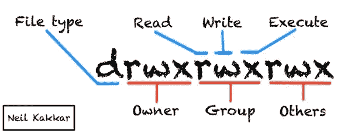
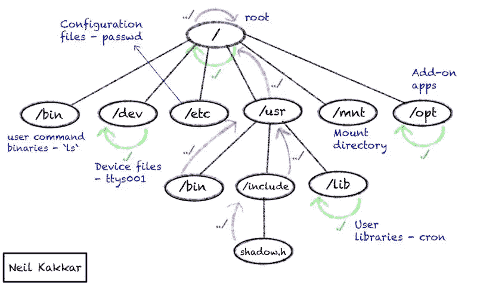
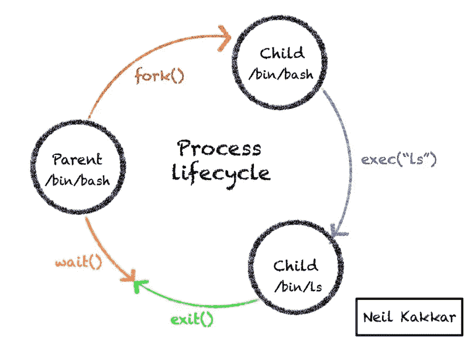
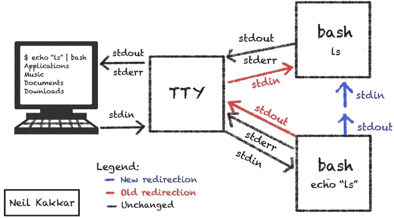
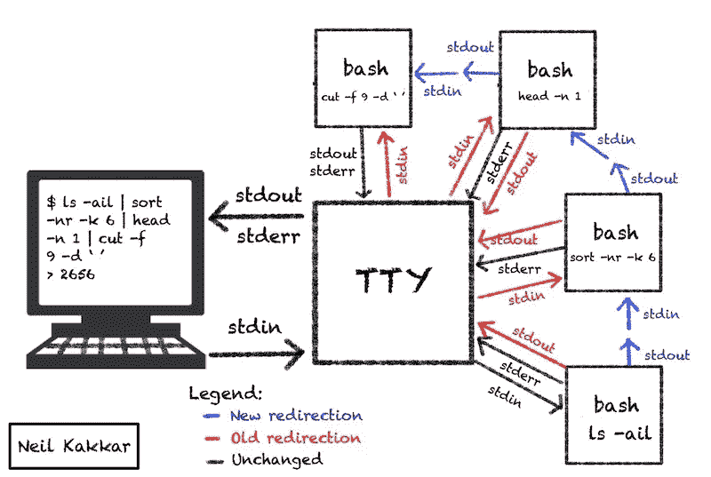

# Unix 如何工作:你不敢问的一切

> 原文：<https://betterprogramming.pub/how-unix-works-everything-you-were-too-afraid-to-ask-f8396aeb2763>

## 文件和进程的故事。成为更好的软件工程师


Unix 很美。请允许我为你在[画一些快乐的小树](https://youtu.be/0n4f-VDjOBE?t=39)。我不打算解释一大堆命令——那很无聊，网上已经有一百万个这样的教程了。

我将留给你思考这个系统的能力。

你想做的每一件新奇的事情只需一次谷歌搜索。但是，理解为什么解决方案能达到您的目的是不一样的。
这就是给你真正力量的东西，不害怕的力量。[1]

而且，既然押韵，那肯定是真的。

假设您是从零开始，我将放入足够的命令让我们一起玩。我们将探索概念，在`shell`中看到它们的实践，然后大喊:“我明白了！”。

在这个过程中，我们还将弄清楚`shell`到底是什么。

但是我们不能不进入创造者的头脑:探索 Unix 的哲学。

现在，我们可以假设 Linux 是 Unix。如果你想知道为什么事实并非如此，你可以跳到底部再回来。我们将一劳永逸地结束 Unix 与 Linux 的混淆。

# 哲学

让我们从核心开始 Unix 背后的哲学。

*   写程序做一件事，并把它做好。
*   写程序一起工作。(没有额外输出，不坚持交互输入。)
*   编写处理文本流的程序，因为那是一个通用接口。

Unix 也信奉 [*越差越好*](https://blog.codinghorror.com/worse-is-better/) 的哲学。

这种思维是强大的。在更高的层面上，我们在函数式编程中看到很多:构建专注于一件事的原子函数，没有额外的输出，然后将它们组合在一起做复杂的事情。

组合中的所有函数都是纯函数。没有要跟踪的全局变量。

也许直接的结果是，Unix 的设计集中在两个主要组件上:进程和文件。Unix 中的一切不是进程就是文件。没别的了。

进程和文件之间存在循环依赖关系，如果我们开始深入解释其中任何一个，我们将需要另一个来支持它。为了打破这种循环，我们将从简单概述每一个开始，然后深入研究。我们将重复几次，以弄清真相。

## 处理

你运行的浏览器是一个进程。终端也是，如果你开着的话。[2]如果没有，现在是打开它的好时机。如果你用的是 Windows 系统，Docker 也很好用。如果你在 Mac 上，使用终端——这是一个 Unix 环境。

更抽象地说，进程是代码的运行实例。操作系统给进程提供资源(比如内存)，然后附加一些元数据(比如谁是所有者)，然后运行代码。

操作系统作为资源的一部分，也为每个进程提供了三个打开的文件:`stdin`、`stdout`和`stderr`。

## 文件

所有不是进程的东西都是文件。

是的，这意味着你的打印机，扫描仪，终端屏幕，任何进程的代码！它们都是文件。如果这听起来令人困惑，请继续阅读。我们会澄清的。

文件系统中的文件就是文件——一串字节串在一起产生有意义的东西。你的照片是文件。你的目录也是文件！它们只包含当前目录中的文件/目录列表，就像一棵树一样。

它的美妙之处在于，我可以“打开”一个目录文件来查看内容！

例如:

```
$ vim .
" ====================================================================
 " Netrw Directory Listing                                 **(**netrw v162**)**
 "   /Users/Neil/examples
 "   Sorted by size
 "   Quick Help: <F1>:help  -:go up dir  D:delete  R:rename  s:sort-by x:special
 " ===================================================================
 ../
 ./                                                                                                
 git-example/
 unix-git/
 unix-file-system-example/
```

我用`Vim`打开了一个名为`.`的文件。这听起来熟悉吗？这就是 Unix 存储当前目录的方式。如您所见，它包含当前目录中的文件/目录列表。

文件只是一个数据流。

# 文件和文件系统

有了 [*的想法，一切都是一个文件*](https://en.wikipedia.org/wiki/Everything_is_a_file) 和*一个文件是一个数据流*就位后，我们可以进一步探索事情是如何运作的。

在 Unix 系统上，获取输入和写入输出的流是预定义的。这正是标准输入`stdin`、标准输出`stdout`和标准误差`stderr`的用途。

*   `stdin`是输入数据源。
*   `stdout`是输出数据源。
*   `stderr`是标准误差输出源。

在`shell`【3】中，`stdin`是从键盘输入数据，`stdout`和`stderr`都是屏幕。[4]

现在，我们可以将这些流重定向到其他地方，我们的程序不需要知道！不管输入来自哪里(键盘或文本文件)，对于任何正在运行的进程，它都来自`stdin`。

同样，对于`stdout`和`stderr`。当我们谈到处理这些流的过程时，我们将对此进行更多的讨论。

## 信息节点

为了有一个合适的文件系统，您需要一个管理文件系统的结构。不仅仅要处理文件中的数据，还要处理关于数据本身的信息，称为元数据。这包括数据存储在哪里，谁拥有它，以及谁可以看到它。

这就是*inode*的含义——文件元数据的数据结构。每个文件都有一个唯一的索引节点号。这将成为文件存在时的唯一标识符。

```
$ ls -li
total 0
2015005 drwxr-xr-x   6 neil  X  192 23 Oct 07:36 git-example
2514988 drwxr-xr-x   4 neil  X  128  9 Oct 11:37 unix-git/
2020303 drwxr-xr-x   4 neil  X  128 23 Sep 11:46 unix-file-system-example/
```

看到第一栏的数字了吗？这些是索引节点！[5]

一个 inode 存储所有元数据。`stat`对于查看这些元数据也很有用。

```
$ stat -LF .
drwxrwxrwx 7 A B 224 Oct 28 07:15:48 2018 ./
```

`A`和`B`是用户名和组名。Unix 是一个多用户系统。Unix 就是这样做的——用户和组是文件的属性。

用户属性设置为 X 的文件意味着 X 拥有该文件。对于 Unix 来说，这就是用户的全部。

`224`是文件大小，或者文件中的字节数。

`Oct 28 07:15:48 2018`是最后修改的日期。[6]

我从哪里得到这些信息的？`man ls`。

现在是我漏掉的有趣的数字和字符:`drwxrwxrwx`和`7`。

## 文件权限

每个文件都有与之关联的权限。

还记得与文件关联的用户和组吗？每个文件存储谁拥有该文件以及该文件属于哪个组。同样，每个用户也有一个用户名和组。



来到`-rwxrwxrwx`字符串:这是所有者、组和其他人的权限。

*   `r`是为了读书。
*   `w`是为了写作。
*   `x`用于执行。对于目录，这意味着可搜索。

您只需要三位来表示每个用户、组和其他人的权限。

您会注意到该字符串有 10 个字符。第一个是特殊的条目类型字符，用于区分目录、符号链接、字符流(stdin)和其他一些字符。`man ls`了解更多。

```
$ stat -LF
crw--w---- 1 neil tty 16,1 Dec 12 07:45:00 2019 **(**stdin**)**
```

如果你想改变权限呢？说，我不希望任何人搜我的个人文件夹(咳咳)。

Unix 的创造者考虑到了这一点。有一个叫做`chmod`的实用程序，可以修改文件的权限。在后端，您现在知道了`chmod`正在与文件的 inode 交互。

因为我们需要三位来表示每个权限，所以我们可以将它转换成一个整数，并将其传递给`chmod`。

例如:`chmod 721 .`将意味着`rwx-w---x`，这意味着所有者的所有权限，对组的写权限，对其他人的执行权限。

我更喜欢冗长的形式:

```
$ chmod u+rwx . *# enable user for rwx*
$ chmod g+w .   *# enable group for w*
$ chmod o+x .   *# enable others for x*
```

你在做同样的事情。给每个人设置权限，`chmod a+x <file>`就简单多了！你也可以删除权限，使用`-`而不是`+`。

要限制对我个人文件夹的访问，我会做:`chmod og-x nothing-interesting-here/`。

您还可以限制自己的访问权限，删除自己的所有读、写和执行权限。如果文件元数据存储在文件本身中，您将不能再次更改权限(因为您不能写入该文件)。

这是 inodes 很酷的另一个原因:它们总是可以被文件所有者和 root 修改，因此您可以恢复您的权限。试着这样做。

## 文件链接

有没有想过为什么把一个千兆字节的文件从一个目录移动到另一个目录非常快，而复制同样的文件可能要花很长时间？你能猜到为什么吗？

这是因为当我们`mv`时，我们移动的是目录结构，而不是实际的文件数据。索引节点是对文件系统非常有用的抽象。

我们可以做其他种类的移动。我们可以将文件从一个地方链接到另一个地方，或者让两个文件名指向同一个文件。

指向同一个文件的两个文件名是*硬链接*。把它们想象成一个文件的别名。您已经看到了两个硬链接:`.`和`..`是指向系统中当前目录和父目录的硬链接。

从一个地方到另一个地方的链接是符号链接。符号链接是一个新文件，独立于原始文件，链接到原始文件。

当您想要修复需要在新环境中运行的脚本时，或者为了满足希望文件位于另一个位置的新程序的安装要求而制作文件的副本时，这些选项非常有用。

```
$ ls -li
total 0
25280489 -rw-r--r--  1 neil  X  0  8 Dec 08:48 a$ man ln *# to check syntax for hard links*$ ln a x *# create x as a hard link to a*$ ls -li
total 0
25280489 -rw-r--r--  2 neil  X  0  8 Dec 08:48 a
25280489 -rw-r--r--  2 neil  X  0  8 Dec 08:48 x*# Notice both files have the same inode number.*
*# Modifying x or a is the same thing - both files get modified together.*$ ln -s a y *# create symbolic link to a*$ ls -li
total 0
25280489 -rw-r--r--  2 neil  X  0  8 Dec 08:48 a
25280489 -rw-r--r--  2 neil  X  0  8 Dec 08:48 x
25280699 lrwxr-xr-x  1 neil  X  1  8 Dec 08:54 y -> a*# y is a symbolic link, a new small file - see size is 1\.* $ cat y *# shows that y (a) is empty*$ echo lsd **>>** y
$ cat y
lsd
$ cat a *# modifying y modifies a*
lsd
$ cat x *# a is x*
lsd
```

我已经在评论中解释了发生的事情。

现在，如果你删除`y`指向的文件`a`，会发生什么？

```
$ rm a$ cat y
cat: y: No such file or directory*# y becomes useless*$ ls -li
25280489 -rw-r--r--  1 neil  X  12  8 Dec 08:56 x
25280699 lrwxr-xr-x  1 neil  X   1  8 Dec 08:54 y -> a
```

这是一个悬空符号链接。没用的。

读写权限之后的数字，或者说从我们做`stat -LF .`开始的`7`是指向一个文件的硬链接的计数。

当我创建`x`的时候，这个数字上升到了 2。当我移除`a`时，数字又回到 1。

我们也可以确认`.`和`..`确实是硬链接。你能想到怎么做吗？

```
$ ls -ail
25280488 drwxr-xr-x   7 neil  X   224  9 Dec 20:19 .
 1289985 drwxr-xr-x+ 83 neil  X  2656 10 Dec 08:13 ..
25390377 drwxr-xr-x   5 neil  X   160  9 Dec 19:13 sample_dir$ cd sample_dir
$ ls -ail
25390377 drwxr-xr-x  5 neil  X  160  9 Dec 19:13 .
25280488 drwxr-xr-x  7 neil  X  224  9 Dec 20:19 ..
25390378 -rw-r--r--  1 neil  X    0  9 Dec 19:13 a
```

检查索引节点号。`sample_dir`中的`..`为 25280488，与父目录中的`.`相同。还有，父目录中的`sample_dir`是 25390377，和`sample_dir`里面的`.`一样。

## 文件结构

它帮助我把文件系统想象成一个树状数据结构(事实上，它就是这样)。每个节点(inode)都有一个指向其父节点、自身节点和所有子节点的指针。这就形成了目录结构。



根目录`/`的父级是什么？

你现在有足够的知识来回答这个问题。我做的第一件事是`vim /`看看`/`是否有父指针。确实如此。然后，我做了`ls -ail`来查看父节点的 inode。它指向`.`，也就是`/`。

总而言之，

*   文件系统是使用索引节点和目录文件构建的。
*   用户是文件和进程的属性。该信息存储在 inodes 中。
*   索引节点在文件系统中是唯一的。
*   可以将多个文件系统挂载并抽象到一个逻辑树中。

# 处理

首先，让我们把定义放在一边。需要记住流程的三个组成部分:

1.  程序文件:代码和数据。
2.  进程映像:存储堆栈、当前定义的变量、数据、地址空间、[和更多](http://www.tldp.org/LDP/LG/issue23/flower/psimage.html)。到了运行的时候，操作系统确切地知道如何使用这个映像重新创建进程。
3.  进程:内存中正在运行的程序。

当一个进程开始运行时，它从父进程继承用户 ID 和组 ID。此信息控制对流程的访问级别。

注意:访问控制对于一个安全的系统至关重要。这就是为什么在生产中运行裸露的 Docker 容器会成为一个问题的原因之一:它需要以 root 身份运行，这意味着可能会发生不好的事情。

我们可以使用`setuid`或`setgid`来使一个进程继承文件所有者权限。`setuid`允许进程继承相关文件的`userID`。

例如，要在 Linux 上更改密码(参见[这个链接](https://unix.stackexchange.com/questions/241927/why-mac-os-x-does-not-set-uid-bit-for-usr-bin-passwd)用于 Mac)，我们需要修改文件`/etc/passwd`。然而，在检查权限时，我们看到只有`root`有权写入该文件。[7]

```
$ ls -ail /etc/passwd
3541354 -rw-r--r-- 1 root root 681 Nov 28 08:47 /etc/passwd
```

因此，当我们调用`/usr/bin/passwd`，帮助修改密码的工具，它将继承我们的用户 ID，这将拒绝对`/etc/passwd`的访问。这就是`setuid`派上用场的地方——它允许我们将`usr/bin/passwd`作为`root`开始。

```
$ ls -al /usr/bin/passwd 
-rwsr-xr-x 1 root root 27936 Mar 22  2019 /usr/bin/passwd
```

执行权限中的`s`而不是`x`表明该进程将以 root 身份运行。

要设置和移除该位，我们可以再次使用`chmod`。

```
$ chmod u-s /usr/bin/passwd 
$ ls -al /usr/bin/passwd 
-rwxr-xr-x 1 root root 27936 Mar 22  2019 /usr/bin/passwd
```

我在 Docker 中这样做了，所以我真正的文件系统是安全的。

## 属性

就像文件系统中的所有文件都有一个惟一的索引节点一样，进程也有它们惟一的标识符，称为进程 id，或`pid`。

就像所有文件都有一个到其父目录的链接一样，每个进程都有一个到产生它的父进程的链接。

就像文件系统的根是如何存在的一样(`/`)，有一个特殊的根父进程叫做`init`。它通常有`pid` 1。

*不像*文件系统的根，它的父目录是它自己(`/`),`init`的`ppid`是 0，这通常意味着它没有父目录。`pid` 0 对应于内核调度程序，它不是一个用户进程。

## 生命周期

在 Unix 中，进程如何工作有一个共同的模式。

通过克隆现有的父进程创建一个新的子进程(`fork()`)。这个新的子进程调用(`exec()`)来用子进程想要运行的进程替换子进程中运行的父进程。



接下来，子进程调用`exit()`来终止自身。它只向外传递一个退出代码。`0`意味着成功，其他一切都是错误代码。

父进程需要调用`wait()`系统调用来访问这个退出代码。这种循环对每个产生的进程重复进行。

这里有一些事情可能会出错。

家长不叫`wait()`怎么办？这会导致一个僵尸进程，这是一种资源泄漏，因为在进程的退出代码被父进程使用之前，操作系统无法清理进程。

如果父进程先于子进程死亡怎么办？这导致了一个孤儿进程(我保证这不是我编的)。一个孤儿流程被`init`流程(特殊的根父流程)采用，然后`waits`在子流程上完成。

在计算机世界的自然秩序中，孩子先于父母死去。

父母如何从孩子那里获得更多信息？它不能通过退出代码，因为这是一个进程唯一可以返回给父进程的东西。

流程不像常规函数，在常规函数中，您可以将响应返回给调用函数。然而，[还有其他方法进行进程间通信](https://en.wikipedia.org/wiki/Inter-process_communication)

我们将通过一个例子来更详细地说明事情是如何工作的。在此之前，我们需要更多的信息。

## 文件重定向

还记得操作系统如何为每个正在运行的进程提供三个打开的文件吗？我们有能力把这些文件重定向到任何我们想要的地方。

`>`重定向`stdout`、`2>`重定向`stderr`、`<`重定向`stdin`。

例如，`./someBinary 2>&1`将`stderr`重定向到`stdout`。

0、1 和 2 分别是`stdin`、`stdout`和`stderr`文件的简写。

注意:`./someBinary 2>1`不会像你期望的那样工作，因为语法是`file-descriptor > file`。`2>1`表示`stderr`将被重定向到一个名为`1`的文件。`&`操作符给出文件的文件描述符。

文件重定向发生在命令运行之前。当操作系统打开新文件时(通过`>`，它会删除那些文件中已经存在的所有内容。

因此，`sort res.txt > res.txt`是行不通的。

```
$ cat res.txt *# check contents of res*
d
c
b
a$ sort res.txt *# sort res*
a
b
c
d$ sort res.txt **>** res.txt
$ cat res
*# empty*
```

提示:通过在 shell 中设置`noclobber`选项，您可以确保您的重定向不会破坏现有文件。

```
$ set -o noclobber
$ sort res.txt **>** res.txt
-bash: res.txt: cannot overwrite existing file
```

然而，它可以与`>>`一起工作，因为在这种情况下，您将追加到文件中。

```
$ sort res.txt **>>** res.txt
$ cat res.txt 
d
c
b
a
a
b
c
d
```

阅读更多关于重定向的信息。

# Unix 中的层

我们可以把 Unix 想象成洋葱。中心是硬件——主板、CPU 和许多我不太明白的晶体管。外面一层是内核。

## 内核

内核是负责与文件系统和设备交互的核心。它还处理进程调度、任务执行、内存管理和访问控制。

内核公开了 API 调用，供构建在其上的任何东西使用。最受欢迎的是`exec()`、`fork()`和`wait()`。

## Unix 实用程序

另一层是 Unix 实用程序。这些都是非常有用的过程，可以帮助我们与内核进行交互。它们通过内核提供的系统调用`exec()`和`fork()`来实现。

您可能已经听说过许多实用程序。你可能用过最著名的一个:`shell`。

其他还有:`python`、`gcc`、`vi`、`sh`、`ls`、`cp`、`mv`、`cat`、`awk`。

您可以从`shell`中调用它们中的大部分。`bash`、`zsh`、`ksh`只是一个`shell`的不同变体。他们做同样的事情。

另一个让人望而生畏的工具是文本编辑器 [Vim](https://www.vim.org/) 。Vim 应该有自己的帖子，[，这就是我在这里创建的](https://neilkakkar.com/How-not-to-be-afraid-of-Vim-anymore.html)

有趣的事实:一个`shell`被称为一个`shell`，因为它是内核之外最接近的层。它将内核包裹在一层保护性的……外壳中。

# 外壳如何工作

还记得 shell 是一个怎样的过程吗？这意味着当它启动时，操作系统提供了三个文件供它使用:`stdin`、`stdout`和`stderr`。

当从终端运行时，`stdin`连接到键盘输入。你写的东西被传入终端。这是通过一个叫做[远程打字机](https://en.wikipedia.org/wiki/Tty_(unix))或`tty`的文件实现的。

`stdout`和`stderr`也连接到`tty`，这就是为什么你运行的任何命令的输出和错误都会显示在终端上。


你打开的每个终端都会通过`tty`分配一个新文件，这样来自一个终端的命令就不会干扰另一个终端。您可以通过`tty`命令找到您的终端附加的文件。

```
$ tty
/dev/ttys001 *# on linux, this looks like: /dev/pts/0*
```

现在你可以做一些有趣的事情:因为`shell`从这个文件中读取数据，你可以让另一个 shell 也向这个文件中写入数据，或者将这些 shell 放在一起。让我们试试。(还记得如何从上面的过程部分重定向文件吗？)

打开第二个终端。键入:

```
$ echo "Echhi" **>** /dev/ttys001 *# replace /dev/ttys001 with your tty output*
```

注意第一个终端发生了什么。

这次尝试回显列出文件的命令`ls`。为什么第一个终端不运行该命令？

它不运行命令，因为写入终端的流是第二个终端的`stdout`，而不是第一个终端的`stdin`流。

记住，只有通过`stdin`进入的输入才作为输入传递给`shell`。其他的都只是显示在屏幕上。即使在这种情况下碰巧是同一个文件，它也与进程无关。

上述内容的自然延伸是，当您重定向`stdin`时，命令应该会运行。听起来很合理，我们试试吧。

**警告:**一种方法是`bash < /dev/ttys001` 。这并不太好，因为现在有两个进程期待来自这个文件的输入。

这是一个未定义的状态，但在我的 Mac 上，一个字符去了一个终端，另一个字符去了第二个，这样继续下去。这很有趣，因为要退出新的 shell，我必须键入`eexxiitt`。然后两个弹壳都丢了。

```
$ echo ls **>** ls.txt *# write "ls" to a file*
$ cat ls.txt *# check what's in file*
ls$ bash < ls.txt 
Applications
Music
Documents
Downloads
```

还有一种更好的方法，我们稍后会谈到。

这里发生了一些微妙的事情。这个新的`bash`进程(我们从一个现有的 bash 进程开始)是如何知道在哪里输出东西的呢？

我们从未指定输出流，只指定了输入流。这是因为进程从它们的父进程继承而来。

每次你在终端上写一个命令，`shell`就会创建一个重复的进程(通过`fork()`)。

从`man 2 fork`开始:

> 子进程拥有自己的父进程描述符副本。这些描述符引用相同的底层对象，例如，文件对象中的文件指针在子进程和父进程之间共享，因此子进程中描述符上的 lseek(2)可以影响父进程的后续读取或写入。
> 
> 这个描述符复制还被 shell 用来为新创建的进程建立标准的输入和输出，以及建立管道。

一旦分叉，这个新的子进程从父进程继承文件描述符，然后调用`exec` ( `execve()`)来执行命令。这将替换流程图像。

从`man 3 exec`开始:

> 本手册页中描述的功能是功能`execve` (2)的前端。

来自`man 2 execve`【8】:

> 在调用进程映像中打开的文件描述符在新的进程映像中保持打开，除了那些设置了 close-on-exec 标志的文件描述符

因此，我们的文件描述符与原始的 bash 进程相同，除非我们通过重定向来改变它们。

当这个子进程正在执行时，父进程`waits`为子进程完成。发生这种情况时，控制权会返回给父进程。

记住，子进程不是`bash`，而是取代`bash`的进程。使用`ls`，程序在将文件列表输出到`stdout`后立即返回。

注意:并不是 shell 上的所有命令都会产生`fork`和`exec`。不支持的命令称为内置命令。有些是出于需要而内置的；由于子进程不能将信息传递回父进程，所以其他进程可以使事情变得更快。

例如，设置环境变量在子 shell 中不起作用，它不能将值传递回父 shell。你可以在这里找到名单。

这是一个我喜欢的演示。

您有没有想过，当某个程序正在运行并向终端输出内容时，您可以编写下一个命令，并在现有进程完成时让它们工作，这有多奇怪？

```
$ sleep 10;
ls
cat b.txt
brrr
*# I stop typing here*
$ ls
b	c	y$ cat b.txt
defbjehb$ brrr
-bash: brrr: command not found
```

只是进程被阻塞了，输入流仍在接受数据。因为我们正在读/写的文件是相同的(`tty`)，我们看到我们键入的内容，当`sleep 10;`返回时，shell 为`ls`创建另一个进程，再次等待，然后为`cat b.txt`创建同样的进程，然后再次为`brrr`创建进程。

我使用`sleep 10;`来演示，因为其他命令发生得太快，在控制返回到父进程`bash`之前，我无法输入任何内容。

现在是尝试`exec`内置命令的好时机(它取代了当前进程，因此它将终止您的 shell 会话)。

```
exec echo Bye
```

`echo`也是内置命令。

如果你想自己用 C 实现 shell，[这里有一个我推荐的资源](https://www.usna.edu/Users/cs/aviv/classes/ic221/s16/lec/14/lec.html)。

# 管子

有了关于 shell 如何工作的知识，我们可以冒险进入管道的世界:`|`。

它将两个过程联系在一起，其工作方式很有趣。

还记得我们开始时的哲学吗？做一件事，并把它做好。既然我们所有的实用程序都运行良好，我们如何让它们一起工作呢？

这是管子，`|`，管子在哪里。它表示对`pipe()`的系统调用，它所做的只是为进程重定向`stdin`和`stdout`。

既然东西设计得如此之好，这个原本复杂的功能就简化成了这个。无论何时你使用管道或者终端上的任何东西，只要想象一下输入和输出文件是如何设置的，你就永远不会有问题。[9]

让我们从一种更好的方式开始，将输入定向到 bash，而不是像前面那样使用临时文件(`ls.txt`)。

```
$ echo ls | bash
Applications
Music
Documents
Downloads
```



为了解释管道重定向，这个图像有点简化。你现在知道 shell 是如何工作的了，所以你知道顶部的`bash`分叉了另一个连接到`tty`的`bash`，产生了`ls`的输出。

您还知道顶层 bash 是从底层 bash 派生出来的，这就是为什么它继承了底层 bash 的文件描述符。您也知道较低的 bash 没有派生新的进程，因为`echo`是一个内置命令。

让我们用一个更复杂的例子来结束这一部分:

```
$ ls -ail | sort -nr -k 6 | head -n 1 | cut -f 9 -d ' '
2656
```

这个管道计算出当前目录中最大的文件，并输出其大小。

可能有一种更优雅的方式来做到这一点，那就是[只需一次谷歌搜索](https://superuser.com/questions/228853/how-to-find-the-largest-file-in-a-directory)，但这作为一个例子效果很好。谁知道这个已经内置在`ls`里了？



注意到`stderr`总是直接路由到`tty`吗？如果你想重定向`stderr`而不是`stdout`到管道呢？您可以在管道之前切换流。

```
$ error-prone-command 2>&1 **>**/dev/null
```

来源:[这个美女](https://stackoverflow.com/questions/2342826/how-to-pipe-stderr-and-not-stdout)。

# 关于路径的一切

局部变量是可以在 shell 中创建的变量。它们在贝壳上是本地的，因此不会传给孩子。(记住，每个非内置命令都在一个新的 shell 中，它没有这些局部变量。)

环境变量(`env` vars)类似于全局变量。它们会传给孩子。但是，对子进程中环境变量的更改不能传递给父进程。记住，除了退出代码，孩子和父母之间没有任何交流。

试试这个:从`bash`调用`bash`的`bash`。第一个`bash`等待第二个`bash`退出，第二个等待第三个。

当您调用`exec`时，退出自动发生。如果没有，您希望自己键入`exit`来将退出代码发送给父进程。退出两次，你又回到原点。

现在，思想实验:当你在 shell 中输入`ls`会发生什么？你知道发生的`fork()`、`exec()`和`wait()`循环，以及`tty`。

但是，即使在这种情况发生之前，`ls`只是另一个效用函数，对吗？这意味着在某个地方有一个程序文件，里面有做`fork()`和其他事情的 C 代码。

这个二进制文件不在你当前的目录中(你可以用`ls -a`来检查)。如果这些文件在我当前的目录中，我可以通过在 shell 中键入它们的名称来执行它们，这对我来说是有意义的。它们是可执行文件。

`ls`程序文件到底在哪里？

还记得文件系统树是如何分层的吗？疯狂是有秩序的。

所有基层目录都有特定的功能。例如，所有的 Unix 实用程序和一些额外的程序都进入`/bin`目录。Bin 代表二进制。如果你想了解更多，有上百万的教程。

这对我们来说是足够的知识。`ls`住在`/bin`。所以，你可以这样做:

```
$ /bin/ls
a  b  c
```

这与运行`ls`相同。

但是，shell 是如何知道在`bin`中寻找`ls`的呢？

这就是神奇的环境变量`PATH`的用武之地。我们先来看看。

```
$ echo $PATH
/usr/local/sbin:/usr/local/bin:/usr/sbin:/usr/bin:/sbin:/bin
```

为了查看所有环境变量，我们可以:

```
$ env
HOSTNAME**=**12345XXXX
TERM**=**xterm
TMPDIR**=**/tmp
PATH**=**/usr/local/sbin:/usr/local/bin:/usr/sbin:/usr/bin:/sbin:/bin
PWD**=**/test
LANG**=**en_US.UTF-8
SHLVL**=**1
HOME**=**/root
LANGUAGE**=**en_US:en
LESSOPEN**=||**/usr/bin/lesspipe.sh %s
container**=**oci
_**=**/bin/env
```

`PATH`是一个冒号分隔的目录列表。当 shell 看到一个没有绝对路径的命令时，它会在这个`$PATH`环境变量中查找，按顺序进入每个目录，并尝试在那里找到文件。它执行找到的第一个文件。

注意`/bin`在`PATH`中的位置，这就是为什么`ls`能够正常工作。

如果我移除`PATH`中的所有内容会发生什么？没有绝对路径，任何东西都不应该工作。

```
$ PATH**=**'' ls
-bash: ls: No such file or directory
```

以上语法仅用于为一个命令设置环境变量。旧的`PATH`值仍然存在于 shell 中。

```
$ echo $PATH
/usr/local/sbin:/usr/local/bin:/usr/sbin:/usr/bin:/sbin:/bin
```

注意:做`PATH='' echo $PATH`不会起作用，因为`echo`是一个内置的 shell。然而，如果您用`PATH=''`启动了一个新的 shell 进程，然后执行了`echo`，它将会工作。

`$ **(**PATH**=**''; echo $PATH**)**`

`()`是新 subshell 的语法。我知道，有很多信息我不会首先解释，但这都是语法层面的，只需要一次谷歌搜索。从好的方面来说，它确保了这篇博文不会变成一本书。

你听说过`./`是运行你创建的文件的方式吗？为什么不能像运行`bash`那样运行它们呢？现在你知道了。当您执行`./`时，这是您想要执行的文件的确切路径。`bash`有效，因为它在`PATH`上。

因此，如果当前目录总是在`PATH`上，那么您的脚本将按名称工作是有道理的。

让我们试试这个。

```
$ vim script.sh
*# echo "I can work from everywhere?"*
$ chmod a+x script.sh 
$ ls
script.sh$ script.sh
-bash: script.sh: command not found *# not on PATH*$ ./script.sh *# path to file is defined*
I can work from everywhere?
```

现在，让我们把它加到电流`PATH`上。然后运行刚`script.sh`。

```
$ PATH**=${**PATH**}**:. script.sh *# this appends . to PATH, only for this command*
I can work from everywhere?
$ export PATH**=${**PATH**}**:. *# this sets the PATH variable permanently to include .*$ script.sh *# calling script.sh without the ./*
I can work from everywhere?$ cd .. *# go one directory up*
$ script.sh *# this shows that PATH directories aren't searched recursively*
-bash: script.sh: command not found *# so script doesn't run anymore*
```

**警告:**在你的路径中包含当前目录是不好的做法。有几个问题。您永远无法确定任何命令的执行是否符合预期。

如果你有一个名为`ls`的二进制文件，它是你当前目录中的一个病毒(从互联网上下载的)，但你本打算做`/bin/ls`，那该怎么办？

[阅读更多](https://unix.stackexchange.com/questions/254711/history-of-unix-not-including-current-directory-in-path)

下次您看到“没有这样的文件或目录”错误时，当您知道该文件存在时(可能您刚刚安装了它)，您就知道问题出在哪里了。`PATH`被终结了！

它安装在不在您的`PATH`上的位置，所以您只能从您安装它的地方调用它。要解决这个问题，您现在知道可以将该目录添加到`PATH`，或者通过其绝对路径调用该文件。

有趣的事实:Python 在搜索导入时也有类似的结构，使用了`PYTHONPATH` env 变量。

# 编写 Shell 脚本

这篇文章已经变得比我预期的要长。此外，使用 shell 编程在网上有很多报道。但是为了完整起见，这里有一个[到手册](https://www.gnu.org/savannah-checkouts/gnu/bash/manual/bash.html#Compound-Commands)的链接，和一个[像样的教程](https://www.shellscript.sh/first.html)。

# 包管理器

假设你写了一个新工具。它在你的机器上运行得非常好，现在你想把它卖给其他用户。等等，我的意思是，本着开源的精神，你想让别人也能使用。

你也要让他们免于头痛。更好的是，您希望将东西安装在正确的位置:二进制文件放入`/usr/bin/`(它已经在`PATH`上了)，依赖项放在主二进制文件可以找到它的地方。

包管理器正好解决了这个问题。它们不会让您头疼，而是让事情正常运行。

据我所知，有三个主要的软件包管理器:`dpkg`、`rpm`和`homebrew`。它们每个都工作在不同的 Linux 发行版上(如果您不确定这意味着什么，这将在下一节中介绍)。

但是，[野生的有几百只](https://en.wikipedia.org/wiki/List_of_software_package_management_systems)，就像分布的数量一样。

`dpkg`是 [Debian](https://www.debian.org/) 包管理器，但是你可能听说过一个构建在它之上的非常有用的工具来管理包:`apt`。

每次你使用`apt install`来安装一个新的包，你都在利用这个包管理器的能力，它确保所有的东西都在它们需要的地方。

在开发方面，这意味着确保您正在创建的工具与包管理器兼容。下面举例说明如何在 [C](https://ubuntuforums.org/showthread.php?t=910717) 和 [Python](https://the-hitchhikers-guide-to-packaging.readthedocs.io/en/latest/quickstart.html) 中实现。

`rpm`是 [Red Hat](https://www.redhat.com/en) package manager，它也有一个构建在上面的有用工具:`yum`，它也处理依赖关系。

`[homebrew](https://brew.sh/)`是 macOS 上的包管理器，你每次使用它`brew install`的时候。

他们让生活变得简单。

它们非常方便，编程语言也有自己的包管理器！例如，`pip`是一个流行的 Python 工具安装程序。有 [Ruby](https://www.ruby-lang.org/en/) 的`bundler`，Swift/iOS 的`cocoa`，还有其他几个。

# Unix 简史

Unix 是第一个允许多个用户使用的操作系统，每个用户可以同时运行多个程序。

这可能听起来微不足道，因为几乎每个操作系统都有这种功能，但它刚出现时是革命性的。在大型主机上租赁时间的日子结束了。你可以让你的程序在后台运行，而其他人做他们的工作。

顾名思义，Unix 是一个多用户多任务操作系统。

这是专利，美国电话电报公司是唯一一家可以出售它的公司。(贝尔实验室在 20 世纪 70 年代开发的)。他们选择了许可模式，并很快推出了一个规范，叫做[单一 UNIX 规范](https://en.wikipedia.org/wiki/Single_UNIX_Specification)。

这是一组指导原则，遵循这些原则的任何系统都可以被认证为 Unix 系统。

大约在同一时间，一些人对 Unix 的专有性质感到不满，并提出了另一种称为 Linux 的开源操作系统内核。

受 Unix 哲学的启发，为了实现可移植性，这些系统遵循了 T2 的 POSIX 标准 T3，这是 Unix 的一个子集。因此，这些系统也被称为类 Unix 系统。[10]

这里的事情变得有点混乱。Linux 是基于 Linux 内核的一系列操作系统。没有一个单一的操作系统叫做 Linux。

我们有的是 Debian，Ubuntu，Fedora，CentOS，Red Hat，Gentoo 等等。这些是 Linux 内核的发行版(俗称*发行版*)。成熟的操作系统。

有什么区别？有些是为特定目的而构建的(例如:Kali Linux 自带安全测试工具)。

大多数在软件包管理、软件包更新频率和安全性方面有所不同。

如果你想了解更多，请访问 opensource.com。

有趣的事实:Mac OS X 是 Unix 认证的。

# 结论

我们已经谈了很多。让我们花一点时间来把它们放在一起。

Unix 是一个成熟的操作系统，而 Linux 是一个内核——操作系统的核心——受 Unix 的启发。他们专注于做一件事，并把它做好。

一切要么是一个过程，要么是一个文件。内核是核心，它公开系统调用，实用程序利用这些调用。进程使用文件作为输入和输出。我们可以控制这些文件，我们可以重定向它们，这不会对流程产生影响。

管道可以将一个进程的输出重定向到另一个进程的输入。来自 shell 的每个命令首先分叉，然后执行，并将退出代码返回给等待的父级。

还有很多。如果有可能进行无损压缩，我会在文章中进行。

所以，欢迎来到野外，你可以走了。

`exit`

感谢 Vatika Harlalka、 [Nishit Asnani](https://medium.com/@asnani04) 、 [Hemanth K. Veeranki](https://www.quora.com/profile/Hemanth-Kumar-Veeranki) 和 [Hung Hoang](https://twitter.com/ParityB1t) 阅读本文的草稿。

# 脚注

1.  这刚刚变成诗了吗？
2.  终端也有正在运行的子流程，比如`shell`。您可以通过`ps -ef`查看所有正在运行的进程。
3.  一个`shell`是你用来和操作系统交互的接口。它可以是命令行界面(CLI)和图形用户界面(GUI)。在这篇文章中，我们只关注 CLI。当你打开终端时，迎接你的默认程序是一个`shell`。[阅读更多](https://en.wikipedia.org/wiki/Shell_(computing))
4.  这不是 100%正确的，有一点更细微的差别，我们很快就会看到。
5.  我花了太多时间在 iPhones 和 iOS 上。是 inode，不是 iNode。
6.  还有，我开始写这个指南的时间。我差不多该完成它了。注意年份。
7.  这些信息我都是从`[man 5 passwd](http://man7.org/linux/man-pages/man5/passwd.5.html)`得到的。
8.  本手册有八个部分，每个部分都有特定的用途。[阅读更多。](http://man7.org/linux/man-pages/man7/man-pages.7.html)
9.  这是一个强有力的想法，因为 Unix 的设计是这样的:“一切都是一个文件”。
10.  有趣的事实——它们不能被称为 Unix，因为它们没有经过认证，Unix 是一个商标。