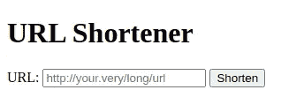
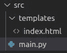
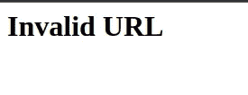
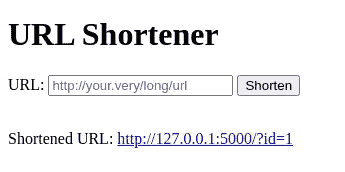

# 网址缩写如何工作以及如何建立一个

> 原文：<https://betterprogramming.pub/how-url-shorteners-work-and-how-to-build-one-77352e12be95>

## 探索为了便于分享，隐藏恶意链接和更好的外观，URL 被缩短了多长


帕特丽夏·塞尔纳在 [Unsplash](https://unsplash.com?utm_source=medium&utm_medium=referral) 上的照片

网址无处不在。你送他们；你接受它们；您可以在网络浏览器中使用它们。不过，有时它们会变得很长，以至于它们变得很烦人。这就是 URL 缩写派上用场的时候了。它们实际上是一种缩短 URL 的工具，并且由于各种原因而被广泛使用，包括:

*   缩短网址，使它们更适合网页，或者可以人工复制，如果还有人这样做的话。
*   隐藏恶意网址背后的匿名缩短。隐藏的链接可能指向黑客的网站，该网站可能会为您带来恶意软件或诱使您泄露敏感信息。
*   流量跟踪执行分析谁访问您的网页通过网址缩写。
*   [瑞克罗林](https://www.youtube.com/watch?v=dQw4w9WgXcQ)。

## 网址缩写是如何工作的

现在我将简单回顾一下当你使用 URL 缩写时会发生什么。然后，我将在代码部分提供更详细的解释。

首先，用户将他的长 URL 插入到 shortener 网页上的一个表单中。然后它被发送到服务器，服务器验证链接并检查潜在的[注入](https://en.wikipedia.org/wiki/Code_injection)。

```
https://github.com/nic-obert/virtual-machine/blob/main/src/assembler/arguments_table.py#:~:text=)%2C-,%27mov%27%3A%20(,-%23%20Register
```

此时，服务器尝试将提供的 URL 插入到数据库中。如果成功，它将以短 URL 的形式向用户返回一个标识码，用于检索存储的长链接。现在，用户可以在网页中或通过任何其他方式共享缩短的 URL。

```
https://my.shortener/?id=7486
```

一段时间后，另一个用户在 web 浏览器中插入缩短的 URL。服务器接收带有识别码的请求，识别码将用于从数据库中检索长 URL。如果资源存在，用户将被重定向到目标。否则，他应该被重定向到一个错误页面，解释请求的 URL 不存在。

## 用 Python，Flask 和 SQLite 构建一个 URL 缩短器

在下面的指南中，我将使用 Python 作为代码示例。我相信当提到简单性和可读性时，它是最好的选择；任何人都应该能够理解它的类似英语的语法。无论如何，任何其他技术栈都可以很好地完成这项工作。

让我们从最简单的部分开始，网页。主要想法是创建一个 HTML 表单，用户可以像这样输入他的长 URL:



GUI 界面。

这个简单界面的代码是:

URL 缩写 HTML 表单。

该表单从用户处获取一个 URL，并通过一个 [GET 请求](https://www.w3schools.com/tags/ref_httpmethods.asp)将其发送到服务器的`/`路由。

第二个代码块可能看起来不寻常。事实上，那不是普通的 HTML，而是 [Jinja 符号](https://palletsprojects.com/p/jinja/)。Jinja 是一个功能强大的工具，用于使用类似 Python 的语法在 HTML 文档中插入逻辑。在这种情况下，它检查是否设置了`url`变量(包含缩短的 URL)。如果是，那就表现出来；如果不是，就不要展示任何东西。

我将这个 HTML 文件放在一个名为`templates`的文件夹中，这是用 Python 编写的微型 web 框架 [Flask](https://en.wikipedia.org/wiki/Flask_(web_framework)) 中模板文件的默认名称。最终的文件夹结构将如下所示:



文件夹结构。

现在，让我们移动到后端部分。我决定把它分解成小块，这样更容易消化。

第一个片段非常简单明了。我导入了一些我们将在代码中使用的包。然后，我创建一个 Flask 应用程序，并为数据库文件选择一个名称。最后一个代码块是 Python 定义主函数的方式。在那里，我首先检查并初始化数据库(我们稍后将定义`initialize_database()`，然后在调试模式下运行应用程序。

数据库接口的代码。

这是代码片段，下面是数据库界面。这些功能将用于在更高层次上与它进行交互。请注意，在这段代码中，我使用了 Python 的类型提示功能，以使代码更加清晰。如果您不熟悉这种符号，我建议您查看我在 Python 中发表的[类型提示文章。](/how-to-write-clearer-python-code-with-type-hints-330216291b7c)

首先，我导入代码中需要的一些包。函数`initialize_database()`首先检查数据库文件是否存在。如果有，它就连接到它并获得一个游标，一个用于执行查询的接口。然后，它评估一个 SQL 查询，检查数据库是否已经包含一个名为`urls`的表。如果该表不存在，就会被创建。

如果数据库文件不存在，它会和`urls`表一起创建。该表保存一个整数作为主键，用于标识所请求的长 URL。文本字段只存储长 URL。

该函数接受一个整数，即长 URL id，并返回 URL(如果存在的话)。如果没有，则返回`None`(在其他语言中可能翻译为`NULL`或`null`)。

创建一个到数据库的连接以及一个游标。执行 SQL 查询来获取对应于所提供的 id 的所请求的 URL。在检查了`data`实际包含的内容之后，返回它的结果。

`store_url()`函数的行为类似于我之前解释过的那个。它连接到数据库并执行一个查询，将提供的长 URL 插入到数据库的`urls`表中。然后，它返回表中新创建的条目的整数 id。

`exists_url()`函数连接到数据库，并使用 SQL 查询检查所提供的 URL 是否已经存在于`urls`表中。最后一个表达式用于将`cursor.fetchone()`的返回值解释为布尔值。具体来说，如果 URL 不是`None` (aka 它存在)，它返回`True`；否则，返回`False`。

`get_url_id()`函数连接到数据库，选择并返回与所提供的长 URL 相对应的整数 id。

现在，让我们转到接收用户请求和响应的代码。

在这里，我为接受 GET 请求的应用程序创建了一个路由。路线名称为`/`，基本路线。如果网址域名为“my.shortener”，则`/`路由对应`http(s)://my.shortener/` URL。

首先，它检查是否有任何 id 作为 GET 请求中的参数被发送。这样一个请求的 URL 应该是这样的，其中`id`用于从数据库中检索长 URL。

```
http(s)://my.shortener/?id=4513
```

如果提供了一个 id，它将被验证。在这种情况下，它必须是一个整数。如果不是，显示一个错误页面。然后它被转换成一个整数(从一个字符串)并用于检索长 URL。如果后者存在，将用户重定向到它；否则，显示错误页面。



无效 URL 的错误页面。

第二个代码块只有在设置了`id`参数的情况下才会被执行。首先，检查是否设置了`url` GET 请求参数。如果是，调用`shorten_url()`函数使其缩短；我们以后再定义。`url.strip()`删除字符串中的尾随和前导空格。最后，在主网页中向用户显示缩短的 URL。

`render_template()`函数将 HTML 模板文件名作为参数，它包含在我之前提到的`templates`文件夹中。可选地，您可以提供一些关键字参数(在本例中是`url=shortened_url`)，Jinja 模板引擎将使用它们来创建 web 页面。

如果没有设置 GET 请求参数(`url`和`id`)，就返回网页。

`shorten_url()`函数将长 URL 作为参数，并返回一个用于访问给定资源的短链接。它首先检查提供的长 URL 是否已经存在，并获取其 id。如果它不在数据库中，存储它并获取 id。

最后，构建并返回短 URL。`request.base_url`是被请求的基本 URL，例如`http(s)://my.shortener/`。然后使用后跟指定参数的`?`添加`id` GET 请求参数。



接口返回缩短的 URL。

注意服务器地址是`127.0.0.1:5000`(本地主机端口 5000)。这意味着您不能在本地机器之外访问 URL shortener 服务器。继续阅读，了解如何从外部网络访问网站。

如果你感兴趣，这是我这篇文章所基于的 GitHub 库。您可以在那里找到完整的源代码。

# 更多提示

这个项目只是一个演示如何网址缩写工作。我的方法肯定不是最安全的，因为它不执行对恶意 URL 的检查，也不能有效地处理成千上万的用户。

您还可以实现创建自定义字符串链接的可能性，比如`http(s)://my.shortener/science-presentation`。

要使 URL shortener 可从您的本地机器网络或局域网外部访问，您可能需要依靠云服务提供商来托管您的服务器。这种方法可以为您节省一些时间，因为您不必自己设置服务器。此外，许多服务提供商甚至为个人提供免费计划。我建议你看看我关于免费云服务提供商的文章，了解更多信息:

[](/7-free-cloud-hosting-service-providers-for-software-developers-99ed433ccdc6) [## 7 家面向软件开发人员的免费云托管服务提供商

### AWS、Pythonanywhere 等等

better 编程. pub](/7-free-cloud-hosting-service-providers-for-software-developers-99ed433ccdc6) 

感谢阅读！