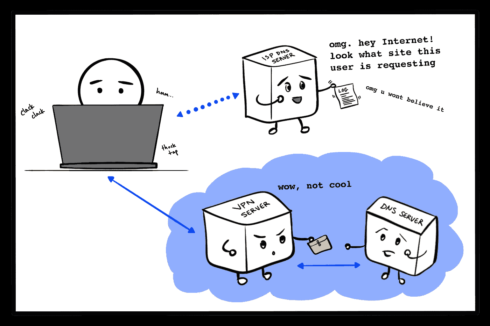

# 用户和应用程序如何在互联网上保持安全:一直以来都是代理服务器

> 原文：<https://betterprogramming.pub/how-users-and-applications-stay-safe-on-the-internet-its-proxy-servers-all-the-way-down-37412c7f5913>

## 代理服务器如何构成在线匿名的基础，以及它们如何帮助用户和 web 应用程序


互联网用户和互联网连接的应用程序都可以从网络安全投资中受益。在线隐私的一个核心方面是使用代理服务器，尽管这一基本构件最初可能在其更易识别的形式下不可见。

如今，对于开发者、软件产品所有者以及互联网上的普通人来说，代理服务器是一个需要了解的有用的东西。

让我们来探索是什么让代理服务器成为网络安全支持的重要组成部分。

> “在互联网上，没有人知道你是一只狗。”—彼得·施泰纳

1993 年，当彼得·斯坦纳的标题首次发表在《纽约客》上时，据说很少有人注意到它。直到后来，网络匿名这一不祥且有点可怕的暗示才以未知事物冰冷的手指触动了公众意识。

随着互联网的使用变得越来越流行，用户开始担心其他人可以以他们选择的任何方式在网上表现自己，而其他任何人都不知道他们的真实身份。

简而言之，现在情况已经不同了。由于[追踪 cookie](https://support.mozilla.org/en-US/kb/enable-and-disable-cookies-website-preferences)、[浏览器指纹](https://robertheaton.com/2017/10/17/we-see-you-democratizing-de-anonymization/)和[互联网服务提供商(ISP)向广告商出售我们的浏览日志](https://www.privacypolicies.com/blog/isp-tracking-you/)，以及我们自己莫名其妙地倾向于将我们的名字和面孔放在社交网络上，在线匿名就像去年的 LaCroix 口味一样过时了。

虽然你的隔壁邻居可能不知道如何在网上找到你(嗯，除了通过你正在使用的基于位置的二手市场应用程序)，但你可以肯定，至少有一家大型广告公司在某个地方有一系列 0 和 1，代表你的市场人口统计的具体细节，以及你的所有在线习惯，包括你喜欢的 LaCroix 口味。

有很多方法可以增加一些模糊层次，比如使用隐藏你 IP 的公司防火墙，或者使用 Tor。

这两种方法的基本机制是相同的。就像藏在洋葱的各层中一样，我们使用一个或多个代理服务器来保护自己免受第三方的追踪。

# 究竟什么是代理服务器？

在传统的英语定义中，代理是“代表另一个人的权威或权力。”([韦氏词典](https://www.merriam-webster.com/dictionary/proxy))在计算环境中，代理服务器是代表另一个服务器或用户机器的服务器。

例如，通过使用代理浏览互联网，用户可以推迟被个人识别。所有用户的互联网流量似乎都来自代理服务器，而不是他们的机器。

# 代理服务器是为用户服务的

作为客户，当我们上网时，有几种方法可以使用代理服务器来隐藏我们的身份。重要的是要知道这些方法提供不同级别的匿名，没有一种方法能真正提供*真正的*匿名。

如果其他人主动在互联网上寻找您，无论出于什么原因，都应该采取进一步的措施，使您的活动真正难以识别。

(这些步骤超出了本文的范围，但是您可以从[电子前沿基金会(EFF)的监视自我防御](https://ssd.eff.org/)资源开始。)

然而，对于普通用户来说，这里有一个很小的选项菜单，范围从最少到最多匿名。

# 在 Web 浏览器中使用代理

某些网络浏览器，包括 Mac 上的 Firefox 和 Safari，允许我们配置它们通过代理服务器发送我们的互联网流量。

代理服务器试图通过用代理服务器自己的 IP 地址替换我们的原始 IP 地址来匿名化我们的请求。这为我们提供了一些匿名性，因为我们试图访问的网站不会看到我们的原始 IP 地址；然而，我们选择使用的代理服务器将确切地知道是谁发出了请求。

这种方法也不一定会加密流量，阻止 cookies，或者阻止社交媒体和跨网站追踪者跟踪我们；从好的方面来说，这是最不可能阻止使用 cookies 的网站正常运行的方法。


公共代理服务器就在那里，决定我们是否应该使用其中任何一个就像决定我们是否应该吃一颗微笑的陌生人递给我们的糖果一样。

如果你的学术机构或公司提供了一个代理服务器地址，它(希望)是一个安全的私有服务器。

如果我们有一点时间和每月几美元来投资我们的安全，我的首选方法是与一家公司建立我们自己的虚拟实例，如亚马逊网络服务公司或 T2 数字海洋公司，并使用它作为我们的代理服务器。

要通过我们的浏览器使用代理，我们可以[在 Firefox](https://support.mozilla.org/en-US/kb/connection-settings-firefox) 中编辑我们的*连接设置*，或者[在 Mac 上使用 Safari 设置一个代理服务器](https://support.apple.com/guide/safari/set-up-a-proxy-server-ibrw1053/mac)。

关于选择浏览器，我很乐意向任何想要增强开箱即用的浏览体验安全性的互联网用户推荐 [Firefox](https://www.mozilla.org/en-US/firefox/new/) 。

自从我听说了隐私优先以来，Mozilla 一直是隐私优先的倡导者，最近对 Firefox 浏览器中的[增强跟踪保护进行了一些广受欢迎的更改，默认情况下，Firefox 浏览器会阻止社交媒体跟踪器、跨站点跟踪 cookies、指纹打印机和加密矿工。](https://blog.mozilla.org/blog/2019/06/04/firefox-now-available-with-enhanced-tracking-protection-by-default/)

# 在您的设备上使用 VPN

为了将代理服务器用于我们所有的互联网使用，而不仅仅是通过一个浏览器，我们可以使用虚拟专用网络(VPN)。

VPN 是一种服务，通常是付费的，通过他们的服务器发送我们的互联网流量，从而充当代理。

VPN 可以在我们的笔记本电脑以及电话和平板设备上使用，因为它包含了我们所有的互联网流量，所以除了确保我们的设备连接外，它不需要太多额外的努力来使用。

使用 VPN 是防止好管闲事的 ISP 窥探我们请求的有效方法。



要使用付费的第三方 VPN 服务，我们通常会在他们的网站上注册并下载他们的应用程序。

重要的是要记住，无论我们选择哪家提供商，我们都是在将我们的数据委托给他们。VPN 提供商对我们在互联网上的活动进行匿名化，但他们自己可以看到我们所有的请求。

提供商在他们的隐私政策和他们选择记录的数据方面有所不同，因此有必要进行一些研究来确定我们可以放心地信任哪一个(如果有的话)。

我们也可以通过使用虚拟实例和 OpenVPN 来推出我们自己的 VPN 服务。OpenVPN 是一个开源的 VPN 协议，可以和少数虚拟实例提供商一起使用，比如[亚马逊 VPC](https://openvpn.net/amazon-cloud/) 、[微软 Azure](https://openvpn.net/microsoft-azure/) 、[谷歌云](https://openvpn.net/google-cloud-vpn/)和[数字海洋水滴](https://openvpn.net/digital-ocean-vpn/)。

我之前写过一篇关于使用 EC2 实例用 AWS 设置你自己的个人 VPN 服务的教程。我已经亲自运行这个解决方案大约一个月了，它总共花费了我将近 4 美元，这个价格让我很放心。

# 使用 Tor

Tor 利用代理服务器提供的匿名性，并通过由其他服务器组成的中继网络转发我们的请求，每个服务器被称为一个“节点”

我们的流量在到达目的地的途中会经过三个节点:守卫节点*、中间节点*、出口节点*和 T21 节点*。在每一步，请求都被加密和匿名，因此当前节点只知道将它发送到哪里，而不知道请求包含什么。

这种知识分离意味着，在所讨论的选项中，Tor 提供了最完整的匿名版本。

(要获得更完整的解释，请参见罗伯特·希顿关于 Tor 如何工作的文章，这篇文章写得太棒了，我真希望是我自己写的。)


也就是说，这种程度的匿名是有代价的。不是金钱，因为 Tor 浏览器可以免费下载和使用。然而，它比通过浏览器使用 VPN 或简单的代理服务器要慢，因为我们的请求要走迂回的路线。

# 代理服务器也适用于服务器

我们现在已经熟悉了在保护用户上网时使用的代理服务器，但是代理不仅仅是为客户服务的。

网站和互联网连接的应用程序也可以使用[反向代理服务器](https://en.wikipedia.org/wiki/Reverse_proxy)进行混淆。“反向”部分仅仅意味着代理代表服务器，而不是客户端。

为什么网络服务器关心匿名？一般来说，他们不会，至少不会像某些用户那样。

出于几个不同的原因，web 服务器可以从使用代理中受益；例如，他们通常通过[缓存](https://en.wikipedia.org/wiki/Web_cache)或[压缩](https://en.wikipedia.org/wiki/HTTP_compression)内容来优化交付，从而为用户提供更快的服务。

然而，从网络安全的角度来看，反向代理可以通过混淆底层基础设施来改善应用程序的安全状况。


基本上，通过在直接访问所有文件和资产的 web 服务器之前放置另一个 web 服务器(“代理”)，我们使攻击者更难找到我们“真正的”web 服务器并破坏我们的东西。

就像当你想见商店经理时，和你谈话的店员说:“我代表经理说话”，你甚至不确定*是不是经理。*

但是，你成功地把他们卖给你的粉红色小马换成了紫红色的，非常感谢，所以现在你不再关心经理是谁，他们是否真的存在。

而且，如果你在街上遇到他们，你不能阻止他们，也不能叫他们出去，因为他们把粉红色冒充成紫红色，经理对此没意见。

一些常见的 web 服务器也可以充当反向代理，通常只需简单的配置更改。虽然我不知道您的特定架构的最佳选择，但我将在这里提供几个常见的示例。

# 使用 NGINX 作为反向代理

[NGINX](https://www.nginx.com/) 使用其[配置文件](https://docs.nginx.com/nginx/admin-guide/basic-functionality/managing-configuration-files/)(默认为`nginx.conf`)中的`proxy_pass`指令将自己变成一个反向代理服务器。该设置要求在配置文件中放置以下行:

```
location /requested/path/ {
proxy_pass http://www.example.com/target/path/;
}
```

这指定了对路径`/requested/path/`的所有请求都被转发到`http://www.example.com/target/path/`。目标可以是域名或 IP 地址，后者可以有也可以没有端口。

使用 NGINX 作为反向代理的完整指南[是 NGINX 文档的一部分。](https://docs.nginx.com/nginx/admin-guide/web-server/reverse-proxy/)

# 使用阿帕奇 HTTPD 作为反向代理

Apache HTTPD 同样需要一些简单的配置来充当反向代理服务器。在[配置文件](https://httpd.apache.org/docs/current/configuring.html)，通常是`httpd.conf`，设置以下指令:

```
ProxyPass "/requested/path/" "http://www.example.com/target/path/"
ProxyPassReverse "/requested/path/" "http://www.example.com/target/path/"
```

`ProxyPass`指令确保对路径`/requested/path/`的所有请求都被转发到`http://www.example.com/target/path/`。`ProxyPassReverse`指令确保 web 服务器发送的头被修改为指向反向代理服务器。

Apache HTTP server 的完整[反向代理指南可以在他们的文档中找到。](https://httpd.apache.org/docs/2.4/howto/reverse_proxy.html)

# 代理服务器大部分都在下面

我承认我的标题有点滑稽，因为网络安全最佳实践并不真的是某种永恒的无限回归之谜(尽管它们有时看起来可能是)。

无论如何，我希望这篇文章有助于你理解什么是代理服务器，它们如何有助于客户端和服务器的在线匿名，以及它们是网络安全实践中不可或缺的组成部分。

如果你想了解更多关于网络安全的个人最佳实践，我强烈推荐你浏览由 [EFF](https://www.eff.org/) 提供的文章和资源。

对于保护网站和应用程序的指南来说， [OWASP 备忘单系列](https://github.com/OWASP/CheatSheetSeries)是一个极好的资源。