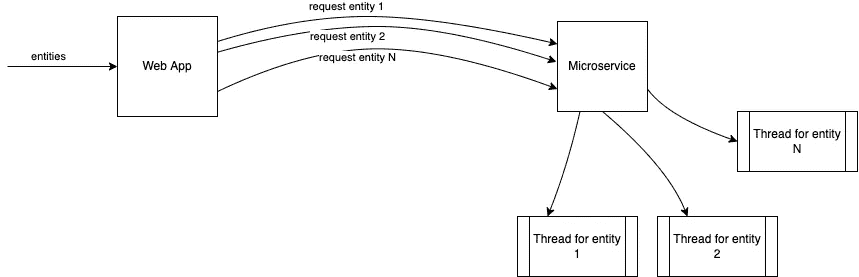
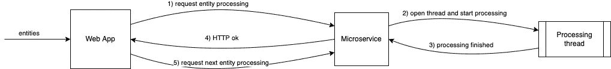
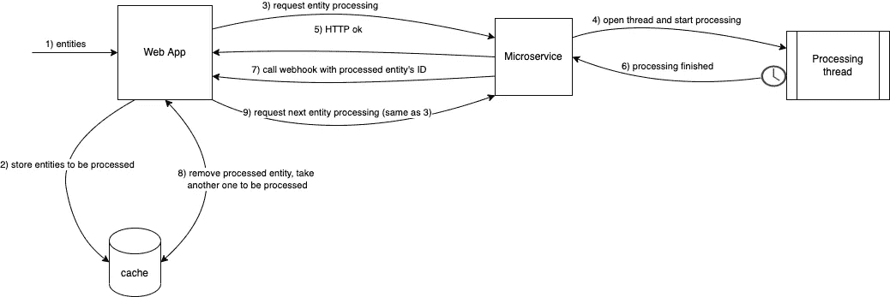

# 在特定的用例场景中，我们如何从 Webhooks 中获益

> 原文：<https://betterprogramming.pub/how-we-benefited-from-webhooks-in-a-specific-use-case-scenario-cf9ff2f5afd3>

## 解决架构问题的快速 webhook 用例

由[米兰·德格雷夫](https://unsplash.com/@milandegraeve?utm_source=medium&utm_medium=referral)在 [Unsplash](https://unsplash.com?utm_source=medium&utm_medium=referral) 上拍摄的照片

上周，我一直面临着一个具有挑战性的场景，它对我们当前的架构有着某些复杂的影响，因此使我在许多限制下工作。我试图以一种清晰的方式来描述它，并展示 webhooks 是如何被证明适合于实现一个工作解决方案的。

# 问题是

有一个单一的 web 应用程序，它使用某些实体(业务领域实体)来执行业务操作。这个 web 应用程序目前正在被分解为微服务，从单一架构转变为面向微服务的架构。为了实现这一点，有许多不同的微服务可以满足特定的业务领域。

有一个特定的用例需要处理一批实体。处理每个实体可能只需要几毫秒或 15 分钟。实体的状态在处理后可能会改变，但是并不立即需要每个特定实体的处理结果，因此可以异步处理一批实体。

顺便说一下，某个实体的处理发生在特定的微服务中。为了处理实体“A”，应该向微服务发送使用“A”作为参数的请求。因此，为了处理一批 N 个实体，微服务应该被请求 N 次。

为了更好地描述这个场景，可以将一批实体看作是查询数据库的结果，将微服务看作是特定的业务域操作。一些有用的例子是:

*   通过在当前工资的基础上增加 5%的奖金来提高在公司工作超过 10 年的前 100 名员工的工资。
*   对于给定客户的每个产品，通过比较它们的名称，找到最有可能相关的产品。然后用匹配项更新`related_products`表。
*   对于社交媒体平台中的每个用户，使用某种兴趣匹配算法找到可能分享相同兴趣的其他用户。然后用匹配更新`users_suggested_friends`表。一旦用户再次在线，就可以向用户显示这些建议。

# 第一种方法:发射和遗忘机制

由于处理每个实体的微服务(MS)可以是异步的，所以一劳永逸的方法起初似乎不错。给定一批实体，web 应用程序应该遍历所有实体，并为每个实体向 MS 发送请求，而不需要等待 MS 的任何响应。这样，MS 将负责异步管理每个实体的处理。

火灾和遗忘进近的概貌

MS 没有任何类型的缓存机制或临时存储来存储所有进入的实体，延迟了它们的处理。话虽如此，每个到达的实体在 MS 中触发一个新的执行线程，完全是为了处理那个特定的实体。

可以想象，这种方法非常简单，但是它带来了可怕的性能问题，经历了非常高的 CPU 和内存使用率以及资源使用中的瓶颈。

# 第二种方法:同步阻塞机制

当我们看到问题时，我们认为 web 应用程序无法知道特定实体的处理何时完成，从而请求 MS 处理下一个实体。下面的方法试图通过采用完全同步的方法提出一个解决方案:一旦处理线程完成，对 MS 的每个请求都将返回一个 HTTP 响应。

这种模式包括让 web 应用程序等待一个实体的处理完成，然后再请求处理下一个实体。它将架构变成了单线程架构。它将 CPU、内存和资源利用率降至最低，并且 web 应用程序现在知道 MS 何时完成了对实体的处理。

同步机构的概貌

但是，我前面提到过，实体的处理可能需要 15 分钟或更长时间。让一个 HTTP 连接打开那么长时间绝对不是一个好主意。

# 第三种也是工作方法是使用 webhook

所有以前的方法都失败了，我们开始详细考虑新的解决方法。以下是我们认为应该涵盖的预期非功能性需求的列表:

*   web 应用程序应该向 MS 发送处理请求，而不必等待它完成。web 应用程序应该完全控制请求率。
*   当 MS 处理完一个实体时，它应该能够与 web 应用程序通信。
*   MS 应该保持无状态。它不应该保存任何实体集合。

一位同事建议使用 webhook 通过将控制权从 web 应用程序临时转移到 MS 本身来异步循环`entities`批处理。我们立刻意识到这是一个多么棒的主意。

webhook、hook 或回调是一个特定的端点，充当事件侦听器的入口点。它只不过是一个端点，每次满足一组特定的条件或触发一个特定的事件时都应该调用它。在这种情况下，事件将是“实体 X 处理完成”，挂钩将由 MS 调用。

web 应用程序将存储`entities`批处理(例如，使用缓存机制)，并且它将只触发第一个实体的处理请求。此后，每次 MS 调用 webhook 时，web 应用程序都会知道某个实体的处理已经完成。假设实体的 ID 是在 hook 请求中发送的，那么 web 应用程序将从批处理中删除传入的实体，并发送下一个实体的处理请求。

webhook 方法的概貌

以下是使用这种有趣模式时需要考虑的一些事项:

*   这种模式保证了在任何时候都只有一个实体被处理，尽管如果我们愿意的话，可以很容易地将它修改为有 N 个同时工作的线程。
*   我们开始只在应用程序端循环实体(只有应用程序对循环有完全的控制权)。它没有像我们预期的那样工作，我们最终使用了混合控制方法:现在有一个应用程序完全控制的第一个时刻，第二个时刻是 MS 负责决定何时应该继续循环。这是一个更复杂的模式，循环决策涉及两个分布式组件。
*   这个循环必须有一个入口点:在 web 应用程序中填充和存储`entities`批处理的时刻和位置，以及发送第一个处理请求的时间。这可以在一个异步过程中完成(比如一个作业或一个脚本)，也可以在主应用程序的线程中触发。
*   如果 MS 失败或没有正确调用钩子，那么`entities`批处理将完全保留在 web 应用程序端，循环将永远不会结束。因此，这种架构必须考虑容错或恢复机制。
*   如果一个新的 `entitie` s 批处理被设置为在已经有一个正在被处理时被处理，会发生什么？新批次是否应该覆盖现有批次？新的一批`entities`是否应该添加到现有的一批中，以便将它们全部混合在一批中？它应该退出记录已经有一个实体批处理的消息吗？

我个人认为，这种模式非常灵活，很容易适应具有两个以上相互依赖的分布式组件的更复杂的类似场景。我喜欢我们根据自己的需要对它进行调整的方式，我希望您的开发人员工具箱中现在有了另一个有用的资源，可以用于这样的场景。

感谢您的阅读，并保持联系以获取更多信息！