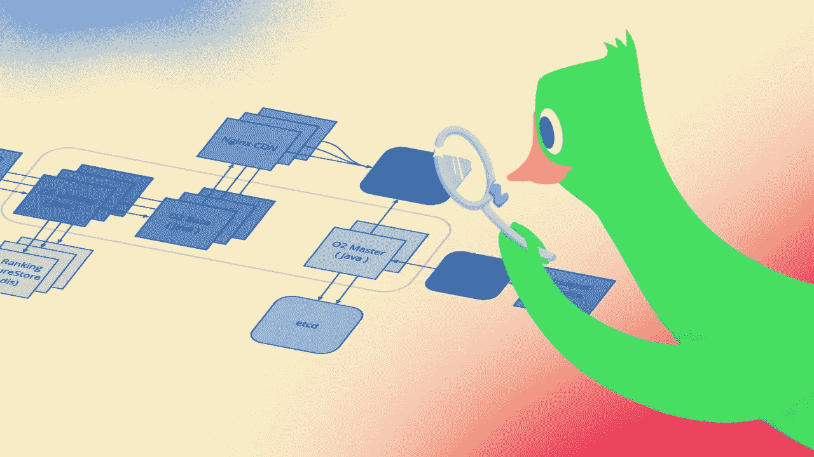
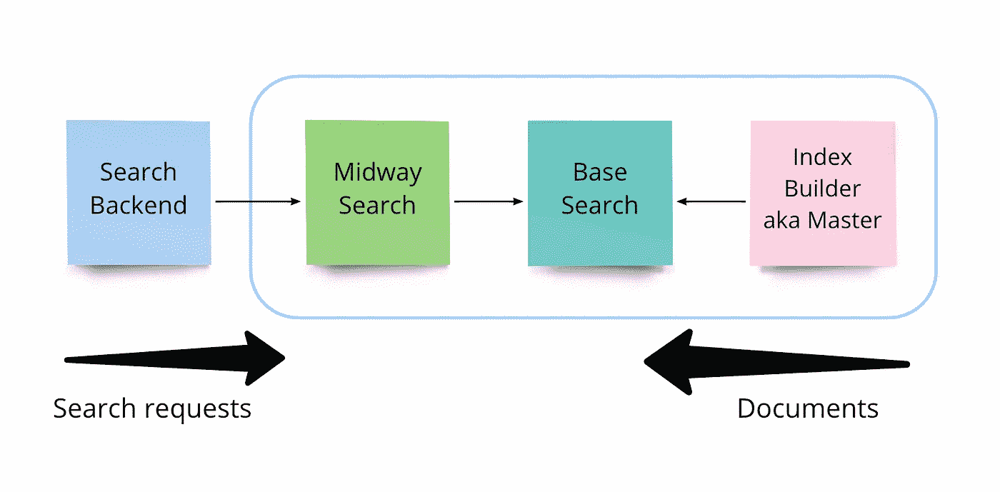
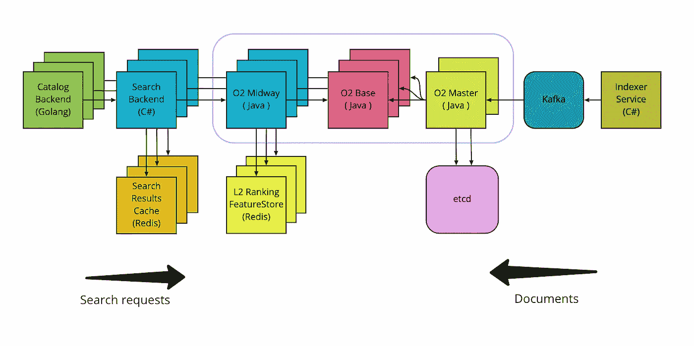
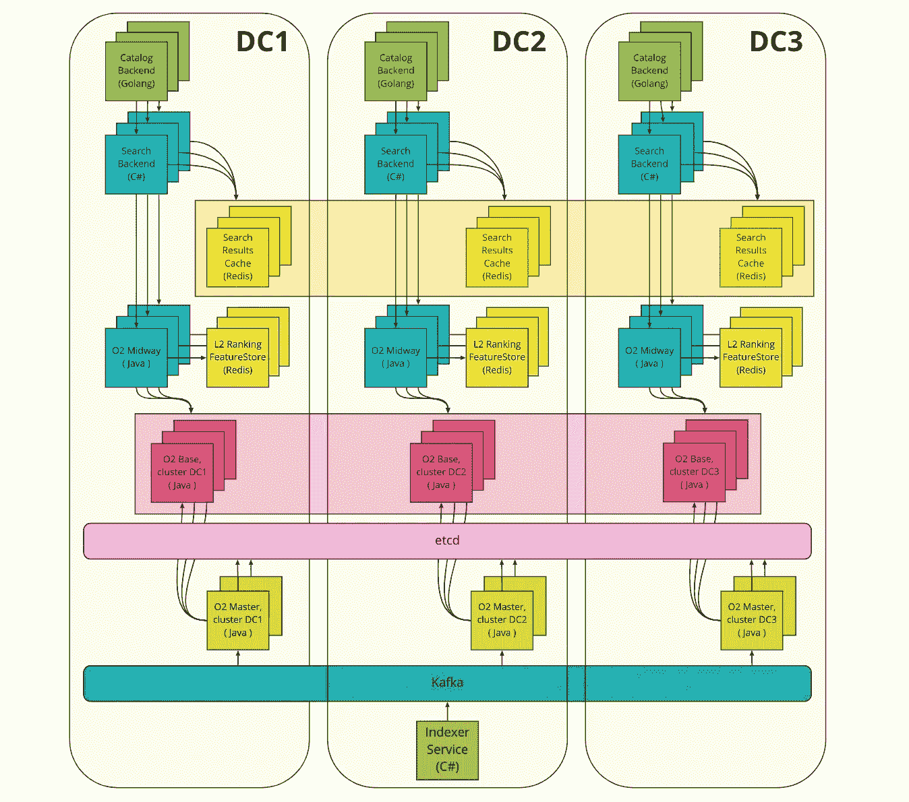
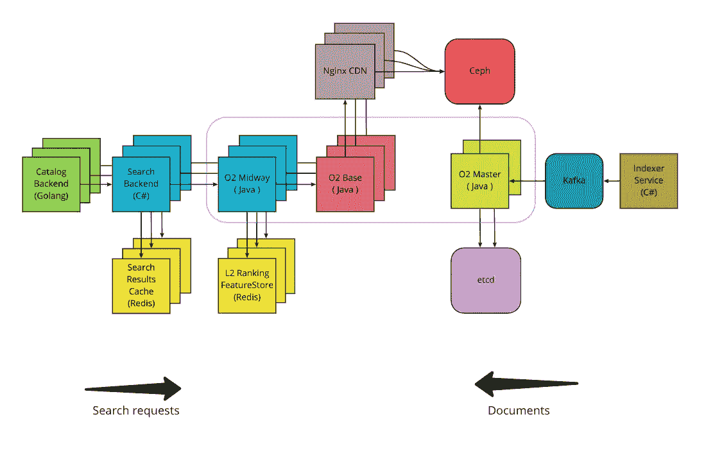
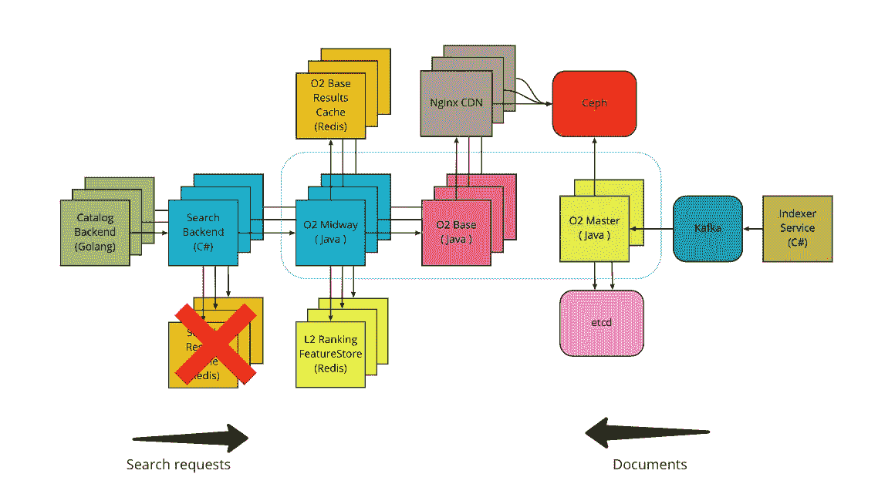

# 我们如何基于 Apache Lucene 构建 O2:分布式搜索引擎

> 原文：<https://betterprogramming.pub/how-we-built-o2-the-distributed-search-engine-based-on-apache-lucene-382e060a5328>

## 使用有趣的算法和数据结构解决复杂的问题

在这篇文章中，我将谈论 [Ozon](https://corp.ozon.com/) 搜索架构。故事的关键部分是 O2(氧气)——我们在 Apache Lucene 上构建的搜索引擎。我们使用了 ElasticSearch 和 Solr 的一些技术，但添加了许多东西，使 O2 成为我们工作负载的最佳匹配。如果你曾经想过建立一个搜索引擎，或者你的工作与搜索技术相关，那么这是一个值得阅读的故事。

另外，如果你不介意阅读 1998 年至 2020 年的预史，这里有一篇关于 habr.com 的原创[文章](https://habr.com/ru/company/ozontech/blog/667600/)。它涵盖了我们与 MSSQL FTS，斯芬克斯和 ElasticSearch 的旅程。这里我从 2020 年开始，只说 O2。

# 简单介绍一下搜索通常是如何工作的

不管你的产品是什么，搜索架构很可能会有这些特性:

*   索引系统，负责从不同的数据存储中收集索引实体(网页、产品、简历等)的属性。结果是一个索引，可以有效地进行搜索。
*   搜索后端，负责处理查询。它可能只是一个直接从应用后端查询的搜索引擎(如 Elasticsearch ),或者如果你的产品很大很成熟，它可能是一个服务集合。搜索请求处理通常包括查询解析、搜索和排序。
*   排名后端，负责搜索结果重新排序。同样，它可能隐藏在搜索引擎中(如 ElasticSearch ),也可能构建为执行一些复杂业务逻辑的顶级服务。

排名是搜索应用中非常重要的一部分。如果你运行一个本地食品配送应用程序，并且你的典型搜索查询只返回 5 个项目，这可能不是最优先考虑的。但对于搜索引擎、求职板或电子商务平台等一些大公司来说，对搜索结果进行排名是一个百万美元的问题。

当您的典型查询返回 100K 甚至更多的结果时，您很难在严格的时间限制约束下运行复杂的排序算法。糟糕的响应时间会比糟糕的搜索相关性对你的伤害更大，所以准备好迎接充满挑战和权衡的旅程吧。

排序问题的典型技巧是使用几个排序公式。假设您的查询返回了 50 万个项目。首先，你挑选你最天真但轻量级的算法，并对你找到的所有结果进行排序。然后，你从第一阶段中挑选最好的项目(尽可能多，比如说 20K ),并用你的下一个算法对它们进行排序——这更聪明，但更耗时。您可以重复这个过程任意多次，但实际上 2 或 3 个排序算法就足够了。最后一个阶段通常是训练神经网络来解决排名问题。

这就是你需要知道的，现在，让我们继续前进！

# 为什么你甚至需要建立自己的搜索引擎，伙计？只需使用 ElasticSearch 并从中获得乐趣

Ozon 在其生命周期中有不同的搜索架构。最后一个是基于一个弹性搜索集群，有几十个节点、碎片、副本和所有你期望从一个高负载搜索引擎得到的东西。我们或多或少对事情的进展感到满意，直到我们看到越来越多的任务积压，需要修改内部 ES 部分。这些任务花费了大量时间，因为您必须编写业务逻辑，然后打补丁，有时甚至需要重新部署集群。

最终，很明显，我们花在基础设施工作上的时间比花在编写业务逻辑上的时间多。我们也看到了在如何实现排名、搜索和索引方面的一些低效，因此在某个时间点上，我们显然可以做得更好。

在开发开始之前，我们设定了几个目标:

*   分离搜索和排名阶段，以便独立开发和扩展它们
*   获得对排名过程的完全控制
*   获得对索引构建和索引复制的完全控制
*   获得搜索算法的低级优化

我们基本上有两个选择:从头开始写(谷歌/脸书/微软的方式)或者使用一些稳定的库作为基础。第一个选项给了我们无限的定制潜力，但是我们必须在搜索技术发展的 20 年历史中“加速奔跑”。第二个选项将我们与我们选择的库的所有细节和低效之处联系在一起，但是将我们从社区已经犯下和修复的错误中解救出来。经过短暂的辩论，我们选择了第二个选项:让我们基于 Apache Lucene 构建一个搜索引擎。

我们的搜索引擎由三个关键部分组成:

*   索引构建器或“主人”负责构建 Lucene 索引。它获取类似 JSON 的文档作为输入，并发布索引段作为输出。Lucene segment 是一个不可变的索引块，包含一些文档，可以被搜索。
*   “基本搜索”是负责搜索请求执行的层。该层的每个节点在启动时下载搜索索引的本地副本。除了搜索和过滤阶段，基本搜索还负责 L1 排名——使用文本相关性的轻量级公式( [tf-idf](https://en.wikipedia.org/wiki/Tf%E2%80%93idf) 、 [bm25](https://en.wikipedia.org/wiki/Okapi_BM25) )和简单的启发式算法。基本搜索支持水平缩放。
*   “中间搜索”或“中途”是负责请求路由和搜索结果的 [L2 排名](https://en.wikipedia.org/wiki/Learning_to_rank)的一层。我们希望在设计中包含对索引分片的支持，这就是为什么我们需要在基本搜索之上增加一层。Midway 应该能够将搜索请求路由到碎片，并将部分响应转换为最终结果。中途也是 ML 排名的运行时间。与基本搜索相同，它支持水平缩放。

O2 搜索引擎的第一个概念

经过 6 个月的紧张工作，第一个稳定的功能性 O2 版本发布了。我们建立了一个具有真实搜索索引的小型集群，并将 1%的生产流量路由到其中。通过这样做，我们能够评估搜索质量。又花了几个月的时间，使用离线测试改进文本相关性算法，修复所有主要的性能问题，并实现高可用性。

2021 年 7 月，我们逐渐将我们的流量从 Elasticsearch 转移到 O2。该版本非常成功:响应时间缩短了近两倍，同时我们获得了 x1.5 的吞吐量。

搜索架构在 2021 年 7 月，就在 O2 发布之后

让我们基于 Elasticsearch 回顾一下自上一版本以来的变化，并讨论为什么 O2 对我们的工作负载表现更好。

## 负载平衡

在以前的架构中，搜索后端通过 Nginx 负载均衡器与 Elasticsearch 对话，Nginx 负载均衡器也作为搜索请求的缓存层。客户端使用域名，域名通过 DNS 被解析成几个 Nginx IP 地址。如果 Nginx 服务器出现故障，我们可以启动另一个服务器，并为其重新分配一个 IP 地址。对客户来说，一切都是透明的。

在 O2 中，我们切换到客户端平衡——一种技术，其中客户端为它们与之通信的每个服务保留一个可用 IP 地址列表。要实现这一点，您需要一个[服务注册中心](https://microservices.io/patterns/service-registry.html)，一个知道存在哪些服务以及如何到达它们的组件。在 Ozon，我们有一个解决这个问题的平台——一个名为 Warden 的服务充当服务注册表。Warden 与 Kubernetes 集成在一起:它知道环境中每个服务的 IP 地址，因为它监听所有的部署更新。

客户端平衡允许我们移除 Nginx 层，直接连接搜索后端和 O2-midway。这改善了延迟，让我们能够使用像[子集](https://sre.google/sre-book/load-balancing-datacenter/)这样的特性，并实现定制的负载平衡算法。例如，现在我们正在测试基于 [EWMA](https://en.wikipedia.org/wiki/EWMA_chart) 响应时间的 [p2c](https://www.nginx.com/blog/nginx-power-of-two-choices-load-balancing-algorithm) 算法。

## 搜索阶段的分离

两个搜索层`o2-base`和`o2-midway`被实现和部署为不同的服务。

较低级别的 o2-base 被部署为 Kubernetes[statefullset](https://kubernetes.io/docs/concepts/workloads/controllers/statefulset/)—一种允许将 pod 链接到持久存储的资源类型。在我们的例子中，它是一个存储搜索索引的硬盘。如果没有 StatefulSet，pod 的每次重启都会导致一个新的 100 GB 搜索索引的下载。由于集群中的大量节点，这将导致非常长的启动延迟或很高的网络利用率。

节点启动后，搜索索引的一个显著部分被加载到 RAM(操作系统页面缓存)中。索引读取操作通过`mmap`完成，这[显著地](https://sasha-f.medium.com/why-mmap-is-faster-than-system-calls-24718e75ab37)减少了磁盘和应用程序之间数据传输的开销。这是搜索请求低延迟的先决条件。o2-base 中的响应时间主要取决于发布列表遍历、文本相关性分数计算和从 DocValues 字段中提取数据。通用索引数据结构(如发布列表和文档值)的概述超出了本文的范围。

中间层 o2-midway 是一个无状态的 Kubernetes 服务。所有的搜索请求都通过这个服务:首先，它们被路由到`o2-base`服务，收集 N 千个最匹配的产品，然后使用机器学习对结果集进行重新排序( [L2 排名](https://en.wikipedia.org/wiki/Learning_to_rank))。ML 模型将产品的特征作为输入。ML 功能的确切列表在 NDA 下，但是告诉我们使用所有常识性的产品属性，如价格、评级或交付时间，这不是犯罪。这些数据需要为每个产品预先计算，并存储在快速存储器中。搜索排名模型还需要产品和搜索查询的成对统计。毕竟我们有上亿个键-值对，其中键是一个`product_id`或一对搜索查询和一个`product_id`，值是一个包含产品统计信息的浮点数组。我们将这些数据存储在一个 [Redis 集群](https://redis.io/docs/manual/scaling/)中——它速度很快，并提供现成的分片和复制。

正如我之前提到的，独立层允许您独立地缩放它们。例如，如果我们添加一个新的超级酷但超级重的 ML 算法，我们可以只缩放中途层，而不触及基础层。

## 最终一致性

基于倒排索引的搜索引擎通常难以提供快速的索引更新。索引的最小部分是 Lucene [段](https://stackoverflow.com/questions/2703432/what-are-segments-in-lucene)，所以没有办法就地更新单个文档。索引更新的唯一选择是提交包含所有新文档和更新文档的新索引段(更新文档的旧版本将被标记为墓碑，在进一步搜索时将被忽略)。每一个新的段都会对搜索延迟产生负面影响，因为你需要做更多的计算。

Lucene 片段可以使用类似于合并排序的技术进行合并。您可以使用它来减少索引中的段数。如果通过合并来减少线段数量的速度不低于新线段到达的速度，那么就没问题。否则，你就有麻烦了，因为索引会降级，直到你建立一个新的。

为了保持较低的延迟，可以减少执行索引提交的频率。为了实现这一点，索引构建器必须在提交之前在一个新的段中积累更多的文档，从而延迟了这个新的段到基本搜索节点的传递。这是延迟和索引更新延迟之间的折衷。Twitter 工程师在他们的搜索引擎 early bird(Lucene fork)中解决了这个问题，他们在尚未提交的片段中实现了内存搜索。我们的团队总有一天会重复这一壮举。

基本搜索的节点以不同的速度下载搜索索引更新。正因为如此，它们在特定的时刻会有不同的状态。对于请求两次的同一个查询，您可能会得到不同的搜索结果，或者您可能会在分页过程中看到一些不一致。

实际上，我们的用户体验不到这些，因为我们使用缓存使搜索结果更稳定。我们有意避免了棘手的会话，以保持系统的简单和弹性。

## 性能改进

拥有源代码让你有可能在你想要的任何水平上进行改进。O2 的第一个性能改进是在搜索请求执行期间处理数据段的方式。Elasticsearch 对片段执行顺序扫描(至少在 6.6 版之前是这样)。我们已经用并行处理取代了顺序处理:数据段被分组为数据块并提交给线程池。分组是由贪婪算法进行的，目标是在每个块中有相似数量的文档。这很重要，因为在并行处理中，您要等待最慢的子任务完成。

这个技巧允许我们在吞吐量(由于多线程开销，我们花费了更多的资源)和延迟(最终结果可以更快地计算出来)之间进行权衡。这是一个很好的权衡:吞吐量损失可以通过添加更多硬件来恢复，但用同样的方法来改善延迟几乎是不可能的。Elasticsearch 建议通过增加碎片和副本的数量来解决这个问题，但与单个服务器内的并行处理相比，这将需要更多的计算资源。

# 发布后时期的挑战

## 更多数据中心

2021 年初，Ozon 开始迁移到多 DC 架构。大部分工作由平台开发人员和基础设施工程师完成:建立新的数据中心，调整基本服务(Kafka、etcd、Hadoop、Ceph、PostgreSQL、Redis)和 CI/CD。

最简单的部分留给了无状态服务的所有者:只需将副本数量设置为 3 的倍数，并将您的服务构建更新为最新的 CI/CD 管道版本。搜索团队有一些问题需要解决，因为 O2 的采用与多 DC 迁移重叠。我们还有一个需要特殊处理的基于 o2 的有状态服务。

我们决定运行三个独立的中型 O2 集群，而不是一个超级大集群。老实说，我们甚至不能选择单集群选项:O2 的第一个版本对连接到`o2-master`的`o2-base`节点的数量有限制。瓶颈是`o2-master`网络通道:当基于 o2 的节点下载索引时，它被充分利用。我将在下一章给出更多的细节。

三个独立的 O2 集群被实现为不同的 Kubernetes 部署:`o2-base-dc1`、`o2-base-dc2`、`o2-base-dc3`，每个都有自己的`o2-master`实例。这种配置产生了流量路由的新问题，因为对于单个 o2-midway 服务，我们现在有三个 o2-base 服务。默认的平台负载平衡解决方案不支持这种定制场景，因此我们必须基于 [Ribbon](https://github.com/Netflix/ribbon) 实现我们自己的解决方案。o2-midway 的实例首先选择概率与集群大小成比例的`o2-base`集群，然后选择集群中的一个节点(使用我之前提到的基于 [p2c](https://www.nginx.com/blog/nginx-power-of-two-choices-load-balancing-algorithm) 的算法)。

展望未来，我可以说三个集群的配置已经完全证明了自己的合理性。它提供了在发生事故时切断流量和关闭单个集群的可能性。此外，您可以一个接一个地独立更新集群，这对于有风险的版本来说是一个非常有用的特性。

多 DC 架构具有以下有趣的特性:

*   无状态服务仅在单个数据中心内相互对话。这是在前面提到的 Warden 服务的帮助下实现的——默认情况下，它只为客户端平衡提供本地 IP 地址。
*   搜索结果缓存分布在三个数据中心，没有复制。这给了我们更多的储物空间。如果数据中心出现故障，我们将丢失 1/3 的缓存数据，这基本上意味着我们将丢失 1/3 的缓存命中率。这是可以接受的，因为即使没有缓存，我们的后端也有能力维持工作负载。
*   每个数据中心都有自己的 ML 特性存储。我们不能丢失 1/3 的数据，因为这将明显影响搜索质量。所以唯一的选择就是数据复制。
*   o2-midway 和 o2-base 服务之间的负载平衡有两个步骤:首先选择数据中心，然后选择服务器。

## 拯救 O2-主网络带宽

在前一章中，我提到了 o2-master 网络带宽的一个问题:它限制了可以从 o2-master 无延迟地同时下载新索引段的 o2-base 节点的最大数量。例如，如果 o2-master 每 5 分钟生成一个新的 10GB 段，则 37 个节点将完全利用 10Gbps 通道(快速检查:您需要 8 秒钟通过 10Gbps 通道下载 10GB 段，这意味着您可以在 5 分钟的间隔内执行下载(5*60/8)=37.5 次)。实际上，有效速度会更低，因为网络可能会出现故障。我们通过在 o2-base 节点和 o2-master 之间添加分布式信号量来降低由 o2-base 节点争用导致的网络低效，但是很明显，这个问题需要一个基本的解决方案。

我们必须将索引构建和索引分发活动分开，因为前者需要单一方法，而后者需要水平扩展。我们更改了逻辑，这样 o2-master 开始上传 S3 存储中的索引(我们使用 Ceph ), O2-base 节点开始从 S3 下载索引。这种方法也有类似的缺点，幸运的是，我们预见到了这一点:到 Ceph 的网关(在我们的例子中是 [Rados Gateways](https://docs.ceph.com/en/quincy/radosgw/index.html) )会过载。这个问题通常用 cdn 来解决，所以我们不必重新发明轮子。我们在 o2-base 节点和 o2-master 之间设置了一层 Nginx 服务器。基本节点开始从 Nginx CDN 请求索引文件，Nginx CDN 首先检查本地副本，只有当文件丢失时，Nginx 才向 Ceph 发出请求。后者是通过[代理缓存锁](https://nginx.org/ru/docs/http/ngx_http_proxy_module.html#proxy_cache_lock)设置实现的，它充当文件下载的互斥体。我们需要 8 台 Nginx 服务器来处理来自 100 个基本节点的流量，这或多或少没问题。我们想尝试网卡绑定来进一步提高吞吐量，但是 NOC 工程师认为不值得支持这个解决方案。

基于 CDN 的索引分发搜索架构

我们在索引分布中优化的最后一件事是数据压缩。我们在 o2-master 中实现了动态 [zstd](https://github.com/facebook/zstd) 压缩(一种不需要临时数据拷贝的流算法),在 o2-base 中实现了动态解压缩，因此 Ceph 现在只存储压缩文件。这将传输数据的大小和传输时间减半。

现在我们致力于 p2p 索引复制，因为这是在时间和网络负载方面最有效的方法。

## 个性化排名

我们在 ML 排名上投入了大量的时间和精力。迁移到 O2 给了我们很多新的特性工程的可能性，其中最重要的是运行时计算特性。这些是无法预先计算的 ML 特征，例如，客户在过去看到特定产品的事实。您只能存储客户过去看到的产品 id 集，而不是功能本身——您必须在运行时为需要排名的产品计算它。

我们首先开发的是个性化排名。你可能会问这个东西和 O2 搜索引擎架构有什么关系？答案是——个性化排名会影响你缓存搜索结果的能力。以前，我们可以为莫斯科的用户缓存“微波”查询的搜索结果，并在进一步的请求中重用这些结果。但是现在情况变了。我们现在在我们的排名中使用鲍勃更喜欢“Toschiba”和爱丽丝更喜欢“松下”的知识。我们不仅可以保存 Bob 的搜索响应，还可以将它重新用于 Alice。

我们不想完全放弃缓存，所以我们决定将缓存层移到排名层之下(o2-midway)。现在，我们只缓存基本搜索的原始结果，并对每个搜索响应执行 ML 排名。我们确实让延迟变得更糟了，但是由于个性化的排名，我们反而提高了搜索质量。我已经告诉过你，好的排名是一个百万美元的问题，所以这个权衡是一个伟大的交易！

具有个性化排序的搜索架构:缓存层现在位于排序层之下

# 进一步的想法

这是一个相当长的旅程，尽管我只关注架构问题。从事搜索工作涵盖了许多其他有趣的主题:产品和 UX、ML 排名、NLP、建议和拼写检查。我们收集了大量的 on 指标，并进行了许多 AB 实验来寻找增长点。希望将来能涵盖其中的一些主题。