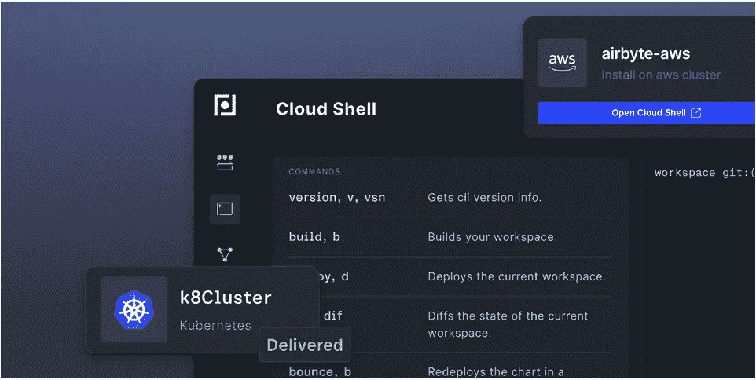
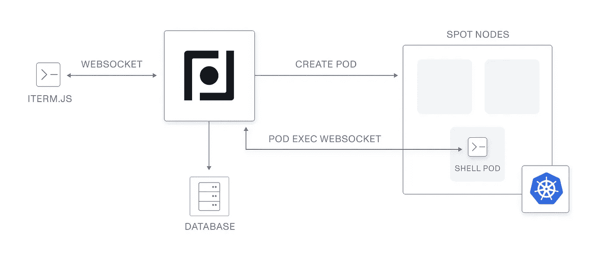

# 用药剂构建云壳体验

> 原文：<https://betterprogramming.pub/how-we-created-an-in-browser-kubernetes-experience-58c065cda803>

## 以创纪录的速度在 Kubernetes 上部署开源软件



图片由 Plural.sh 提供。

在我们深入研究我们的云壳如何取得成果的技术杂草之前，首先有必要解释一下我们为什么要构建云壳(我们的免费开源浏览器内 Kubernetes 体验)。毕竟，这是一个相当不寻常的产品决策。

[](https://github.com/pluralsh/plural) [## GitHub - pluralsh/plural:以创纪录的时间在 kubernetes 上部署开源软件。🚀

### Plural 使您能够在 Kubernetes 上构建和维护云原生和生产就绪的开源基础设施…

github.com](https://github.com/pluralsh/plural) 

即使你不是 Kubernetes 的超级用户，你也可能熟悉或认识一个提到 Kubernetes 学习曲线有多陡的开发人员。首先，您需要利用大量工具来正确地部署和管理 Kubernetes 集群。

在我们的案例中，我们依赖于以下工具:

*   舵
*   将（行星）地球化（以适合人类居住）
*   库贝特尔
*   饭桶
*   任何云 CLI(例如，AWS、GCP、AZURE)
*   以及免费和开源的复数 CLI

除了安装上述所有软件之外，您还需要正确配置他们的所有证书，确保他们在正确的版本上运行，并解决在本地运行软件的所有其他细节问题。

如您所见，这绝对是一项耗时的任务，并且至少需要一些 Helm 和 Terraform 的基础知识，以便正确地部署和管理应用程序。

# 我们从早期采用者那里学到了什么


照片由帕特里克·托马索 / [Unsplash](https://unsplash.com/?utm_source=ghost&utm_medium=referral&utm_campaign=api-credit) 拍摄

当我们最初构建 Plural 时，我们是在这样的假设下设计我们的应用程序的，即我们的大多数产品用户已经对部署基础设施有了一些熟悉，并且开发环境对他们来说是非常熟悉的，如果不是已经预先安装在他们的系统上的话。

作为一个团队，我们很快认识到我们最初的假设是不正确的，我们的大部分高级用户实际上对在 Kubernetes 上部署基础设施知之甚少。

在大多数情况下，我们发现用户来自数据科学和工程背景，并且没有安装标准的 DevOps 工具链。结果，他们遇到了大多数依赖的障碍，从而限制了我们的自由和开源工具的能力。

虽然我们平台的底层技术不是问题，并且来自我们早期采用者的反馈很有启发性，但我们知道我们必须快速解决用户面临的这个常见障碍。当我们的工程团队坐下来解决这个问题时，他们最初想出了两种方法来解决用户 DevOps 知识缺口。

第一个解决方案是简单地给用户一个预装的 Docker 映像，并随时可用。然而，让 Docker 容器与本地 git 存储库和本地云凭证一起工作本身就是一个不小的挑战。我们又回到了起点。

下一个自然的途径是弄清楚如何在我们自己的基础设施上运行和配置 Docker 映像，从用户体验中去掉这一步。最初，将我们的 Docker 映像转换为云外壳类型的体验似乎并不具有挑战性。Kubernetes 有一个远程执行 API，我们认为我们可以利用这个 API 来使它工作。

看起来很简单，对吗？算是吧，但也不尽然。

# 复数云壳的基本架构



图片由 Plural 首席技术官兼联合创始人 Michael Guarino 提供。

利用 Kubernetes API 比我们最初想象的更具挑战性。我们能够通过遵循这个通用系统设计来克服这个问题。

*   我们有一组 graphql APIs 来管理云外壳实例的创建、轮询和重启。API 在我们的数据库中创建对 shell pod 的引用，并在 k8s 集群中创建 pod。
*   我们将所有 shell pods 放在一个专用的 k8s 节点组中，这些节点组是网络隔离的，并在现场运行实例，以尽可能降低成本。
*   我们有一个操作员跟踪一个声明过期的 pod 标签，它会在六个小时后删除 shell 实例。然后，我们有一个优雅的关闭机制，它将确保未提交的 git 更改被推送到上游，以确保我们不会鲁莽地破坏状态。
*   我们的前端提供了一个 WebSocket API，允许我们推送和接收相当于 stdin 和 stdout 的浏览器，所有的 b64 编码和呈现在 react 应用程序中的 xterm.js 中。

这并不复杂，但魔鬼总是在细节中。

# 使用酏剂处理 Kubernetes pods/exec API

我们必须克服的第一个问题是弄清楚 Kubernetes pod exec API 是如何操作的。总的来说，我们的服务器将位于浏览器客户端和 Kubernetes pod 之间，提供 auth+authz 并处理 pod 娱乐逻辑。这意味着我们需要代理 API 公开的格式，并将其转换为 elixir phoenix channel WebSocket 响应。

事实证明，该 API 的文档记录很差，但实际上使用起来非常简单。虽然 Kubernetes 文档中没有关于它的细节，但我们能够通过深入官方 [Kubernetes 仪表板](https://github.com/kubernetes/dashboard)的代码来逆向工程如何使用它。

您只需通过 wss 连接到如下路径:

```
/api/v1/namespaces/{namespace}/pods/{name}/exec
```

并且，提供任何参数作为查询参数。然后，API 公开五个通道，所有通道都是以整数 0 到 4 为前缀的二进制消息。

*   0 是 stdin 的通道。
*   1–3 是对应于 stdout、stderr 等的输出通道。
*   4 专用于调整终端屏幕大小的 JSON 消息。

我们能够用 elixir 二进制模式匹配非常优雅地处理这个问题，例如:

```
**def** **command**(client, message) **do**
  WebSockex.send_frame(client, {:binary, <<0>> <> message})
**end**

**def** **resize**(client, cols, rows) **do**
  resize = Jason.encode!(%{Width: cols, Height: rows})
  WebSockex.send_frame(client, {:binary, <<4>> <> resize})
**end**

defp deliver_frame(<<1, frame::binary>>, pid),
  do: send_frame(pid, frame)
defp deliver_frame(<<2, frame::binary>>, pid),
  do: send_frame(pid, frame)
defp deliver_frame(<<3, frame::binary>>, pid),
  do: send_frame(pid, frame)
defp deliver_frame(frame, pid), do: send_frame(pid, frame)
```

[Elixir](https://elixir-lang.org/) 也有一个相当简单的[基于 GenServer 的 WebSocket](https://elixirforum.com/t/how-to-implement-extension-of-functionality-as-inheritance-in-object-oriented-language/37263) 客户端，我们利用它来建立到 k8s API 的弹性连接。我们将 WebSocket genserver 链接到我们的通道进程，以确保在我们失去与 k8s 的连接时，一切都可以正确重启。

管理 pod exec WebSocket 的所有代码都可以在[这里](https://github.com/pluralsh/plural/blob/master/apps/core/lib/core/services/shell/pods/pod_exec.ex)找到，将这些代码封装到 genserver 中使我们能够创建一个非常薄的通道来管理往返于浏览器的 stdout 和 stdin:

```
**defmodule** **RtcWeb**.ShellChannel **do**
 **use** RtcWeb, :channel
 **alias** Core.Services.{Shell.Pods, Shell}
 **alias** Core.Shell.Client
 **alias** Core.Schema.CloudShellrequire Logger**def** **join**(“shells:me”, _, socket) **do**
 send(**self**(), :connect)
 {:ok, socket}
 **end****def** **handle_info**(:connect, socket) **do**
 with %CloudShell{pod_name: name} = shell <- Shell.get_shell(socket.assigns.user.id),
 {:ok, _} <- Client.setup(shell),
 url <- Pods.PodExec.exec_url(name),
 {:ok, pid} <- Pods.PodExec.start_link(url, **self**()) **do**
 {:noreply, assign(socket, :wss_pid, pid)}
 else
 err ->
 Logger.info “failed to exec pod with #{inspect(err)}”
 {:stop, {:shutdown, :failed_exec}, socket}
 **end**
 **end****def** **handle_info**({:stdo, data}, socket) **do**
 push(socket, “stdo”, %{message: Base.encode64(data)})
 {:noreply, socket}
 **end****def** **handle_in**(“command”, %{“cmd” => cmd}, socket) **do**
 Pods.PodExec.command(socket.assigns.wss_pid, fmt_cmd(cmd))
 {:reply, :ok, socket}
 **end****def** **handle_in**(“resize”, %{“width” => w, “height” => h}, socket) **do**
 Pods.PodExec.resize(socket.assigns.wss_pid, w, h)
 {:reply, :ok, socket}
 **end****defp** **fmt_cmd**(cmd) **when** is_binary(cmd), do: cmd
 **defp** **fmt_cmd**(cmd) **when** is_list(cmd), do: Enum.join(cmd, “ “)
**end**
```

对于这类产品来说，Elixir 是一个很棒的解决方案，原因有二。这使得创建一个专门构建的 WebSocket API 成为一种快乐的体验。它还允许我们利用其独特的二进制处理能力来轻松处理一个愚蠢的协议，并以 Javascript 可理解的格式呈现给我们的浏览器客户端。

# 外壳弹性

使用 Kubernetes pod execs 的一个缺点是，如果 WebSocket 由于某种原因被终止，那么您执行到该 pod 的 shell 进程将在 pod 端终止。这意味着，每当有人刷新页面或在浏览器中导航时，他们的会话就会被完全破坏。

在常见的 k8s dashboard 用例中，这完全没问题，因为您可能正在运行非常短暂的任务，如检查文件或一次性调用小 python 脚本。

然而，在我们的例子中，我们的 shell 正在执行长时间运行的 terraform 和 helm 命令，如果过早终止，可能会导致状态损坏和资源悬空。这是一个巨大的阻碍，几乎扼杀了这个项目。

这是很多其他终端任务的常见问题，比如长时间运行的 ssh 会话。老派的解决方案是使用 screen 或 tmux 之类的工具来处理这个问题，但是这个选项对我们不适用。

谢天谢地，我们找到了解决办法；*终端复用*。

如果您不熟悉终端多路复用器，它本质上是一种在小型本地服务器上运行终端会话的方法，即使调用它的 shell 进程终止，它也不会终止。正因为如此，你可以继续你正在做的任何工作，而不会被打断。

为了管理 shell pods 中的单个 tmux 会话，我们编写了一个简单的 bash 脚本:

```
#!/bin/shsession=”workspace”
tmux start
tmux has-session -t $session 2>/dev/null**if** [ $? != 0 ]; **then**
 tmux new-session -c ~/workspace -s $session zsh
**fi**# Attach to created session
tmux attach-session -d -t $session
```

这确保了有一个持久的 tmux 会话，浏览器总是在 WebSocket connect 上安装到这个会话，这也使我们的 shell 在许多方面比在本地运行更可取，因为笔记本电脑的网络远不如我们的 shell pods 在其中运行的 AWS 数据中心可靠。对于长期运行的 terraform 设置，尤其是 k8s 集群创建过程，它还允许您拥有一个“运行并忘记”的工作流。

我参加这个项目时并没有期望必须重新学习我的 tmux 技能，但是能够将它融入到我们的最终解决方案中是很有趣的。

# React 实现

我们要解决的最后一个难题是如何在浏览器中呈现终端。

显然，在野外有相当数量的工具可以做到这一点。GCP 和 Azure 都有一个云外壳，Kubernetes dashboard OSS 项目也在其 pod viewer 中嵌入了一个。所以很明显有现有技术

经过一番挖掘，我们的团队发现了 [xtermjs 项目](https://xtermjs.org/)，这是一个完整的 POSIX 终端实现，采用浏览器兼容的 javascript。还有一个用于 [xterm-for-react](https://www.npmjs.com/package/xterm-for-react) 的 react 包装器，它基本上只是将 xterm 挂载到一个父 HTML 节点中，并以一种 react 兼容的方式管理一些设置状态。

要欺骗 phoenix 通道从 xtermjs 中读取和写入数据需要做一些工作，但最终还是相当简单的。如果有人对它如何在前端组合在一起感到好奇，你可以在这里查看我们终端组件[的源代码](https://github.com/pluralsh/plural/blob/master/www/src/components/shell/Terminal.js)。

# 包扎

总的来说，我们在构建这个特性的过程中得到了很多乐趣。它让我们能够深入到 Kubernetes API 中一个经常未被探索的领域，我真的很高兴我们能够探索这个领域。这个项目在使用`tmux`时也发生了意想不到的变化，并在`xtermjs`中向我们展示了一个真正令人兴奋的项目(我很惊讶社区有耐心用 javascript 编写完整的 shell！).

我们也很高兴看到它为我们的用户解决了多少真正的痛点。它允许开发人员很快看到复数的价值，而没有设置开发环境的麻烦，否则他们将不会经历。

希望您能从中学到一些东西，尤其是如果基于浏览器的 shell 在您正在构建的任何项目中都有用的话。

如果你喜欢我们正在做的事情，并希望为我们的项目做出贡献，请前往[我们的 GitHub](https://github.com/pluralsh/plural) 查看我们的项目。