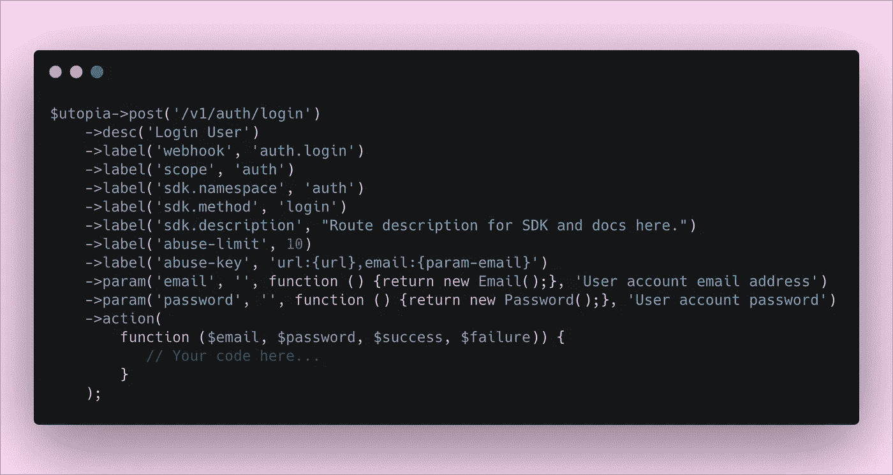

# 我们如何将我们的文档和 SDK 集成为编码过程中的一等公民

> 原文：<https://betterprogramming.pub/how-we-integrated-our-docs-and-sdks-as-first-class-citizens-of-our-coding-process-8e343def0e9>

## 构建一个伟大的开源项目不仅仅是编写伟大的代码并上传到 GitHub

由[路](https://unsplash.com/s/photos/github?utm_source=unsplash&utm_medium=referral&utm_content=creditCopyText)上[车头](https://unsplash.com/@headwayio?utm_source=unsplash&utm_medium=referral&utm_content=creditCopyText)拍摄

当我们第一次开始构建开源后端服务器 [Appwrite](https://appwrite.io) 时，我们的目标是让开发人员的生活更轻松。

不同项目甚至公司中的许多任务都是复杂的、重复的，并且可以很容易地抽象出来，这正是 Appwrite 试图做的事情。

Appwrite 为开发者提供了一套 REST APIs 和工具，有助于抽象复杂性，帮助开发者更快、更安全地构建应用。

但是构建一个伟大的开源项目不仅仅是写伟大的代码并把它推送到 GitHub。这是关于建立一个伟大的社区，拥有详细和最新的文档，并允许使用不同的工具和技术轻松集成到我们的 API 中。

为了让 Appwrite 能够对开发人员产生影响，我们希望确保我们将文档和 SDK 视为一等公民，而不是我们必须在开发生命周期的后期阶段解决的问题。

# 申报一切

Appwrite 后端使用声明性方法向我们的每个 API 路由添加新的标签和元数据。

这种方法迫使每个 Appwrite 开发人员定义路由用户输入、验证规则、方法描述、SDK 类名和 SDK 方法名(如图所示)。

我们的路线拥有我们需要的所有元数据。

我们不仅声明了关于路由的简单元数据，如它们的描述或 SDK 方法名，还声明了复杂的设置，如它们的速率限制阈值、访问控制权限，以及是否应该在用户帐户中审核对该路由的 HTTP 请求。

当查看我们的路线定义时，我们确切地知道它将在舞台上和后台做什么。

感谢我们定义新路线的声明性方法，我们能够确保我们需要的所有元数据都被正确地设置和使用。

使用声明性方法对我们的项目有很大的好处。它不仅使代码更容易理解，而且这些元数据还可以帮助我们自动化我们的工作过程。

# 自动化，自动化，自动化

为了确保我们的 SDK 和文档与我们的任何代码更新保持同步，我们使用 app 对象来获取所有路线并生成一个`open-api.json`文件。

由于我们的路由是非常声明性的，我们拥有了关于 API 的所有信息，内置于我们的代码中。

现在，我们有了一个描述我们整个 API 的`open-api.json`文件，我们可以使用它来生成我们的文档和 API，作为我们 CI 或开发生命周期的一部分。

# 现在我们可以试着改变现状

我们创建了一个让我们安心、拥有优秀文档和更少工作的过程，而不是事后才编写冗长的文档，或者有多个来回循环来确保开发人员更新他们的更改。

我们的 SDK 不断以五种不同的语言生成并自动推送到我们的 GitHub repos 上(我们还在不断获得更多)。

通常，这项工作需要由具有不同技术背景的多个开发人员来完成。感谢我们的声明式方法，这项工作是由我们谦逊而努力的 CLI 工具来完成的，而不是我们。

将我们的文档和 SDK 定义声明和视为我们编码过程的一部分有助于我们改变思维模式和过程。

我们节省了大量时间，我们不再忙于保持我们的生态系统同步，我们可以专注于对我们来说重要的事情，*让开发人员的生活更轻松。*