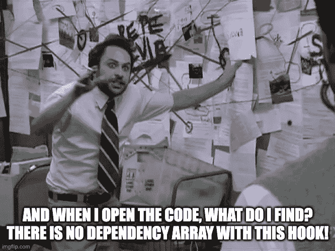
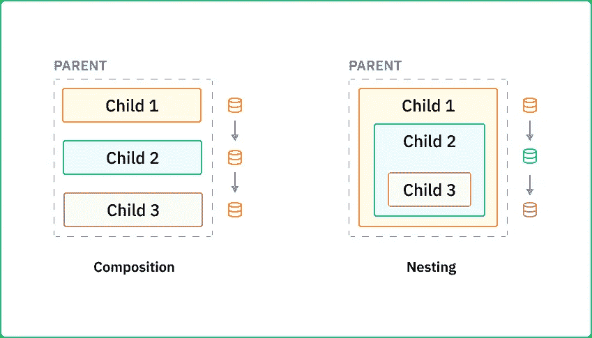

# 我们如何减少 React 代码库中的错误

> 原文：<https://betterprogramming.pub/how-we-reduced-bugs-in-our-react-code-base-9a7a979b4442>

## 了解 React 中的模式和反模式


照片由[表面](https://unsplash.com/@surface?utm_source=medium&utm_medium=referral)在[未溅上](https://unsplash.com?utm_source=medium&utm_medium=referral)

# 介绍

最近，在使用我们的大型 React 应用程序代码库时，我们遇到了三类错误，它们不是编译时或运行时错误，而是意外的代码行为。

*   组件不会因用户事件而更新。
*   组件根据用户事件进行部分更新。
*   组件意外呈现。

我们的第一本能当然是“在我们能找到邪恶的地方与它战斗。”


资料来源:imgflip.com

然而，即使在一连串的打印声明之后，错误仍然很难追踪。就在那时，我们意识到我们代码的某些部分可以被认为是反模式。因此，我们花了很多时间来理解和描述它们，以确保我们在未来避免这些错误。本文试图解释这些发现。

# React 中的模式和反模式

在本文中，如果满足以下条件，React 代码可以被视为一个好的模式:

*   该组件是可重用的。
*   代码更容易审查和调试。

请注意，如果我们编写了更多的代码行，或者我们(预期地)引入了一些额外的渲染来实现上述目标，代码仍然被认为是一种模式。


资料来源:giphy.com

## 为什么即使是有经验的开发人员也会陷入反模式的陷阱？

1.  React 代码在遵循模式时与遵循反模式时看起来惊人地相似。
2.  这种模式看起来如此明显，以至于被忽略了。

# 如何识别反模式？

## 提示#1:没有依赖数组的钩子

在 React 中，不同的代码片段通过依赖关系相互链接。这些相互依赖的代码片段共同将应用程序状态保持在所需的形式。因此，如果我们在 React 中编写一段没有依赖关系的代码，很有可能会导致 bug。

因此，使用`useState`、`useRef`等钩子时要小心。因为它们不接受依赖数组。



资料来源:imgflip.com

## 提示#2:复合嵌套

有两种排列 React 组件的机制:

1.  构成:所有的孩子都有相同的数据
2.  嵌套:每个孩子可以有不同的数据



作者图片

让我们想象一个场景，我们观察到“孩子 3”中有一个 bug

如果我们使用 composition 来安排组件，我们就不必查看“Child 1”和“Child 2”的代码，因为它们都是独立的。因此，调试的时间复杂度将是`O (1)`。

然而，如果我们使用嵌套来安排组件，我们将不得不检查“Child 3”之前的所有孩子，以找出错误的来源。在这种情况下，调试的时间复杂度将是`O (n)`，其中`n`是“孩子 3”之上的孩子的数量

因此，我们可以得出结论，嵌套经常比组合更难调试。

# 示例应用程序

现在，让我们考虑一个演示不同模式和反模式的应用程序。

## 应用程序的预期行为

当在左侧导航菜单中点击一篇文章时，它会在右侧打开。接下来是两个动作:

1.  **计算**:文章的总字数计算为`(num_chars(title) + num_chars(text)`并显示。
2.  **网络请求**:根据文章的总字数，通过网络请求获取表情符号并显示。随着字符数的增加，表情符号会从悲伤变成快乐。

## 构建应用程序

我们将通过四个步骤来了解构建这款应用的正确方法:

*   **不正确**:应用程序没有按预期运行——当选择一篇新文章时，不会触发计算或网络请求。
*   **部分正确**:应用程序工作正常，但选择新文章时会出现闪烁现象。
*   **正确但次优**:应用程序工作正常，没有 DOM 闪烁，但发出不必要的网络请求。
*   **正确和最佳**:应用程序工作正常，没有 DOM 闪烁和不必要的网络请求。

下面是这个应用程序的嵌入式沙盒。单击顶部导航栏中的相应选项，查看每种方法。在左侧导航菜单中点击一篇文章时，检查应用程序的执行情况。

## 代码结构

点击右下角的按钮可以打开上面的沙盒。

`src/pages`目录有映射到每个步骤的页面。在`src/pages`中每个页面的文件包含一个`ArticleContent`组件。讨论中的代码在这个`ArticleContent`组件中。要跟进，您可以检查沙箱中的相应文件或参考所附的代码片段。

现在让我们回顾一下上述四种方法中遵循的反模式和模式。

## 反模式#1:道具或上下文作为初始状态

在不正确的方法中，`props`或`context`被用作`useState`或`useRef`的初始值。在`Incorrect.tsx`的第 21 行，我们可以看到总的字符数已经被计算出来并存储为一个状态。

这种反模式是选择新文章时既不触发计算也不触发网络请求的原因。

## 反模式#2:破坏和重建

让我们通过使用“破坏并重新创建”反模式来弥补我们不正确的方法。

销毁一个功能组件是指销毁第一次函数调用时创建的所有钩子和状态。重新创建是指再次调用该函数，就好像它以前从未被调用过一样。

注意，父组件可以使用`key`属性来破坏组件，并在每次`key`改变时重新创建它。是的，你没看错——你可以在循环之外使用键。

具体来说，我们通过使用`key` prop 实现“销毁并重新创建”反模式，同时在`PartiallyCorrect.tsx`文件中呈现父组件`PartiallyCorrect`的子组件`ArticleContent`(第 65 行)。

该应用程序按预期运行，但当选择一篇新文章时会出现闪烁效果。因此，这种反模式会导致部分正确的输出。

## 模式 1:JSX 的内部状态

在这种“正确但次优”的方法中，我们将使用“重新呈现”，而不是使用“销毁并重新创建”反模式

重新呈现是指再次调用 react 功能组件，钩子在函数调用中保持不变。请注意，在“销毁并重新创建”中，所有的钩子首先被销毁，然后从头开始重新创建。

为了实现“重新渲染”，将串联使用`useEffect`和`useState`。可以将`useState`的初始值设置为`null`或`undefined`，一旦`useEffect`运行，将计算实际值并分配给它。在这个模式中，我们通过使用`useEffect`来避免`useState`中缺乏依赖数组的问题。

具体来说，请注意我们是如何将总字符数计算转移到`Suboptimal.tsx`中的 JSX(第 44 行)中的，并且我们使用`props`(第 33 行)作为`useEffect`(第 25 行)中的依赖项。

使用这种模式，避免了闪烁效果，但是每当道具改变时，网络请求获取表情符号。因此，即使字符数没有变化，也会发出不必要的请求来获取相同的表情符号。

## 模式 2:在 useMemo 中将 Props 作为依赖项

让我们这次做得既正确又最佳。这一切都始于反模式#1: `props`或`context`作为初始状态。

我们可以通过在`useMemo`中使用`props`作为依赖来解决这个问题。通过将总字符数计算转移到`Optimal.tsx`(第 22 行)中的`useMemo`钩子，我们能够阻止网络请求获取表情符号，除非总字符数已经改变。

# 结论

在本文中，我们讨论了使用`props`或`context`作为初始状态和‘销毁并重新创建’是反模式，而使用 JSX 中的内部状态和`props`作为`useMemo`中的依赖是好模式。我们还了解到，在使用没有依赖数组的钩子和嵌套来安排 React 组件时，我们应该小心。

```
**Want to Connect?**This article was written in collaboration with [Shyam Swaroop](https://medium.com/u/bb565db0c961?source=post_page-----9a7a979b4442--------------------------------), Co-Founder & CTO at Atri Labs.
```