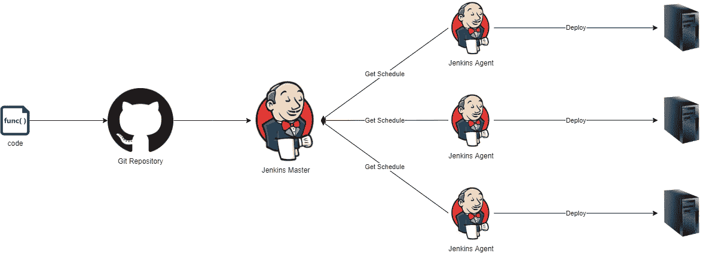
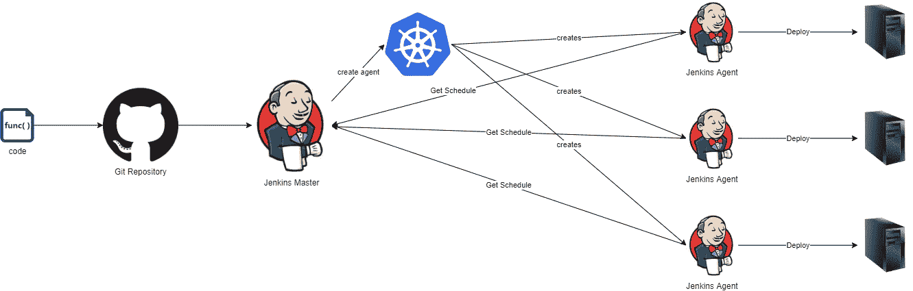
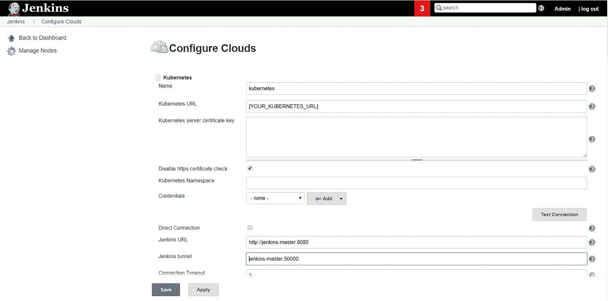
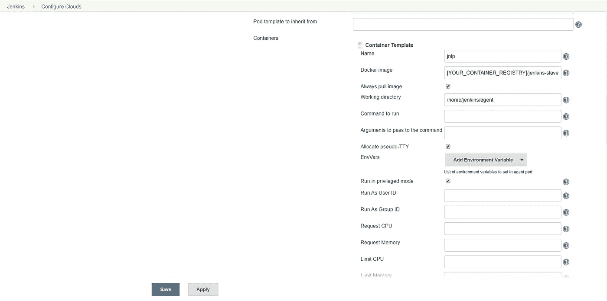
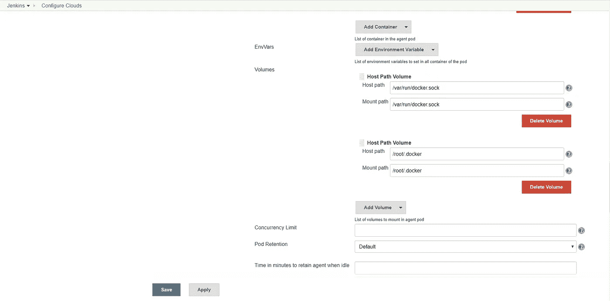
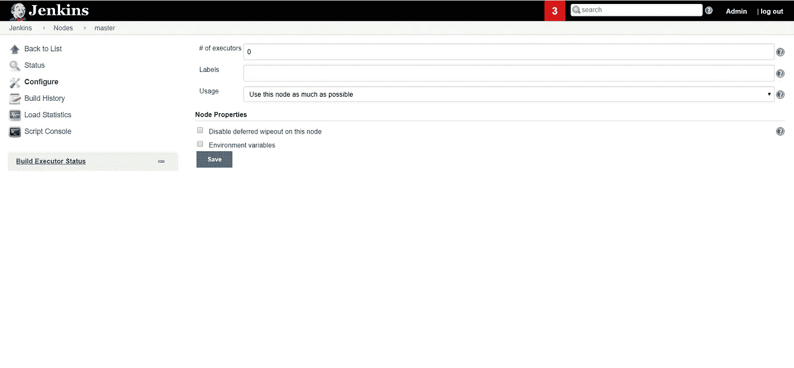
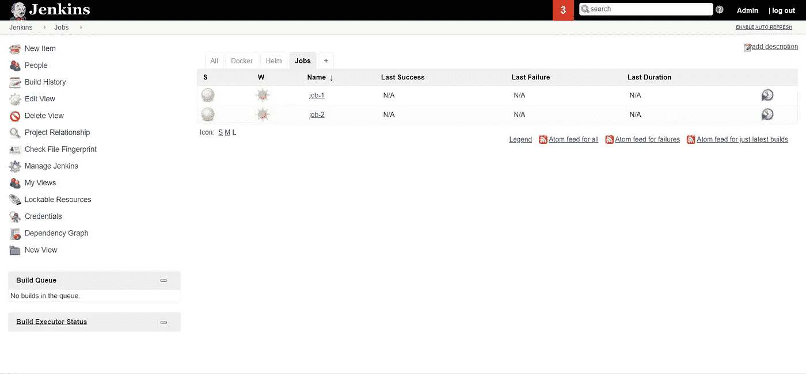
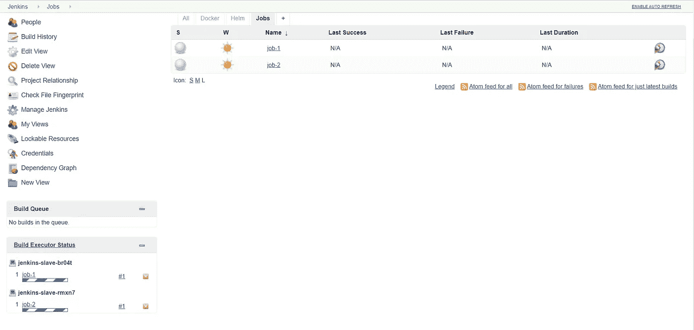
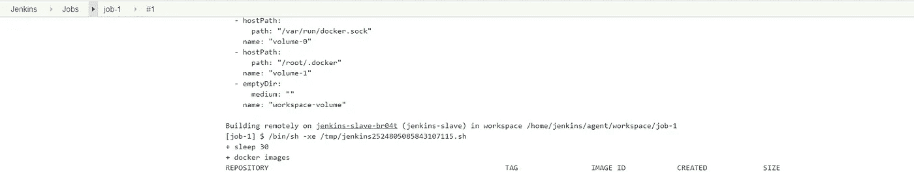

# 我们如何在不到一天的时间内爬上詹金斯

> 原文：<https://betterprogramming.pub/how-we-scaled-jenkins-in-less-than-a-day-ccbcada8e4a4>

## 使用 Kubernetes 扩展您的 Jenkins 代理

[布兰登·格林](https://unsplash.com/@brandgreen?utm_source=unsplash&utm_medium=referral&utm_content=creditCopyText)在 [Unsplash](https://unsplash.com/s/photos/growth?utm_source=unsplash&utm_medium=referral&utm_content=creditCopyText) 拍摄的照片

如果你还活着，并且是一名工程师，那么很可能你已经在使用 Jenkins 了——或者至少听说过它。

Jenkins 是市场上最受欢迎的开源持续集成和持续交付(CI/CD)工具。它受欢迎的原因？CloudBees 等组织的坚实支持，优秀的社区支持，数以千计的插件和庞大的开发人员基础，以及其设置和使用的简单性。

这允许组织将 Jenkins 与流行的版本控制工具如 Git、Subversion 和 Mercurial 联系起来；与 SonarQube 和 Fortify 等代码分析软件整合；运行 Maven 和 Gradle 构建；执行 JUnit 和 Selenium 测试；还有更多。

虽然这是一个强大的工具，但从 Jenkins 开始并不费力。您只需要一个 Java web 服务器，比如 Tomcat 和免费提供的`jenkins.war`文件，就万事大吉了。使用 Jenkins 有多种方式，现在我将讨论一些典型的模式

# 独立的 Jenkins 服务器

在这个设置中，有一个 Jenkins 服务器负责托管和构建所有作业，并使用出站 TCP 链接部署到远程服务器。这是最简单的配置，您不需要担心任何其他变量。

詹金斯独立

# 主代理配置

使用独立的 Jenkins 服务器有其缺点。

虽然您不必担心多个服务器和节点，但问题是您的服务器可能会因同时运行大量作业而过载。有一些方法可以通过增加执行者的数量来解决这个问题，但是你很快就会陷入一个性能极限。

为了克服这个问题，您可以将一些作业卸载到称为 Jenkins 代理的不同机器上。Jenkins 代理运行一个小程序，该程序与 Jenkins master 通信，以检查是否有任何作业可以运行。当 Jenkins 找到一个已调度的作业时，它会将构建传输到代理服务器。问题解决了？好吧，继续读下去。

Jenkins 主代理配置

# 可扩展的 Jenkins

让我们更进一步。您不需要静态服务器来卸载您的 Jenkins 工作，原因很简单——CI 是峰值。

您没有一天 24 小时、一周 7 天运行的构建，在服务器空闲期间，这只是浪费服务器资源。

如果你运行一个像 Kubernetes 这样的容器 orchestrator，你可以让 Jenkins 做更聪明的事情。这个想法很简单。Jenkins master 负责主机配置和向多个代理分发作业。然而，您不需要预先存在代理—它们可以在需要时动态创建。

它在很多方面让生活变得简单:

## **您不需要规划 Jenkins 服务器的容量**

因为您是在 Kubernetes 集群上的容器上运行，所以 Jenkins 可以在您的集群中扩展，直到它有可用的资源容量。由于多个应用程序共享一个 Kubernetes 集群，这就节省了资源——因为当您的构建运行时，所有的工作负载可能不会同时达到峰值。

当你像我们一样在云提供商，比如谷歌云平台上运行你的集群时，事情会变得更好。Google Kubernetes 引擎(GKE)不仅允许您水平扩展容器，还可以根据您的集群负载添加或删除集群的工作节点，这为您提供了近乎无限的扩展能力。

## **你可以并行运行你的构建**

你再也不用去规划执行者，去限制他们；相反，Jenkins 将启动一个代理实例，并在其中运行您的构建。问题解决了！

## **负载分布均匀**

Kubernetes 很好地管理负载，它将确保您的 Jenkins 代理在最好的可用服务器上运行，从而使您的构建更快、更高效。

## **自动愈合是可能的**

如果您构建或您的代理被破坏，您不再需要担心 Jenkins 将删除不健康的实例并构建一个新的实例。

这节省了大量的故障诊断时间，因为代理现在是可有可无的资源。如果一个代理不起作用，Jenkins 会要求 Kubernetes 删除它并创建另一个代理。简单！

可扩展的 Jenkins

# 我们是如何利用詹金斯的？

我们开始独立使用 Jenkins，它运行了六个月非常好。但是随着越来越多的团队使用这个工具和不断增加的负载，我们自然会遇到性能开销。

由于我们当时没有 Kubernetes，我们唯一的选择是要么选择通过服务器进行主代理配置，要么通过添加更多 CPU 和内存来垂直扩展服务器。我们选择了后者，因为它对我们来说更快更舒适。然而，我们意识到这不会持续很久，我们开始寻找替代方案。

# 我们如何解决这个问题

不知何故，时代在变，公司的 CTO 决定继续推进云战略。对我们有好处。我们决定将我们的 Jenkins 迁移到云中，并将其转移到我们已经构建并迁移了所有工具的 Kubernetes 集群。很简单，不是吗？让我们找出答案。

我们有两个选择:要么封装主文件并独立使用，要么使用 Kubernetes 构建一个可伸缩的 Jenkins。我们提出了以下架构:

詹金斯大师的一个复制品作为控制平面运行。Jenkins master 是所有用户登录并构建和管理其作业的地方

然后，当有人触发构建时，我们使用 Kubernetes 来增加 Jenkins 代理容器；在容器中运行作业；并且当成功时，移除容器。

让我们看看如何设置类似的配置。

## 建立詹金斯主码头工人形象

我们使用以下 Docker 文件创建了 Jenkins 主 Docker 映像。

构建 Docker 映像:

`docker build -t <your-docker-registry>/jenkins-master:0.0.1 .`

将 Docker 映像推送到您的 Docker 注册表:

`docker push <your-docker-registry>/jenkins-master:0.0.1`

主服务器的 docker 文件很简单，我们没有在其中安装任何软件，因为它不需要运行构建，只需要管理代理。您可以根据自己的需求定制 docker 文件。

## 引导 Jenkins 主实例

然后，我们使用 Kubernetes 清单文件启动 Jenkins 主实例，如下所示。

清单文件定义了以下内容:

*   默认名称空间中名为`jenkins`的服务帐户
*   集群角色绑定`jenkins-crb`，它将`jenkins`服务帐户绑定到`cluster-admin`集群角色。这将允许 Jenkins master 与 Kubernetes 集群进行交互和认证，并执行`cluster-admin`任务，如旋转和移除 pod。
*   持久卷声明`jenkins-pv-claim`，它将请求一个 30 GB 的卷来持久存储 Jenkins 数据
*   使用`jenkins`服务帐户和`jenkins-pv-claim`卷加速 Jenkins 主容器并公开端口`8080`(UI 端口)和`50000`(JNLP 端口)的部署
*   公开群集 IP 上的 Jenkins 主服务器的服务
*   在`jenkins.example.com`或您选择的任何 URL 上向客户端提供服务的入口资源

上面的配置使用入口让流量进入。您可以选择在负载平衡器或`NodePort`上公开 Jenkins。您需要根据您的需求更改这些值，然后使用`kubectl apply -f <manifest_file>`应用清单文件。从您的浏览器访问`jenkins.example.com`(或您定义的 URL)上的 Jenkins。

## 构建代理 Docker 映像

我们决定为 Jenkins 代理使用不同的图像是有充分理由的。代理 Docker 图像有不同的用途。这个想法是，它不负责管理你的工作，而是建立你的工作。因此，我们必须确保它已经安装了所有的需求。

由于我们构建的应用程序是微服务——在容器上运行——我们需要在 Jenkins 从属容器中包含 Docker 运行时，这样我们就可以在代理中运行 Docker 构建。我们使用的 Dockerfile 文件类似于以下内容:

构建 Docker 映像:

`docker build -t <your-docker-registry>/jenkins-slave .`

将 Docker 映像推送到您的 Docker 注册表:

`docker push <your-docker-registry>/jenkins-slave`

## 在 Jenkins 上配置 Kubernetes 集群

既然我们已经准备好并推送了代理 Docker 映像，下一步就是设置 Jenkins 使用 Kubernetes 在触发构建时旋转代理容器的副本。我们遵循以下步骤:

通过运行`kubectl cluster-info | grep master`获得您的 Kubernetes API 服务器的 URL。

转到 Jenkins 云设置(`[your_jenkins_url]/configureClouds/`，并按照以下步骤操作:

应用并保存配置。

## 禁用主执行器

为了确保主服务器只是作为一个控制平面，而不是在其内部构建作业，我们必须将主服务器上的执行器数量设置为 0。

对于那转到`[your_jenkins_url]/computer/(master)/configure`，设置执行者为 0，并保存。

## 测试配置

创建一个名为`job-1`的自由作业和一个 execute-shell 构建步骤，内容如下:

创建一个与`job-1`相同的`job-2`。

一起运行这两个作业，您应该注意到这两个作业应该在 kubernetes 上运行一个新的 pod 并并行运行。

检查`job-1`和`job-2`的控制台输出，它们应该如下所示:

# 进一步阅读

感谢您的阅读。我希望你喜欢这篇文章。如果您有兴趣了解更多信息，请查看以下文章，您可能会感兴趣:

 [## 如何用 Sonatype Nexus 掌舵

### 使用 Sonatype Nexus 作为 CI/CD 的导航库

medium.com](https://medium.com/better-programming/how-to-helm-with-sonatype-nexus-c49c98324a19)  [## 揭开 Kubernetes 物件的神秘面纱

### 理解什么、为什么和如何

medium.com](https://medium.com/better-programming/demystifying-kubernetes-objects-understanding-the-what-why-and-how-18b42c9ca9c2)