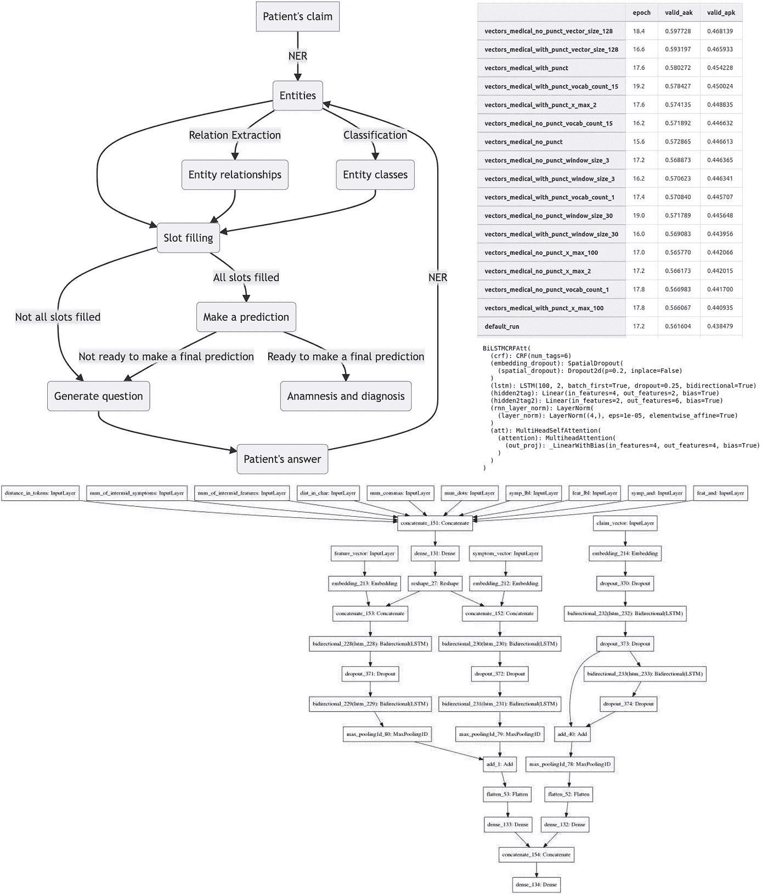
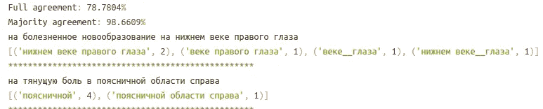
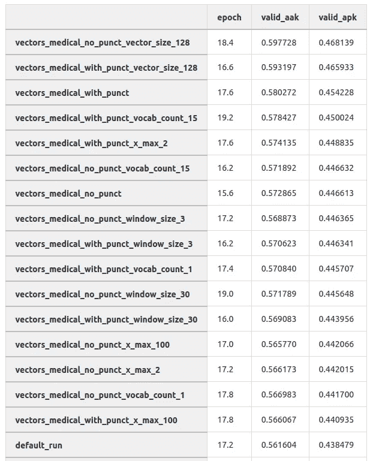
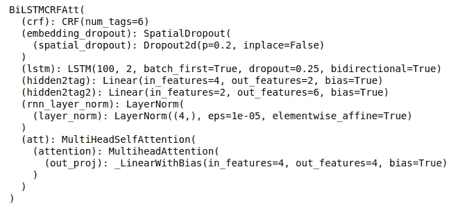
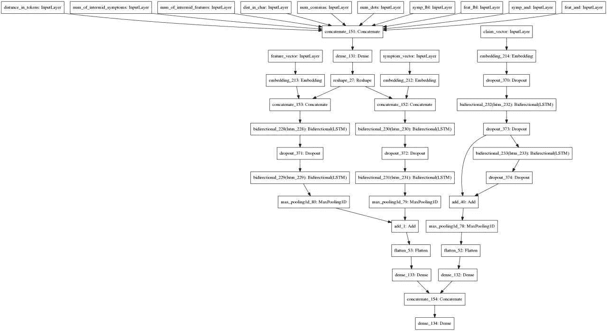

# 我们如何试图创造一个医疗聊天机器人

> 原文：<https://betterprogramming.pub/how-we-tried-to-create-a-medical-chatbot-b500b44be10f>

## 人工智能预测诊断

## 一个从未被批准的项目的故事



作者制作的拼贴画

近年来，远程医疗市场(远程医疗服务)和医疗技术总体上一直在滚雪球，冠状病毒疫情只是加速了它的发展。这种技术很受欢迎，因为它们相对便宜，无论患者住在哪里都可以获得，并且允许患者选择自己的医生。

然而，在实施和提供这些技术方面存在许多问题，例如立法改革缓慢，以及在获取、处理和存储机密数据方面存在困难。目前，在俄罗斯，医生不与病人面对面就不允许做出诊断。与此同时，根据卫生部的一项命令，到 2030 年，一半的医疗咨询应该在网上进行。

现在在线咨询在医疗技术领域非常流行。有没有医生都可以做。自然，严重的问题应该由医生来解决，但人工智能仍然可以处理许多简单的任务。这种解决方案已经在俄罗斯实施:机器人帮助预约，在这些预约之前进行调查，分析医患对话，并将音频记录转换为文本。

在 MTS AI，我们已经开发了我们的医疗聊天机器人大约两年了，但是……它没有成功。想法很简单:在第一次预约之前，病人与聊天机器人交谈，聊天机器人进行初步调查。输出是医生的记忆，病人知道他应该去看哪个专家。对医生来说，好处是他不必向每个病人问同样的问题，而只需要核实病史和假定的诊断。这减少了初次预约的时间长度，加快了病人的流动。此外，患者并不总是知道该去看哪个医生，聊天机器人会帮助他导航。当然，如果聊天机器人可以显示潜在的诊断结果，那就更好了，但这是有风险的，可能违反法律，所以我们决定只给出建议。

该项目结果非常复杂，其潜在盈利能力尚不清楚，因此在 2020 年底被叫停。但是我们在工作的时候学到了很多，我想分享一下。

我已经在这个项目的 NLP 部分担任了一年的技术领导，我将谈谈这个问题。

在这篇文章中，我将首先描述项目的整体工作，然后我将谈论数据收集和标记。众所周知，项目的成功直接取决于数据的质量。这就是为什么不仅要组织数据收集和标签，还要组织标签验证的原因。在那之后，我们将看看已经使用了哪些机器学习模型——这是有趣的部分，对吗？那我就说说哪些想法没有奏效。最后，我会解释我们是如何从这个项目中获益的，尽管它并没有成功。

额外通知:该项目最初是在俄罗斯(原文可以在这里找到)，但我用英语展示了这些例子，这样会更容易理解。

# 高级技术概述

开发一个高质量的聊天机器人是一项艰巨的任务，我们的项目也不例外:NLP 和推荐系统领域的数据科学家、程序员、经理和其他专家都参与了这项工作。

首先，让我们看看我们的聊天机器人应该如何工作。下面是一个简化的方案:


作者提出的方案

如上所述，该项目执行两项任务:编辑病历和预测诊断(即使我们不会向患者展示)。为了正确诊断，我们需要详细描述这个人的健康状况。例如，如果一个病人抱怨“喉咙痛”，“干咳”，并报告其他几个特定的症状，我们可以说他可能患有“急性咽炎”但是从原始文本中提取这些症状是非常困难或者不可能的，并且询问人们所有这些症状会花费很长时间，因为他们会厌倦回答。因此，我们决定从文本中提取独立的实体，并将它们组合成更复杂的症状。

最终，我们团队想出了以下方案。我们决定让患者向聊天机器人写非结构化的文本，由我们从文本中提取信息并将其转化为结构化的形式。这就是槽填充通常的用途。

我们有一个配置文件，其中列出了实体以及它们之间的链接。我们区分了两组:实体本身和它们的属性。例如，实体可以是“疼痛”、“流鼻涕”或“肿胀”。属性可以显示疼痛在什么情况下发生(条件)，在哪里感觉到疼痛(定位)，何时发生(一天中的时间)等。并且已经指定了实体可以具有的属性。为什么这是必要的？并不是所有的组合都有意义(例如，你不需要描述在鼻子里感觉到流鼻涕——它不会发生在其他任何地方)，有些组合对诊断并不重要。

此外，我们有大多数属性的类。例如，它会伤害你的胳膊、腿、左肋部、耳朵和其他东西。症状会在坐着、弯腰、呼吸等时候出现。此外，人们可能会使用小后缀，俚语和不同的替代拼法。所有这些都需要建立分类模型来预测特定的类别。

让我们看一个例子:

一个病人给我们写了一份抱怨，比如:“我从楼梯上摔了下来，现在我的腿和胳膊疼得厉害，早上我的脸颊也肿了。”注意:此处和此后的投诉都是虚构的。


作者提出的方案

首先，我们使用 NER 模型提取实体。我们需要提取很多，所以我们使用各种方法，从简单的基于规则的解析和正则表达式到神经网络。

接下来，我们使用关系提取模型来寻找相关的实体。我们需要弄清楚肿胀具体发生在早上，而且只有腿和胳膊疼。为此，我们通过模型传递所有实体和属性以及额外功能对，并进行预测。此外，我们设置过滤来丢弃不可能的对。

下一步是将属性分成类(如上所述)。这是每个术语的简单分类模型。

但这还不是全部:抱怨可能是“我的腿疼，但我的胳膊不疼”。在这种情况下，我们需要找到否定，并正确地分配它。

所有这些都是第一步，但却是最困难的一步。接下来，我们分析槽填充。例如，我们不知道病人的手臂在什么情况下会疼(或者可能总是疼)，所以我们必须问他。

我们根据预先编写的模板生成问题，并就所有项目向该人提问。然后，病人可以选择一个建议的选项或写一个自由风格的答案。

这种询问一直持续到所识别的实体的所有槽都被填充(或者被标记为缺失/未知)。然后，我们试图预测诊断，并制定新的问题来澄清它。这是使用推荐系统完成的，但我不会详细介绍，因为我没有这样做。

当达到收敛标准时，对话结束，我们给出一个回忆和一个试探性的诊断。

# 关键是数据

在我们的项目中，处理数据非常具有挑战性。总的来说，俄语文本比英语文本少。但这只是麻烦的一半。我们需要医学领域的数据。不幸的是，俄语中几乎没有这种类型的数据集。我们能够从公开来源(比如论坛)提取几百万条文本，但是有几个问题。其中包括:

*   来自论坛的文本的风格和内容与人们写给聊天机器人的非常不同；
*   数据尚未标记；
*   没有关于俄语医学文本的预先训练的 NLP 模型。最接近的要么是英语的生物伯特，要么是俄语的伯特。但第一种情况，语言不符合，第二种情况，领域不符合；

因此，我们不得不:

*   自己给课文贴标签；
*   考虑到我们现有的文本和我们将在生产中得到的文本之间的领域差异；
*   从零开始训练模型或根据我们自己的数据进行预训练；

数据标注分几个阶段完成:

在开始时，我们手动或者使用简单的基于规则的解析器和正则表达式来完成(我在这个阶段加入了这个项目)。当我试图在这些标签上训练 NER 模型时，我得到了预期的结果——该模型往往是错误的，在许多情况下，它对带有错误标签的样本做出了正确的预测。

过了一段时间，我们决定最好贴上正确的标签。如果我们想标记一些简单的东西(如地名或人名)，我们就不必担心准备说明，因为每个人都知道要标记什么。但我们需要与医疗机构合作，所以第一步是制定详细的说明。

这比我们最初预期的要困难得多。我们尝试了不同的方法来涵盖大多数情况:例如，我们分别标记文本，然后聚在一起讨论有争议的观点。因此，说明书包含以下信息:

*   实体、其描述及其回答的问题；
*   案例举例；
*   误导案例的例子，看似相关但不相关的词语的例子；

我已经在上面写了，我们知道我们的文本和那些能在产品中找到我们的文本之间的区别。但那时，我们已经有了一个聊天机器人的工作版本(尽管几乎没有 ML 部分)，所以我们可以查看日志，找出人们写了什么。坦率地说，结果令人沮丧:有时人们用一两个词非常简要地描述他们的疾病；有时他们会列出几乎所有的疾病，不仅仅是现在困扰他们的疾病；最后，许多消息不包含任何关于健康问题的内容——人们写道他们很好，开玩笑(例如，抱怨他们的“灵魂受伤”)或只是写些废话。

基于这一切，我们决定采取以下措施:

*   取短短语(最多 50 个单词)进行标注和模型训练；
*   添加足够的没有实体/类的文本，降低误报比例；
*   添加增强功能；

随着时间的推移，带标签的文本越来越多，但我们很快发现，其质量还有待提高。关键是对标签几乎没有任何控制:每个文本都由一个人来标记，并且标签的质量没有得到验证。但我不能只是说，“让我们做得更好，”我必须表明存在问题，并提出解决方案。

当时，我们有大约 15000 个带标签的文本。其中，我发现了大约 3000 个重复的——相同或几乎相同的文本，它们被标记了多次，因为当时我们没有对重复进行初步检查。所以对这些标签的分析揭示了几个问题:

*   不同的人对同一篇文章中的 ner 有不同的标记:有些人标记了介词，有些人没有；有的贴上了“多余”的字样，有的没有，等等；
*   有时，同一实体在文本中出现多次。一些贴标签者强调所有这样的实体，一些只强调第一个；
*   最后，在文本中，一个标注者只标注了一个实体，另一个标注者只标注了另一个实体。

这一分析足以改变贴标过程。最后，作为几次迭代的结果，我们有了下面的过程:

*   首先，我们为标签收集数据。这最初是通过简单的关键词搜索来完成的，但后来我们实现了某种简化版本的主动学习:我们收集一个最小的数据集，训练模型，然后进行预测，计算熵，并选择熵最大的文本进行标记。这并不是直接使用的，而是结合了其他一些标准。这非常有效；
*   这些文本和我们准备的说明书一起交给了贴标机。他们在定制的文档中标注了数据。每篇课文有 5 个人在做；
*   Telegram 中有一个特殊的聊天室，贴标签者可以向“控制者”(更了解如何做的人)提问，以澄清有争议的问题。这大大提高了质量。有一次，为了一个实验，我们试图取消这个阶段，结果这个迭代结果比平时差很多；
*   有一段时间，结果标签由验证器预先检查。他们会随机抽取 10%的标注文本并检查质量；如果高于 90%，标签会发送给我们；如果不是，则发送数据进行重新标记；
*   我们使用了大量的后处理程序——它修复了许多问题，这些问题自动处理比让人跟踪更容易。它删除了多余的介词和空格，垃圾词，等等。随着我们在标签中发现新的微小差异，这个脚本得到了迭代改进。这也导致了质量的显著提高；
*   然后，我们运行我们编写的脚本来分析标签的质量。它显示了大量信息:完全和部分标签匹配的文本比例，带标签的文本块(对于 NER 任务)，以及不匹配和匹配文本的例子。顺便说一句，查看带有相同标签的文本的例子是很方便的，因为有时所有的标签员都会犯同样的错误。这是一个信号，我们应该更新他们的指令。对于没有标注者突出显示任何内容的文本也是如此；
*   如果全标签匹配的文本比例高于 90%，我们接受该批文本，否则，文本被退回；



截图来自作者代码

我们有许多加快标注的想法，但通常是在标注者的时间、数据科学家的时间和模型质量之间进行权衡。我们来看一些建议。

一个想法如下:假设在当前的迭代中有 1000 个文本被标记。对标签的分析表明，只有 70%的文本具有完全的交叉标签匹配。因此，我们建议，在这种情况下，不是所有的 1000 个文本都要重新标记，而只是 300 个有差异的文本。这种方法，当然，大大加快了进程，但代价是质量略有下降，因为在 700 个匹配标签的文本中，肯定会有所有标签都是错误的文本。然后，要么数据科学家必须浏览所有文本并检查它们的错误，要么我们接受模型的恶化，因为标签的恶化。

另一个想法:我们有很多实体(超过 50 个)，在每个文本中标注所有实体就太好了；在这种情况下，可以一次为所有实体训练一个模型。不幸的是，这是不可能的。首先，它很耗时:有些实体频繁出现(超过一半的时间)，有些很少见(少于 10%甚至 5%)。如果你要求人们标注所有文本中的所有实体，他们通常不会标注任何内容。更重要的是，如果你让某人在一篇文章中标注 50 个实体，他们会忘记其中的许多。

结果，我们只是给贴标签的人发短信，让他们给一个实体贴很长时间的标签。后来，我们尝试用同样的文本来标记其他实体，或者让他们在文本中标记五个特定的实体。

甚至所有这些都经常缺乏。例如，有一次，我们发现在短语“我的胳膊疼”中，NER 本地化模型没有找到单词“胳膊”。结果发现，在当时标注的四千篇课文中，只有一篇有“arm”这个词。

此外，在文本中经常有很容易出错的复杂情况。让我给你举个例子:“患有非常严重的头痛，有时甚至会痛得眼前发黑。”“头痛”这个词就是“疼痛”这个实体。但结尾的“疼痛”一词并不是实体“疼痛”——而是眼睛里的黑暗发生的状况。

# 关于机器学习的更多信息

## 文本处理

文本处理给我们带来了很多痛苦。

上面我已经描述了数据标签标准化的后处理。我们在实体提取模型之后使用了类似的后处理。此外，我们有自己的缩写解码、基于业务规则的预测后处理等等。

文本标记化值得特别关注。记号化的方法很多，很难说哪种最好。最初，我们使用 spaCy tokenizer(因为 spaCy 在项目中被非常积极地使用)，切换到其他 tokenizer 将意味着重写项目的许多部分，所以我们没有替换它。但是经常需要手动调整它，所以它不会破坏我们的文本。此类代码的一个示例:

```
from spacy.tokenizer import Tokenizer
from spacy.util import compile_infix_regex, compile_suffix_regex, compile_prefix_regexdef custom_tokenizer(nlp):
    """Creates custom tokenizer for spacy"""
    suf = list(nlp.Defaults.suffixes)  # Default suffixes# remove suffixes, so that spacy doesn't split things like '140мм рт ст'
    del suf[75]
    suffixes = compile_suffix_regex(tuple(suf))# remove №
    inf = list(nlp.Defaults.infixes)
    inf[2] = inf[2].replace('\\u2116', '')
    infix_re = compile_infix_regex(inf)pre = list(nlp.Defaults.prefixes)
    pre[-1] = pre[-1].replace('\\u2116', '')
    pre_compiled = compile_prefix_regex(pre)
    return Tokenizer(nlp.vocab,
                     prefix_search=pre_compiled.search,
                     suffix_search=suffixes.search,
                     infix_finditer=infix_re.finditer,
                     token_match=nlp.tokenizer.token_match,
                     rules=nlp.Defaults.tokenizer_exceptions)
```

## 嵌入

在 NLP 中，成功的关键之一是使用良好的预训练模型，或者至少是预训练嵌入。

正如我在上面所写的，在俄罗斯医学文本上没有预先训练的 NLP 模型，所以我们不得不寻找其他方法。

首先，我只是在维基百科上接受了预先训练的公共嵌入`fasttext`。他们工作得很好，但我想要更好的东西。所以我拿起我们现有的所有医学文本，开始训练它们的嵌入——`word2vec`、`glove`和`fasttext`。`fasttext`嵌入被证明是最好的(这并不奇怪)，超参数的选择也发挥了重要作用。



截图来自作者代码

在此表中，您可以看到在不同嵌入上训练诊断分类模型的结果。这是一个对投诉全文的诊断进行直接预测的实验。我们没有使用这种方法，但尽管如此，我们可以看到，选择嵌入的超参数可以显著提高模型的质量。

## NER 模型

实体提取开始时很简单:一开始，我们使用正则表达式解析器来搜索关键字。我想指出的是，这种方法一直被用于简单的实体，直到最后；我们可以通过关键词轻松提取实体，因此没有必要花费资源来标记它们。

下一步是使用 spaCy 的 NER 模型。也就是说，我们要么从头开始训练模型，要么使用 spacy_ru。在那个时候，使用自己编写的 python 脚本来训练模型更加方便，但在新版本中，只需在命令行中完成这一点就容易得多。最后，我们尝试将训练空间模型与 EntityRuler 相结合，即添加规则或仅通过关键字搜索的能力，但这不是很有帮助。

当我们积累了更多的标签后，我们转向神经网络。快速文本向量上的 BiLSTM 工作良好。我们尝试用建筑做实验，例如增加注意力，但是没有太大的改善。最后，我们只是调整了模型的架构和超参数，以适应不同的实体。



截图来自作者代码

## 分类

有了分类，一切都变得简单明了:模型将非常短的文本作为输入——这正是 NER 模型所预测的。在这方面训练任何复杂的模型都没有意义，所以我们只是使用旧的、经过验证的方法——使用 TF-IDF 对字母组合(字符)和单词组合(`word-grams`)进行矢量化，并使用逻辑回归进行预测。

使用来自`sklearn`的管道很方便，它看起来像这样:

```
from sklearn.pipeline import FeatureUnion
from sklearn.feature_extraction.text import TfidfVectorizer
from sklearn.pipeline import Pipeline
from sklearn.linear_model import LogisticRegressioncombined_features = FeatureUnion([('tfidf', TfidfVectorizer(ngram_range=(1, 3))),
                                  ('tfidf_char', TfidfVectorizer(ngram_range=(1, 3),
                                                                 analyzer='char'))])
pipeline = Pipeline([('features', combined_features),
                     ('clf', LogisticRegression(class_weight='balanced',
                                                solver='lbfgs',
                                                n_jobs=10,
                                                multi_class='auto'))])
```

## 关系抽取

寻找实体之间的关系是一个相当大的挑战。有时相关的实体在文本中紧挨着；有时，他们离得很远；有时，文本中有一对一的关系；有时候，多对多的关系；此外，并不是所有的关系组合都是可能的。

所有这些都给训练模型带来了挑战，因为不经意组装的数据集很容易导致过度拟合和许多假阳性。我们尝试了许多模型，例如，我们从提取 ELMo 嵌入和 MLP 开始，但是这种方法运行缓慢并且质量不高。

经过多次迭代，我们提出了这种方法:我们提取一个句子和从中提取的实体，对其进行矢量化，为每对实体和属性提取额外的属性，并在此架构中使用它:



截图来自作者代码

## 增大

增强功能在提高模型质量方面发挥了相当重要的作用。事实是，总是没有足够的标签，这已经成为我们的主要问题之一。例如，本地化实体(回想一下，这就是问题所在——leg、arm 等等)有超过 150 个类，这意味着两个 NER 模型都需要捕捉这样的单词，分类模型需要正确地识别它们的类，关系提取模型需要准确地找到到这样的术语的链接。其他实体的班级人数少得多，但仍有类似的困难。如果我们随机标注文本，有很大概率不会遇到很多类/词。并且手动搜索所有类别是困难的。为抽取模型手动收集具有所有单词对的文本的尝试注定会失败。

我们开始使用增强，大多数是基于规则的，而不是一些聪明的变种。一种标准的文本扩充方法是用同义词或具有相似嵌入的单词替换单词。不幸的是，这在我们的案例中并不奏效。

假设有一句话，“我的胳膊疼。”如果我们只是试图找到一个与“疼痛”紧密相关的同义词或单词，我们可能会得到一些合适的东西，比如“疼痛”，或者我们可能会得到，比如，“不适”，“疼痛”——这些已经是其他实体了。此外，这种替换可能会破坏拼写。

一个有效的方法是:

*   再次以原始句子为例，例如“我的手臂疼痛”,通过简单地将“手臂”替换为其他本地化内容来生成新的句子。我们必须记住使用正确的词形变化；
*   此外，我们可以改变“疼痛”实体中的单词，得到类似“我胳膊疼”或“我胳膊疼”的东西——同样，我们必须检查单词的形式；
*   此外，我们还可以添加属性，得到“我手剧痛”、“我早上手疼”等很多东西。改变标签本身也很重要；
*   最后，我们可以用别的东西代替实体“疼痛”，得到“我胳膊疼”，“我胳膊肿了”，也改变标签；

这种方法可以用于 NER 数据集和分类提取数据集。

所有这些听起来都太好了——好像这些标签并不真的需要。事实上，它好得令人难以置信。这种方法导致了两个问题:我们不知道所有可能的单词选项，模型学习模式太快。因此，我们得到了野生过度拟合和许多假阳性。

为了解决这种情况，我们必须随机化增强，向生成的短语中添加更多的垃圾词(而不是实体)，并确保在训练数据集中，文本的重要部分是真实的，而不是生成的。这种方法被证明是有效的。

## 其他技术细节

我将描述一些我发现非常有趣的其他技术要点。

我们有相当多的遗留脚本，我们保留了其中的大部分，出于需要，我们重写了一些，还有一些是为了方便。例如，不同的分类/NER 模型在不同的脚本中编写，导入到另一个脚本中，并在那里使用。这工作得很好，但是当添加/修改模型时，您将不得不更改导入并对代码进行其他更改，这并不总是一件好事。所以我重写了这个，结果是模型设置和类路径被存储在 YAML 配置中。因此，如果我们正在训练一个新版本的模型或者添加一个新的模型，我们不需要改变底层代码，只需要改变配置，如果必要的话，添加一个包含新模型代码的脚本。

```
single_entities_models:localization:
    model_name: pytorch_ner.PytorchNerWrapper
    params:
      path: localization.pth
      ner_name: localization
      idx2label_path: idx2label.json
      config_path: config.json
    preprocessing: Trueproductivity:
    model_name: pytorch_ner.PytorchNerWrapper
    params:
      path: productivity.pth
      ner_name: productivity
      idx2label_path: productivity_pytorch_220920/idx2label.json
      config_path: productivity_pytorch_220920/config.json
    preprocessing: True
```

我们建立了一个基本的 ci/cd，尽管它更多的是一个风格检查。

在某个时候，我们决定我们需要或多或少的清晰标准来决定是否推出新版本的模型。为此，我们(数据科学家)收集并标记了我们自己的测试数据集，以检查模型的质量。它包含带有实体、类和实体间链接的完整标签的文本。由于这一过程的劳动密集型性质，只有几百个例子。当我们有一个新版本的模型时，我们会在这个数据集上运行它，看看质量有多大变化，同时注意假阳性和假阴性。只有当新模型改进了所有的指标，它才被接受。同时，这使我们能够向我们的经理报告改进模型的进展。

该项目的挑战之一是我们有如此多的模型——我们必须提取 50 多个实体，找到它们之间的联系，对它们进行分类，等等。结果是模型的总规模很大，项目速度很慢。例如，有一段时间，我们根本无法在小型服务器上运行它，因为没有足够的内存。速度也很关键:用户必须快速得到响应。我们通过综合措施解决了这些困难:

*   简单地优化代码(在遗留代码中，同一个模型被多次初始化或低效使用的情况并不少见)。
*   尽可能使用规则模型。
*   如果标签允许，在多个实体上训练一个模型。

这也意味着我们不能在一个项目中塞进十几个 BERTs，那会超出所有可能的限制。

## 那些不起作用的想法

我们有很多想法，但要么没有成功，要么因为很多原因没有尝试。我将列举其中一些。

我们真的想为所有实体训练一个模型。理想情况下，我们希望构建一个复杂的架构，并同时为 NER 和关系提取(如果可能的话，也为分类)训练模型。不幸的是，这受到标签可用性的限制，但我们没有办法为所有实体标记足够大的数据集。然而，我们确实设法尝试了 SpERT，但是结果不够好，无法在项目中实现它。

我们尝试过词汇化，但最终放弃了这个想法。我们测试了不同的工具:`spacy`、`pymorphy2`、`natasha`、`rnnmorph`和其他工具；pymorphy2 是我们数据中最快最好的一个。但是词汇化的使用并没有提高我们模型的质量。此外，许多医学术语没有被 lemmatizers 很好地处理。最后，使用 lemmatizers 明显降低了系统的响应速度，所以我们认为没有必要使用它们。

这个想法是尝试使用拼写检查，因为许多人写错了。我们的团队测试了 Jamspell 和`pyenchant`，但是遗憾的是，它们经常破坏文本，并大大降低了项目的速度。

我们还试图将训练好的模型转换成其他格式以加快推理速度，但事实证明，CRF 层不可转换为`onnx`，如果你在没有它的情况下训练 NER 模型，质量会明显下降。

# 项目没有成功的原因

如本文开头所述，该项目已经停止。这个决定是由于我们无法控制的原因而做出的。发生这种情况的部分原因是这个项目运作得不够好。有两组原因:技术的和组织的。然而，它们往往是相互关联的。

## 技术问题

我已经写了很多关于处理数据的文章，我将重复一遍:给数据加标签既复杂又耗时。为了提高模型的质量并涵盖不同的情况，在它上面花费更多的时间和精力是值得的。

我们无法有效地使用聊天机器人日志数据，因为数据非常少。我们应该做两件事之一:要么更积极地使用聊天机器人并分析日志，要么将项目开发集中在收到最多投诉的领域。

## 组织问题

*   大多数时候，我们要么没有路线图，要么它是非常顶级的。因此，不太清楚必须做些什么才能使项目成功；
*   正因为如此，产品经理不时会提出新的想法，导致功能的变化、可检索实体和类列表的变化以及工作逻辑的变化。这些想法经常是考虑不周的，我们必须自己调整它们；
*   此外，我们对模型的质量没有明确的标准。我们花费了大量的时间和精力来改进我们的模型，但是我们不知道什么样的模型质量是足够的。我们甚至自己组装了一个测试数据集来检查我们模型的质量；
*   此外，我们没有任何指标来评估对话的质量。也就是说，我们可以用通常的机器学习指标来衡量模型的质量，但是我们没有办法评估我们的对话系统作为一个整体是否工作良好；
*   我们没有测试。这个项目非常复杂；除了 NLP 部分，还有很大一部分负责对话本身，一个令人印象深刻的后端组件，等等。我们发现了一些错误，并不时地修复它们，但如果我们有一个 QA 团队，情况会好得多。公平地说，我们很难要求 QA 从医学的角度来测试这个项目，因为这需要领域知识，但是除此之外，还有很多东西要测试；

在项目接近尾声时，向我们公布了三个业务指标:

*   此人同意聊天机器人的建议；
*   该人同意并预约；
*   那人答应了，约好了，进来预约。

问题是我们只能影响第一个指标；第二个和第三个指标不依赖于聊天机器人的质量。

结果，这个项目非常复杂，对它在真实条件下的效果以及它能带来多少钱没有清晰的认识。结果 2020 年底被上面的一个决定冻结了。

# 这个项目有什么好处吗？

嗯，结果怎么样？这一切似乎都是徒劳的:许多资源被消耗，项目被停止。但是尽管如此，当被问及它是否有任何好处时，我会说有。原因如下:

*   我们尝试了许多主动学习和标签质量分析的方法，其中一些方法被用于未来的项目；
*   我们积累了构建不同文本处理模型的经验——NER、分类和关系提取。这也用于其他项目；
*   在训练模型时，我们在 PyTorch lightning 上开发了两条管道——这些管道可以在未来再次使用；

该项目被冻结，但将来可能会恢复。

这就是这个项目的全部内容。我希望它是有趣的和有价值的。:)

> 你可以在我的个人[博客](https://andlukyane.com/blog/)中阅读原[博文](https://andlukyane.com/blog/medical-chat-bot)和我的其他博文。