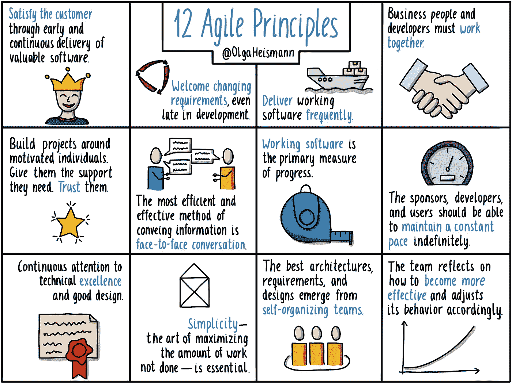

# 我们如何使用 Scrum

> 原文：<https://betterprogramming.pub/how-we-work-with-scrum-ce46356879d2>

## 了解它是如何以正确的方式完成的，以及最终会发生什么样的大事

马文·迈耶在 [Unsplash](https://unsplash.com/s/photos/developers-workshop?utm_source=unsplash&utm_medium=referral&utm_content=creditCopyText) 上的照片

“Scrum 是一种古老的工作方式，旨在解决另一个时代的问题。持续部署的组织不需要它。代码没有版本。冲刺没有意义。你们是仪式失去意义的邪教成员”。

[一位经验丰富的工程师发的这条推文](https://twitter.com/shaiyallin/status/1529881787672969227)，让我分享了 Scrum 如何让我们的团队比我过去 16 年合作过的任何其他团队都更加成功。

我在 2011 年与 Scrum 合作，然后在 2018 年与 dailies 合作。这两次都不是很好的经历——没有人理解我们为什么要这么做，或者这样做有什么好处，感觉就像我们在日常工作中向经理汇报进展，这给日常工作增加了很多压力。

在过去的一年半时间里，我一直在和我们的团队一起练习，学习如何以正确的方式完成，以及结果会发生什么样的事情。

# 敏捷的历史

在学习敏捷的过程中，我明白了一件重要的事情，那就是敏捷不是它的仪式。正如推荐的书籍"[敏捷开发的艺术](https://www.amazon.se/Art-Agile-Development-James-Shore/dp/1492080691)"，[敏捷宣言](/agilemanifesto.org)是由 17 个轻量级方法的支持者创建的，这些方法是与瀑布开发相反的(Kent Beck、Martin Fowler 和 Bob 叔叔是该列表中一些比较有名的名字)。

他们定义了四种价值观:

> **个人和互动**流程和工具
> **工作软件**综合文档
> **客户协作**合同谈判
> **响应变更**遵循计划

和 12 条原则，如下图所示:

来源: [@OlgaHeismann](https://twitter.com/OlgaHeismann)

所以这不是仪式，也不是严格按照书来做，如果有人这样做，他们就不是在实践敏捷。

当你实践敏捷时，你想要:

1.  团队合作——定义目标，并作为一个团队来实现目标。
2.  作为一个团队提高——团队流程和个人能力。

# 回顾——作为一个团队提高

回顾是一个以特定节奏反思团队工作的机会，例如每周或每两周一次。因为我们是混合工作，所以我们在 [Miro](http://miro.com) 中工作，这允许很多灵活性和乐趣。

我的一个团队每次都使用相同的格式:有 4 个盒子放笔记:停止、开始、继续和表扬。我们花 10 分钟时间填写笔记，每个成员都有自己的笔记颜色，然后每个人检查自己的笔记并解释它们。然后我们对笔记进行投票讨论，讨论并制定行动项目。

我的另一个团队每次都改变格式，从 funretrospectives.com 的[那里获得灵感，但立场是一样的——我们把笔记分开，然后浏览它们，并创建行动项目。这是人们庆祝成功、提出改变的机会——因为他们拥有团队的工作方式——分享奋斗和享受乐趣。](https://www.funretrospectives.com/)

# 规划——作为一个团队定义目标

我们的规划目标是在商定的时间框架内，就我们团队的目标达成一致。我们进行一到两周的短跑训练。在这些会议中，我们在我们的票务系统中创建一个列表，团队认为他们将在冲刺阶段完成。我们考虑了最后冲刺的速度，人们计划休假等等。如果有人在团队之外有一些个人奋斗或专业活动，他们会让团队知道，团队会减少计划的容量。

## 放几张票进去

一队用积分。每个点代表半天的工作。由于会议和休假等原因，团队在 sprint 中获得的分数并不是天数乘以 2。团队猜测第一次冲刺的点数，然后迭代。

另一队不用积分。他们使用票证细分，确保每张票证足够小，并接收正确数量的票证。当团队经验丰富时，这些会议需要半个小时到一个小时。

## 一张票有多费时间

成功规划的另一个先决条件是团队了解门票的细节，并了解产品的优先级。

为了做到这一点，我们会在计划前几天召开 backlog 精化会议，并根据需要进行产品或技术发现。在项目开始时，我们会召开发现会议，以确保团队中的每个人都了解项目的范围和细节。

产品发现由项目经理领导，他们可以是用户故事映射，其中项目经理简要介绍项目的背景，然后团队成员两人一组描绘用户流，然后分享他们的观点。这就为设计者创造了足够的背景，使他们能够与项目经理一起最终确定流程，并让工程师开始技术探索，在那里他们检查技术或创建系统设计。

这些票是在技术发现和改进过程中产生的。在精化阶段，我们试图为下一个 sprint 做尽可能多的准备，以便计划尽可能的短。

产品发现是有关联的，因为团队知道未来两个月左右的中期规划。他们在发现中建立中期规划，然后在改进中审查它。它包含了这一时期短跑的高级门票(每个门票一个短句)。

# 每日站立—作为一个团队实现目标

我们团队的几个特点是:对人们推出的每一段代码进行代码评审。我们的团队是相互依赖的，所以有时他们会在冲刺阶段收到另一个团队的请求，并选择改变计划，而不是等待未来的计划和冲刺。人们的愿望是能够承担董事会的任何任务。

每日站立会议期间更新的目标是让其他团队成员知道团队是否按预期进展，或者是否由于挑战性或个人问题而需要他们中的一个来支持另一项任务。在站立会议期间，团队了解是否有一些障碍他们可以一起工作来消除(内部或外部)，以及他们是否有可能达到他们的目标(有时这并不重要，有时没有达到目标意味着计划的改变或需要进行沟通)。

# 会议主持人

会议由轮流的“冲刺大师”主持，有时不同于“复古大师”，或者由团队中的开发人员 scrum 大师主持。

# 结果

这种工作方式的结果是，一个团队拥有他们的工作方式，并对此感觉良好，不依赖于经理，并对他们的交付和质量感到高度负责。它允许组织级的计划和承诺，而不用加班——真正的工作与生活的平衡。