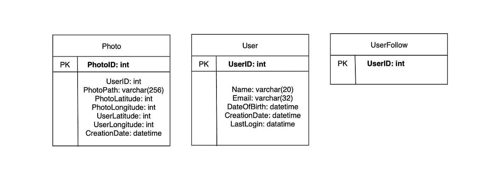
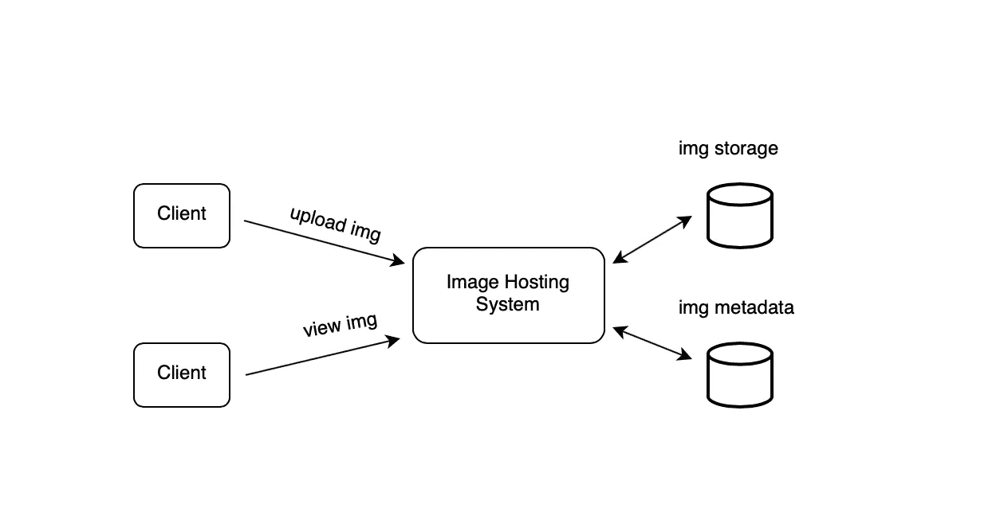

# 你会如何设计 TinyURL 和 Instagram？

> 原文：<https://betterprogramming.pub/how-would-you-design-tinyurl-and-instagram-987dfc06cbe9>

## 系统设计面试准备指南


作者照片。

在当今的科技行业，理解系统设计比以往任何时候都更加重要。随着应用程序变得越来越大，设计既高效又可靠的架构模式非常重要。现在，系统设计通常是获得你梦想中的软件工程工作的必要条件。

今天，我们将通过设计 Instagram 和 TinyURL 来回顾系统设计原则。

本文将涵盖:

*   如何设计 TinyURL
*   如何设计 Instagram
*   更多资源


作者照片。

# 如何设计 TinyURL

## TinyURL 是什么？

TinyURL 是一个缩短 URL 的 web 服务，为长 URL 创建较短的别名。当点击短链接时，用户被重定向到原始 URL。这项服务非常有用，因为短链接可以节省空间，并允许用户更容易地键入长 URL。

## 系统的要求和目标

在设计类似 TinyURL 的应用程序时，需要考虑一些功能性和非功能性需求。

非功能性需求:

*   系统必须高度可用。如果服务失败，所有的短链接都将不起作用。
*   URL 重定向应该以最小的延迟实时发生。
*   缩短的链接不应该以任何方式预测。

功能要求:

*   当给定一个 URL 时，我们的服务将生成原始 URL 的一个较短的别名。这个新链接将被大大缩短，以便于复制和粘贴。
*   短链接应该将用户重定向到原始链接。
*   用户应该可以选择为他们的 URL 选择一个自定义的短链接。
*   短链接将在默认时间间隔后过期，但用户可以指定过期时间。

## 容量估计和限制

我们的系统将会被大量读取。与新的 URL 缩短相比，将会有大量的重定向请求。让我们假设读和写的比率为 100:1。

## 交通量估计

假设我们每个月有 5 亿个新的 URL 快捷方式，读/写比为 100:1，我们可以预计在同一时期有 500 亿个重定向:

*100 * 500M = > 50B*

我们系统的每秒查询数(QPS)是多少？每秒新的 URL 缩写:

*5 亿/ (30 天* 24 小时* 3600 秒)= ~200 个网址/秒*

考虑到 100:1 的读/写比，每秒的 URL 重定向将为:

*100 * 200 个网址/秒= 20K/秒*

## 存储估计

假设我们将每个 URL 缩短请求(以及相关的缩短链接)存储了五年。由于我们预计每个月会有 5 亿个新 URL，因此我们预计要存储的对象总数将达到 300 亿:

*5 亿* 5 年* 12 个月= 300 亿*

让我们假设每个存储的对象大约为 500 字节(这只是一个大概的估计——我们稍后会深入研究)。我们将需要 15TB 的总存储空间:

*300 亿* 500 字节= 15 TB*

## 带宽估计

对于写入请求，由于我们预计每秒会有 200 个新 URL，因此我们服务的总传入数据将为每秒 100KB:

*200 * 500 字节= 100 KB/s*

对于读取请求，由于我们预计每秒大约有 20K 个 URL 重定向，因此我们服务的总传出数据将为每秒 10MB:

*20K * 500 字节= ~10 MB/s*

## 内存估计

如果我们想缓存一些经常访问的热门网址，我们需要多少内存来存储它们？如果我们遵循 80-20 规则，这意味着 20%的 URL 产生 80%的流量，我们希望缓存这些热门 URL。

因为我们每秒有 20，000 个请求，所以我们每天会收到 17 亿个请求:

*20K * 3600 秒* 24 小时= ~ 17 亿*

要缓存其中 20%的请求，我们需要 170GB 的内存:

*0.2 * 17 亿* 500 字节= ~170GB*

这里需要注意的一点是，由于会有很多重复的请求(相同 URL 的)，我们的实际内存使用将少于 170GB。

## 系统 API

我们可以使用 REST APIs 来公开服务的功能。以下是用于创建和删除 URL 而无需服务的 API 的定义示例:

```
createURL(api_dev_key, original_url, custom_alias=None, user_name=None, expire_date=None)
```

参数:

*   `api_dev_key`(字符串):注册账户的 API 开发者密钥。这将用于根据分配给用户的配额限制用户。
*   `original_url`(字符串):要缩短的原始 URL。
*   `custom_alias`(字符串):URL 的可选自定义键。
*   `user_name`(字符串):编码中使用的可选用户名。
*   `expire_date`(字符串):缩短的 URL 的可选截止日期。

Returns (string):成功插入将返回缩短的 URL。否则，它会返回一个错误代码。

```
deleteURL(api_dev_key, url_key)
```

`url_key`是一个字符串，描述了需要删除的缩短的 URL。成功删除将返回`URL Removed`。

## 数据库设计

让我们来看看对我们存储的数据的一些观察:

*   这项服务需要存储数十亿条记录。
*   这项服务的阅读量很大。
*   每个对象都很小(小于 1K)。
*   除了用户用短链接创建的存储之外，每个记录之间没有任何关系。

对于模式，我们需要一个表来存储关于 URL 映射的信息，还需要另一个数据库来存储来自创建短链接的用户的数据。


最好的数据库类型是 NoSQL 的数据库存储，比如 DynamoDB 或 Cassandra，因为我们存储的是数十亿行，而对象之间没有关系。

## 基本系统设计和算法

对于我们的服务来说，最大的问题是当给定一个 URL 时，如何生成一个简短且唯一的密钥。我们今天要看的方法是对实际的 URL 进行编码。

我们可以计算一个唯一的散列(例如 MD5、SHA256 等。)的链接。然后可以对散列进行编码以供显示。这种编码可以是 base36 ([a-z，0–9])或 base62 ([a-z，A-Z，0–9])。如果加上`+`和`/`，就可以用 Base64 编码了。一个合理的问题是，“短键的长度应该是多少？6、8 或 10 个字符？”

*   使用 base64 编码，六个字母的密钥将产生 64⁶= ~ 687 亿个可能的字符串。
*   使用 base64 编码，一个八个字母的密钥将产生 64⁸ = ~281 万亿个可能的字符串
*   有了 687 亿个唯一的字符串，让我们假设六个字母的键对我们的系统来说就足够了。

如果我们使用 MD5 算法作为散列函数，它将产生一个 128 位的散列值。经过 base64 编码后，我们将得到一个超过 21 个字符的字符串(因为每个 base64 字符编码哈希值的 6 位)。现在我们每个快捷键只能容纳八个字符。那么我们将如何选择我们的密钥呢？

我们可以用前六个(或八个)字母作为密钥。这可能导致密钥重复。为了解决这个问题，我们可以从编码字符串中选择一些其他字符或者交换一些字符。

采用这种方法时的潜在障碍:

*   如果多个用户输入相同的 URL，他们将获得相同的短链接。
*   URL 的某些部分可以进行 URL 编码。

变通办法:

*   为了解决其中的一些问题，我们可以将一个序列中的数字附加到每个短链接 URL 上。这使得它是唯一的，即使多个用户提供相同的 URL。
*   另一个潜在的解决方案是将用户 id 附加到输入 URL 上。如果用户没有登录，这将不起作用，我们将不得不生成一个惟一性密钥。

## 数据分区和复制

不可避免地，我们将需要扩展我们的数据库，这意味着我们必须对它进行分区，以便我们可以存储数十亿个 URL 的信息。

基于范围的分区:我们可以根据散列键的首字母将 URL 存储在单独的分区中。因此，我们将所有 URL 的散列关键字的第一个字母保存在一个分区中，以此类推。

这种方法是有问题的，因为它会导致不平衡的数据库服务器，造成不均衡的负载。

基于散列的分区:使用基于散列的分区，我们可以获得被存储对象的散列，然后计算使用哪个分区。哈希函数会将数据随机分配到不同的分区。

有时，这种方法会导致分区过载，这可以使用一致散列法*来解决。*

## 隐藏物

我们的服务应该能够缓存经常被访问的 URL。我们可以通过 Memcached 这样的解决方案做到这一点，Memcached 可以存储完整的 URL 和相应的哈希。

我们应该有多少高速缓冲存储器？首先，我们可以从大约 20%的日常流量开始，并根据使用模式进行调整。根据我们之前的估计，我们将需要 170GB 的内存来缓存 20%的日常流量。

我们应该使用哪种缓存回收策略？因为我们想用一个更流行的 URL 替换一个链接，所以我们可以对我们的系统使用最近最少使用(LRU)策略。

## 负载平衡器(磅)

我们可以在三个地方向系统添加负载平衡层:

*   客户端和应用服务器之间
*   在应用服务器和数据库服务器之间
*   在应用服务器和缓存服务器之间

首先，我们可以简单地使用循环法，在服务器之间平均分配传入的请求。这很容易实现，并且不会产生任何开销。

如果服务器因这种方法而过载，负载平衡器不会停止向该服务器发送新请求。为了解决这个问题，可以开发一种更加智能的负载平衡器解决方案，根据负载定期调整流量。


作者照片。

# 设计 Instagram

## Instagram 是什么？

Instagram 是一个社交媒体平台，允许用户与其他用户分享照片和视频。像许多其他社交媒体平台一样，用户可以公开或私下分享他们的信息。

今天，我们将设计一个简单版本的 Instagram，用户可以在其中分享照片，关注其他用户，并访问新闻。这包括用户关注的人的顶部照片。

## 需求和目标

在设计类似 Instagram 的应用程序时，需要考虑一些功能性和非功能性需求。

非功能性需求:

*   服务应该是高度可用的。
*   对于新闻提要，系统可接受的延迟应该在 200 毫秒左右。
*   该系统应该是高度可靠的，这样系统中的任何照片或视频都不会丢失。

功能要求:

*   用户应该能够根据照片或视频标题进行搜索。
*   用户应该能够上传，下载和查看照片和视频。
*   用户应该能够跟随其他用户。
*   该系统应该能够生成一个显示的新闻提要，其中包括用户关注的人的顶级照片和视频。

一些不会在这个项目范围内的事情是给照片添加标签，搜索带标签的照片，评论照片，标记用户等。

## 容量估计和限制

*   假设我们有 5 亿用户，每天有 100 万活跃用户。
*   每天 200 万张新照片，每秒 23 张新照片。
*   平均照片文件大小=> 200KB
*   一天的照片所需的总空间:

*2M * 200KB = > 400 GB*

*   10 年所需的总空间:

*400GB * 365(一年天数)* 10(年)～= 1425 TB*

## 高级系统设计

在高层次上，系统应该能够支持用户上传他们的媒体和其他用户能够查看照片。因此，我们的服务需要服务器来存储照片和视频，还需要另一个数据库服务器来存储媒体的元数据。


## 数据库模式



虽然我们可以采取一种简单的方法，将上面的模式存储在关系数据库管理系统(RDBMS)中，但是在使用关系数据库时会出现一些挑战——尤其是在扩展应用程序时。

我们可以利用 NoSQL 数据库存储上面的模式和键值对。照片和视频的元数据将属于一个表，其中`key`将是`PhotoID`,`value`将是一个包含`PhotoLocation`、`UserLocation`、`CreationTimestamp`等的对象。

我们可以使用 Apache Cassandra，一个宽列数据存储，来存储用户和照片之间的关系以及用户关注的人的列表。`UserPhoto`表的`key`将是`UserID`,`value`将是用户拥有的`PhotoIDs`的列表，它们将被存储在不同的列中。该模式类似于`UserFollow`表。

照片和视频可以存储在分布式文件存储器，如 HDFS。

## 数据大小估计

让我们估计一下将有多少数据进入每个表，以及 10 年内我们将需要多少总存储量。

假设每个`int`和`dateTime`都是四个字节，用户表中的每一行都是 68 个字节:

*UserID (4 字节)+ Name (20 字节)+ Email (32 字节)+ DateOfBirth (4 字节)+ CreationDate (4 字节)+ LastLogin (4 字节)= 68 字节*

如果我们有 5 亿用户，我们将需要 32GB 的总存储空间:

*5 亿* 68 ~= 32GB*

照片表中的每一行都是 284 字节:

*PhotoID (4 字节)+ UserID (4 字节)+ PhotoPath (256 字节)+ PhotoLatitude (4 字节)+photolongitude(4 字节)+ UserLatitude (4 字节)+ UserLongitude (4 字节)+ CreationDate (4 字节)= 284 字节*

如果每天上传 200 万张新照片，我们一天将需要 0.5GB 的存储空间:

*2M * 284 字节~=每天 0.5 GB*

10 年后，我们将需要 1.88TB 的存储。

UserFollow 表中的每一行都由 8 个字节组成。如果我们有 5 亿个用户，每个用户平均关注 500 个用户，我们将需要 1.82TB 的存储用于用户下表:

*5 亿用户* 500 关注者* 8 字节~= 1.82TB*

所有表 10 年所需的总空间为 3.7TB:

*32GB+1.88 TB+1.82 TB ~ = 3.7 TB*

## 组件设计

照片上传通常是一个缓慢的过程，因为它们会进入磁盘，而读取要快得多。上传用户将消耗所有可用的连接，因为这个过程非常慢。因此，当系统加载写入请求时，无法提供读取服务。为了解决这个瓶颈，我们可以将读取和写入分散到不同的服务器上，这样系统就不会过载。

这将使我们能够有效地优化每个操作。



## 可靠性和冗余

因为应用强调可靠性，所以我们不能丢失任何文件。因此，我们将存储每张照片和视频的多个副本，这样即使一台服务器出现故障，系统也可以从副本服务器中检索媒体。

这种设计将应用于我们架构的其他组件。我们将在系统中运行服务的多个副本，这样即使一个服务终止，系统也将保持运行。在系统中创建冗余允许我们在系统故障时创建备份。

## 数据分片

元数据分片的一个可能方案是基于 PhotoID 进行分区。如果我们能先生成唯一的 PhotoIDs，然后通过`PhotoID % 10`找到碎片号，上面的问题就解决了。在这种情况下，我们不需要为 ShardID 添加 PhotoID，因为 PhotoID 本身在整个系统中是唯一的。

如何才能生成 PhotoIDs？在这里，我们不能在每个碎片中有一个自动递增的序列来定义 PhotoID，因为我们需要首先知道 PhotoID 来找到它将被存储的碎片。一种解决方案是使用一个单独的数据库实例来生成自动递增的 id。如果我们的 PhotoID 可以放入 64 位，我们可以定义一个只包含 64 位 ID 字段的表。因此，每当我们想要在系统中添加照片时，我们可以在这个表中插入一个新行，并将该 ID 作为新照片的 PhotoID。

这个生成密钥的数据库不会是一个单点故障吗？是的，会的。一种解决方法是定义两个这样的数据库，一个生成偶数编号的 id，另一个生成奇数编号的 id。对于 MySQL，以下脚本可以定义这样的序列:

```
KeyGeneratingServer1:
auto-increment-increment = 2
auto-increment-offset = 1

KeyGeneratingServer2:
auto-increment-increment = 2
auto-increment-offset = 2
```

我们可以在这两个数据库前放置一个负载平衡器，在它们之间进行循环调度，以应对停机时间。这两个服务器可能不同步，一个生成的密钥比另一个多，但这不会在我们的系统中引起任何问题。我们可以通过为用户、照片评论或系统中的其他对象定义单独的 ID 表来扩展这种设计。

## 负载平衡

这项服务需要一个大规模的照片传送系统，为全球用户提供数据。我们可以使用地理上分散的缓存服务器将内容推送到离用户更近的地方。

# 包扎

干得好！现在，你应该很清楚如何设计一个像 Instagram 和 TinyURL 这样的应用程序了。其他好的应用程序包括 Dropbox、Facebook Messenger、YouTube、优步后端、Twitter 等等！通过真实世界的例子学习系统设计的行业标准，不仅在面试中，而且在工作中都会给你力量！

为了帮助您入门，我们编制了一份您应该了解的系统设计基础术语表:

*   可扩展性(水平与垂直)
*   负载平衡
*   贮藏
*   数据划分
*   指数
*   委托书
*   冗余和复制
*   SQL 与 NoSQL
*   一致散列法
*   长轮询 vs. WebSockets vs .服务器发送事件
*   CAP 定理
*   系统设计模式(即工厂方法、观察者、构建者、状态等。)

快乐学习！