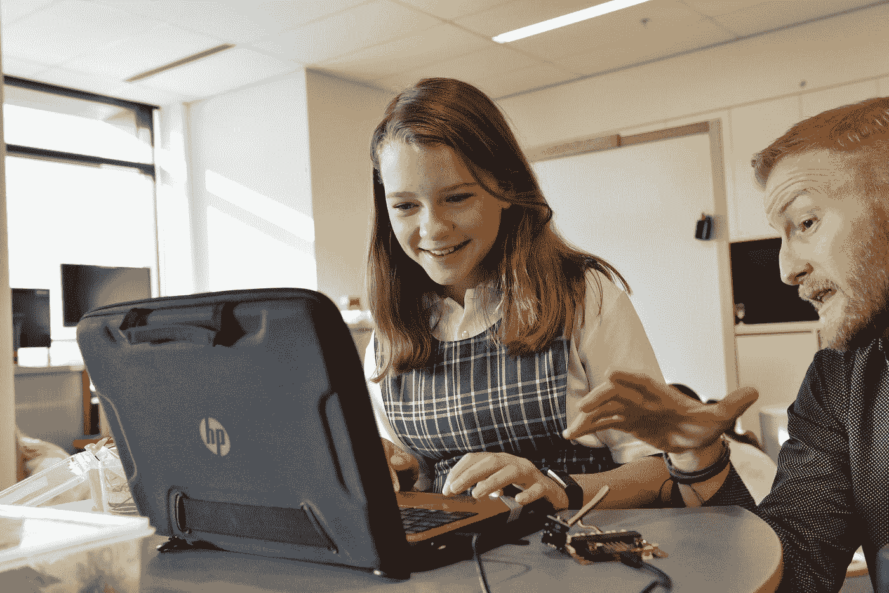

# 如何提高你的编程技能

> 原文：<https://betterprogramming.pub/how-you-can-improve-your-programming-skills-a439d47c26a4>

## 编程是一项技能，你可以不断提高和学习新事物

照片由[妮可·沃尔夫](https://unsplash.com/@joeel56?utm_source=medium&utm_medium=referral)在 [Unsplash](https://unsplash.com?utm_source=medium&utm_medium=referral) 拍摄

编程是一种你永远不可能知道所有事情的手艺。几乎不可能知道与编程相关的所有主题的一切，因为那里有如此多的信息。如果你知道这一点后还在努力保持理智，要知道最好的方法可能是对新信息保持开放的心态，并坦然接受你不可能知道所有事情的事实，尽管你每天都可以进步。这里有四种方法可以实现这一点。

# 每天编码

编码和其他技能一样是一种技能。要精通它需要大量的练习和努力。没有一个人有一天醒来突然变得擅长编程。所有优秀的工程师都夜以继日地努力完善他们的编程技能。让每天编码成为一种习惯，不管是项目还是编程语言——重要的是你每天都在做。

李·坎贝尔在 [Unsplash](https://unsplash.com?utm_source=medium&utm_medium=referral) 上的照片

哦，不要只写代码。试着看其他程序员的代码，谈谈代码，试着找专家来评审你的代码。编程是一门需要技巧的手艺，你不会仅仅通过学习规则就精通一门手艺。通过练习和反思，你会变得更好。

# 学习多种编程语言

大学和学校在课程中引入多种编程语言是有原因的。编码知识通过语言传递。例如，熟悉 Java `class`和面向对象编程使你更容易理解 Swift 编程语言的概念，因为相同的编码概念适用于两者。

由 [Kobu 机构](https://unsplash.com/@kobuagency?utm_source=medium&utm_medium=referral)在 [Unsplash](https://unsplash.com?utm_source=medium&utm_medium=referral) 上拍摄的照片

当我从多种语言中学习到不同的概念时，编程开始真正地运转起来。我从 Swift 学到了`structs`，从 JavaScript 学到了函数式编程，从 PHP 学到了面向对象编程——你懂的。将跨多种语言的所有零碎内容结合起来，无疑帮助我巩固了大局，并使我更擅长编程。不要困在小角落里。尝试探索未知，而且要经常。感觉自己什么都不知道没关系。毕竟，这是我们学习的唯一途径，通过吸收新信息。

# 教导和帮助其他程序员

你听说过*被保护人效应*吗？通过教别人来学习是一种有趣的方式。门徒效应是一种现象，在这种现象中，向他人教授或准备教授信息有助于一个人学习该信息。

教授一门学科意味着你必须采取不同的视角，因为你不熟悉学生已经知道的深度。因此，你必须假设学生对这个话题了解不多，这意味着你必须从最基本的开始教。你教授基本面的唯一方法是对基本面了如指掌。

[梗摄。T4L](https://unsplash.com/@stem_t4l?utm_source=medium&utm_medium=referral) on [Unsplash](https://unsplash.com?utm_source=medium&utm_medium=referral)

教学学习的一种方式是*塑料鸭嘴兽学习*或*鸭嘴兽学习*技术。这项技术是基于证据表明，教学一个无生命的物体提高了理解和知识的主题。这种技术的优点是学习者不需要另一个人在场来教授这门课程。在[维基百科](https://en.wikipedia.org/wiki/Learning_by_teaching)上阅读更多关于这个话题的内容。

塑料鸭嘴兽在行动中学习—[https://en.wikipedia.org/wiki/Learning_by_teaching](https://en.wikipedia.org/wiki/Learning_by_teaching)

你可以从小处着手。拿起一期 GitHub，试着每天帮助一个人。我喜欢每天在 StackOverflow 上回答一个问题，只是为了每天尽可能地学习和帮助。

# 结论

编程很有趣，尽管很难掌握。扪心自问:如果你真的想掌握编程，你愿意付出额外的努力吗？你现在已经知道答案了。

感谢阅读，保持敬畏。

# 参考

[门徒效应:你如何通过教别人来学习](https://effectiviology.com/protege-effect-learn-by-teaching/)

[知道你是否是伟大软件工程师的四种方法](https://medium.com/better-programming/4-tells-whether-youre-a-great-software-engineer-b0e496ed8f3b)