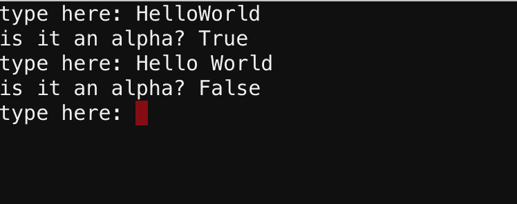
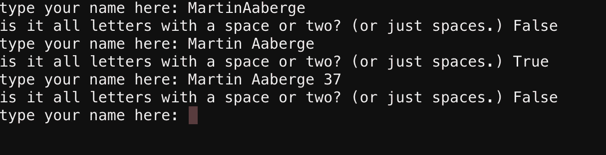
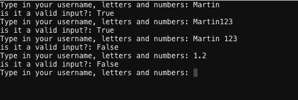
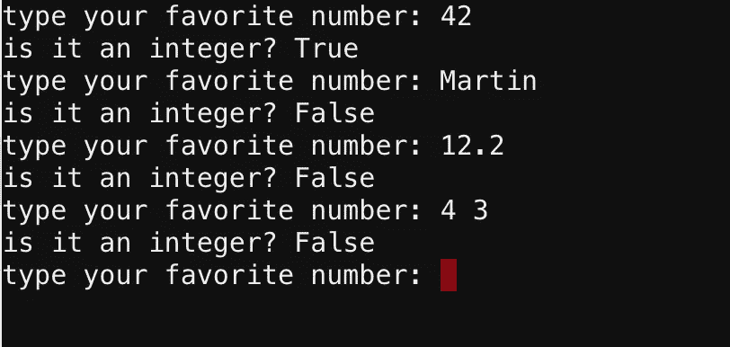
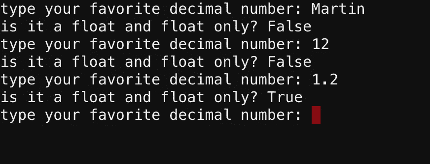
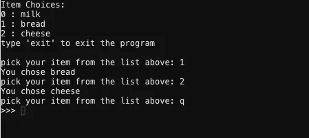

# 在 Python 中如何确保 input()是您想要的类型

> 原文：<https://betterprogramming.pub/how-you-make-sure-input-is-the-type-you-want-it-to-be-in-python-521f3565a66d>

## Input 返回一个字符串，但是你不希望这样，对吗？


图片由 [X posid](https://www.needpix.com/photo/1346858/frenchcheese-bread-milk-breakfast-food-tomato) 上的[公共域图片](https://www.publicdomainpictures.net/en/browse-author.php?a=34913)

我在各种脸书小组和堆栈溢出中经常看到的一个问题是关于用户输入和如何处理输入。

在 Python 中，您可以使用函数`input()`请求用户输入:

`user_input = input('Type your input here: ')`

`input()`返回一个字符串，其中包含用户用键盘在终端上输入的内容。

不过，有时你会寻找不同的类型。也许你希望它是一个整数，你将在计算中使用，或者作为某个东西的索引。

以下代码中什么会失败？

```
food_list = ['milk' , 'bread' , 'cheese']
print (f'Item Choices:')
for index, item in enumerate(food_list):
    print(f'{index} : {item}')user_input = input('choose an item: ')
print (f'user chose {food_list[user_input]}')
```

你可能已经猜到了。你不能使用一个字符串作为索引来获取存储在列表位置的值。即使用户键入“1”，它也会失败，因为输入仍然存储为字符串。

```
Traceback (most recent call last):
  File "main.py", line 6, in <module>
    print (f'user chose {food_list[user_input]}')
TypeError: list indices must be integers or slices, not str
```

> “只是`int()`那个`input()`，老弟。如果他们输入了错误的内容，就会出现用户错误。”

事实上，没有。许多开发人员都有这种心态。如果一个用户能够通过做一些错误的事情来破坏系统，我们就必须观察系统。

即使这将使代码运行…

```
user_input = int(input('choose an item: '))
```

…如果用户输入“1”或“1.0”——或者任何其他的胡言乱语，它就会崩溃。在这个例子中，它可能看起来很荒谬，但是在更复杂的代码中，它可能有更大的影响。我的一位主管在开发我们的管道时引用了这句话:

> “假设人类智能。”
> 
> — Espen Nordahl，暴风工作室的 CG 主管

引用的话总是让我傻笑，而且很有道理。但是在过去的几年里，我更加开放地承认系统应该更多地支持用户，我们需要设计来防止错误的发生。

很抱歉在这里谈论 UX，回到代码:

如果你写一个计算矩形面积的函数——但是它只接受整数——我想很多用户会通过输入一个浮点数(比如 32.4)来破坏程序。在这个例子中，Float 对用户来说很有意义。

你如何确保得到你想要的？

在这一部分中，我们将首先创建所有的函数来检查类型，然后我们将创建一个交互菜单，在这里我们对它们进行测试。

# 编码时间


照片由[普里西拉·杜·普里兹](https://unsplash.com/@priscilladupreez?utm_source=medium&utm_medium=referral)在 [Unsplash](https://unsplash.com?utm_source=medium&utm_medium=referral) 上拍摄

让我们将其分解为我们希望检查的内容:

*   `integer`
*   `string`
*   `float`

Python 中的类型字符串已经有很多内置函数，可以免费提供我们想要的结果。耶，蟒蛇。

我们希望支持并检查以下项目:

1.  `HelloWorld`(所有字母，不多不少)
2.  `Hello World`(注意空间)
3.  `HelloWorld123`(包括字母和/或数字)
4.  `123`(纯数字，int)
5.  `12.2`(浮点)

## 1.检查变量是否全是字母(alpha):

这意味着字符串中的所有字符都是字母。这里连一个空间都不允许。

```
def is_string_only(check_input):
    if check_input.isalpha():
        return True
    return False
```

正如您所看到的，这实际上只是使用 Python 的内置函数。如果我们愿意，我们的主代码可以直接使用这个。将其写入我们自己的函数更适合于学习目的。

```
user_input = input(‘’)
if user_input.isalpha():
    #do incredible things
```

请注意，您不需要说:

```
if something:
    return True
else:
    return False
```

如果`if`语句的求值结果为`True`，则该功能将返回`True`然后停止。因此，我们永远不会读到最后一行说`return False`。

如果`if`语句的评估结果不是`True`，它只会沿着每一行往下，最后到达`return False`。不需要`else`。

与函数的交互如下所示:



“HelloWorld”有效，因为所有字符都是字母。“你好，世界”有空格，无效。

## 2.检查变量是否都是字母并且包含任何空格

正如你在上面看到的，如果字符串中有空格，它会失败，因为空格不是字母。

字符串有一个叫做`isspace()`的函数。我用它来检查字符串中是否有空格，同时检查其余的是否是字母。

```
def is_string_with_space(check_input):
    valid = False
    if ' ' in check_input:
        for char in check_input:
            if char.isdigit():
                valid = False
            elif char.isalpha() or char.isspace():
                valid = True
    return valid
```

首先，我检查我们传递的字符串中是否有空格。临时变量`valid`被使用，所以我们不会在第一次发现`True` 或`False`语句时脱离循环。请记住，该函数在返回某些内容时会考虑已完成的工作。

如果有空格，我循环遍历所有字符，如果可以找到任何数字，则返回`False`。这是可选的。如果您想支持数字，您可以不支持。最后，我检查变量中的项目是字母还是空格。然后我返回`valid`。

像这样的功能可以用来检查用户是否输入了有效的名字。

与函数的交互如下所示:



只有中间有字母和空格的才有效

## 3.检查字母和/或数字

我想不出有多少设置你会使用它，但也许你会需要它作为用户名或其他东西。它与`.alpha()`功能相同:

```
def is_string_or_num(check_input):
    if check_input.isalnum():
        return True
    return False
```

如果您想强制它既是数字又是字母，您可以像我们在前面的检查中所做的那样遍历字符串中的元素。

此功能不支持空格。如果你愿意，这也是另一个你可以加入的东西。

与函数的交互如下所示:



用户键入包含字母和/或数字的用户名

## 4.检查整数

这是另一个简单的问题。检查 int 的函数可以是:

```
def is_digit(check_input):
    if check_input.isdigit():
        return True
    return False
```

这将检查字符串中的所有字符是否都是数字。注意这个也不支持空格。

与函数的交互如下所示:



只有整数是有效的输入

## 4.检查浮点

这也是一个非常有趣的故事。如果你知道更好的方法来检查浮动(除了`try` / `except`)，请告诉我。

```
def is_float(check_input):
    if '.' in check_input:
        split_number = check_input.split('.')
        if len(split_number) == 2 and split_number[0].isdigit() and split_number[1].isdigit():
                return True
    return False
```

我做的第一件事是检查这里是否有一个点。如果没有点，就不可能是浮点数。

但是，如果有一个点，我们不能说它是一个浮点数。用户写一句话怎么办？

因此，我在圆点上做了一个分割`split(‘.’)`。通过检查这个的长度，我可以判断出它是否是一个潜在的浮点数。必须是两个:点前面的数字和点后面的数字。

为了确保它确实是一个数字，我使用`.isdigit()`检查了拆分后创建的列表的两个索引是否都是数字。

聪明？笨重？我不知道。至少超级有趣。

与函数的交互如下所示:



检查十进制数。

当你完成所有的功能后，感觉应该是这样的:


照片由[米 PHAM](https://unsplash.com/@phammi?utm_source=medium&utm_medium=referral) 在 [Unsplash](https://unsplash.com?utm_source=medium&utm_medium=referral) 拍摄

# 最后的乐趣:把函数用在有用的地方

## 食物清单

如果我们回到食物列表，我们可以再次创建一个菜单。

这一次，我们用检查来改变它，以确保即使用户输入了我们不想要的输入，程序也能运行。我通常将函数放在一个单独的文件中，甚至可能为此创建一个类，但是对于这个例子，我将所有代码放在一个 Python 文件中。

如果你读过我的关于向 CSV 文件添加数据的文章，你应该已经熟悉了我是如何创建用户菜单的，这些菜单会一直运行，直到用户输入预定义的东西退出。

下面是我们可以在前面的列表示例中使用的代码。

对于这个小程序，我们希望用户输入一个 int。这是我们访问列表中的条目的唯一有效的输入。因为我们绝对确定用户输入了一个 int，所以我们可以使用`int(input())`。

如果用户输入了一个无效的输入，他们还会有一次机会，直到他们输入正确为止。我还添加了一个选项，让用户通过键入“q”来退出程序。我之前选择了“exit”，但“q”对用户来说更短。



用户与我们的菜单交互

# 最后

确保用户确实输入了正确的类型会使代码更加简洁，并大大降低出错的风险。

如果出现错误，程序会把用户扔进一个空的地方。你真的不希望用户仅仅因为输入了错误的值就再次启动程序。

现在，你可以确保用户一直呆到工作完成——这就是软件的初衷。

喜欢写更好的代码，如果你有更好的处理输入的方法，请告诉我。我相信有更多的方法可以解决这个问题。