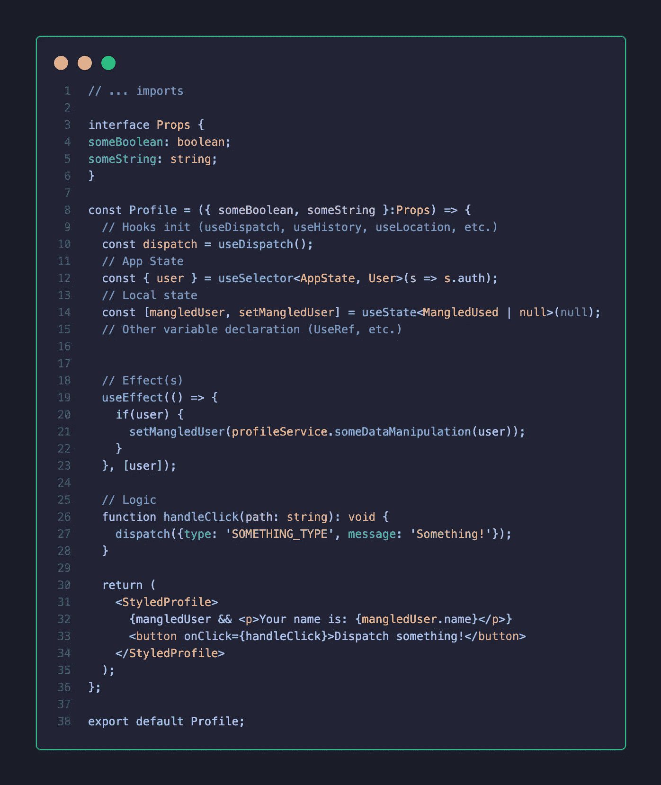

# 应该如何构建 React 应用程序

> 原文：<https://betterprogramming.pub/how-you-should-structure-your-react-applications-e7dd32375a98>

## 当然，这是个人喜好的问题，但这里有一种方法可以扩展


由[瑞安·巴伦](https://unsplash.com/@netherlandz108?utm_source=medium&utm_medium=referral)在 [Unsplash](https://unsplash.com?utm_source=medium&utm_medium=referral) 上拍摄的照片。

有没有构建 React 项目的完美方法？官方文档帮不了你多少。React 是一个库，而不是一个框架，这就是为什么它对你应该如何构建你的应用程序没有意见。

这很好，因为它给了我们自由来构建我们想要的应用程序。有经验的开发人员不会发现这样做的缺点，但是初级开发人员可能会发现很难找到构建整洁结构的方法。

# 我的哲学

每个项目都满足特定的需求，因此需要特定的结构和规则。构建应用程序的好方法有多少，坏方法就有多少。我将在本文中描述的方法可能不是您项目特定需求的完美答案。

也就是说，我已经在不同规模的项目上与 React 合作了一段时间。我今天用的结构和几年前用的真的不一样。事实上，我一直在为自己创建的每个项目改进构建应用程序的方式。因为我对我最近使用的结构非常满意，所以我决定分享它。

当然，你会发现下面的结构可能看起来太多了，这取决于你的需求(应用程序的大小，目标等等)。)，但是要明白，这是一种允许您的项目扩展的方法，从长远来看是值得的。

除非你完全确定你要去哪里，否则我不会说你需要从第一天起就对你的应用应用一个严格的结构。代码总是可以在以后进行重构。那是选择的问题。

我总是觉得重构非常令人满意，但同时，我也不喜欢一开始就在混乱的代码库中工作。

因此，我试图尽快应用我的结构需求，因为我认为这对我的生产率有好处(显然，这不会阻止未来潜在的重构)。

让我们开始吧！


照片由 [Dragos Gontariu](https://unsplash.com/@dragos126?utm_source=medium&utm_medium=referral) 在 [Unsplash](https://unsplash.com?utm_source=medium&utm_medium=referral) 上拍摄。

# 全球结构

好吧！每个项目的根目录都是一样的，这一点没有太多争议，因为它只是关于配置的东西。所以我就直接去`./src`文件夹了，那里有乡亲们的意见和品味！

下面是我如何构建我的`./src`文件夹:

```
/src
  │
  ├── **assets**
  │   └── ...
  │
  ├── **components**
  │   └── ...
  │
  ├── **containers**
  │   └── ...
  │
  ├── **core**
  │   └── ...
  │
  ├── app.tsx
  ├── index.tsx
  └── router.tsx
```

这里发生了什么？

## 为数不多的 TSX 档案

是的，我喜欢打字稿，你将在这篇文章中处理它。TSX 是包含 JSX 代码的类型脚本文件的文件扩展名。

*   `./index.tsx`:项目的切入点。这是我初始化我使用的库的地方，比如主题提供者(来自 [styled-components](https://styled-components.com/) )、商店( [Redux](https://redux.js.org/) 、 [Apollo](https://www.apollographql.com/docs/react/) ，或者你选择的库)、路由器( [React Router](https://reactrouter.com/web/guides/quick-start) )并且我显然还包括了我的`<App />`组件。
*   `./app.tsx`:包含`<Router />`组件。这也是我实现我的特性(主要是容器，但我们将在后面了解)的地方，这些特性在整个应用程序中使用，比如模态系统、通知容器、服务人员等。
*   `./router.tsx`:由我项目的主要部件`<Switch />`和`<Route />` 组成。如果我需要子路由，它们由使用它们的容器来处理。

## 资产文件夹

没什么大不了的。这个文件夹显然包含图像、图标、字体等等。

但是因为我不希望它变成一个巨大的垃圾桶，团队只是随着应用程序的增长随意扔东西，所以资产是按上下文排序的。

```
/**assets**
  │
  ├── auth // ◀️ Assets specific to the auth container
  │   ├── connected.mp3
  │   └── background.png
  │
  ├── fonts
  │   └── ...
  │
  ├── ionicon // ◀️ An icon Library
  │   └── ...
  │
  ├── profile // ◀️ Assets specific to the profile container
  │   └── background.png
  │
  ├── logo.svg
  └── ...
```

规则如下:如果资产仅在特定容器中使用，则它属于与该容器同名的文件夹。

例如，如果我的应用程序使用了一个徽标，它可能会在我的项目中的任何地方使用。由于这个原因，这个属于`./assets`文件夹的根目录。但是只在`Auth`容器中使用的背景图像属于`./auth`子文件夹。

我发现用这种方式浏览我的资产非常简单。

这种方法还可以更容易地找到不再使用的资产。首先这应该不是问题，但是说实话:我们经常忘记清理这个文件夹。

## 组件和容器文件夹

您应该如何对组件进行分组？这里有很多不同的口味。 [React 的文档](https://reactjs.org/docs/faq-structure.html)提出了两种解决方案:

*   按特征或路线对文件进行分组。
*   或者按类型(CSS、组件、测试等)对文件进行分组。).

如果我正在做一个有大约 100 个组件的项目，第二个解决方案会让我发疯。

我更喜欢使用第一种选择——或者至少是它的改进版本。

```
/src
  │
  ├── **components**
  │   └── ...
  │
  ├── **containers**
  │   └── ...
  │
  └── ... // ◀️ other folders we saw above
```

让我们先处理组件文件夹。

为了让 React 组件在`./components`文件夹中赢得一席之地，它必须遵守两条规则:

*   它必须是一个*表示组件*，这意味着它没有连接到应用程序的状态，当然也不会获取或发布数据。
    它可以与父容器交互(例如，通过触发 Props 中传递的函数)。我没意见，但仅此而已。
*   它必须跨多个组件或容器使用。

组件使事情看起来很好，而容器使事情工作。

根据你的应用程序实现的功能，它可以是一个页面，也可以是页面的一个模块。我喜欢称它们为*功能*。标题是一个特征。授权页面也是一个特性。他们完成特定的事情。

容器是有状态的，这意味着它们可以:

*   订阅商店。
*   触发副作用，(与存储交互，获取或发布数据等。).
*   处理分析事件的分派。
*   通过 props 向子组件提供状态、数据和动作。

这在我的文件结构中清楚地表明了逻辑在哪里，表示部分在哪里。

## 核心文件夹——应用程序的核心

我的核心文件夹也可以命名为 *Commons* 或 *Shared* 。它包含应用程序中使用的所有内容。

```
/**core**
  │
  ├── **models**
  │   ├── notification.model.ts
  │   ├── user.model.ts
  │   └── ...
  │
  ├── **services**
  │   ├── notification.ts
  │   ├── notification.test.ts
  │   ├── user.ts
  │   ├── user.test.ts
  │   └── ...
  │
  ├── **store**
  │   ├── middlewares
  │   │   └── ...
  │   │
  │   ├── auth
  │   │   ├── actions.ts
  │   │   ├── epics
  │   │   │   ├── some-side-effect.ts
  │   │   │   ├── fetch-stuff.ts
  │   │   │   └── ...
  │   │   │
  │   │   ├── reducer.ts
  │   │   └── selectors.ts
  │   │
  │   ├── index.ts
  │   └── state.ts
  │
  └── **theme**
      ├── animations.ts
      ├── global-state.ts
      └── index.ts
```

由于我在项目中使用 TypeScript，这意味着我需要一个地方来存储我所有的类型和接口。

每种数据类型都有一个文件(`User`、`Product`、`Notification`等)。).

容器的工作就是启用这个特性。为了让我的容器尽可能精简，服务处理会在组件中产生大量不必要噪音的业务逻辑。服务通常负责验证输入、记录错误、执行 HTTP 请求、操作数据等。

应用程序中有多少服务就有多少服务，所以很容易找到我需要的东西。

store 文件夹包含商店配置及其中间件——没什么特别的。它还包含所有的缩减器、它们的动作、它们的史诗和它们的选择器。

我们应该把减速器放在哪里经常是一个争论。我们应该把它们放在主要使用它们的容器旁边，还是放在一个单独的目录中，和所有其他的 reducers 放在一起？

两种选择都可行。我更喜欢把它们放在`./core/store`文件夹中，因为状态经常被多个组件使用，动作也是如此。

我正在使用 Redux-Observable 来处理我的应用程序的副作用。这相当于 NgRx 处理 Angular 副作用的方式，我发现它非常方便。这就是为什么你会看到一个史诗文件夹。因为它们可以被多个容器触发，所以我将它们放在存储中各自的文件夹中。

最后是`./theme`文件夹。像我们许多人一样，我使用流行的样式组件库来设计我的组件。主题文件夹是我放置项目的全局样式和 CSS 动画的地方。

我还将我的项目的主题变量存储在`index.ts`文件中，如[文档](https://styled-components.com/docs/advanced#function-themes)中所述。

# **组件文件夹的结构**

容器比表示组件负责更多的东西，但是我用同样的方式构造它们。因此，以下内容适用于容器和组件。以下是构建组件文件夹的方法:

```
/my-component
  │
  ├── **components** // ◀️ Only for a Container!
  │   ├── sub-componentA
  │   │   ├── index.test.tsx
  │   │   ├── index.tsx
  │   │   └── styled.ts
  │   │
  │   └── sub-componentB
  │       └── ...
  │
  ├── **service** // ◀️ Optional, mostly for Containers
  │   ├── index.test.tsx
  │   └── index.ts
  │
  ├── **index.test.tsx**
  ├── **index.tsx**
  └── **styled.ts**
```

## **组件的根**

*   `./index.tsx`:我的组件定义的地方。有些人喜欢用它导出的组件的名字来命名它。那是口味问题。这两种方法各有利弊。我不介意在我的项目中使用哪一个。
*   `./styled.ts`:我的组件的设计所在的地方。
    在该文件中创建的所有组件遵循相同的惯例。它们被命名为 *StyledXxx* ，用法如下:`<StyledXxx />`。由于一个组件可以使用许多子组件，这是一个简单的方法来确定一个组件是否只负责设计。
*   `./index.test.tsx`:测试现场。

## **组件文件夹(仅用于容器)**

容器通常使用自己的表示组件。所谓“拥有”，我的意思是那些表示组件只在这个容器中使用。

因为我想把代码放在靠近使用它的地方，所以让这些组件存在于容器中是有意义的。

`./components`子文件夹的深度为 2，这使得容器易于浏览。更深的深度会不必要地增加复杂性。

在上面的例子中，`<SubComponentB />`可能是`<SubComponentA />`的子节点，但这无关紧要。他们生活在同一水平。

## **服务文件夹**

该服务帮助我从我的容器中外包特定的繁重业务逻辑。并非每个容器都需要自己的服务，因为“公共”逻辑可能已经存在于核心文件夹中，但有时可能需要它。

让我们举一个例子:我有一个分析事件要分派，它以特定的方式需要十个字段(我发誓我遇到过这种情况)。这意味着它将在我的容器中增加十多行噪声。对于一个分析事件来说，这是一个很大的噪音，但是我希望商业智能团队高兴，所以我提供他们想要的东西！

因为我想让我的容器尽可能精简，这样一看就能明白，所以我把这个逻辑放在组件旁边的服务文件中。这种方法也使得测试更加干净。

有些人可能会说，这实际上使理解正在发生的事情变得更加困难，因为他们需要打开服务来检查逻辑。我看不出这有什么问题。此外，由于我使用 TypeScript，悬停该方法会告诉我我得到了什么。

# 反应组分的结构

拥有一个好的文件结构是至关重要的，但是让我们也关注一下 React 组件本身，因为这是我们花费时间最多的地方。

以下是一些规则以及我如何构建我的 React 组件:



一个<profile>容器示例</profile>

## 命名您的组件

该名称应该是唯一的，并且清楚地表明该组件实现了什么。

为什么给组件命名很重要？我喜欢直呼同事的名字——我的组件也是如此。

更严重的是，它有助于调试。下面是匿名组件的情况:

```
export **default** (props) => {
  return <p>**Don't do this**</p>;
}
```

如果你用 React dev 工具检查你的应用，一切都显示为`Anonymous`，这真的很令人沮丧。运行时错误也是如此…


用 React 开发工具调试匿名组件


真的吗？谢谢，反应先生！

命名您的组件使您的生活更加轻松！

```
const **Better** = (props) => {
  return <p>Do This instead</p>
}export default **Better**;
```


使用 React 开发工具调试命名组件


知道去哪里更快！

在一个大项目中，你*希望*你的组件有一个名字。

## 打字道具

当我打开一个 React 组件时，我想看一看它收到了什么。这就是为什么我把 Props 接口放在文件的顶部，就在 imports 的下面。

然后，我在函数的参数中析构 props。由于 VSCode 只突出显示使用过的道具，这使得查看一个道具是否还在使用变得更加简单。这一切都是为了让我的组件尽可能的干净。

## 钩子初始化

它们很吵，但是我们需要它们。它们位于组件的顶部，所以当我读取文件的其余部分时，它们不会打扰我。

这些规则很简单，容易遵循，不需要太多的工作，但是它们仍然让你的生活变得更轻松。

请记住，上面的例子非常简单。组件通常比这个大，不容易阅读。

## 应用状态和本地状态

这就是我的目光停留的地方——就在道具界面之后。它们位于钩子的正下方，因为它们代表了最有价值的信息:我的容器从存储中接收了什么数据，以及它在本地管理什么状态。

## 效果

我知道我的组件是由什么组成的。效果告诉我它的行为。按照重要性的顺序，这就是我希望在组件状态下面看到的内容。

## 功能

最后，业务逻辑。我有理解逻辑所需的所有信息。

# 结论

下面是我在这篇文章中经历的完整结构。

正如我前面提到的，您可能不需要在应用程序中实现完整的结构，因为每个应用程序都有自己的需求。如果你的 app 特别小，五个组件一个容器，显然太多了。

这是我构建 React 应用的方法。这是一种可扩展的方法，效果很好，允许我快速工作，而不会随着应用程序的增长而影响代码库的质量。

有许多其他的方法来构建你的应用程序，我想说的是，除了你做出的结构选择，最重要的考虑是在整个项目中保持一致。

```
/src
  │
  ├── **assets** │   ├── auth
  │   │   │
  │   │   ├── connected.mp3
  │   │   └── background.png
  │   │
  │   ├── fonts
  │   │   └── ...
  │   │
  │   ├── ionicon
  │   │   └── ...
  │   │
  │   ├── profile
  │   │   └── background.png
  │   │
  │   ├── logo.svg
  │   └── ...
  │
  ├── **components**
  │   ├── **componentA**
  │   │   ├── service
  │   │   │   ├── index.test.tsx
  │   │   │   └── index.ts
  │   │   │   
  │   │   ├── index.test.tsx
  │   │   ├── index.tsx
  │   │   └── styled.ts
  │   └── ...
  │   
  ├── **containers**
  │   ├── **containerA**
  │   │   ├── **components**
  │   │   │   ├── sub-componentA
  │   │   │   │   ├── index.test.tsx
  │   │   │   │   ├── index.tsx
  │   │   │   │   └── styled.ts
  │   │   │   │
  │   │   │   └── sub-componentB
  │   │   │       └── ...
  │   │   │
  │   │   ├── **service**
  │   │   │   ├── index.test.tsx
  │   │   │   └── index.ts
  │   │   │   
  │   │   ├── index.test.tsx
  │   │   ├── index.tsx
  │   │   └── styled.ts
  │   │
  │   └── ...
  │
  ├── **core**
  │   ├── **models**
  │   │   ├── notification.model.ts
  │   │   ├── user.model.ts
  │   │   └── ...
  │   │
  │   ├── **services**
  │   │   ├── notification.ts
  │   │   ├── notification.test.ts
  │   │   ├── user.ts
  │   │   ├── user.test.ts
  │   │   └── ...
  │   │   
  │   ├── **store**
  │   │   ├── middlewares
  │   │   │   └── ...
  │   │   │   
  │   │   ├── auth
  │   │   │   ├── actions.ts
  │   │   │   ├── epics
  │   │   │   │   ├── some-side-effect.ts
  │   │   │   │   ├── fetch-stuff.ts
  │   │   │   │   └── ...
  │   │   │   │
  │   │   │   ├── reducer.ts
  │   │   │   └── selectors.ts
  │   │   │   
  │   │   ├── index.ts
  │   │   └── state.ts
  │   │
  │   └── **theme**
  │       ├── animations.ts
  │       ├── global-state.ts
  │       └── index.ts
  │
  ├── **app**.tsx
  ├── **index**.tsx
  └── **router**.tsx
```

感谢阅读！