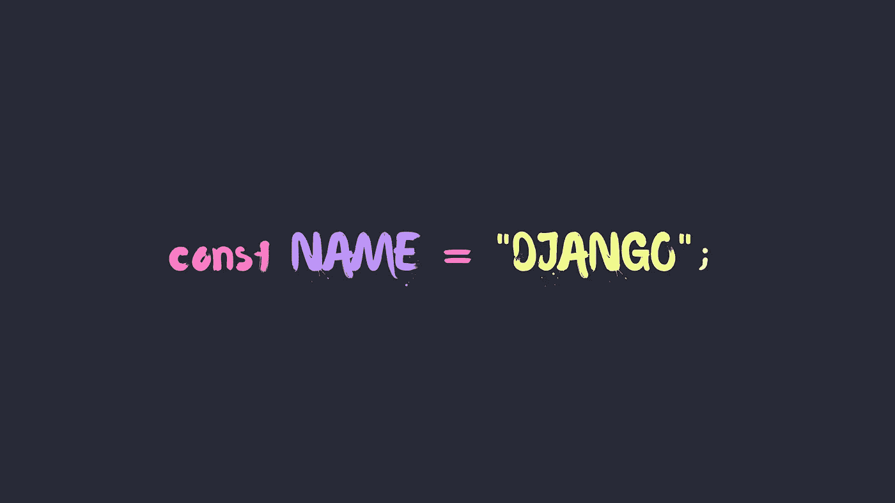
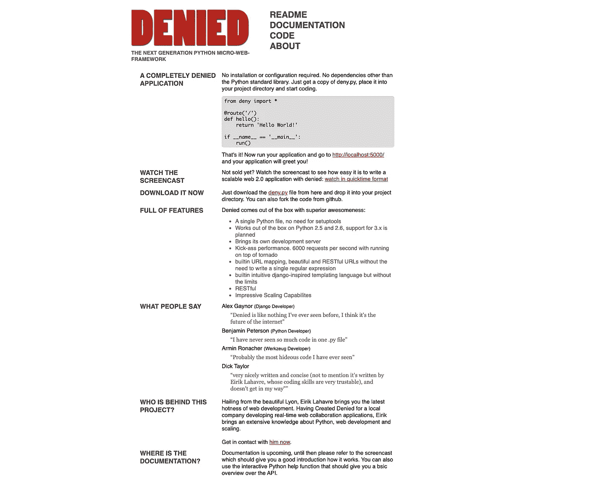
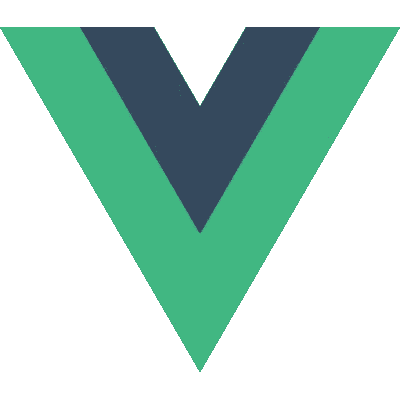

# 您最喜欢的库和框架是如何得名的

> 原文：<https://betterprogramming.pub/how-your-favorite-libraries-and-frameworks-got-their-names-2a4c4f805cda>

## Django 在一个装有 Laravel 和 Hadoop 的烧瓶中运行

作者提供的图片

你们中的一些人可能能够猜到像 React 或 Vue 这样的库的名字是从哪里来的，但是像 Django 或 Laravel 这样的库呢？你知道吗，Flask 最初是作为一个愚人节玩笑被创造出来的？

让我们探索一些最有影响力的库和框架的历史，以及它们的名字是如何来的。

# 瓶

信不信由你，阿明·罗纳彻[在 2010 年](https://web.archive.org/web/20160604162342/http://mitsuhiko.pocoo.org/flask-pycon-2011.pdf)愚人节制造了 Flask。当时，出现了许多 Python“微”框架，其思想是从单个`web.py`文件构建 web 服务。

Ronacher 构建了 [Werkzeug](https://werkzeug.palletsprojects.com/en/1.0.x/) (一个 WSGI web 应用程序库)和 [Jinja](https://jinja.palletsprojects.com/en/2.11.x/) (一个模板引擎)，他决定将两个项目缝合在一起，添加一些功能，并发布一个“新的”微框架，他称之为[拒绝](https://web.archive.org/web/20110904053655/http://denied.immersedcode.org/)。

令人难以置信的是，这个愚人节玩笑获得了如此多的关注，以至于罗纳彻把它变成了一个成熟的图书馆。他继续嘲笑整个微框架的想法，将他的库 Flask 命名为对当时流行的 Python 微框架 [Bottle](https://bottlepy.org/docs/dev/) 的文字游戏。

Flask 始于愚人节玩笑，原名 DENIED。[来源](https://web.archive.org/web/20110904053655/http://denied.immersedcode.org/)。

# 姜戈

有些人可能认为《姜戈》是 1966 年的热门电影，激发了无数的衍生电影。然而，Django 框架实际上是以著名的爵士乐吉他手坦哥·雷恩哈特的名字命名的。莱因哈特因左手(他的和弦手)只有两个手指而闻名，17 岁时的一次事故使他的戒指和小指严重烧伤。

Django 的联合创作人 Adrian Holovaty 本身就是一名吉他手。他在自己的 YouTube 频道上录制了自己的吉他作品，该频道拥有超过 3 万名订户。相应地，坦哥·雷恩哈特有一个名叫 Python Reinhardt 的表亲 Holovaty 直到 2019 年才知道。说说巧合吧！

# Ruby on Rails

Ruby on Rails 是由 David Heinemeier Hansson 在 2003 年创建的，当时他正在构建一个项目管理工具。这个工具不仅取得了巨大的成功——它现在被称为[base camp](https://basecamp.com/)——而且 David 还将 Rails 框架提取到了一个开源项目中。

汉森将它命名为 Rails 的确切原因尚不清楚，但人们通常认为它是对 Rails 的两个指导原则的隐喻[:“不要重复自己”和“约定胜于配置”](https://www.quora.com/What-is-the-story-behind-the-name-of-Ruby-on-Rails)

众所周知，Rails 非常固执己见，抽象出代码来执行这两个原则。使用框架的项目将是“在轨道上的”:它们遵循约定的预先确定的“轨道”，通过避免不必要的重复来帮助你快速移动。

# 拉勒韦尔

Laravel 听起来很花哨，但实际上没有任何意义。Laravel 的创作者 Taylor Otwell，[只是想出一些在他脑海中听起来很酷的词](https://leanpub.medium.com/leanpub-podcast-interview-13-taylor-otwell-3c57ffc4e38f)。他从一本儿童书籍中获得灵感:

> “在儿童读物《纳尼亚传奇》中，有一个地方叫凯尔帕拉维尔，所有的国王和王后都住在那里，所以它有点押韵，拉勒维尔和帕拉维尔，所以它就有点被卡住了。”——[泰勒·奥特威尔](https://leanpub.medium.com/leanpub-podcast-interview-13-taylor-otwell-3c57ffc4e38f)

Laravel 怎么发音的？ *Lair-uh-vul？拉-拉-维尔？拉-雷-武？* *Lar-a-vel？*

# 结节

在你拿出你的干草叉之前，是的，我知道:Node 不是一个框架也不是一个库，它是一个运行时环境。但是代替技术细节，我包括了 Node，因为它有着迷人的历史！

Node 是瑞安·达尔在 2009 年创建的。他[批评了当时最流行的服务器](https://s3.amazonaws.com/four.livejournal/20091117/jsconf.pdf)，Apache HTTP Server，因为它的顺序阻塞架构无法处理大量的并发请求。Dahl 以非阻塞的基于事件的范例为核心，着手构建一个更好、更快的替代方案。

他最初将自己的项目命名为 web.js ，因为他只是想使用非阻塞模型构建一个 web 服务器替代方案。然而，Dahl 很快意识到他的项目作为一个可以做任何事情的运行时环境有更大的潜力。他将 Node 描述为一个[单线程、单进程系统，其中许多“节点”需要被组织起来以相互通信](https://www.bizjournals.com/boston/inno/stories/news/2011/01/31/nodejs-interview-4-questions-with-creator-ryan.html)，这就是这个名字的来源。

> “我有几个失败的私人项目在 C、Lua 和 Haskell 上做同样的事情。Haskell 相当理想，但我不够聪明，无法破解 GHC ……] V8 大约在我研究这些东西的同时问世，我突然意识到 JavaScript 实际上是我想要的完美语言。”— [瑞安·达尔](https://www.bizjournals.com/boston/inno/stories/news/2011/01/31/nodejs-interview-4-questions-with-creator-ryan.html)

众所周知，Node 是建立在 Google 的 V8 JavaScript 引擎之上的，但这几乎不是 Dahl 开始的地方！他首先尝试了 Mozilla 的 SpiderMonkey 引擎[，但发现 V8 更干净，而且“比 Mozilla 的东西](https://www.theregister.com/2011/03/01/the_rise_and_rise_of_node_dot_js?page=4)更现代”在 JavaScript 之前，他尝试过很多其他语言，包括 Haskell、Lua 和 c，但都失败了。

Dahl 从此离开 Node，发布了用 Rust 编写的 [Deno](https://deno.land/) 。我提到这个是因为 Deno 实际上是 Node 这个词的变位词！

# 反应

React 由乔丹·沃克于 2011 年在脸书创立。你们中的许多人可能已经猜到了它的名字来源:React 是一个声明性的、基于组件的视图，它对状态的变化做出反应。

你可能不知道的是，React 的早期原型叫做 FaxJS，以 fax 命名(就像传真机里一样)。乔丹·沃克自己解释得很好:

你还能在 Github 上找到[原 FaxJS 回购——早期，JSX 根本不存在！](https://github.com/jordwalke/FaxJs)

# 某视频剪辑软件

Vue 的名字很简单:它是一个 JavaScript UI 框架，用于在网页上呈现你“vue”的东西。

*Vue* 也是 *view* 的法语单词，在英语和法语中发音相同！也许最合适的是，Vue 和它的创造者尤雨溪的姓押韵。

Vue 的 logo 简洁优雅，就像它的名字一样。

# Hadoop

2004 年，谷歌发表了论文 [MapReduce:大型集群上的简化数据处理](https://www.usenix.org/legacy/publications/library/proceedings/osdi04/tech/full_papers/dean/dean_html/index.html)。受这篇论文的启发，Doug Cutting 和 Mike Cafarella 创建了 Hadoop。如今，Hadoop 是 MapReduce 最著名的开源实现:2010 年，[脸书在一个 Hadoop 集群中拥有超过 21PB 的内存](https://hadoopblog.blogspot.com/2010/05/facebook-has-worlds-largest-hadoop.html)！

这个名字来自一只黄色的填充大象，它属于卡丁的儿子。当时他只有两岁，刚刚开始说话，他的儿子给他的玩具大象取名 Hadoop，[切决定这个异想天开的名字将非常适合他的软件](https://www.cnbc.com/2013/05/28/hadoop-toddler-talk-provides-big-data-name.html)。

道格·卡丁和黄色毛绒大象 Hadoop(图片来源:[美国消费者新闻与商业频道](https://www.cnbc.com/2013/05/28/hadoop-toddler-talk-provides-big-data-name.html)

我希望你会对这些起源故事感兴趣。知道一个我没有提到的框架或库的有趣故事吗？请在下面分享，感谢阅读！

你可能也喜欢一些最有影响力的编程语言的名字起源的类似故事。

 [## 你最喜欢的编程语言是如何得名的

### 总之，蛇和咖啡与编程有什么关系？

medium.com](https://medium.com/better-programming/how-your-favorite-programming-languages-got-their-names-9916fe997f78)