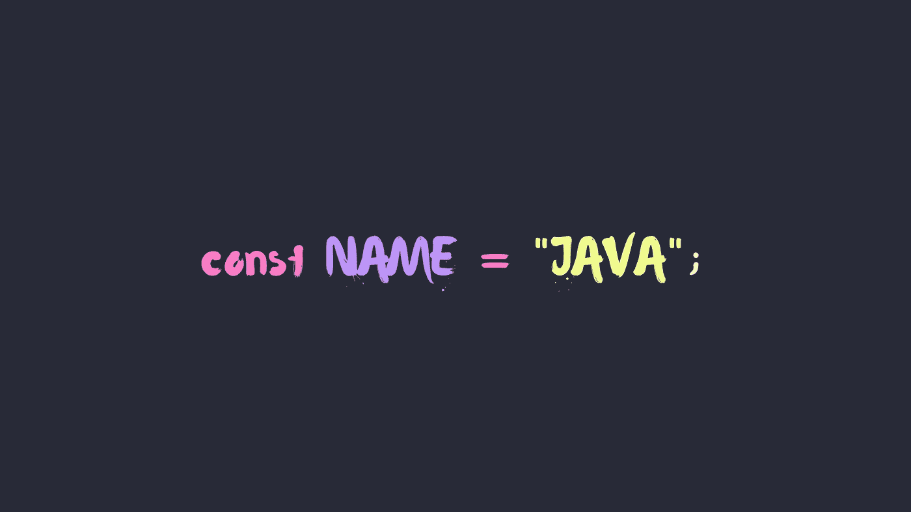
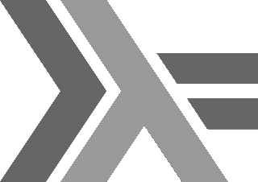

# 你最喜欢的编程语言是如何得名的

> 原文：<https://betterprogramming.pub/how-your-favorite-programming-languages-got-their-names-9916fe997f78>

## 总之，蛇和咖啡与编程有什么关系？

作者提供的图片

你可能听说过这样一种说法[计算机科学只有两件很难的事情，](https://martinfowler.com/bliki/TwoHardThings.html#:~:text=There%20are%20only%20two%20hard,cache%20invalidation%20and%20naming%20things.)其中之一就是给事物命名。有些编程语言的名字很有意义，比如 Google 将他们的语言命名为 Go(lang)。其他名字——如 Python 和 Java——就不那么明显了。

让我们探索一些最具标志性的编程语言的历史，以及它们的名字是如何来的。

# 计算机编程语言

Python 是吉多·范·罗苏姆创造的一个[“业余爱好”编程项目，让他在圣诞假期](https://www.python.org/doc/essays/foreword/)有事可做。对于他的语言，范罗森想要一个简短、独特、略带神秘的名字。鉴于 Python 的“两条蛇”标志，你可能会认为 Python 是以巨大的蟒蛇命名的(能够吞下一整条鳄鱼！).

更确切地说，在“[略带不敬的心情](https://www.python.org/doc/essays/foreword/)下，圭多以 70 年代的英国喜剧系列《巨蟒剧团之飞行马戏团》命名了它。原来他是这部剧的超级粉丝，只是碰巧当时在看这部剧的剧本。

Python 的“两条蛇”标志与名字的由来无关。[来源。](https://www.python.org/community/logos/)

# Java 语言(一种计算机语言，尤用于创建网站)

Java 是在 20 世纪 90 年代早期由太阳微系统公司开发的，作为绿色项目的一部分。创造一种新的语言[甚至不是项目](https://web.archive.org/web/20080530073139/http://java.sun.com/features/1998/05/birthday.html)的重点:开发 Java 是因为他们需要一种独立于处理器的语言，能够提供 C++的大部分功能，同时更容易使用。绝密的*绿色团队*的成立是为了建立超越个人电脑的“下一波计算”，他们认为这是互动的、数字控制的消费电子产品(“智能设备”的前身)。

绿色团队的伟大创造:一个被称为*7 的无线全彩触摸屏控制器。[来源](https://tech-insider.org/java/research/1998/05-a.html)。

Java 最初被命名为 Oak，是以开发者窗外的一棵树命名的。然而，当 Sun 的律师确定 Oak 已经被注册为商标时，的绿色团队召集了一次咖啡因引发的头脑风暴会议，并想出了 Java 这个名字。[他们想要一些反映他们语言精髓的东西](https://www.infoworld.com/article/2077265/so-why-did-they-decide-to-call-it-java-.html):“充满活力、革命性、生动有趣”。从一个被描述为“基本上持续的疯狂”的会议来看，Java 是一个完美的选择。

虽然*7 有点超前，从未真正起飞，但它所基于的编程语言做到了——剩下的就是历史了。

# Java Script 语言

JavaScript 是由 Brendan Eich 于 1995 年在 Netscape——当时最流行的网络浏览器 Navigator 背后的公司——创建的。那时，网页是完全静态的，但是网景公司预见了今天存在的动态的、交互式的网络。感受到来自微软的 Internet Explorer 的压力，他们雇佣了 Eich 将一种脚本语言集成到他们的浏览器中。

Netscape 想创造一种简单易用的语言。借助 Java 的蓬勃发展，他们将这种语言描绘成[“Java 的脚本伴侣”](https://auth0.com/blog/a-brief-history-of-javascript/)，类似于 Visual Basic 是 C/C++的补充。由于强调快速开发和简单性，Eich 继承了 Java 的大部分语法，仅用了 10 天就编写了第一个版本的 JavaScript。它被恰如其分地命名为摩卡。

> “我接到营销指令，要让它看起来像 Java，但不要太大[……]这只是一种愚蠢的小兄弟语言，对吗？Java 的伙伴。”— [布伦丹·艾希](https://thenewstack.io/brendan-eich-on-creating-javascript-in-10-days-and-what-hed-do-differently-today/)

当这种语言首次集成到 Netscape 中时，它被称为 LiveScript。不久之后，网景公司全力以赴开发“Java 伴侣”剧本。他们与 Sun 合作，将他们的语言重命名为 JavaScript，并将其与 Java 并驾齐驱:JavaScript 被宣传为浏览器中小型客户端任务的脚本语言，而 Java 将被宣传为开发丰富 web 组件的更大、更专业的工具。事实上，JavaScript 名字的起源是网景公司试图抵御微软的一个营销策略。

# C 系列(C、C++、Objective-C、C#)

第一种编程语言被命名为 Ada，归功于阿达·洛芙莱斯和 T2。不久之后就有了一种叫 B 的语言，C 这个名字就是由此衍生出来的。C 语言由贝尔实验室的丹尼斯·里奇开发，被许多人认为是第一种高级编程语言。

C 有很多扩展，包括 C++、Objective-C 和 C#。C++和 Objective-C 这两个名字是不言自明的，而 C#就不那么明显了。C#受到音乐的启发:一个高(#)音符意味着它应该在音高上提高半音。更有趣的是,#符号是一个 2x2 正方形中 4 +符号的连字，非常适合 C#是 C++的“增量”!

# 迅速发生的

2010 年在苹果公司快速开发，四年后首次发布。由于它的主要影响是 Objective-C，苹果吹捧 Swift 是快速、易于使用和安全的设计。起初， [Swift 被命名为 Shiny，好像你在打造一个“闪亮的新东西”](https://oleb.net/2019/chris-lattner-swift-origins/)。事实上，它甚至有文件扩展名`.shiny`。

Swift 这个名字最终被选中，以反映其速度——在性能和开发时间方面。雨燕的标志是一种同名的鸟:[雨燕](https://en.wikipedia.org/wiki/Swift)是一种以速度和空中力量闻名的鸟类。

斯威夫特的标志描绘了一只同名的快速鸟。[来源。](https://commons.wikimedia.org/wiki/File:Swift_logo_with_text.svg)

# 哈斯克尔

哈斯克尔是以逻辑学家[哈斯凯尔·布鲁克斯·加里](https://en.wikipedia.org/wiki/Haskell_Curry)的名字命名的，他因在组合逻辑方面的工作而闻名。事实上，有一种编程语言以他的名字命名:Haskell、 [Brook](https://graphics.stanford.edu/projects/brookgpu/) 和 [Curry](https://www-ps.informatik.uni-kiel.de/currywiki/) ！[阿谀奉承](https://en.wikipedia.org/wiki/Currying)的概念也是以他命名的。

Haskell 很少讨论的一个有趣的方面是它的徽标。你可能会注意到标志中的 *λ* 符号，这是对[λ演算](http://dev.stephendiehl.com/fun/lambda_calculus.html)的赞颂。然而，再仔细看一点，你会发现 *λ* 被夹在一个“ *>* ”和“=”之间。这来自于[臭名昭著的*为单子*](https://www.haskell.org/tutorial/monads.html#:~:text=The%20Monad%20class%20defines%20two,%3D%20(bind)%20and%20return.&text=The%20bind%20operations%2C%20%3E%3E%20and,into%20the%20monad%20(container).&text=The%20%3E%3E%20function%20is%20used%20when,by%20the%20first%20monadic%20operator.) : `>>=`绑定运算符。Haskell 的标志是与一个 *λ* 交织的绑定操作符。

Haskell 徽标是绑定运算符和 lambda 符号的组合。[来源。](https://commons.wikimedia.org/wiki/File:Haskell-Logo.svg)

希望你喜欢学习一些编程语言的历史。我在研究这个故事的过程中获得了很多乐趣，因为我认为其中的一些起源故事绝对令人着迷。

如果你有我没有提到的其他编程语言的有趣起源故事，请分享！感谢阅读！

您还可以享受:

 [## 您最喜欢的库和框架是如何得名的

### Django 在一个装有 Laravel 和 Hadoop 的烧瓶中运行

medium.com](https://medium.com/better-programming/how-your-favorite-libraries-and-frameworks-got-their-names-2a4c4f805cda)