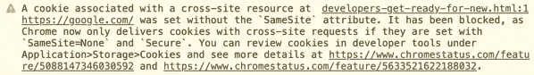

# Chrome 80 更新会如何破坏你的网站和应用

> 原文：<https://betterprogramming.pub/how-your-websites-and-apps-could-be-broken-right-now-by-the-chrome-80-update-b654f074313>

## 破坏网站的安全更新也破坏了我的网站。以下是你如何防止它发生在你身上


克里斯蒂安·威迪格在 [Unsplash](https://unsplash.com/s/photos/google-chrome-browser?utm_source=unsplash&utm_medium=referral&utm_content=creditCopyText) 上拍摄的照片

Chrome 80 更新是谷歌在今年 2 月宣布的——2020 年。但我没有听说过，作为一名软件开发人员和商业应用的维护者，这对于我来说是件坏事。这些事情太重要了，我应该在上面。

无论如何，更新是一个好消息。它专注于基于 chrome 浏览器的安全，如谷歌 Chrome、Opera、Internet Explorer 等。它是在 2 月份宣布的，并使用金丝雀部署模型进行了推广。

这意味着一些精选用户——由谷歌确定——将首先收到更新，然后越来越多的人将逐渐收到更新，这取决于它对第一批接收者是否有效。

许多基于 chrome 的浏览器还没有升级到新的 Chrome 版本，但很快他们最终会升级的。只要没有太多的抱怨，他们会的。

也就是说，除了更新中可能的错误修复和其他内容，还有一个突出的新功能可能会破坏许多网站。

我最近为了维护协议访问了一个客户的网站，发现我无法登录。所以我做了每个 web 开发人员都会做的事情:我检查了浏览器控制台。

不料这个错误，正盯着我



图片来自[的 Chromium 博客](https://blog.chromium.org/2020/02/samesite-cookie-changes-in-february.html)

# 背景

出于安全考虑，网络浏览器不允许访问主机的设备存储。但是为了给用户提供个性化的功能，网络开发者已经被提供了临时的浏览器内存储，也就是大家所知道的 cookies。网络上到处都是 Cookies。一段时间以来，每个人都认为 cookie 是不好的，而创建 cookie 的初衷本身是好的:为用户提供个性化的功能。

例如，为了保持用户登录到他们最喜欢的网站，以便他们不必每次访问该网站时都登录，cookies 用于在用户第一次登录后保存用户的 ID。这称为会话，即已经为用户创建了一个会话。

通常，登录的会话会保留几天，这取决于开发人员对网站安全性的担忧，就像 PayPal 和 stripe 的情况一样，cookies 非常短暂，以至于用户出于安全原因经常登录。

cookies 派上用场的另一个场景是，当用户保存某一类产品的过滤器，以便每次在电子商务网站上购物时向他们显示，比如联想 Thinkpad 笔记本电脑的过滤器。

当类似的事情发生时，作为开发人员，您应该在用户的浏览器中设置一个 cookie，如下所示:

```
Set Cookie: Category=Electronics and Computers; Type=Computers; Details=Lenovo Thinkpad
```

(不完全是那样，只是那种形式的东西。)

现在，当您设置 cookies 时，这是在后台发生的事情。

您可以为 cookie 设置几个属性。例如，相同站点属性、cookie 的最大年龄或到期时间、安全属性，即浏览器是否应该使用安全手段来提供 cookie、cookie 的路径、cookie 的域等。

所有这些属性决定了浏览器如何使用 cookie，哪些网站可以看到它，浏览器如何保护 cookie，以及将 cookie 保存在哪里。

但问题是，作为开发人员，至少对于对 web 安全不太感兴趣的开发人员来说，上述 cookie 属性中只有一些对我们最重要。

我们倾向于只设置 cookie 的名称和它的值以及 cookie 的到期时间，然后让浏览器为它设置默认值。

我不知道，可能很多开发者也不知道这一点。

每当一个网站链接到一个资源，比如另一个网站的图片，被链接的网站在访问者浏览器上设置的 cookies 就会被发送到链接的网站。

这意味着你设置的每一个 cookie 都可能被其他网站的服务器访问。他们需要做的就是链接到你网站上的资源，然后等待你的用户访问他们的网站。

这方面的知识可能会被利用来访问未经授权的信息，从而在网站上进行某些攻击。

这种漏洞被称为**跨站请求伪造(CSRF)** 。

想象一下，如果您将用户的密码和用户名保存在 cookie 中，就会发生这种情况。灾难，嗯…

这就是为什么我们只在 cookie 中保存加密的用户 id，而从不在 cookie 中保存密码，无论加密与否。

*但是事情为什么要这样运作；为什么每个人都可以访问我的 cookies？*

如果你问这个问题，那是因为我们没有学习。是的，你和我，我们没能学会。

cookie 上的`SameSite`属性可以用来表示您是否希望您的 cookie 被发送到其他站点。

但是，我们没有意识到，也许是因为它在我们的盲点上。我们只对网站的功能感兴趣，所以我们没有设置这个属性，作为回报，浏览器默认设置为这个属性，也就是`None`——意思是把我的 cookies 提供给任何人。

可以设置的其他可能值包括:`Lax and Strict.`

在新的 Chrome 80 更新中，该属性现在要求如果你将`None`设置为它，你还必须指定`Secure`。这意味着，是的，您希望将 cookie 发送到其他站点，但是只能在安全的上下文中。

更详细的解释见[这里](https://web.dev/samesite-cookies-explained/)。

# 这个更新可能会破坏你的 Angular 应用程序

为了在我的 angular 应用中设置 cookies，我使用了`ngx-cookie-service`库，我相信其他几个 Angular 开发者也在使用这个库。

但是，我是如何知道 chrome 80 更新的，是因为我维护的一个网站在谷歌 chrome 浏览器上崩溃了。这意味着，如果你试图从 Chrome 浏览器登录该网站，你将无法登录。

发生这种情况是因为`ngx-cookie-service`不再正确设置 cookies，这是我在两天的检查、研究和试验后意识到的。`Ngx-cookie-service`在 Chrome 浏览器上设置 cookies 有一个已知问题，但是这个问题已经[修复](https://github.com/stevermeister/ngx-cookie-service/issues/28)。

修复方法是设置 cookies，确保将 path 属性设置为`/`。但似乎这一修复对 Chrome 80 更新不再有效。我不知道我在这一点上有多正确，但是[我在这上面开了一个问题](https://github.com/stevermeister/ngx-cookie-service/issues/112#issuecomment-687980309),这样开发者可以再次调查它，因为最初的问题并没有真正解决。这只是一个解决办法。

为了明确起见，我还试着更新了模块，看看它是否已经得到了修复，但这并没有解决问题。

同时，在事情稳定下来之前，您可以使用的另一个变通方法是使用 DOM 对象来设置 cookies，然后您就可以使用普通的`ngx-cookie-service` API 来访问它们。

例如:

```
document.cookie = "userId=d123DujfOkxPxjsk234jwskksjd; Max-Age=${60*60*24}; SameSite=Strict";
```

然后要访问它，你只需在你的组件中使用`ngx-cookie-service`,就像这样:

```
// Import ngx-cookie-service
import { CookieService } from 'ngx-cookie-service';// Inject the service
constructor(
 private cookieService: CookieService
){ }// Read the cookie value
userId = this.cookieService.get("userId");
```

# 这个更新会如何破坏其他所有的网站

根据我的理解，Chrome 80 的更新可能会要求每个开发者或网站维护者为他们的网站提供服务，如果他们还想从谷歌 Chrome 用户那里获得流量的话。

对于任何使用 cookies 向用户提供个性化数据和功能的网站来说，这次更新可能会破坏他们的网站。

在过去的默认情况下，如果没有为 cookies 上的 SameSite 属性指定任何值，该属性就会被设置为`None`，而现在新的浏览器会将其设置为`Lax`。如果你之前没有设置，那么你的网站肯定会崩溃；到 chrome 80 更新时，现在需要的值是`SameSite=None; Secure;`。

谷歌 Chrome 从 84 版开始就有这种默认行为，火狐从 69 版开始就已经在测试中了。

显式地声明它也更安全，而不是无所事事，抱最好的希望，因为你甚至可能使用某个库在你的站点上设置 cookies，而你不确定它默认设置的值是多少。

在 GitHub 上，在用户 ***axos88*** 打开的`ngx-cookie-service` repo 上有一个[开放问题](https://github.com/stevermeister/ngx-cookie-service/issues/98)，请求库开发者改变`ngx-cookie-service`的实现，使其在`SameSite` 值未设置时显式声明`Lax`。

这是为了支持仍在为该值设置`None`的旧浏览器。

所以，考虑到所有这些，你不能说用户应该清除所有的 cookies 并更新他们的浏览器，然后一切都会恢复正常。你必须为网站提供服务，并明确说明你设置的所有 cookies 的`SameSite`值应该是多少，这样你才能确定。

即使对你的 cookie 库进行了更新，你仍然需要进入你的站点的源代码并更新你正在使用的模块的版本。

所以，就去服务你的网站吧，就像这个好孩子的仆人在这里做的那样…


通过[Kootenaydistrictcouncil](https://kootenaydistrictcouncil.wordpress.com/gallery/cupe-local-748-ralley-in-nelson-on-november-28-2013/)

别紧张，伙计们。