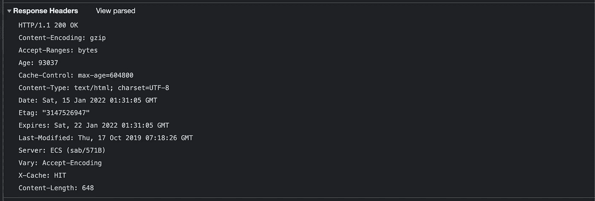
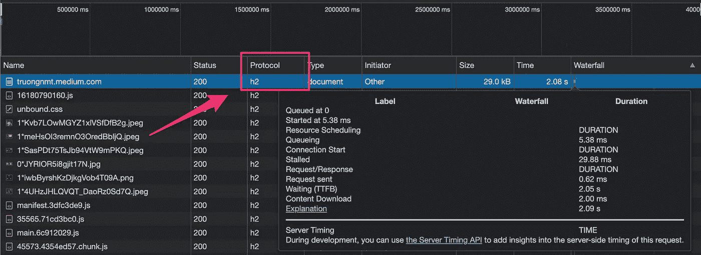
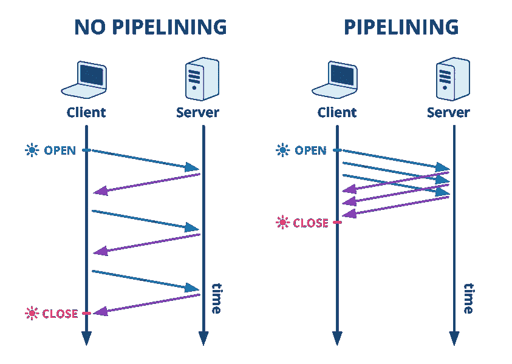
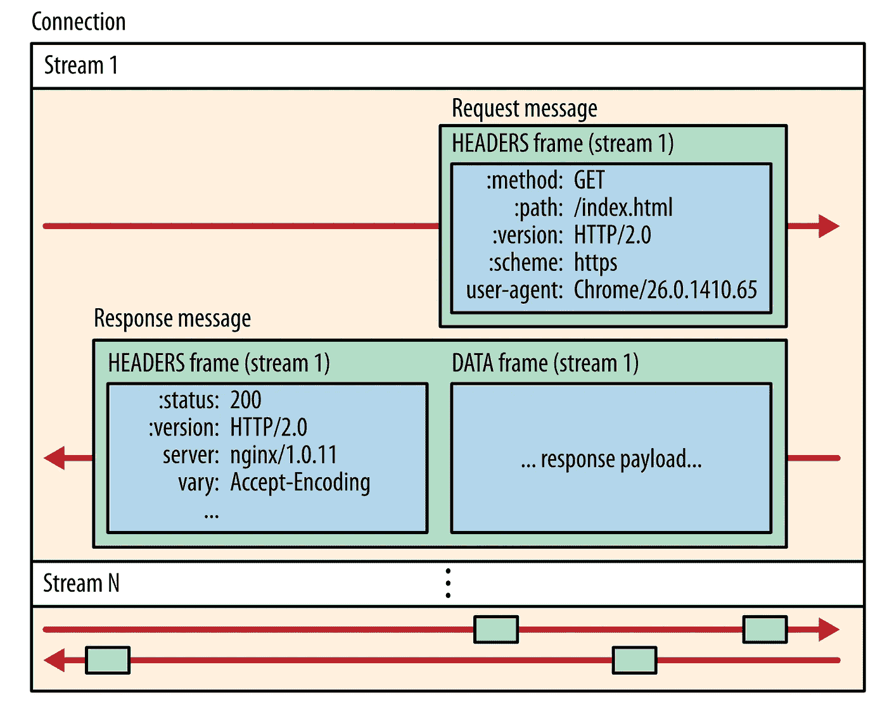
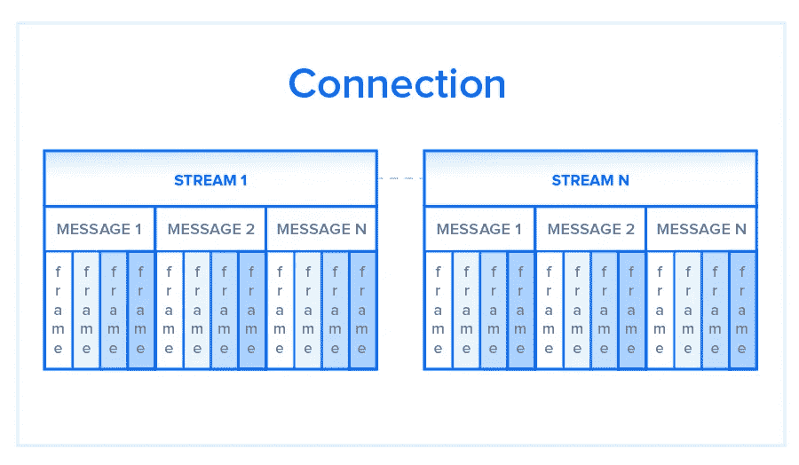
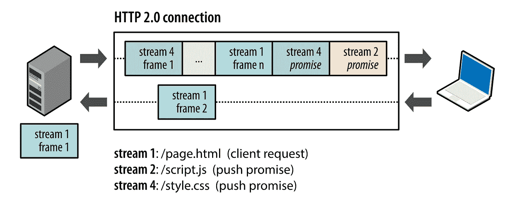
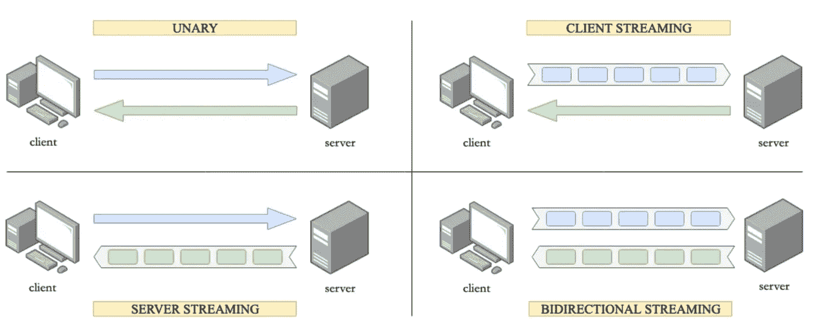
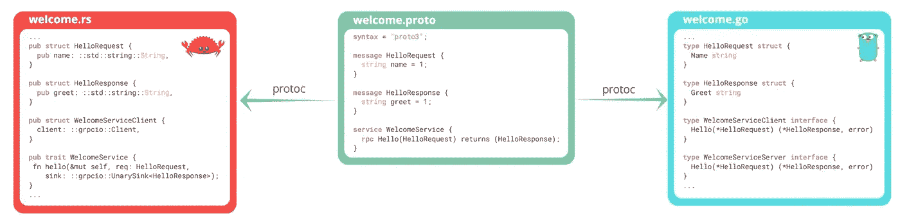

# HTTP/2 和 GRPC:微服务通信的事实标准

> 原文：<https://betterprogramming.pub/http-2-and-grpc-the-de-facto-for-microservices-communication-84a6bb2a6126>

## HTTP/2 和 gRPC 允许微服务之间更快、更简单、更健壮的通信。但是你有没有想过为什么我们使用这个技术栈，为什么他们发明了 HTTP/2 和 gRPC？

照片由 [NASA](https://unsplash.com/@nasa?utm_source=medium&utm_medium=referral) 在 [Unsplash](https://unsplash.com?utm_source=medium&utm_medium=referral) 拍摄

在本文中，让我们看看 HTTP/2 与 HTTP/1.x 的主要区别是什么，它解决了哪些问题，以及 gRPC 如何在幕后利用 HTTP/2，并利用 HTTP/2 的所有效率。

# 关于 HTTP 协议的背景

应用层是开放系统互连(OSI)模型的最高层，即第 7 层。应用层有许多网络协议，HTTP 是其中之一。

## HTTP/1.1

HTTP/1.1 于 1989 年开发，作为万维网的通信标准。HTTP 使用类似于`GET` `POST`或`DELETE`的方法来指定客户端想要对资源执行的操作。

例如，假设您正在`[www.example.com](http://www.example.com.)` [访问一个网站。](http://www.example.com.)当您导航到此 URL 时，网络浏览器会以文本消息的形式发送一个 HTTP 请求。

HTTP/1 中的原始请求头

作为对该请求的响应，web 服务器向发出请求的客户机返回一个 HTML 页面，以及 HTML 中调用的任何图像、样式表或其他资源。请注意，在第一次调用数据时，并不是所有的资源都返回给客户端。请求和响应将在服务器和客户机之间来回传递，直到 web 浏览器接收到在屏幕上显示 HTML 页面内容所需的所有资源。

HTTP/1 中的原始响应头

## HTTP/2

HTTP/2 发布于 2015 年 5 月。从技术角度来看，区分 HTTP/1.1 和 HTTP/2 的最重要的特性之一是二进制帧层。与将所有请求和响应保持为纯文本格式的 HTTP/1.1 相反，HTTP/2 使用二进制帧层以二进制格式封装所有消息，同时仍然保持 HTTP 语义，如动词、方法和头。应用程序级 API 仍然会创建传统 HTTP 格式的消息，但是底层会将这些消息转换成二进制格式。这确保了在 HTTP/2 之前创建的 web 应用程序在与新协议交互时可以继续正常运行。

因此，HTTP/1.1 和 HTTP/2 共享语义，使用类似于`GET`和`POST`的熟悉方法，确保在这两种协议中的服务器和客户机之间传输的请求和响应以传统格式的消息(带有消息头和消息体)的形式到达目的地。在下一节中，让我们看看 HTTP/1.1 如何试图通过其交付模型来优化效率，以及由此产生的问题，随后是 HTTP/2 的二进制帧层的优点，以及它如何对请求进行优先级排序的描述。

h2 = HTTP/2

# HTTP/1.1 问题

## 流水线和行首阻塞

客户端收到的对 HTTP `GET`请求的第一个响应通常不是完整呈现的页面。相反，它包含所请求页面所需的附加资源的链接。客户端发现，只有在下载页面之后，页面的完整呈现才需要服务器提供这些额外的资源。因此，客户端将不得不发出额外的请求来检索这些资源。在 HTTP/1.0 中，对于每个新的请求，客户机必须中断并重建 TCP 连接，这在时间和资源上都是一件昂贵的事情。

HTTP/1.1 通过引入持久连接和管道来解决这个问题。对于持久连接，HTTP/1.1 假设 TCP 连接应该保持打开，除非直接被告知关闭，这大大提高了重新建立 TCP 连接的成本。通过管道，客户机可以沿着同一连接一个接一个地发送请求，而不必等待每个请求的响应。

HTTP 管道——图片来自 [HAProxy](https://www.haproxy.com/blog/http-keep-alive-pipelining-multiplexing-and-connection-pooling/)

但是，服务器仍然需要按照传入请求的顺序发送响应。所以 HTTP/1.1 仍然是一个先进先出队列**并且存在这样的情况，即在队列最前面的一个请求不能获得它所需要的资源，它将阻塞它后面的所有请求。这就是所谓的*线头(HOL)* 阻塞。添加单独的并行 TCP 连接可能有助于解决这个问题，但是客户端和服务器之间的并发 TCP 连接数量是有限的，每个新连接都需要大量资源，这与 HTTP/1.0 存在相同的问题。**

HTTP/2 就是为了解决这些问题而产生的。让我们看看如何使用二进制帧层可以解决这些问题。

# HTTP/2 和 HTTP/1.x 之间的主要区别

## 二进制帧层

在一个 HTTP/2 连接中，有多个数据流。每个流由多条消息组成，这些消息采用熟悉的请求/响应格式。

这些消息中的每一条都被分割成更小的单元，称为帧。

在最细的层次上，通信信道由一组二进制编码的帧组成，每个帧都标记有一个特定的流。识别标记允许连接在传输过程中交错这些帧，并在另一端重新组合它们。交错的请求和响应可以并行运行，而不会阻塞它们后面的消息，这个过程称为*多路复用*。多路复用解决了 HTTP/1.1 中的行首阻塞问题，它确保没有消息必须等待另一个消息完成。这也意味着服务器和客户端可以并发发送请求和响应，从而实现更好的控制和更高效的连接管理。

由于多路复用允许客户端并行构建多个流，因此这些流只需要使用一个 TCP 连接。通过减少整个网络中的内存和处理空间，每个源拥有一个持久连接对 HTTP/1.1 进行了改进。这将提高网络和带宽利用率，从而降低总体运营成本。

## 标题压缩

每个 HTTP 传输都带有一组描述传输的资源及其属性的头。在 HTTP/1.x 中，该元数据总是以纯文本形式发送，每次传输会增加 500–800 字节的开销，如果使用 HTTP cookies，有时会增加数千字节。为了减少这种开销并提高性能，HTTP/2 使用 HPACK 压缩格式压缩请求和响应头元数据。

除了压缩之外，客户机和服务器还维护一个常见字段及其压缩值的列表。因此，当这些字段重复时，它们仅仅包括对压缩值的引用。

## 服务器推送

除了对原始请求的响应之外，服务器可以将额外的资源推送到客户端，而无需客户端显式地请求每一个资源。

例如，当浏览器请求页面时，服务器在响应中发送 HTML，然后需要等待浏览器解析 HTML 并发出对所有嵌入资源的请求，然后才能开始发送 JavaScript、图像和 CSS。

服务器推送潜在地允许服务器通过将它认为客户机需要的响应“推送”到它的缓存中来避免这种往返延迟。

然而，推送响应并不“神奇”——如果使用不当，会损害性能。服务器推送的正确使用是一个正在进行的实验和研究领域。

总之，与 HTTP/1.1 相比，HTTP/2:

*   是二进制的，而不是文本的
*   是完全多路复用的，而不是有序和分块的
*   因此可以使用一个并行连接
*   使用标头压缩来减少开销
*   允许服务器主动将响应“推送”到客户端缓存中

关于 HTTP/2 的更多细节可以在 HTTP 2 规范和 T2 高性能浏览器网络中找到。

现在你可能想知道 HTTP/2 和 gRPC 之间的关系。gRPC 使用 HTTP/2 作为它的消息协议，因此它具有 HTTP/2 的所有效率。在下一节中，让我们更详细地了解 gRPC 提供了哪些特性，并将其与其他通信类型进行比较。

# 微服务之间的通信

服务通过消息以同步或异步的方式相互通信。让我们看看服务间通信是如何发展的。

## SOAP——简单对象访问协议

*   客户端和服务器以 XML 的形式交换数据
*   由于它的 XML，它可以跨平台实现，完全独立于语言和平台。
*   可以在任何协议上运行，如 HTTP、SMTP、TCP、UDP。
*   今天仍然存在于许多遗留服务中。
*   难以处理，有一套严格的编码规则。
*   协议的冗长、XML 解析速度慢以及缺乏标准化的交互模型导致了直接使用 HTTP 协议的服务占主导地位。比如休息。

## REST —表征状态转移

*   交互(创建、读取、更新、删除)资源的标准方式。
*   将 API(URL)公开为资源的访问点。
*   仅使用 HTTP。
*   仅公开 HTTP 方法上的 CRUD 行为(POST、GET、PUT、PATCH 和 DELETE)。如果我们的需求与这些定义良好的规则略有不同，我们需要调整这组名称来公开我们的 API。
*   不定义严格的接口类型。即使我们有 OpenAPI 或 Swagger 规范，它也不受带下划线的体系结构或消息协议的类型限制。

## gRPC — Google 远程过程调用

*   Google 设计的开源 RPC 框架。
*   公开供其他服务远程调用的过程。
*   最大的优点是它与 HTTP/2 协议一起工作，因此受益于 HTTP/2 的上述许多效率。
*   在 gRPC 中实现协议缓冲区或 Protobuf，一种 IDL(接口描述语言)。

既然我们已经了解了几个流行的内部通信协议的背景和一般概念。让我们看看利弊，以及为什么我们应该选择 gRPC 而不是 REST 进行微服务通信。

# gRPC 与 REST

## HTTP/1.1 与 HTTP/2

REST APIs 遵循请求-响应的通信模型，该模型通常构建在 HTTP 1.1 之上。不幸的是，这意味着如果微服务接收到来自客户端的多个请求，模型必须一次处理一个请求，从而降低整个系统的速度。然而，REST API 也可以构建在 HTTP/2 上，**但是通信的请求-响应模型保持不变**，这就禁止了 REST API 充分利用 HTTP 2 的优势，比如**流通信**和**双向支持**。

gRPC 没有面临类似的障碍。它建立在 HTTP 2 之上，支持双向通信和流通信。gRPC 可以通过不断地传输信息来同时处理请求，同时也可以处理“一元”交互，比如构建在 HTTP 1.1 上的交互。

4 种 gRPC

## 有效载荷数据结构

如前所述，gRPC 默认使用协议缓冲区来序列化有效负载数据。这种解决方案更轻便，因为它支持高度压缩的格式，并减小了消息的大小。进一步来说， [**Protobuf**](https://developers.google.com/protocol-buffers) (或协议缓冲区)是二进制的；因此，它序列化和反序列化结构化数据，以便进行通信和传输。换句话说，**强类型**消息可以自动从 Protobuf 转换成客户端和服务器的编程语言。

这可以减少从字符串到类型转换的许多错误，例如，客户端发送一个`int64`字段类型，它被转换为 JSON 字符串并发送给服务器，但是服务器期望`int32`字段类型，所有类型的错误都可能发生。

REST 主要依靠 JSON 或 XML 格式来发送和接收数据。事实上，尽管 JSON 没有强制要求任何结构，但它是最流行的格式，因为它具有灵活性和发送动态数据的能力，而不必遵循严格的结构。使用 JSON 的另一个重要好处是它的可读性，这是 Protobuf 还无法与之竞争的。

尽管如此，在数据传输方面，JSON 并没有那么轻便和快速。原因在于，当使用 REST 时，JSON(或其他格式)必须被序列化，并转换成客户端和服务器端都使用的编程语言。这给传输数据的过程增加了额外的步骤和开销，从而可能损害性能并可能导致错误。

## 构建代码生成功能

与 gRPC 不同，REST API 不提供内置的代码生成功能，这意味着开发人员必须使用像 Swagger 或 Postman 这样的第三方工具来为 API 请求生成代码。

相比之下，gRPC 由于其**协议编译器**而具有**本地代码生成**特性，该编译器兼容多种编程语言。这对于集成了用不同语言和平台开发的各种服务的微服务系统尤其有利。

# 结论

在本文中，我们了解了 HTTP/2，它为什么诞生，它解决了什么问题，与 HTTP/1.x 相比的主要区别，以及 gRPC 如何在幕后利用 HTTP/2 并利用 HTTP/2 的所有效率。我们还比较了 REST 和 gRPC，发现 gRPC 在性能、有效负载数据结构和本地生成代码的能力方面比 REST 有很多优势。这些原因使得 HTTP/2 和 gRPC 完全适合高性能、可靠性和健壮的微服务通信。

# 参考

*   [HTTP/1.1 vs HTTP/2:有什么区别？](https://www.digitalocean.com/community/tutorials/http-1-1-vs-http-2-what-s-the-difference)(digitalocean.com)
*   [HTTP/2 和 gRPC——下一代微服务交互](https://blog.netsil.com/http-2-and-grpc-the-next-generation-of-microservices-interactions-aff4ffa6faed)(blog.netsil.com)
*   [HTTP/2](https://developers.google.com/web/fundamentals/performance/http2)简介(developers.google.com)
*   [HTTP/2 常见问题解答](https://http2.github.io/faq/) (http2.github.io)
*   [www.imaginarycloud.com GRPC VS REST:比较 API 架构风格](https://www.imaginarycloud.com/blog/grpc-vs-rest/)

*感谢您阅读本文！如果你有任何问题，请留言。如果你觉得这篇文章有帮助，请按住鼓掌按钮，让其他人也能发现。请务必在下面注册我的时事通讯，或者在 Medium 上关注我，以获得更多类似的文章。* ☝️👏 😄