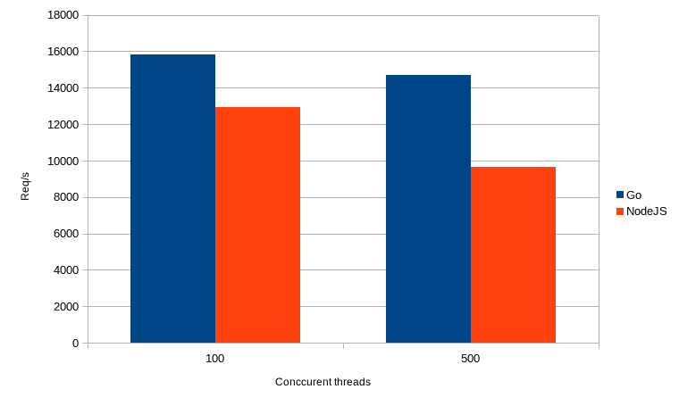

# Http 服务器性能:NodeJS 与 Go

> 原文：<https://betterprogramming.pub/http-server-performance-nodejs-vs-go-397751e8d275>

## 谁交付的并发请求数量更多？


让·格柏在 Unsplash[上的照片](https://unsplash.com?utm_source=medium&utm_medium=referral)

我们正在开发类似广告代理或谷歌广告缓冲区的东西。服务只是将 ad HTTP 请求转发到 SSPs 服务器。为此，有必要用最少的硬件资源创建许多 HTTP 请求。因此，我们决定研究和比较虚拟机的编程语言，并编译了一个。

我们非常熟悉 NodeJS 和 JavaScript 技术。因此，我们开始测试与 V8 引擎的 HTTP 连接。当然，我们不是从零开始，我们用的是 [fastify](https://github.com/fastify/fastify) 包。它实际上是基于 NodeJS HTTP 包。所以在软件栈的底部是一个编译好的低级 HTTP 服务器。但无论如何，V8 下有一个很小的层在运行。问题是这一层如何降低执行速度。

# **节点 JS**

这个脚本非常简单。

```
const fastify = require(“fastify”)({
 logger: false,
});fastify.get(“/fillbuffer”, async (request, reply) => {
 reply.type(“application/json”).code(200);
 return {
 result: `{result: “Hello world”}`,
 };
});fastify.listen(3008, (err, address) => {
 if (err) throw err;
});
```

我使用 ApacheBench (ab)工具进行测试。让我们跳过完整的硬件规格。我只能说我用的是 I7–8550 u CPU。

```
ab -n 1000000 -c 100 localhost:3008/fillbufferRequests per second: 12925.33 [#/sec] (mean)
Time per request: 7.737 [ms] (mean)
Time per request: 0.077 [ms] (mean, across all concurrent requests)Percentage of the requests served within a certain time (ms)
 50% 8
 66% 8
 75% 8
 80% 8
 90% 9
 95% 10
 98% 12
 99% 13
 100% 106 (longest request)
```

让我们尝试更多的并发连接。

```
ab -n 1000000 -c 500 localhost:3008/fillbufferResults:
Requests per second: 9673.37 [#/sec] (mean)
Time per request: 51.688 [ms] (mean)
Time per request: 0.103 [ms] (mean, across all concurrent requestPercentage of the requests served within a certain time (ms)
 50% 48
 66% 49
 75% 50
 80% 51
 90% 58
 95% 79
 98% 137
 99% 156
 100% 286 (longest request)
```

到目前为止一切顺利。500 个并发连接达到了 CPU 极限，节点解决方案开始陷入困境，但让我们开始吧。

# **走**

剧本有点长，但仍然很短。

```
package mainimport (
 “encoding/json”
 “fmt”
 “log”
 “github.com/valyala/fasthttp”
)var (
 addr = “:3008”
 strContentType = []byte(“Content-Type”)
 strApplicationJSON = []byte(“application/json”)
 httpClient *fasthttp.Client
)func main() {
 fmt.Println(“Starting server…”)
 h := requestHandler
 h = fasthttp.CompressHandler(h)httpClient = &fasthttp.Client{
 MaxConnsPerHost: 2048,
 }if err := fasthttp.ListenAndServe(addr, h); err != nil {
 log.Fatalf(“Error in ListenAndServe: %s”, err)
 }
}func requestHandler(ctx *fasthttp.RequestCtx) {
 if string(ctx.Method()) == “GET” {
 switch string(ctx.Path()) {
 case “/fillbuffer”:
 ctx.Response.Header.SetCanonical(strContentType, strApplicationJSON)
 ctx.Response.SetStatusCode(200)
 response := map[string]string{“result”: fmt.Sprintf(“hello world”)}
 if err := json.NewEncoder(ctx).Encode(response); err != nil {
 log.Fatal(err)
 }
 }
 }
}
```

如您所见，我决定使用`fasthttp`作为 HTTP 服务器。该服务器不基于任何 HTTP 库。所以真的是纯 HTTP 协议实现。让我们看看 100 个并发请求的结果。

```
ab -n 1000000 -c 100 localhost:3008/fillbufferRequests per second: 15847.80 [#/sec] (mean)
Time per request: 6.310 [ms] (mean)
Time per request: 0.063 [ms] (mean, across all concurrent requests)Percentage of the requests served within a certain time (ms)
 50% 6
 66% 7
 75% 7
 80% 7
 90% 7
 95% 7
 98% 8
 99% 8
 100% 18 (longest request)
```

嗯，相对于 NodeJS 解决方案来说，数字确实很大。尤其是在特定时间内满足的请求。几乎是平的。让我们开始最后的测试。

```
ab -n 1000000 -c 500 localhost:3008/fillbufferRequests per second: 14682.27 [#/sec] (mean)
Time per request: 34.055 [ms] (mean)
Time per request: 0.068 [ms] (mean, across all concurrent requests)Percentage of the requests served within a certain time (ms)
 50% 34
 66% 36
 75% 37
 80% 37
 90% 39
 95% 40
 98% 41
 99% 41
 100% 62 (longest request)
```

# 结论

如您所见，Go 解决方案的服务时间仍然持平。看起来仍然有获得更多并发请求的空间，但是让我们比较一下基本数字。



Go 是这里唯一的赢家，尤其是在并发请求数较高的情况下。

所以在 V8 引擎下运行的微小层并不那么微小。对于 100 个并发请求，交付的请求会增加 18%以上。500 个并发请求将收益提高了 34%以上。