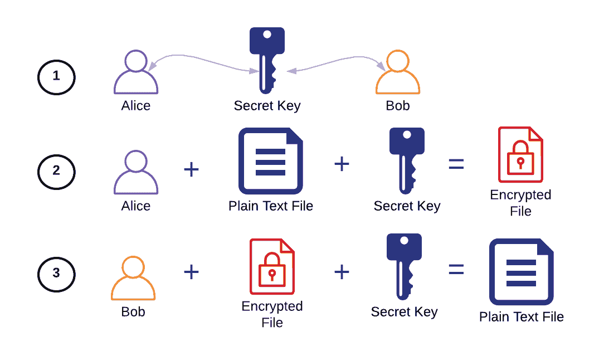
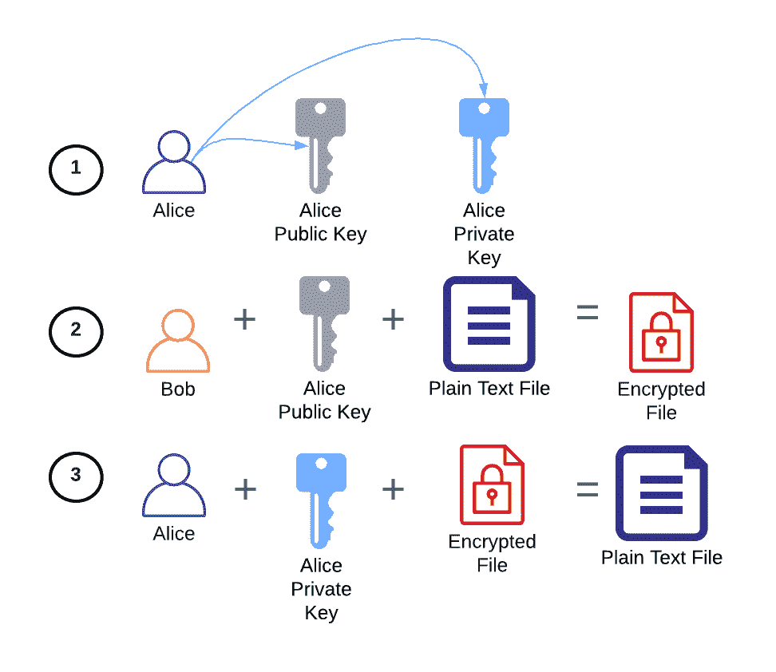
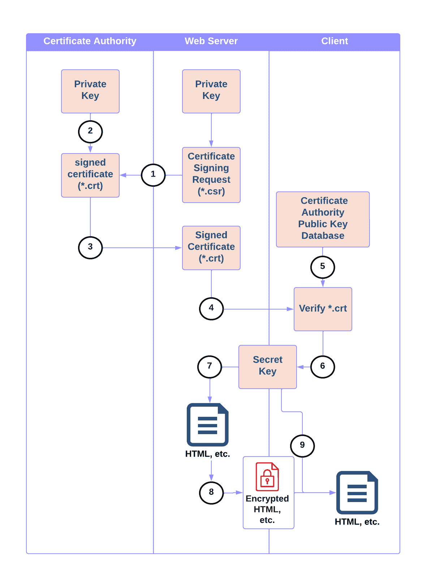

# HTTPS——简而言之

> 原文：<https://betterprogramming.pub/https-in-a-nutshell-4be77279967c>

## 理解 HTTPS 如何工作所需的最少概念


在 [Unsplash](https://unsplash.com/?utm_source=unsplash&utm_medium=referral&utm_content=creditCopyText) 上由[费利佩·格里察](https://unsplash.com/@felipegregate?utm_source=unsplash&utm_medium=referral&utm_content=creditCopyText)拍摄的照片

*对于一些工作来说，拥有一个证书——比如医学学位——是必要的，以确保这个人接受过从事这项工作的适当培训。这种情况引出了一个问题:如何验证一个人是否有证书？*

# HTTPS 是什么？

当一个公司想要确认一个求职者是否拥有他们所说的资格证书时，它可能会雇佣一个“可信的”背景调查机构来联系持有求职者资格证书的机构，以验证他们拥有他们所做的事情。换句话说，一个可信的第三方确认了这种关系。

一旦求职者成为公司的员工，他们通常可以访问公司提供的帐户，如电子邮件地址，这允许他们向公司的其他成员发送私人信息。

验证并通过公共互联网将私人数据发送到网络服务器(如 Amazon.com)的过程类似。客户端，例如像 Firefox 或 Google Chrome 这样的 web 浏览器，通过被称为认证机构(CA)的可信第三方来验证它们已经连接到合法的 web 服务器，该认证机构可以证明浏览器正在与之对话的 web 服务器实际上是它所声称的那个服务器。

一旦通过验证，客户端和浏览器就可以在彼此之间共享私人信息，如登录信息，因为它们已经建立了关系。

总之，超文本传输协议安全(HTTPS)是一种协议，通过该协议，客户端(例如浏览器)可以:

*   验证它是否通过 CA 与正确的 web 服务器对话
*   通过加密在 web 服务器和浏览器之间发送安全数据

我们将在本文的剩余部分讨论这个协议的细节。

# 加密技术

要了解 HTTPS 是如何工作的，我们首先必须了解一些加密技术，因为这些是 HTTPS 的基本工具。我不会深入到每个主题，但会提供一个基本的总结，让您可以掌握一般概念。

## 对称加密

消息、文件等。用私钥加密。这个相同的私钥解密消息。



1.  爱丽丝和鲍勃共用一把秘密钥匙。
2.  Alice 可以使用秘密密钥来加密文件。
3.  Bob 可以用相同的密钥解密加密的文件，以返回原始消息。

```
### Symmetric Encryption with GPG ###### Adapted from [https://www.baeldung.com/linux/encrypt-decrypt-files](https://www.baeldung.com/linux/encrypt-decrypt-files)# create a random file
echo hi > symmetric-example.txt# encrypt it with the phrase "mysecret"
gpg --batch \
    --output symmetric-example.txt.gpg \
    --passphrase mysecret \
    --symmetric symmetric-example.txt# decrypt it with the phrase
gpg --batch \
    --output symmetric-example-out.txt \
    --passphrase mysecret \
    --decrypt symmetric-example.txt.gpg# check the differences
diff symmetric-example.txt symmetric-example.out.txt
```

## 不对称加密

密钥对包括公钥和私钥。公钥可以加密只能用其私钥解密的消息。



1.  Alice 生成公钥和私钥对。
2.  Alice 与 Bob 共享她的公钥，Bob 用它来加密消息。注意:Bob 无法使用 Alice 的公钥解密该消息。
3.  使用 Alice 的私钥将加密的消息解密回原始消息。

```
### Asymmetric Encryption with GPG ###### Adapted from [https://www.baeldung.com/linux/encrypt-decrypt-files](https://www.baeldung.com/linux/encrypt-decrypt-files)# generate the key pair as a key-ring
gpg --batch --generate-key <<EOF
    Key-Type: RSA
    Key-Length: 3072
    Subkey-Type: RSA
    Subkey-Length: 3072
    Name-Real: Alice
    Name-Email: alice@example.com
    Passphrase: alicerocks
    Expire-Date: 30
    %pubring alicepubring.kbx
    %commit
EOF# Create a shareable public key, alicepubkey.gpg
gpg --keyring ./alicepubring.kbx \
    --no-default-keyring \
    --armor \
    --output alicepubkey.gpg \
    --export# Import alice's pubkey into bob's keyring file
gpg --keyring ./bobpubring.kbx \
    --no-default-keyring \
    --import alicepubkey.gpg# Encrypt a file with alice's pubkey
echo "Hi Alice!" > alice.txtgpg --keyring ./bobpubring.kbx \
    --nodefault-keyring \
    --encrypt \
    --recipient "alice@example.com" alice.txt# Decrypt the file with alice's private key
gpg --keyring ./alicepubring.kbx \
    --no-default-keyring \
    --pinentry-mode=loopback \
    --passphrase "alicerocks" \
    --output alice-decrypted.txt \
    --decrypt alice.txt.gpg # Compare the messages
diff -s alice.txt alice-decrypted.txt
```

## 数字证书

数字证书是由“可信”第三方颁发的身份文件(对于 HTTPS，这是 x.509 证书)。数字证书就像护照；它们包含关于实体的身份和认证信息，并有办法通过认证机构验证该信息是否正确。

在护照的情况下，认证机构是政府机构(如美国国务院)，实体是个人。护照中的身份信息包括该人的名、姓、出生日期等。海关和边境官员可以向该机构核实。

对于网站来说，认证机构是像[委托](https://www.entrust.com/)这样的机构，实体是 web 服务器。该证书包括关于 web 服务器的信息，如其通用名称(即域名)、组织、国家等。浏览器可以验证这一点。

以编程方式，数字证书遵循如下接口:

```
DigitalCertificate:
  .public_key            # attribute, webserver pubkey
  .identity_information  # attribute, webserver info
  .issuing_CA            # attribute, CA info
  .verify(CA_public_key) # method, verify it's signed by CA
```

# HTTPS 是如何工作的？

HTTPS 使用对称、非对称和数字证书来实现网络上的安全通信。下图详细描述了从 web 服务器希望向 CA 注册(步骤 1–4)到 web 服务器和浏览器(即客户端)能够安全地相互传输数据(步骤 5–9)的数据流:



HTTPS 通信

1.  web 服务器生成一个证书签名请求(CSR ),其中包括有关 web 服务器的身份信息及其私钥。它将 CSR 发送给 CA。
2.  一旦 CA 批准了 CSR，它就对 CSR 进行签名，从而将其转换成数字证书。
3.  CA 将证书发送回 web 服务器。
4.  当从客户端(例如网络浏览器)向网络服务器发出 GET 请求时，网络服务器将来自步骤 3 的数字证书发送到浏览器。
5.  收到证书后，浏览器会验证该证书是由一个已知的可信 CA 使用该 CA 的公钥签名的。*注意:浏览器内置了一个 CA 公钥数据库*。
6.  一旦通过验证，浏览器就会为 web 服务器和浏览器之间的加密通信生成一个对称会话密钥。该对称会话密钥使用来自证书的 web 服务器的公钥进行加密，并发送回 web 服务器。
7.  web 服务器从客户端接收包含对称会话密钥的消息，并使用其私钥解密对称会话密钥
8.  web 服务器现在可以对称地加密消息，如 HTML 文件等。，并通过互联网发送加密邮件。
9.  一旦客户端收到加密的消息，它就可以解密并查看消息。

# 结论

您可能想知道，当整个过程只需要非对称加密就可以满足时，为什么 HTTPS 同时使用非对称和对称加密？这是因为对称加密相对于非对称加密来说速度更快。一旦客户机和服务器之间的验证完成，客户机和服务器之间就不再需要缓慢的、来回的不对称通信。