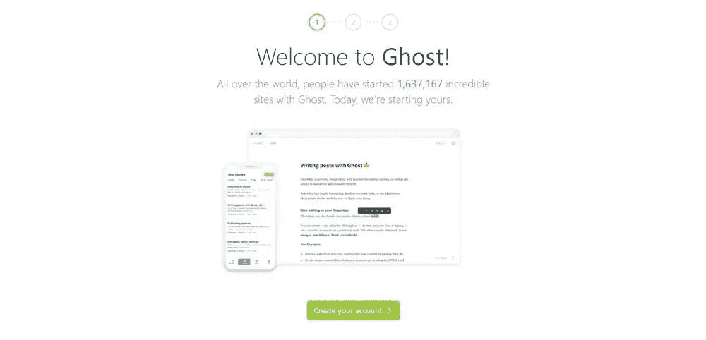
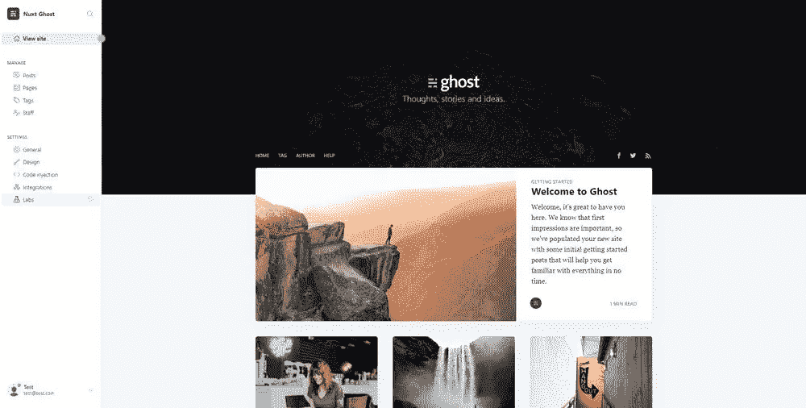
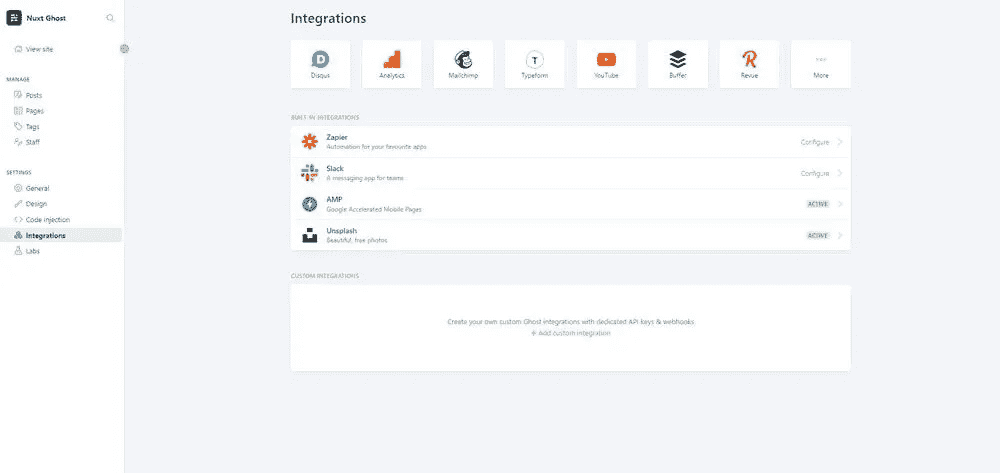
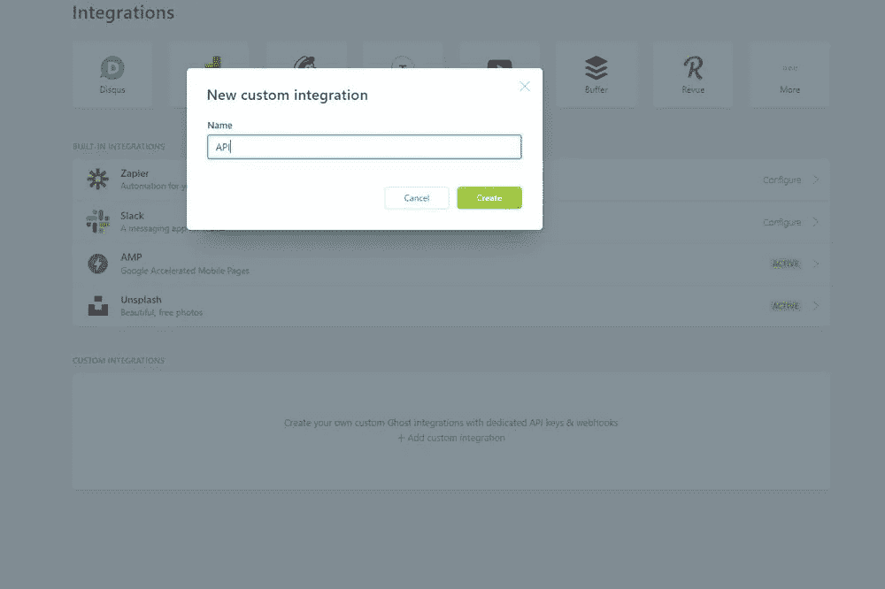
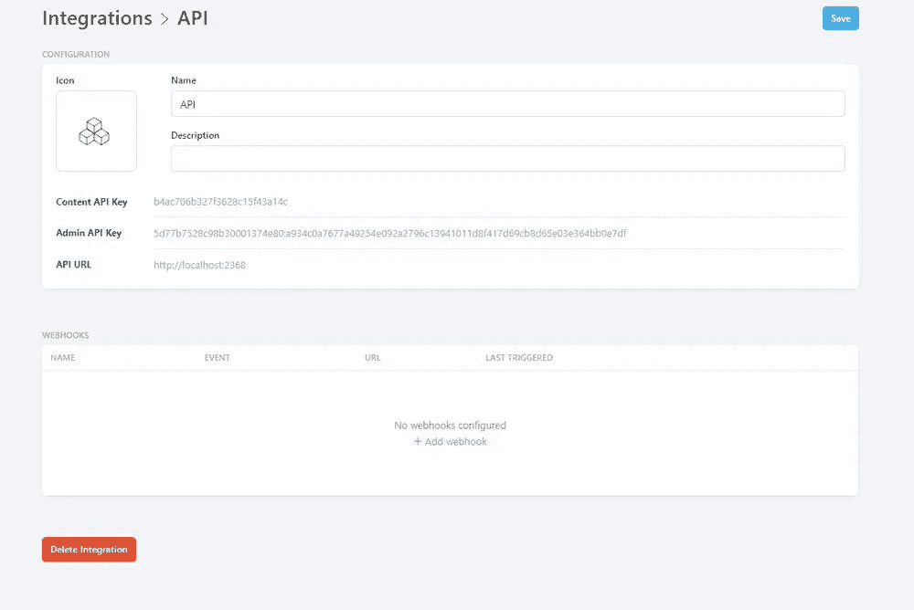
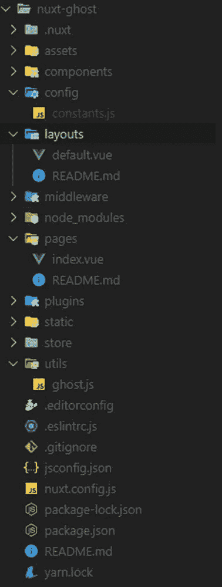
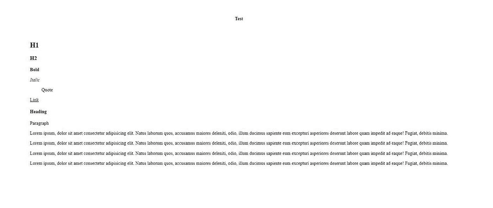

# 使用 Nuxt.js 和 Ghost 创建博客

> 原文：<https://betterprogramming.pub/https-medium-com-better-programming-ghost-cms-using-nuxt-js-5e879c6c7677>

## 构建您自己的开源 CMS


照片由[思想目录](https://unsplash.com/@thoughtcatalog?utm_source=unsplash&utm_medium=referral&utm_content=creditCopyText)在 [Unsplash](https://unsplash.com/s/photos/desk?utm_source=unsplash&utm_medium=referral&utm_content=creditCopyText) 上拍摄

[Ghost](https://ghost.org/about/) 是一个构建和运行现代在线出版物的开源平台。它为从 Zappos 到天空新闻的博客、杂志和记者提供动力。

在本教程中，您将学习如何在本地机器上安装 Ghost，并使用它的 API 在 [Nuxt.js](https://nuxtjs.org/) 中创建博客。

# 为什么要用 Ghost？

现在，问题仍然是:“为什么首先要使用 Ghost？”以下是它相对于其他内容管理系统的一些优势。

## 可扩展的富文本编辑器

Ghost 提供了一个熟悉的编辑环境，可实现无缝创作体验，让作者专注于内容创作。

你可以把它想象成 Medium 的编辑器和 Slack 的集成，这使得编辑你的文章变得非常容易，同时提供了很多很棒的功能。得益于 [MobileDoc](https://github.com/bustle/mobiledoc-kit) ，该编辑器也是完全可扩展的。

## 免费和开源

Ghost 是一个完全开源的应用程序，几乎可以与任何现代技术堆栈一起使用。

它为 Windows 和 Linux 都提供了本地安装设置，甚至它自己的 [Docker](https://www.docker.com/) 映像。如果您想要 Ghost Pro 云解决方案，也可以付费购买。

## 优化的分销渠道

出版一次，到处发行。

这一原则是 Ghost 的核心构建块，使用户能够轻松控制 SEO(搜索引擎优化)，定义元标签，甚至为 RSS 阅读器、电子邮件和 Slack 等工具提供集成。

## 完整的 JSON API

Ghost 的 JSON API 让您可以完全控制获取、设置和显示哪些数据。

它让你有机会在其上构建完整的博客或其他发布应用，并完全定制阅读体验。在本教程中，您将使用 API 将数据获取到您的自定义 Nuxt.js 博客中。

# 幽灵设置

现在，您已经大致了解了为什么应该使用 Ghost 以及它在哪里有用，让我们来看看如何在本地计算机上安装 Ghost。

该装置分为两部分:

1.  在本地机器上安装 Ghost(两种不同的方式)。
2.  基本 Ghost 配置，以便您可以使用 API。

# 装置

## **窗户**

Windows 上的安装过程很简单，可以使用 Ghost-CLI(命令行界面)来完成，可以使用节点包管理器( [npm](https://www.npmjs.com/) 或 [Yarn](https://yarnpkg.com/) 来下载。

```
npm install ghost-cli@latest -g
```

安装后，使用以下命令验证您的安装:

```
ghost -v
```

成功安装 CLI 后，您可以使用以下命令在空目录中安装 Ghost 的本地版本，从而继续操作:

```
ghost install local
```

您的 Ghost 站点现在应该在`[http://localhost:2368](http://localhost:2368.)` [上可见。](http://localhost:2368.)您也可以使用`ghost ls`命令来验证它是否正在运行。

这就是 Windows 安装。以下是一些控制 Ghost 实例的有用命令:

*   `ghost stop`:阻止幽灵。
*   `ghost start`:启动 Ghost。
*   `ghost log`:查看日志。

## **码头工人**

另一种在本地机器上安装 Ghost 的方法是通过官方的 Docker 镜像。

如果你以前没有使用 Docker 的经验，我会推荐你使用上面的安装指南，因为一开始可能很难理解。

以下是运行基本 Ghost 安装的命令:

```
docker run -d --name ghost -p 2368:2368 ghost
```

这个命令运行一个带有官方 Ghost 映像的 Docker 容器并发布端口`2368`，这样您就可以在您的主机系统上使用容器，而不必在端口前键入容器的 IP 地址。

您的实例现在应该在`[http://localhost:2368](http://localhost:2368)`上运行，并且应该与之前安装的相同。

使用 Docker 安装 Ghost 时，您需要记住一件事。这就是当容器生命周期发生变化时，如何保持应用程序状态的方法。这是通过定义体积来实现的。

```
docker run -d --name ghost -p 2368:2368 -v local/path/data:/var/lib/ghost/content ghost
```

如果你想知道更多关于如何使用 Docker 设置 Ghost 的信息，我推荐你查看官方图片的[文档。](https://hub.docker.com/_/ghost)

## **Ubuntu**

我从来没有亲自在 Ubuntu 上安装过 Ghost，这就是为什么我会链接到官方文档的原因。

# 基本配置

现在安装已经完成，Ghost 已经在本地机器上运行，让我们继续 Ghost 项目的基本配置。

您访问`[http://localhost:2368](http://localhost:2368)`时看到的第一个屏幕应该是这样的:



在这里，你只需要点击*创建一个账户*并继续设置。


接下来，您需要创建一个用户。只需填写表格，然后继续。

下一步是添加其他编写器，我们现在跳过这一步。点击*继续*后，您应该会看到一个类似如下的窗口:



下一步是启用 API，这样您就可以开始在 Nuxt.js 中开发您的前端。您可以通过导航到 integrations 并单击 *Add custom integration* 来完成。



现在你只需要给它一个名字，在我的例子中是`API`。



也就是说，您应该看到您的内容和管理 API 键，您将使用它们将数据从 API 获取到您的前端。



# Ghost API

很好，现在设置已经完成，让我们看看 Ghost 内容 API 和所有可用的可能性和端点。

Ghost RESTful API 将发布的内容交付给用户，并且可以由任何客户端以只读方式访问以呈现网站。访问控制是通过 API 密钥管理的，并提供了一个 SDK，使过滤和查询您的数据变得容易。

## 端点

内容 API 的所有端点都使用`GET`关键字并返回 JSON 数据。以下是最重要的终点列表:

*   `/posts` —获取帖子。
*   `/authors` —获取作者。
*   `/tags` —获取标签。
*   `/pages` —获取页面。
*   `/settings` —获取设置。

这些端点的响应是包含对象的列表。以下是`/posts`端点的示例响应:

SDK 还允许您定义想要查询的特定字段和其他过滤选项。

如果你想了解更多关于 Ghost Content API 的信息，我会推荐[官方文档](https://ghost.org/docs/api/v2/content/)。

# 创建 Nuxt 项目

既然您已经有了 Ghost 设置属性并了解了 API 的基础知识，让我们开始深入研究您的 Nuxt.js 前端。

# 设置

首先，您需要创建一个新的 Nuxt.js 项目，并使用以下命令安装所需的依赖项:

```
npx create-nuxt-app nuxt-ghost 
cd nuxt-ghost && npm install @tryghost/content-api --save
```

这些命令将创建一个基本的 Nuxt 项目并安装所需的依赖项。现在，您只需要在开始编码之前创建所需的文件和文件夹。

下面是我的文件夹结构的截图:



# 实现 Ghost API

现在您已经完成了设置过程，您可以继续并开始实现实际的功能。让我们从将 API 密匙复制到上面创建的`constant.js`文件开始。

```
export const API_KEY = "YOUR-KEY"
```

下一步是实现一些实用程序，使 Ghost 内容 API 库的使用更加容易。为此，您需要向您的`ghost.js`文件添加一些简单的代码。

好吧，让我们从头到尾看一遍，以便更好地理解:

*   我们从配置文件中导入`GhostContentAPI`和 API 密匙。
*   然后，我们使用运行 Ghost 实例的 URL 和 API 的 API 键创建一个基本的 Ghost API 实例。
*   `postIndexFields`变量定义了我们想从 API 中获取的字段，以后会用到。
*   最后，我们导出这三个变量，以便在其他文件中使用它们。

现在打开`pages/index.vue`文件并导入您刚刚在配置中创建的实用程序。

在这里，您可以获取您在 Ghost 中发布的所有帖子，并通过定义您希望向其发送请求的端点(在本例中为帖子)和定义您希望获取的字段(如果您不定义字段，您将按标准获取所有内容)将它们保存在一个变量中。

然后，返回将在布局中显示的数组的第一个项目。

您现在需要做的就是呈现标记并添加一些样式。

给你。您已经成功地从 Ghost API 获取了一篇博客文章。

如果你打开你的应用程序，它看起来会像这样:



瞧啊。你有一个现代的服务器端渲染博客，用 Ghost 构建。

我们仅仅触及了 Ghost API 的皮毛，但是对如何使用它有了一个很好的概述。其他请求的功能非常相似，只需投入很少的时间就可以添加。

本教程的全部代码也可以在我的 [GitHub](https://github.com/TannerGabriel/Blog/tree/master/nuxt-ghost) 上找到。

# 结论

你一路走到了最后！我希望这篇文章能帮助您理解 Ghost 的基础知识，以及如何使用 API 来构建定制的应用程序。