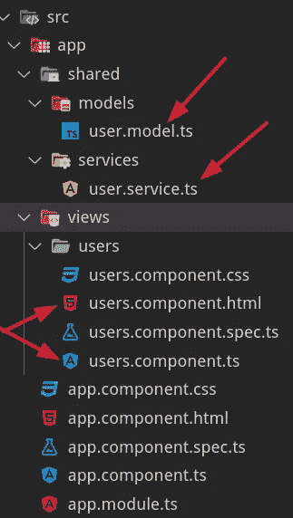

# 了解前端的 MVC 服务:Angular

> 原文：<https://betterprogramming.pub/https-medium-com-ccaballero-understanding-mvc-services-for-front-end-angular-a6196492ee74>

## 循序渐进的角度教程


卡斯帕·卡米尔·鲁宾在 [Unsplash](https://unsplash.com/s/photos/javascript?utm_source=unsplash&utm_medium=referral&utm_content=creditCopyText) 上的照片

# 介绍

这篇文章是理解 MVC 架构如何创建前端应用程序的系列文章中的第三篇。目标是理解如何构建前端应用程序。这是通过从使用 JavaScript 作为脚本语言的网页向使用 JavaScript/TypeScript 作为面向对象语言的应用程序发展来实现的。

在第三篇文章中，将使用 Angular 构建应用程序，第二个版本使用 TypeScript。因此，这篇文章涵盖了应用程序从 TypeScript 到 Angular 的迁移。然而，理解应用程序的所有部分是如何关联的以及它是如何构造的是很重要的。Angular 让我们忘记了 DOM，所以`user.view.ts`文件从我们的应用中消失了。

最后，在最后一部分，我们将转换我们的代码，使其与 Angular 框架相集成。

*   [第一部分。了解前端的 MVC 服务:VanillaJS](https://medium.com/better-programming/understanding-mvc-services-for-the-front-end-vanillajs-2268255b36e6)
*   第二部分。了解面向前端的 MVC 服务:TypeScript
*   第三部分。了解面向前端的 MVC 服务:Angular

# 项目架构

没有什么比图像更有价值来理解我们将要建造的东西了。这是我们正在构建的应用程序:


这可以使用单个 JavaScript 或 TypeScript 文件来构建，该文件修改文档的 DOM 并执行所有操作，但是这是强耦合的代码，不是我们打算在本文中应用的。

什么是 MVC 架构？MVC 是一个具有三层/三部分的架构:

*   **模型** —管理应用程序的数据。模型将会缺乏活力(它们将缺乏功能)，因为它们将会被提交给服务。
*   **视图/模板** —用户与应用程序交互的页面/GUI。
*   **控制器** —服务和视图之间的链接。

这是我们在问题域中的文件结构:



使用`root`元素，`index.html`文件将作为画布，在其上动态构建整个应用程序。

最后，我们的文件体系结构由以下类型脚本文件组成:

*   **user.model.ts** —用户的属性(模型)。
*   **user.service.ts** —管理用户的所有操作。
*   **users.component.ts** —负责加入服务和视图的人。
*   **users.component.html**—负责刷新和改变显示屏。

App 模块如下所示:

```
import { FormsModule, ReactiveFormsModule } from '@angular/forms';

import { AppComponent } from './app.component';
import { BrowserModule } from '@angular/platform-browser';
import { NgModule } from '@angular/core';
import { UserService } from './shared/services/user.service';
import { UsersComponent } from './views/users/users.component';

@NgModule({
  declarations: [AppComponent, UsersComponent],
  imports: [BrowserModule, FormsModule, ReactiveFormsModule],
  providers: [UserService],
  bootstrap: [AppComponent]
})
export class AppModule {}
```

你可以看到我们的应用程序使用了三个模块:`BrowserModule`、`FormsModule`和`reactiveFormsModule`。第一个模块用于从 Angular 获取基本的结构和属性指令，而第二个和第三个模块用于创建表单。在这个例子中，没有定义用户模块，因为这个例子很小。可以看到`UserService`和`UsersComponent`都包含在这个模块中。事实上，您可以将`UsersComponent`分成两个组件(列表和表单),但是在这个例子中，我们的目标是向您展示从 JavaScript 到 Angular 的演变。

# 模型(贫血)

本例中第一个构建的类是应用程序模型`user.model.ts`，它由类属性和一个生成随机 id(这些 id 可能来自服务器中的数据库)的私有方法组成。

这些模型将具有以下字段:

*   **id** 。独特的价值。
*   **名称**。用户的名称。
*   **年龄**。用户的年龄。
*   **完成**。布尔值，让你知道我们是否可以把用户从列表中划掉。

已经使用 TypeScript 对`User` 类进行了类型化。但是，用户构造函数接收一个普通对象，该对象将由 LocalStorage 或通过表单输入的用户数据提供。这个普通对象必须符合`UserDto`接口，这样任何普通对象都不能被实例化，但那些满足定义的接口的对象除外。

`user.model.ts`如下图所示:

```
export interface UserDto {
  name: string;
  age: string;
  complete: boolean;
}

export class User {
  public id: string;
  public name: string;
  public age: string;
  public complete: boolean;

  constructor(
    { name, age, complete }: UserDto = {
      name: null,
      age: null,
      complete: false
    }
  ) {
    this.id = this.uuidv4();
    this.name = name;
    this.age = age;
    this.complete = complete;
  }

  uuidv4(): string {
    return (([1e7] as any) + -1e3 + -4e3 + -8e3 + -1e11).replace(
      /[018]/g,
      (c: number) =>
        (
          c ^
          (crypto.getRandomValues(new Uint8Array(1))[0] & (15 >> (c / 4)))
        ).toString(16)
    );
  }
}
```

# 服务

对用户执行的操作在服务中执行。因为所有的逻辑负载都在模型中，所以服务允许模型贫血。在这个具体的例子中，我们将使用一个数组来存储所有用户，并构建与读取、修改、创建和删除(CRUD)用户相关的四个方法。

您应该注意到服务利用了模型，实例化了从`LocalStorage`提取到`User class`的对象。这是因为`LocalStorage`只存储数据而不是存储数据的原型。从后端传输到前端的数据也会发生同样的情况:它们没有实例化它们的类。

我们类的构造函数如下:

```
constructor() {
  const users: UserDto[] = JSON.parse(localStorage.getItem('users')) || [];
  this.users = users.map(user => new User(user));
}
```

注意，我们已经定义了一个名为`users`的类变量，一旦用户从普通对象(`UserDto`)转换为`User`类的原型对象，该变量就会存储所有用户。

我们必须在服务中定义的下一件事将是我们想要开发的每个操作。下面使用 TypeScript 显示了这些操作:

```
add(user: User) {
    this.users.push(new User(user));
    this._commit(this.users);
  }

  edit(userID: string, userToEdit: User) {
    this.users = this.users.map(user =>
      user.id === userID
        ? new User({
            ...user,
            ...userToEdit
          })
        : user
    );

    this._commit(this.users);
  }

  delete(userID: string) {
    this.users = this.users.filter(({ id }) => id !== userID);
    this._commit(this.users);
  }

  toggle(userID: string) {
    this.users = this.users.map(user =>
      user.id === userID
        ? new User({ ...user, complete: !user.complete })
        : user
    );

    this._commit(this.users);
  }
```

负责存储在我们的数据存储中执行的操作的`commit`方法(在我们的例子中是`LocalStorage`)仍有待定义:

```
_commit(users: User[]) {
  localStorage.setItem('users', JSON.stringify(users));
}
```

这个方法不调用在创建服务时绑定的`callback`函数，而在 JavaScript 或 TypeScript 中开发时需要调用这个函数，因为 Angular 执行这个任务，执行控制器和模板之间的绑定。

文件`user.service.ts`如下:

```
import { User, UserDto } from "../models/user.model";

export class UserService {
  public users: User[];

  constructor() {
    const users: UserDto[] = JSON.parse(localStorage.getItem("users")) || [];
    this.users = users.map(user => new User(user));
  }

  _commit(users: User[]) {
    localStorage.setItem("users", JSON.stringify(users));
  }

  add(user: User) {
    this.users.push(new User(user));
    this._commit(this.users);
  }

  edit(userID: string, userToEdit: User) {
    this.users = this.users.map(user =>
      user.id === userID
        ? new User({
            ...user,
            ...userToEdit
          })
        : user
    );

    this._commit(this.users);
  }

  delete(userID: string) {
    this.users = this.users.filter(({ id }) => id !== userID);
    this._commit(this.users);
  }

  toggle(userID: string) {
    this.users = this.users.map(user =>
      user.id === userID
        ? new User({ ...user, complete: !user.complete })
        : user
    );

    this._commit(this.users);
  }
}
```

# 视图

这是与本系列前几篇相比变化最大的部分。在这种情况下，我们不需要使用 DOM，因为 Angular 将执行动态操作 DOM 的困难任务。然而，我们必须正确定义模板。

下面是为这个例子创建的模板(一个角度丰富的 HTML 版本):

```
<h1>Users</h1>

<form [formGroup]="userForm" (ngSubmit)="add(userForm.value)">
  <input
    type="text"
    placeholder="Name"
    name="name"
    formControlName="name"
  /><input
    type="text"
    placeholder="Age"
    name="age"
    formControlName="age"
  /><button>Submit</button>
</form>
<ul class="user-list">
  <li *ngFor="let user of users">
    <input type="checkbox" (change)="toggle(user)" [checked]="user.complete" />
    <span>
      <s *ngIf="user.complete; else uncompleteName">{{ user.name }}</s>
      <ng-template #uncompleteName>{{ user.name }}</ng-template>
    </span>
    <span
      #age
      contenteditable="true"
      class="editable"
      (focusout)="edit(user, age)"
    >
      <s *ngIf="user.complete; else uncompleteAge">{{ user.age }}</s>
      <ng-template #uncompleteAge>{{ user.age }}</ng-template></span
    >
    <button class="delete" (click)="delete(user)">Delete</button>
  </li>
</ul>
```

这不是一个 Angular 教程，而是一系列的图片，在这些图片中你可以看到 Web 应用程序从 JavaScript 到 TypeScript 再到 Angular 的演变。

但是，我们注意到，Angular 提供了两个结构化的指令，如* ngFor 和* ngIf，允许从模板本身轻松地操作 DOM，从而解决了前面几篇文章中的许多 DOM 操作代码。

另一个有趣的地方是 Angular 在这个例子中帮助我们使用了反应式。有了这些，模板就可以连接到控制器，而不需要我们发送一个处理程序来进行连接。

# 控制器

这个架构的最后一个文件是控制器(`users.component.ts`)。控制器通过依赖注入(DI)接收它拥有的两个依赖项(服务和 formBuilder)。这些依赖关系存储在控制器的私有变量中。

控制器只关注管理连接到视图(模板)的属性和调用服务。就像我们之前文章的第一个 JavaScript 代码或第二个 TypeScript 版本一样。在这种情况下，我们将所有与 DOM 相关的任务都留给了框架。

这是文件`users.component.ts`:

```
import { Component, OnInit } from '@angular/core';

import { FormBuilder } from '@angular/forms';
import { UserService } from 'src/app/shared/services/user.service';

@Component({
  selector: 'app-users',
  templateUrl: './users.component.html',
  styleUrls: ['./users.component.css']
})
export class UsersComponent implements OnInit {
  public users;
  public userForm;

  constructor(
    private userService: UserService,
    private formBuilder: FormBuilder
  ) {
    this.userForm = this.formBuilder.group({
      name: '',
      age: ''
    });
  }

  ngOnInit() {
    this.refreshUsers();
  }
  refreshUsers() {
    this.users = this.userService.users;
  }

  add(userForm) {
    this.userService.add(userForm);
    this.refreshUsers();
    this.userForm.reset();
  }
  delete({ id }) {
    this.userService.delete(id);
    this.refreshUsers();
  }
  edit(user, { innerText: age }) {
    const { id } = user;
    this.userService.edit(id, { ...user, age });
    this.refreshUsers();
  }
  toggle({ id }) {
    this.userService.toggle(id);
    this.refreshUsers();
  }
}
```

# 结论

在第三部分中，我们开发了一个 web 应用程序，在这个应用程序中，项目是按照 MVC 架构构建的，在这个架构中使用了贫血的模型，逻辑的责任在于服务。

需要强调的是，这篇文章的教学内容是让你理解项目在不同责任的不同文件中的结构，以及视图是如何完全独立于模型/服务和控制器的。

同样重要的是要注意，在这篇文章中，我们已经将应用程序从 TypeScript 迁移到 Angular，这使我们可以忘记与 DOM 相关的重复性任务，这些任务在我们开发的所有 Web 应用程序中都是相同的。

我建议你从与 JavaScript 相关的第一篇文章开始，理解所使用的架构。下一步是通过应用 TypeScript(在第二篇文章中)来强化代码，最后回顾这篇文章，在这篇文章中，代码已经适应了一个框架。

这不是一个有角度的教程，而是关于我们的代码从技术到框架的进化。

该岗位的 *GitHub 分支*为[https://github.com/Caballerog/Angular-MVC-Users](https://github.com/Caballerog/Angular-MVC-Users)

*原载于 2019 年 11 月 12 日*[*https://www . carloscaballero . io*](https://www.carloscaballero.io/understanding-mvc-services-for-frontend-angular)*。*