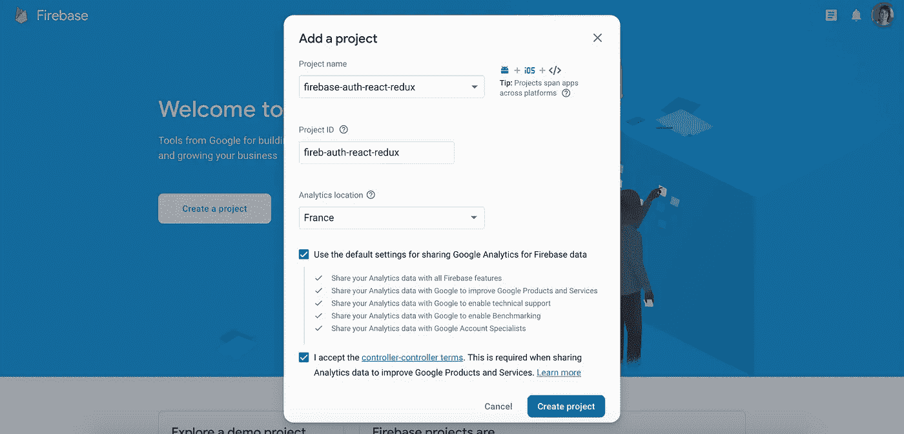
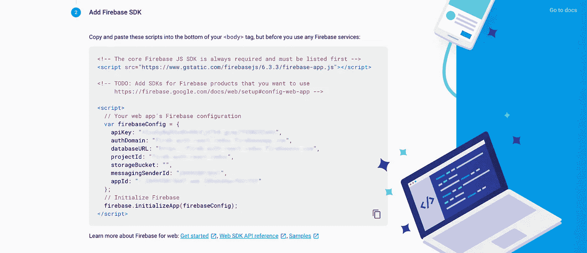

# React + Redux 应用程序的 Firebase 授权:从 0 到 1

> 原文：<https://betterprogramming.pub/https-medium-com-clairechabas-auth-with-firebase-for-react-redux-apps-from-0-to-1-104e7343521b>

## 完整的分步指南

## Firebase 使得为一个应用程序设置整个认证系统变得很容易


鸣谢: [Artem Sapegin](https://unsplash.com/@sapegin?utm_source=unsplash&utm_medium=referral&utm_content=creditCopyText) 在 [Unsplash](https://unsplash.com/search/photos/react?utm_source=unsplash&utm_medium=referral&utm_content=creditCopyText) 拍摄的电脑和杯子背景照片

认证是一个复杂的话题，不能掉以轻心。

当我从零开始构建我的第一个现实世界应用程序 [Mark](https://getmark.app/) 的认证系统时，我发现了它的来龙去脉，这是一个 Chrome 扩展，它可以让你在 Chrome 的*新标签*主页中锁定网页。

令人欣慰的是， [Firebase](https://firebase.google.com/) 让我们在几个小时内为我们的应用程序建立整个认证系统变得非常容易，相比之下，如果你自己从头开始，需要几天甚至几周的时间。

本指南旨在使用 Firebase Auth 将您从一个空的 React 应用程序转变为一个具有完整身份验证系统的应用程序。正如您将看到的，我们只需五个步骤就能做到:

*   步骤 1:安装和设置。
*   步骤 2:注册电子邮件验证。
*   步骤 3:登录并重定向。
*   第四步:注销。
*   第五步:密码重置。
*   额外收获:根据授权状态限制页面访问。

先决条件:我假设您已经熟悉 React 和 Redux。

让我们开始这个认证派对吧！

# 步骤 1:安装和设置

首先，你需要[创建一个 Firebase 账号](https://firebase.google.com/)。

然后，连接到 Firebase 控制台，点击*创建一个项目*。

为您的项目选择一个名称和 ID(明智地选择，您以后不能更改 ID)，设置位置，同意将您一生的工作交给 Google，然后单击*创建项目*。



创建您的 Firebase 项目

其次，你需要注册你的应用程序。选择 *Web* 图标，因为我们正在这里创建一个 React web 应用程序。

输入你的应用程序名称(可选地，你可以设置 Firebase 托管，但我们现在不会这样做，因为这超出了本文的范围，所以不要选中此框)并点击*注册应用程序*。

然后在*中添加 Firebase SDK* ，复制`firebaseConfig` 对象，这是你的应用程序的配置信息，你需要它来设置你的应用程序和 Firebase 之间的链接。



获取您的 firebaseConfig

并点击*继续到控制台*。

第三，*为你的 Firebase 项目激活认证*。点击*认证*，然后点击*设置登录方式*。

您可以看到，您可以使用各种第三方提供商进行身份验证，从谷歌、脸书、Twitter 或 GitHub，到使用匿名访客帐户以避免使用凭据，任您选择。

这里我们将使用传统的电子邮件/密码登录选项，因此单击相应的行，*启用*并点击*保存*。现在这个登录选项已经启用，我们可以在我们的应用程序中使用相关的 Firebase 方法。

在我们继续之前，请查看*模板*部分。您将看到您有四个电子邮件模板，您可以对其稍加修改。

在撰写本文时，不可能进一步定制模板。如果您想使用自己的电子邮件模板，可以跳过使用与发送这些电子邮件模板相关的 Firebase 方法，自己用自己的电子邮件服务处理相关操作(电子邮件地址验证、密码重置……)。

如果你对如何做到这一点感兴趣，请在评论中告诉我，我会就此写另一篇文章。

最后，设置 React 应用程序以使用 Firebase:

1.  安装`firebase` npm 包。

```
npm install --save firebase
```

2.在你的应用程序文件夹中创建一个`firebase.js`文件(我喜欢把它放在一个`services`文件夹中，但这完全取决于你),并在这个文件中插入以下代码:

你完了！

您已经成功地设置了一个用于身份验证的 Firebase 项目，并将其与一个 React 应用程序相关联。设置和配置阶段已经结束，现在我们可以继续做好的事情了:注册并验证用户的电子邮件地址。

# 步骤 2:注册电子邮件验证

您应该使用 React 路由器和您的登录组件设置 React 应用程序。以下是我的出发点:

`index.js`

```
*import* React *from* "react";
*import* ReactDOM *from* "react-dom";
*import* { BrowserRouter *as* Router } *from* "react-router-dom";
*import* "./css/index.css";
*import* App *from* "./components/App";ReactDOM.render(
  <Router>
    <App />
  </Router>,
document.getElementById("root")
);
```

`App.js`

```
*import* React *from* "react";
*import* { Switch, Route } *from* "react-router-dom";
*import* Main *from* "./Main";
*import* Login *from* "./Login";const App = () => {
  *return* (
    <div *className*="App">
      <Switch>
        <Route *exact* *path*="/" *component*={Main} />
        <Route *exact* *path*="/login" *component*={Login} />
      </Switch>
    </div>
  );
};*export* *default* App;
```

`Main.js`:

稍后将使用 Main 根据用户是否经过身份验证自动重定向到 home 或 login 组件。同时，我们现在只显示登录。

```
*import* React *from* "react";
*import* Login *from* "./Login";const Main = () => {
  *return* <Login />;
};*export* *default* Main;
```

## **安装 Redux 商店并用 Firebase 增强它**

首先，我们需要设置我们的 Redux store，我们需要将它连接到 Firebase，这样我们就可以访问 Firebase reducer。这将允许我们在我们的应用程序中访问用户的身份验证状态。

让我们安装必要的依赖项:

```
npm i redux react-redux redux-thunk
```

此外，我们还需要特定于 Firebase 的依赖项，这将允许我们将其绑定到我们的 Redux 存储:

```
npm i react-redux-firebase
```

现在，在没有 Firebase 的情况下，我们之前创建商店的方式是这样的，您应该很熟悉:

```
*const store = 
createStore(rootReducer, {}, applyMiddleware(reduxThunk));*
```

在这里，我们将需要“增强”我们的 redux store 以利用 Firebase，我们将使用 store enhancer `reactReduxFirebase`来完成这项工作，它来自我们的新 npm 包:`react-redux-firebase`。

正如你在下面看到的，我们正在使用 redux 中的`compose`将我们的 Firebase 实例(位于我们的`firebase.js`文件中，先前已启动)传递给`reactReduxFirebase` ，并用这个增强器包装 Redux `createStore`方法。

像这样:

```
*// 1\. Enhancing our createStore method with Firebase*const createStoreWithFirebase = compose(reactReduxFirebase(firebase))(createStore); *// 2\. Creating our store with this newly enhanced store creator*const store = 
createStoreWithFirebase(reducers,{},applyMiddleware(reduxThunk));
```

下面是我们的`index.js`文件在这个商店建立后的样子:

index.js 根文件，使用 Firebase 设置并增强了 Redux 存储

## 创建根缩减器并添加 Firebase 缩减器

现在我们设置存储文件夹结构，并为身份验证缩减器和操作创建者创建`auth.js`文件:

```
store/ 
 |- reducers/
     |- index.js
     |- auth.js
 |- actions/
     |- actionTypes.js
     |- auth.js
```

root reducer 像往常一样创建，但是我们添加了 Firebase reducer。因此，`reducers`文件夹中的`index.js`文件看起来像这样:

```
*import* { combineReducers } *from* "redux";
*import* authReducer *from* "./auth";
*import* { firebaseReducer } *from* "react-redux-firebase";*export* *default* combineReducers({
  firebaseReducer,
  authReducer
});
```

## 用 Firebase 注册动作创建器

最后，我们可以创建 action creator，使用 Firebase Auth 方法为用户注册。

首先，我在`actionTypes.js`文件中创建了两个*动作类型*，这样我们可以向用户发送反馈，让他们知道注册是否有效:

```
*// SIGN UP
export* const SIGNUP_SUCCESS = "SIGNUP_SUCCESS";
*export* const SIGNUP_ERROR = "SIGNUP_ERROR";
```

然后，在我的`actions`文件夹中的`auth.js`文件中，我正在导入那些动作类型，以及我的 Firebase 实例，并且我正在为注册启动一个动作创建器:

```
*import* { AUTH_SUCCESS, AUTH_ERROR } *from* "./actionTypes";*import* firebase *from* "../../services/firebase";*// Signing up with Firebase
export* const signup = (email, password) => async dispatch => {
  *try* {
    *...* } *catch* (err) {
    *...* }
};
```

我们要做的就是调用 Firebase 提供的`createUserWithEmailAndPassword`方法来创建新用户:

```
firebase.auth().createUserWithEmailAndPassword(email, password)
```

这回报了一个承诺。然后我们可以使用`onAuthStateChanged`，每当用户的登录状态发生变化时都会调用它。

这个方法让我们可以访问用户的数据，然后我们可以调用`sendEmailVerification`方法来验证他们的电子邮件地址，如下所示:

```
firebase.auth().onAuthStateChanged(function(user) {
  user.sendEmailVerification();
});
```

以下是最终注册操作创建者:

auth.js —使用 Firebase Auth 注册操作创建者

# 步骤 3:登录并重定向

我们快完成了。正如您将看到的，大部分工作已经完成，剩下的工作非常简单。

## 正在登录

首先，让我们创建我们的操作类型:

```
*// SIGN IN
export* const SIGNIN_SUCCESS = "SIGNIN_SUCCESS";
*export* const SIGNIN_ERROR = "SIGNIN_ERROR";
```

要使用 Firebase 登录用户，我们使用 Firebase Auth 的`signInWithEmailAndPassword`方法，该方法将电子邮件和密码作为参数:

```
firebase.auth().signInWithEmailAndPassword(email, password)
```

以下是完整的`signin`动作创建者:

auth.js —使用 Firebase Auth 登录操作创建者

## 登录后重定向用户

如你所见，我正在给我的`signin`动作创建器添加一个回调函数。这是为了在登录后将用户重定向到主组件。

为此，我将使用 *Firebase reducer* ，它是我们之前添加到 root reducer 中的。事实上，Firebase reducer 让我们可以访问包含用户数据(如果前者已登录)或以下内容的`auth`对象:

```
auth: { isLoaded: false, isEmpty: true }
```

`isLoaded`表示授权加载状态(当请求待定时，您可以使用它向用户显示加载程序)。`isEmpty`如果用户未登录，则为真。

因此，登录后的流程将是:

1.将用户重定向到与主要组件相对应的根路径`“/”`。为此，我们将对`props.history.push(“/”)`的调用作为对`signin`动作创建者的回调:

```
signin(email, password, **() => props.history.push("/")**);
```

并且，我们在分派了`SIGNIN_SUCCESS`动作之后，在`signin`动作创建器中激活这个回调。

```
*export* const signin = (email, password, callback) => 
  async dispatch => {
    *try* {
      firebase
      .auth()
      .signInWithEmailAndPassword(email, password)
      .then(data => {
        *if* (data.user.emailVerified) {
          dispatch({ type: SIGNIN_SUCCESS });
          **callback();**
       } *else* {
          ...
```

2.将`Main`组件连接到商店，观察来自 Firebase reducer 的 auth 对象，如果`isEmpty`为真，则用户未登录，因此显示`Login`组件，或者，当用户登录时，显示`Home`组件。

连接到 Redux store 的 Main.js 组件侦听来自 Firebase reducer 的 auth 对象，以便根据 auth 状态重定向用户。

这也将处理一个非常重要的事情: *auth persisting* 。

这可以确保我们的用户在成功登录后仍然与应用程序保持连接，直到他们正式退出。只需让我们的`Main`组件成为我们应用程序的入口点，并监听来自 Firebase reducer 的 auth 对象，从而相应地重定向到`Home`或登录页面。

# 第四步:注销

我们再次创建相关的操作类型:

```
*// SIGN OUT
export* const SIGNOUT_SUCCESS = "SIGNOUT_SUCCESS";
*export* const SIGNOUT_ERROR = "SIGNOUT_ERROR";
```

对于注销用户，我们使用 Firebase Auth 的`signOut`方法，该方法不带任何参数:

```
*// Signing out with Firebase**export* const signout = () => async dispatch => {
  *try* {
    firebase
    .auth()
    .signOut()
    .then(() => {
      dispatch({ type: SIGNOUT_SUCCESS });
    })
    .catch(() => {
      dispatch({ 
        type: SIGNOUT_ERROR, 
        payload: "...some error message for the user..."
      });
    });
  } *catch* (err) {
    dispatch({ 
      type: SIGNOUT_ERROR, 
      payload: ...some error message for the user..."
    });
  }
};
```

# 第五步:密码重置

同样简单的是密码重置方法。我们使用 Firebase Auth 的`sendPasswordResetEmail`方法，该方法将电子邮件作为参数:

```
*// Reset password with Firebase**export* const resetPassword = email => async dispatch => {
  *try* {
    firebase
    .auth()
    .sendPasswordResetEmail(email)
    .then(() => 
      dispatch({
        type: RESET_SUCCESS,
        payload: "Reset email sent. Go check your inbox."
      })
    )
    .catch(err => {
      dispatch({
        type: RESET_ERROR,
        payload: "...some message for the user..."
      });
    });
  } *catch* (err) {
    dispatch({ 
      type: RESET_ERROR, 
      payload: "...some message for the user..." 
    });
  }
};
```

# 额外收获:根据授权限制页面访问

到目前为止，我们已经做了很多，但在下班后去喝酒之前，还有一点需要解决。

为了说明我的观点，我将添加一个名为`Bunny`的新组件，并将`Route`添加到我的路由器交换机内的`App.js`文件中的`Bunny`:

```
<Route *exact* *path*="/bunny" *component*={Bunny} />
```

现在，如果你没有登录，你改变网址去`“/bunny”`，你会看到你可以访问这个组件。我们不想那样。我们需要告诉`Bunny`组件，我们只希望经过身份验证的用户能够访问它。

为此，我们将创建一个更高阶的组件，它将包装我们想要限制访问的组件，并且如果用户没有登录，它将侦听来自 Firebase auth 的 Auth 对象并重定向到我们的`Main`组件。

这是我们的`requireAuth` HOC:

requireAuth : HOC 根据身份验证状态限制对组件的访问

这里是利用`requireAuth` HOC 的`Bunny`组件:

```
*import* React *from* "react";
***import* requireAuth *from* "./hoc/requireAuth";**const Bunny = () => {
  *return* (
    <div *className*="page">...</div>
  );
};*export* *default* **requireAuth(Bunny)**;
```

我们完事了。

# 结论

您可以在下面的专用报告中找到 React 样板应用程序的完整代码，使用 Firebase 和 Redux 实现身份验证:

[](https://github.com/clairechabas/firebase-auth-react-redux) [## claire chabas/fire base-auth-react-redux

### 这个项目是一个样板文件，用于在 React 应用程序上使用 Firebase Auth 初始化一个身份验证系统

github.com](https://github.com/clairechabas/firebase-auth-react-redux) 

您可以根据自己的需要随意使用这个样板文件。

我希望这篇文章是有帮助的。如果你有任何问题或改进建议，我很乐意在评论中看到。

快乐编码💛