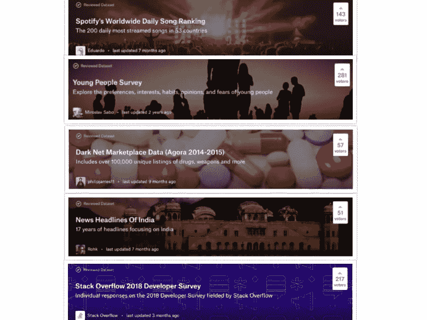
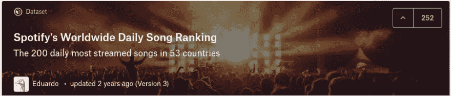
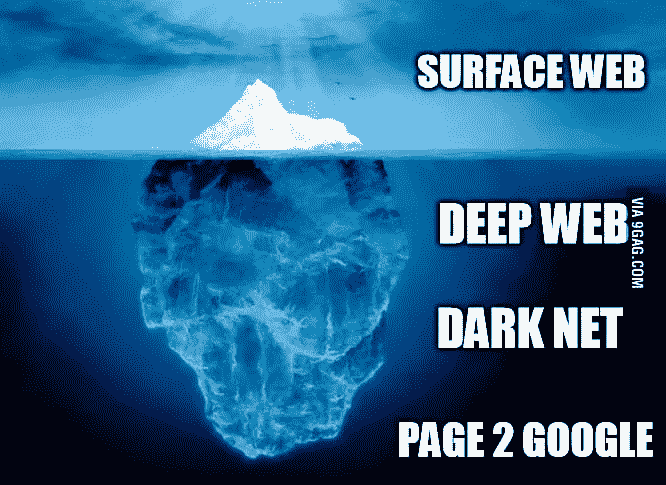
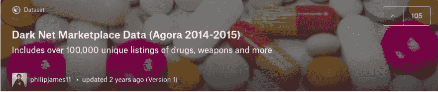
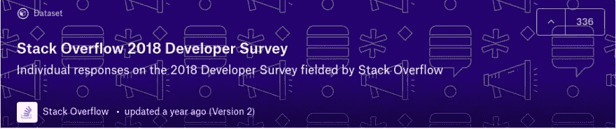
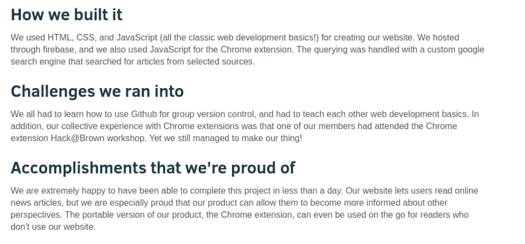
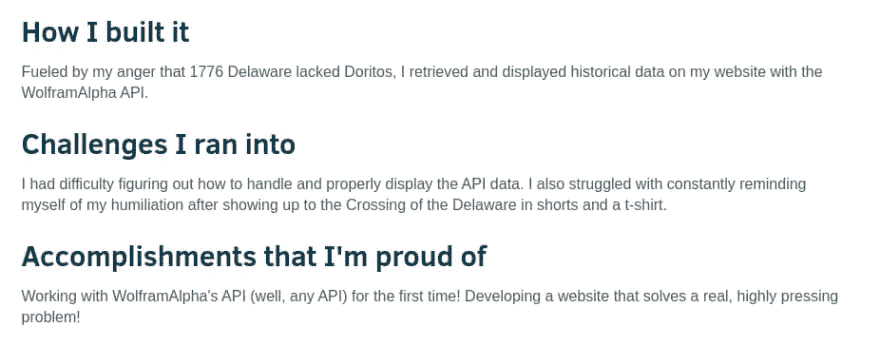
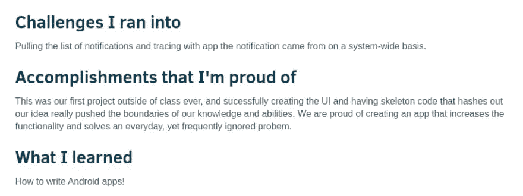
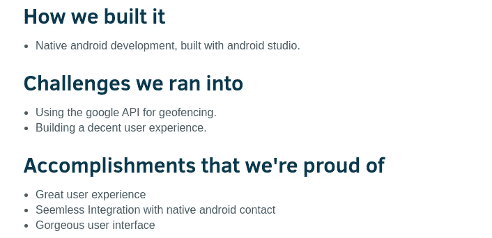
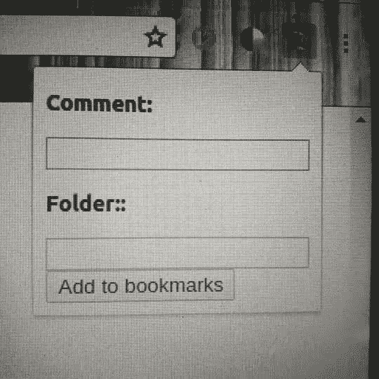

# 奇妙的编程项目想法以及在哪里可以找到它们(初学者友好版)

> 原文：<https://betterprogramming.pub/https-medium-com-nityeshagarwal-fantastic-programming-project-ideas-and-where-to-find-them-d529c98f6965>

## 数据科学、机器学习应用程序开发和 web 开发的 20 个酷项目创意

在 [Unsplash](https://unsplash.com/s/photos/project?utm_source=unsplash&utm_medium=referral&utm_content=creditCopyText) 上由[米米·蒂安](https://unsplash.com/@mimithian?utm_source=unsplash&utm_medium=referral&utm_content=creditCopyText)拍摄的照片

我们都知道从事个人项目是学习中非常重要的一部分。这是磨练纪律。从理论走向实践。一种边做边学的方法。

是[楼学](https://www.buildtolearn.club/)。

但是，首先，获得好的项目想法的任务不也是阻止你构建东西的任务吗？难道不是一个狭窄的瓶颈吗？

那些建议你分析泰坦尼克号数据集或花卉数据集，或者构建诸如待办事项列表应用程序、贪吃蛇游戏、计算器、电子商务网站或其他没人会觉得酷的东西的编程项目想法列表，你难道不厌倦吗？

我发现它们真的很无聊，因为没有人会对使用最终结果感到兴奋。老实说，连我都不知道。

我相信你可以训练你的思维来获得更好的想法——任何人都可以想到好主意。如果你看了足够多的这些项目，也许做了几个，你的大脑将学会识别有趣的事情。

所以，在这里我展示了一些我觉得非常酷的项目想法，按照它们的来源分类——我的*金矿*的绝妙项目想法。**

# **来源 1: [卡格尔](https://kaggle.com/)**

**我相信，如果你想进入数据科学/ML 领域， [Kaggle](https://kaggle.com/) 是你学习和实践这门手艺的一站式商店。**

*   **[数据集](https://www.kaggle.com/datasets):这里有大约 300 个竞赛挑战，所有挑战都伴随着它们的公共数据集，总共有 9500 多个数据集(并且还在不断增加)，这里就像是数据科学/ML 项目创意的宝库。**
*   **[内核](https://www.kaggle.com/kernels):所有的数据集都有一个公共的内核标签，人们可以为了整个社区的利益发布他们的分析。所以，任何时候当你觉得不知道下一步该做什么的时候，你可以通过查看这些内核来获得一些想法。此外，许多内核是专门为帮助初学者而编写的。**
*   **[课程](https://www.kaggle.com/learn/overview):该选项卡包含免费、实用的实践课程，涵盖了快速入门所需的最低先决条件。他们最大的优点是什么？一切都是使用 Kaggle 的内核完成的(如上所述)。这意味着你可以互动和学习…不再被动地阅读数小时的学习材料！**

****

## ****1。** [**Spotify 的全球每日歌曲数据集**](https://www.kaggle.com/edumucelli/spotifys-worldwide-daily-song-ranking)**

**该数据集包含 Spotify 用户 2017 年和 2018 年在 53 个国家听得最多的 200 首歌曲的每日排名。它包含 200 多万行，包括 6629 位艺术家，18598 首歌曲，总共有 1050 亿个数据流。**

****

**并找到以下问题的答案:**

*   **歌曲在你们国家的前 3，5，10，20 停留多久？哪些歌曲是离群值？**
*   **哪些国家的音乐品味相似？**
*   **一首排名靠前的歌需要多少时间才能进入邻国的排名？**

## ****2。** [**年轻人调查数据集**](https://www.kaggle.com/miroslavsabo/young-people-survey)**

**这探究了年轻人的偏好、兴趣、习惯、观点和恐惧。**

**1010 名学生被问及以下问题:**

*   **音乐偏好**
*   **电影偏好**
*   **爱好和兴趣**
*   **恐惧**
*   **健康习惯**
*   **性格特征，对生活的看法，和意见**
*   **消费习惯**
*   **人口统计数据**

****

## ****3。** [**暗网市场数据集**](https://www.kaggle.com/philipjames11/dark-net-marketplace-drug-data-agora-20142015)**

**我发现暗网简直令人着迷。**

****

**这是 2014 年至 2015 年从 Agora(一个黑暗/深度网络)市场抓取的市场数据的数据解析。它包含毒品、武器、书籍、服务等等。**

****

**以下是一些灵感:**

*   **此数据集的描述:**

> **“这个数据集是由 Reddit 用户“usheep”制作的 HTML rip 制作的，他威胁说，如果 Agora 上的所有供应商不满足他的要求，他就会向警方揭发他们(给他一小笔钱，几百美元，以换取他不泄露他们的信息)。**
> 
> **大多数关于“usheep”和他的威胁的信息是不存在的。他发布了 HTML rip，从此杳无音信。几个月后 Agora 关闭了。**
> 
> **不知道这是否与“usheep”有关，但是原始的 HTML 数据仍然存在。"—[https://www . ka ggle . com/Philip James 11/dark-net-market place-drug-data-agora-2014 2015](https://www.kaggle.com/philipjames11/dark-net-marketplace-drug-data-agora-20142015)**

**脸书黑客指南、ATM 黑客教程、50000 个 Facebook 赞、假身份证、假执照、大量毒品和卖淫相关条目——这些都是数据集中的项目**

## ****4。** [**印度新闻标题**](https://www.kaggle.com/therohk/india-headlines-news-dataset)**

**这包含了 18 年来聚焦印度的头条新闻。**

****

**它包含了《印度时报》从 2001 年到 2018 年发布的大约 290 万个事件。**

**您可以使用它来:**

*   **对标题进行情绪分析，自己看看——新闻机构关注坏消息多于好消息吗？**
*   **了解印度社会最流行的话题是什么。**
*   **将该数据集分割成更小的部分，以便对宝莱坞、政党、板球等类别进行更集中的分析，并查看这些年的趋势**

## **5. [**StackOverflow 开发者调查**超过 100，000 名开发者](https://www.kaggle.com/stackoverflow/stack-overflow-2018-developer-survey)**

****

**您可以利用这份内容丰富的调查来获得以下问题的数据支持答案:**

*   **人们通过为开源项目做贡献来学习吗？**
*   **不同国家/年龄/发展角色对人工智能的看法有何不同？**
*   **学生的观点和意见(在本次调查中，每五个应答者中就有一个是学生)**
*   **vim 用户与非 vim 用户有何不同？**
*   **创建一个工资预测器。**

**我用它来比较印度和美国、英国、德国以及整个世界的软件开发者。**

# **来源 2: [数据是复数](https://tinyletter.com/data-is-plural)**

**这是数据科学或机器学习项目的另一个来源。这是一个免费的电子邮件时事通讯，作者每周都会给你发送一些有趣的数据集。**

**为什么您应该为您的个人项目分析好奇的数据集:**

1.  **研究它们令人激动——你很想知道自己的分析结果。**
2.  **它们是创建有趣项目的简单方法——即使是对本来就有趣的数据集的简单分析也会很有趣。**

**好了，这里有一些来自 [Data is Plural 的档案](https://tinyletter.com/data-is-plural/archive)的很酷的照片:**

## **6. [**一个 2656 个 TED 演讲的数据集，有元数据和文字记录**](https://github.com/kinnaird-laudun/data/tree/master/Release_v0)**

**TED 演讲已经成为我们文化不可或缺的一部分。**

> **一群青少年聚集在他们的储物柜旁，享受着课间的快速交谈。其中一个走得有点长，意识到这一点后，他向大家宣布:“好吧，谢谢你们来听我的 TED 演讲。"**
> 
> **其余的人笑着，点着头，在宣布上课开始的铃声响起之前，对话流恢复正常。“—作者之一[https://culturalanalytics.org/2019/07/ted-talks-as-data/](https://culturalanalytics.org/2019/07/ted-talks-as-data/)的现场笔记**

**分析这些抄本来揭示我们文化的一些错综复杂之处。**

## ****7。** [**情侣如何相遇并相守**](https://data.stanford.edu/hcmst)**

**这是对 4002 名成年人的调查，其中 3009 人有配偶或主要的浪漫伴侣。它甚至在主要调查一年和两年后进行了跟踪调查，以研究夫妇的离婚率。**

**分析可以揭示以下问题的答案:**

*   **传统情侣和非传统情侣见面的方式一样吗？什么样的情侣更有可能在网上相遇？**
*   **最近的婚姻群体(尤其是传统的异性同性婚姻夫妇)是以他们的父母和祖父母的方式相遇的吗？**
*   **网恋会让夫妻关系更稳定还是更不稳定？**
*   **与更传统的同性异性伴侣的婚姻解体率相比，非传统伴侣的婚姻解体率如何？**
*   **民事结合、家庭伴侣关系或同性婚姻权利的可用性如何影响同性夫妇的婚姻稳定性？**

## **8. [**印度农村用电**](https://dataverse.harvard.edu/dataverse/REDI)**

**Smart Power India 和可持续能源政策倡议组织发布了一份调查数据集，该数据集“涵盖了比哈尔邦、北方邦、奥里萨邦和拉贾斯坦邦 200 个村庄的 10，000 个家庭和 2，000 个农村企业。”**

**受访者被问到的问题包括，他们每天用电的时间有多长，他们是否有太阳能电池板，以及他们为煤油支付的价格。**

**做一个分析来了解印度农村到底有多糟糕，并与你自己的情况进行比较。**

## **9. [**岗位死亡**](https://www.bls.gov/iif/oshcfoi1.htm)**

**自 1992 年以来，美国劳工统计局通过其致命职业伤害普查收集了与工作有关的死亡数据。**

**也许你可以对*工作做一个详细的研究来避免*？**

## ****10** : [**一组讽刺电视剧《老友记》和《生活大爆炸》的数据集**](https://github.com/soujanyaporia/MUStARD)**

**MUStARD 是一个由 690 个文本和视频剪辑组成的语料库，“用于自动讽刺发现的研究”**

**该数据集的 690 个例子——一半涉及讽刺，一半不涉及——来自《老友记》、《黄金女郎》、《生活大爆炸》和讽刺幽默匿名。**

**我敢打赌，有很多有趣的事情，我们可以做这个热闹的数据集！**

# **来源 3:[Devpost.com](https://devpost.com/software/search?query=is%3Afeatured)**

**浏览其他人的 hackathon 项目是发现好项目想法的好方法，因为:**

*   **他们中的许多只是小的、舒适的、温暖的宠物项目:作为年轻程序员在仅仅 12 或 24 或 48 小时内建立的个人项目，他们肯定是可行的。(是的，你能做到！)**
*   **你会知道你正在构建一些有价值的东西:它们中的大多数都是黑客马拉松获奖项目**

**如果你创造了:**

## ****11** 。[在 YouTube 视频中搜索](https://devpost.com/software/yoogle)**

**一个网络应用程序，可以让你在 YouTube 视频中搜索，并让你找到说出那个词的地方——这是一个针对视频的 Ctrl-F 功能。**

**还骗自己学了 Python，基础 web 开发(HTML/CSS，Javascript)。**

****

## ****12** 。[一个浏览器扩展，它将你引向一篇与你正在阅读的文章政治观点相反的文章](https://devpost.com/software/twosidednews)**

**这将打击新闻源的影响，新闻源允许人们只看到社交媒体和新闻网站上同意他们观点的帖子。**

**并且骗自己学了基本的 web 开发(HTML/CSS，JavaScript，jQuery)，可能是一些机器学习。**

****

## ****13** 。[计划旅行的网络应用](https://devpost.com/software/time-traveling-for-dummies)**

**一个网络应用程序，允许你输入你计划去旅行的日期和地点以及你将携带的钱数，并将为你提供关于天气条件和你的钱的价值的有用信息。**

**并且骗自己学了基础的 web 开发(HTML/CSS/JavaScript)，API。**

****

## ****14** 。一个简单的通知应用程序阻止通知**

**一个通知应用程序，可让您选择当通知频率超过每三秒钟一次时想要阻止通知的消息应用程序。**

**还骗自己学安卓开发。**

****

## ****15** [一款自动发送短信的短信应用](https://devpost.com/software/holla-vkgquz)**

**一款信息应用程序，可以自动给你爱的人发送短信，让他们知道你已经到达了一个特定的目的地，因为你经常忘记这样做。**

**还骗自己学了安卓 app 开发。**

****

# **资料来源:纽约大学。**

**哦，是的，我做到了！**

**我在开头写道——你可以训练自己的思维，自己想出好主意。**

**我认为保罗·格拉厄姆关于 [*如何找到创业点子*](http://www.paulgraham.com/startupideas.html) 的建议同样适用于如何找到你喜欢的项目点子。**

**获得创业想法的方法是不要试图去想创业想法。而是寻找问题，最好是你自己有问题。**

**同时，这可能听起来像是我在自相矛盾，你不想把标准定得太高。**

**你可能看了太多电影《社交网络》,希望通过这个项目打造下一个谷歌或脸书。但是你不应该。这只会减慢学习的速度，让你建立不切实际的目标，最危险的是，让你拖延。**

**记住，你的目标不是写一个十亿美元的软件。那就是创建一个程序，为你提供一个工作的舞台，并从中学习。比如说:**

****16** :在和我的朋友聊天时，我们讨论了开发**一个工具来分析我们的 Whatsapp 聊天记录**会有多酷，它可以揭示诸如发送的消息数、发送的字数、每条消息的平均字数、最常用的单词、最长的连续两次发短信、聊天时间模式、最常分享的网站链接等等。我们后来发现，我们重新发现了一个曾经在 Reddit 上非常流行的想法**

****

**令人惊叹的是，在构建过程中，她将自己的 Python 技能提高了一个档次。现在，我们甚至可以尝试 web 开发，建立一个允许任何人对自己的聊天文件进行分析的网站！**

## ****17。**给书签添加评论**

**我经常使用 Chrome 书签。我真的需要在我的书签上添加评论，这样我就可以保存我为这个很棒的链接添加书签的动机。**

**但是 Chrome 浏览器没有评论选项。这就是为什么我构建了一个简单的 Chrome 扩展来帮助我给书签添加评论。**

****

**而且我还骗自己学了 JavaScript，jQuery，HTML。**

**几个月前，当《权力的游戏》发布最后一季时，我想到创建一个脚本来分析《权力的游戏》各季的推文情绪，以了解最后一季有多糟糕(😜)
**做到这一点就可以骗自己去学** — Python，机器学习，NLP**

**既然你的目标是学习，你不应该因为重新实现一些已有的想法而感到难过。有一天，我在黑客新闻上看到了一个名为[的热门帖子，“我教我的小弟弟 JS，他在一周内制作了这个视频游戏”](https://news.ycombinator.com/item?id=18866500)。我检查了这个游戏，它有点让人上瘾，但是非常简单。我告诉了我上面提到的朋友，我们正在用 PyGame 制作这个很酷的游戏的 Python 版本。**

****

****20** : **一个简单的应用程序，提醒你关注你想联系的重要而忙碌的人**。我最近读了 Alexey Guzey 的一篇文章，关于你不应该期待忙碌的人回复你的第一条信息，以及如何跟进他们是你的责任。但是当你有一堆重要的人要谈的时候，跟踪后续情况可能会有点困难。这个应用程序将为你做这件事，并提醒你未来的后续行动。**

## **关于如何想出(有点)酷的想法的 3 点建议—**

*   **睁大眼睛**
*   **设立一个低标准**
*   **不要犹豫重新实施你自己也有类似的问题吗？如果你能在下面的评论中告诉社区你古怪的、可能很酷的项目想法，那将会很棒。**

**我先说我自己的两个怪想法。看看下面的评论吧！让我们把这篇文章的评论变成另一个奇异项目想法的金矿，嗯？**

**这绝对不是一个很酷的项目创意来源的详尽列表。像这样的金矿还有很多，但是，当然，很难找到。当我发现更多的时候，我会更新这篇文章。**

**我会在我的 [Twitter](https://dev.to/nityeshaga/(https://twitter.com/nityeshaga)) 、Build To Learn 简讯[和](https://buildtolearn.substack.com/) [Build To Learn Slack group](https://join.slack.com/t/build-to-learn/shared_invite/enQtMzg3MzYyNTA5MjAzLTkwMGYyYTljOTdkNTIzODJhNTlkZWQxMTZkODJmY2YxMTQ4OTVkODM1MTVlM2FmYTE0MzkwODhhYTc5MDc4YmI) 上宣布这篇文章的任何更新。**

**所以，关注并订阅保持联系。**

**你也可以通过推特[和 T2【LinkedIn】联系我。](https://twitter.com/nityeshaga)**

**在本系列的下一篇文章中，我将逐一剖析上述项目，并给出一个详细的构建和学习路线图。**

**我已经开始了 WhatsApp 聊天分析器项目:**

** [## 通过构建 WhatsApp 聊天分析器来提高您的 Python 技能

### 这是一个指导性的项目，可以帮助你创建一些很酷的东西，并学习有用的编程概念

medium.com](https://medium.com/better-programming/https-medium-com-nityeshagarwal-whatsapp-chat-analyser-a-guided-project-7d21e033109d)**