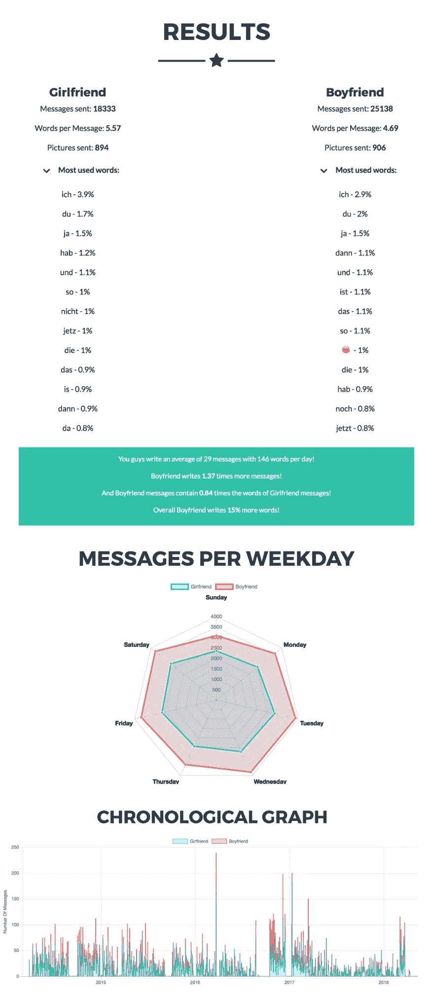
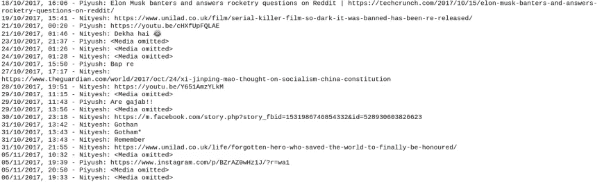
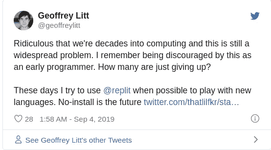
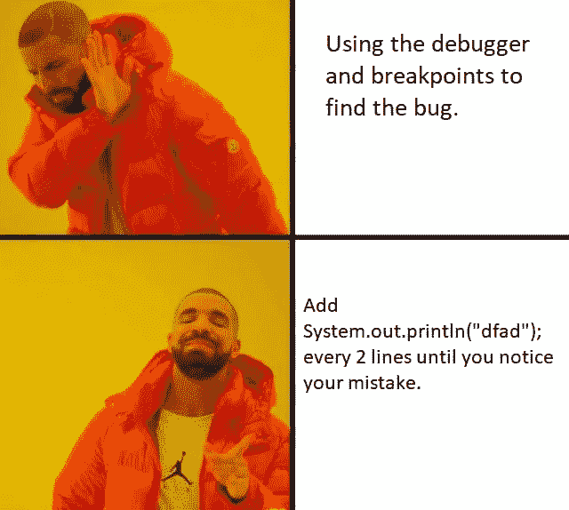

# 通过构建 WhatsApp 聊天分析器来提高您的 Python 技能

> 原文：<https://betterprogramming.pub/https-medium-com-nityeshagarwal-whatsapp-chat-analyser-a-guided-project-7d21e033109d>

## 这是一个指导性的项目，可以帮助你创建一些很酷的东西，并自学有用的编程概念！


在之后*才找到应用你的知识的方法学习过程本质上意味着学习是在没有太多目标感的情况下进行的。我们所做的就是尽我们所能积累所有的知识，希望这些知识能在遥远而神秘的未来派上用场。*

那感觉不像是拖延症吗？

[我相信一种强调*做*项目](https://www.buildtolearn.club/)的学习方法。

当你试着做一些东西时，你会发现一百件你不知道的事情。你会发现一些你以为自己知道但实际上并不知道的事情。你被看起来如此简单的事情绊倒，你甚至没有注意到它们。你填补了你学习中的空白。

还有，超级好玩，冒险。

只有做一个项目，你才能得到这一切。所以我认为把你的整个学习集中在完成一个项目上是值得的。

如果你想深入构建一些有趣的东西，并在此过程中学习有用的 Python/编程技能，本指南就是为你准备的。

通过这篇指南，我的目标是带你构建一些有趣的东西，让你在构建的时候体验难以理解的编程直觉。希望你能从一个基础的 Pythonista 变成一个高级的。

但是，最重要的是，我想给你动力，激励你自学。

## 你会学到什么

这里有一些你会学到的课本技能:

*   文件处理
*   Python 中的字符串操作
*   功能
*   模块
*   pip 和使用第三方软件包
*   Python 中的正则表达式(RegEx)

但这不是教科书。因此，除了这些，你还会对良好的编程实践产生直觉，比如:

*   代码可读性和编码风格的重要性
*   何时以及如何将代码分解成函数
*   如何调试你的代码(当你想用头撞墙的时候)
*   如何在互联网上查找资料——使用谷歌，使用堆栈溢出，阅读文档等。
*   理解对不同数据结构的需求以及何时使用什么

那我们就开始吧。

## 问:“好吧，我在建造什么？”😃

好吧，我有个想法:

当你和一个亲密的朋友聊天时，你有没有想过要知道:

*   你们每个人发送的消息数量
*   您的邮件的平均长度
*   谁先发短信，每次对话的第一条短信是什么
*   你的聊天时间模式——每小时、每天和每月
*   共享最多的网站链接
*   你们每个人最常用的词

如果你能写一个程序来帮你计算这些东西，那不是很酷吗？

## 问:“但它真的有多酷？”😒

[Reddit 说这是“14k 积分”酷！](https://www.reddit.com/r/dataisbeautiful/comments/8fl589/i_built_a_tool_to_visualize_whatsapp_chats_here/)



你的程序会找到相似的结果，并打印出来，但没有那些图表和视觉效果。

## 问:“酷！但是我准备好了吗？”😳

> “你认识的每一个伟大的开发人员都是通过解决他们没有资格解决的问题而获得成功的，直到他们真正做到了。”
> 
> 帕特里克·麦肯齐

沿着这些思路思考，我相信:

*   如果你知道 Python 中的以下基础知识——变量、列表、字典、循环、条件、函数——你就准备好了。
*   否则，如果你是 Python 新手，但知道一些其他语言的基础知识，请浏览一下[这个快速 Python 教程](https://www.w3schools.com/python/)——我想你会准备好的。

只需进入下面的第一个“你好，世界”等价练习。如果你能完成它，你就准备好了。

## 问:“我将如何构建它？”😕

WhatsApp 允许你[将任何聊天内容](https://faq.whatsapp.com/en/wp/22548236)导出到一个文本文件中，如下所示:



所以你可以写一个程序来读取这个聊天文件，解析它，分析它，并给你结果。

但这还不够，对吗？

*“好，那就这么办吧。”* **😃**

# 构建 WhatsApp 聊天分析器的路线图

## MS0:设置您的环境

当你开始时，你不想花几个小时来设置你的环境。你的一半动力就在那里被扼杀了，对吗？

[Repl.it](http://repl.it/) 是摆脱这种设置挫折的方法。

这是一个为几乎所有语言提供在线 IDE 的网站，你只需点击几下鼠标就可以免费访问。它非常适合像我们正在建设的这种小型项目。



## MS1:事物工作的保证(“你好，世界！”等效)

每本编程书籍/教程都会以“你好，世界！”程序。为什么会这样呢？

除了欢迎新来的人，这个项目还能让学习者放心，她的环境已经设置好了，一切正常。所以如果她做得对，她的程序也会成功。

带着这些目标，这是你的“你好，世界！”-等效程序:

打印`"I love you 3000"` 3000 次。(有漫威的粉丝吗？)

**这是一个深入的好机会:**

*   看看你是否准备好深入这个项目

如果没有，那么是时候做 Python 的基础了。别担心，这并不太难。

## MS2:用你的 Python 程序阅读你的聊天文件

从这里开始，你将为项目的每个章节构建一个片段。

这个项目需要两个文件

1.  您的 Whatsapp 聊天文件(以`.txt`结尾)
2.  一个 Python 代码文件(以`.py`结尾)

> *一旦你有了它们，第一章要求你使用 Python 程序打开聊天文件并打印其所有内容。*

**这是一个深入的好机会:**

*   了解如何用 Python 处理文件

## Python 中的文件处理——从零到英雄:

你知道你用来在你的电脑上打开一个文本文件的任何编辑器(记事本，VS 代码，Vim 等等。)是程序吧？

你猜怎么着—你可以让你自己的 Python 程序来做这件事。几乎很容易！

通过阅读[这篇由 Real Python 编写的优秀教程](https://realpython.com/read-write-files-python/)来学习 Python 中文件处理的概念。

## MS3:功能#1 和#2 —统计消息总数和单词总数

计算你和你的朋友交换的信息数量。

然后，根据信息的数量和字数来计算你的个人分享。

打印结果。

**这是一个深入的好机会:**

*   理解 Python 中的字符串

**关于 Python 中的字符串需要记住的重要事情:**

*   字符串被视为列表。所以你可以这样搜索:

```
if "- Paridhi:" in chat_line: 
    counter+=1
```

*   Python 字符串之所以出名(与其他语言中的字符串相比)，是因为 Python 为它们提供了丰富的内置方法库，您可以使用这些方法对它们执行操作。我建议你用 W3Schools 的[这个教程作为那些方法的参考资料。](https://www.w3schools.com/python/python_ref_string.asp)
*   Python 的[切片和负索引字符串的能力](https://developers.google.com/edu/python/strings#string-slices)有时真的很方便

***注意*** *:* 现在开始，你会感觉到你的程序越来越大，越来越复杂。在这种情况下，您应该开始注意自己的编码风格，并牢记代码的可读性。

**代码的编码风格和可读性:**

Brian Kernighan 在他的书《编程的实践》中说

> *风格的目的是让代码对自己和他人来说易于阅读，好的风格对好的编程至关重要。*

**就我个人而言，每当我试图对代码的可读性做出决定时，来自“[Python 的禅宗](https://www.python.org/dev/peps/pep-0020/)”的这句话就会在我的脑海中出现:**

> **“显性比隐性好。”**

**这里有三个简单可行的规则，你可以牢记在心，以培养良好的编码风格:**

****1。考虑选择变量的名字****

**我发现布莱恩·柯尼根的建议很有帮助:**

*   **全局函数、类和结构应该有描述性的名字来暗示它们在程序中的角色**
*   **相比之下，对于局部变量，较短的名称就足够了；在一个函数中，`n`可能就足够了，`npoints`就可以了，`numberofPoints`就有点过了**
*   **以常规方式使用的局部变量可以有非常短的名字。将`i`和`j`用于循环索引，将`p`和`q`用于指针，将`s`和`t`用于字符串是如此频繁，以至于在更长的名字中几乎没有利润，甚至可能有一些损失。**

****2。必要时使用功能****

*   **将长段代码分解成函数**
*   **不要重复自己(干)——使用函数删除重复的代码片段**

**下一章将详细介绍函数。**

****3。写下有用的评论****

*   **注释是为了帮助程序的读者。他们不会说代码已经说得很清楚的事情，或者反驳代码，或者用复杂的印刷展示来分散读者的注意力。**
*   **尽可能多的写通俗易懂的代码；你做得越好，你需要的评论就越少。好代码比坏代码需要更少的注释。评论充其量是一种必要的罪恶。**
*   **不要抵触守则。大多数注释在编写时都与代码一致，但是随着错误的修复和程序的发展，注释通常会保持原来的形式，导致与代码不一致。**

**最后，请记住，编程风格的原则是基于由经验指导的常识，而不是基于任意的规则和规定。**

## **MS4:功能 3——计算每一方发送的消息的平均长度**

**现在，您已经使用两个指标计算了您的个人份额——消息计数和字数——您可以使用它来计算每个消息的平均长度。打印结果。**

****这是一个深入的好机会:****

**将功能理解为一种手段:**

*   **减少重复**
*   **让代码更具可读性**

## **深入探究使用功能——动机和风格:**

**复制可能是软件中所有罪恶的根源。功能是控制这种邪恶的第一批技术之一。**

**理解编写函数的语法很容易，但是需要实践和一些设计意识来学习何时将代码分解成函数。一个目标是设计函数，以便在将程序扩展到新的情况时可以重用它们。**

**还有什么？做出这样的设计选择是编程的乐趣所在。**

**以下是来自[鲍伯·马丁的《干净代码](https://www.goodreads.com/book/show/3735293-clean-code)》一书的三条启发，将指导你做出这样的选择:**

1.  ****职能应该不大。**多小？不超过一屏——或者 20 行。**
2.  ****函数应该有描述性的名字**。函数越小越集中，就越容易选择一个描述性的名字。不要害怕让名字变长。一个长的描述性的名字比一个短的神秘的名字更好。一个长的描述性名称比一个长的描述性注释更好。**
3.  ****函数应该只做一件事**并且没有副作用——从它的名字就可以清楚地看出它的意图。**

**当你第一次写一个函数的时候，它可能会很长很复杂，并且不遵循上面的任何规则。这没关系。您可以在以后改进和重新格式化您的代码。我不认为任何人可以从编写遵循上述所有规则的函数开始。**

**记住这些是你需要努力实现的功能建设目标。不要让他们麻痹你。**

## **MS5:功能#4 —计算第一个文本的数量，并显示出来**

**你想一劳永逸地解决谁先发短信的问题吗？

过了这个里程碑，你就。**

**你会确切地知道你们每个人发起了多少次对话，并有一份第一条短信的清单。把这些都打印出来。**

****这是一个深入的好机会:****

*   **理解模块——这里你需要 Python 的`time`模块**
*   **学习如何查找和阅读文档**

****告诫**:不要被文件吓倒。他们是你的朋友。**

****什么是模块？****

**名称以. py 扩展名结尾的每个 Python 源代码文件都是一个模块。**

**Python 安装附带了一个标准库，其中包含这种现成的模块。这些都是有用的代码，你不必去写。**

## **MS6:功能#5 —聊天时间模式(每小时、每天和每月)**

**现在，是时候找出你通常的聊天模式了。**

***你一天中最常聊天的时间是什么时候？剩下的时间呢？**

***你通常在一周的哪一天聊天最多？剩下的日子呢？**

***你们哪个月聊的最多？其余的呢？**

**打印结果。**

****这是一个深入的好机会:****

*   **理解存储所有这些数据需要不同的数据结构，并思考如何设计一种数据结构来满足您的需求**

****注意**:这里你还需要`time`模块。重要的是你知道不记得也没关系；你可以使用谷歌，根据需要多次查看文档。**

**小心:实现这一点可能相当棘手。你很可能会花大部分的编码时间在破碎的代码上。记住:有问题的不是计算机，而是你的代码。**

**如何调试您的代码:**

1.  ****向朋友解释代码或使用橡皮鸭技术****

*   **选一个朋友(或者一只橡皮鸭)**
*   **打开有问题的代码，一行一行慢慢耐心地给他解释(/她/它)**
*   **发现问题盯着你，在你的脸上，没有你的朋友(或鸭子)的任何帮助，就像变魔术一样**

**2.**添加打印报表****

****

**尽管添加这样的打印语句不是调试的正确方法，但我发现它们有时非常有效——尤其是当我使用像 VIM 这样的文本编辑器而不是在一个有调试器的成熟 IDE 上工作时(或者当你懒得学习如何使用调试器时)。**

**但是我不得不说，一旦你学会了如何使用 IDE 调试器，就没有回头路了。**

****3。使用 IDE 调试器****

**截至发稿时，repl.it 还不完全支持调试器。我最喜欢的支持 Python 的 ide 是 PyCharm 和 VS Code。**

**调试器非常有用，因此我建议您进行切换，并学习如何在其中使用调试器。相信我，这完全值得(尤其是现在你的代码相当复杂。)**

**个人建议:我使用 IDE 调试器是因为 Python 在标准库模块中提供了一个调试器——*`pdb`* *——我建议你现在不要开始使用它。**

## **MS7:功能#7 —最常分享的网站**

****这是一个深入的好机会:****

*   **学习正则表达式**
*   **将 Python 字典理解为传统哈希表:从网站名称到出现次数的映射**

****正则表达式快速介绍:****

**正则表达式是描述搜索模式的特殊文本字符串。**

**您可能熟悉通配符表示法，如`*.txt`，用于在文件管理器中查找所有文本文件。你可以把正则表达式想象成类固醇上的通配符。它们允许您搜索:**

> **我想要在`"http://"`或`"https://"`和之后的第二个`/`之间的所有字符串，如果有的话。要不，第一个`/`。**

***下面是一些我最喜欢的学习 RegEx 的资源:***

*   ***[RegexOne——学习 RegEx 的交互式教程](https://regexone.com/)***
*   ***[“Python 中正则表达式的介绍](https://scotch.io/tutorials/an-introduction-to-regex-in-python)”***
*   ***[Python 的文档](https://docs.python.org/3/howto/regex.html)——它把它们称为“嵌入在 Python 中的微小的、高度专业化的编程语言”***

## ***MS8:功能#8 —最常用的单词***

***我会让你自己解决这个问题的！***

## ***MS9:用漂亮整洁的表格打印以上所有内容***

***您必须使用一些打印语句来打印每个里程碑的结果。现在，是时候关注这些结果的展示了。将以上所有结果打印在漂亮整洁的表格中。***

***为此，您可能需要重新构建大部分代码，以便将打印语句从函数定义中分离出来(假设您还没有这样做)。***

*****这是一个深入的好机会:*****

*   ***意识到当人们建议“功能应该只做一件事”时意味着什么***
*   ***学习搜索、安装和使用第三方模块，这些模块是 Python 令人敬畏的、充满活力的社区通过 pip 提供的***
*   ***用你设计桌子的方式给这个项目注入个人风格***

*****Python 丰富的开源第三方包生态系统快速入门:*****

***Python 的生态系统有贡献者，从个人开发者到像脸书和谷歌这样的大公司(丰富的生态系统，嗯？).他们提供模块和代码库来帮助网站建设、数字编程、游戏开发、数据科学、机器学习、深度学习，以及打印漂亮的表格。***

***现在，这是一大堆你不必写的代码。***

***PyPI 是所有这些第三方 Python 包的家。您可以在这里找到每个开源第三方软件包的页面。***

***这里有一些东西可以帮助您快速使用 PyPI:***

*   ***您可以使用一个简单的终端命令— `pip`来安装每个软件包。您可以在 PyPI 中找到您需要在包的页面上键入的内容。***

```
***pip install tabulate***
```

*   ***任何好的软件包在 PyPI 页面上都有使用指南(或文档)***
*   ***即使是新手也可以发布他们的实验包。在使用它们之前你应该小心；它们可能不完整或未经维护。您可以查看一个包的发布历史或它的 GitHub 统计数据来确定它的可信度。***

## ***MS10:让所有这些都适用于群聊文件***

***有了这个里程碑，您就可以将您的计划扩展到一个新的领域——群聊。到目前为止，您将拥有一个与一个朋友的直接消息聊天文件。现在，您将修改您的程序，以便它也能与 WhatsApp 群聊文件一起工作。***

*****这是一个深入的好机会:*****

*   ***评估你的功能。你能重用其中的一些吗？***
*   ***感受好的编码风格和好的编程实践的好处***
*   ***看到版本控制系统的重要性并学习 Git***

# ***好软件***

***记住 Brian W. Kerninghan 在他的书*中对好软件的描述会对你有所帮助:****

> ****构成优秀软件基石的基本原则是简单性，它使程序简短且易于管理；清晰，这确保它们易于理解，对人和机器都是如此；一般性，这意味着他们在各种情况下都能很好地工作，并能适应新的情况；自动化让机器为我们工作，把我们从平凡的任务中解放出来。****

****好吧，我希望这对你有用。一旦你真的开始自己做这个项目，你就会真正理解本指南中的所有小课程。****

****这里有一些代码可以帮助您起步:****

****不要害怕开始，因为当你陷入困境时，事情会变得困难。那就是冒险；每次把自己挖出来都会觉得超级爽。****

****此外，您可以在 [Build To Learn Slack group](https://join.slack.com/t/build-to-learn/shared_invite/enQtMzg3MzYyNTA5MjAzLTkwMGYyYTljOTdkNTIzODJhNTlkZWQxMTZkODJmY2YxMTQ4OTVkODM1MTVlM2FmYTE0MzkwODhhYTc5MDc4YmI) 中告诉我或您的学习伙伴您的疑问(请随时使用[给定链接](https://join.slack.com/t/build-to-learn/shared_invite/enQtMzg3MzYyNTA5MjAzLTkwMGYyYTljOTdkNTIzODJhNTlkZWQxMTZkODJmY2YxMTQ4OTVkODM1MTVlM2FmYTE0MzkwODhhYTc5MDc4YmI)加入)。****

****作为结束语，我希望您在从事这个项目(或任何其他编程项目)时，记住 Jen Simmons 的话:****

****Whatsapp Chat Analyser 是我在系列文章的上一篇文章中提到的 [20 个酷编程项目之一—](https://dev.to/nityeshaga/fantastic-programming-project-ideas-and-where-to-find-them-the-beginner-friendly-version-9d5) [Build To Learn](https://www.buildtolearn.club/) 。如果你想让我为其他人做类似的指导，欢迎在下面评论或者直接联系我！****

****订阅 [Build To Learn 简讯](https://buildtolearn.substack.com/)以便在我撰写新指南和文章时收到电子邮件。****

****你可以在 Twitter 和 LinkedIn 上联系我。****