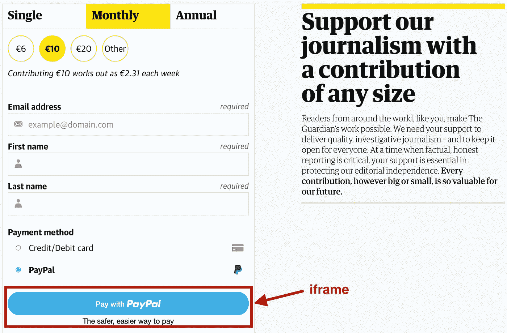
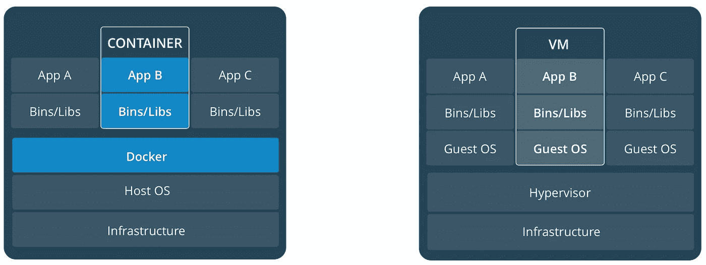
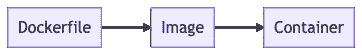
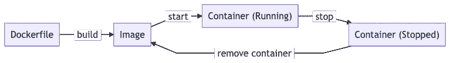

# 用前端术语解释 Docker

> 原文：<https://betterprogramming.pub/https-medium-com-ozantunca-explaining-docker-in-frontend-terms-9d8d2b282ed8>

帕特里克·布林克斯玛在 [Unsplash](https://unsplash.com/photos/PnOhIxlmdRA) 上的照片

我们前端开发人员已经习惯了处理流行词汇和不断增加的要学习的技术。多年来，我们已经被一个又一个库轰炸了——而且每一个库都结合了许多具有矛盾方法的框架。

如果你已经在这个行业呆了几年以上，很可能你的脸皮已经开始因为这个行业对我们的花言巧语而变厚了。我们听说了码头工人、库伯内特斯、集装箱化和所有其他的东西。它们听起来都是非常复杂的概念，但是不要觉得有什么特别。在这篇文章中，我将解释你听到最多的一个。

这篇文章是写给前端开发人员的，他们想了解 Docker 到底是怎么回事，并想看看如何利用 Docker 来改进他们的日常工作。

我并不期望你比一般的前端开发人员拥有更多的知识。请注意，本文更多的是对 Docker 主要特性和用例的理论解释，而不是关于如何实现它们的实践教程。

# 术语

在我开始详细解释之前，让我们先快速浏览一下术语。

*   **容器:**容器是一个标准的软件单元，它封装了代码及其所有依赖关系，因此应用程序可以快速可靠地从一个计算环境运行到另一个计算环境。
*   **映像:**映像是一个不可更改的静态文件，包括可执行代码及其所有依赖关系，操作系统除外。当执行一个映像时，它会创建容器，使用该映像中的文件运行该映像中的代码。
*   **容器化:**将可执行代码封装在容器内，并在虚拟环境(如云)中运行这些容器的过程。

Docker 是一个容器化解决方案，所以我们需要从解释什么是容器以及它们如何工作开始。

# 那么容器到底是什么呢？

你可以把容器想象成一种虚拟机或者一个`iframe`。与`iframe`非常相似，容器的目的是将内部的进程和代码执行与外部干扰隔离开来。

在前端世界中，当我们出于许多原因想要将外部资源与我们的网站隔离时，我们使用`iframes` 。有时这是为了确保 CSS 或 JavaScript 执行不会有任何不必要的冲突；其他时候是为了在宿主和导入的代码之间加强一个安全层。

例如，我们将广告单元放在 iframes 中，因为它们通常由不同的团队甚至不同的公司构建，并且独立于管理主机网站的团队部署。在这种情况下，几乎不可能管理双方之间的 CSS 和 JS 冲突。

另一个用例是加强安全性。你在下面看到的 PayPal 按钮被放置在一个 iframe 中，以确保主机网站无法访问你在 PayPal 帐户上的任何信息。它甚至不能为你点击那个按钮。因此，即使你支付的网站被黑了，只要贝宝本身安全，你的贝宝也是安全的。

来自[guardian.co.uk](http://guardian.co.uk)的支付屏幕

Docker 最初的用例是一样的。您可以将两个应用程序从彼此的进程、文件、内存等中分离出来，即使它们运行在同一台物理机器上。例如，如果一个数据库在 Docker 容器中运行，另一个应用程序就不能访问该数据库的文件，除非数据库容器希望它这样做。

## 所以 Docker 容器是虚拟机？

有点——但不完全是。

虚拟机运行自己的操作系统。这允许您在同一台计算机上运行 macOS、Linux 和 Windows，这很神奇，但不是很高效，因为这些操作系统的边界必须非常精确地定义，以防止可能的冲突。

但是对于大多数意图和目的，容器不需要完全独立的操作系统。他们只是需要隔离。

https://docs.docker.com/get-started/

因此，Docker 所做的是在 Linux 上使用内核级隔离来隔离应用程序的资源，同时赋予它底层操作系统的功能。容器共享操作系统，但是保持它们的独立资源。

这意味着更好的资源管理和更小的图像尺寸。因为一旦你把资源管理交给 Docker，它就能确保容器不会使用比它们需要的更多的 RAM 和 CPU，而如果你使用一个虚拟机，你就需要把一定数量的资源分配给虚拟机，不管它们是否总是使用它们。

我们开始了:我们现在知道了什么是 Docker 和什么是 Docker 容器的基本知识。但是隔离仅仅是开始。一旦我们获得了这些高性能的隔离容器和一个强大的资源管理器(Docker)来管理它们，我们就能够进行下一步了。

# 可再生容器

Docker 做得很好的另一件事是为我们提供了一种以声明方式重新构建容器的方法。

我们所需要的是一个`Dockerfile`来定义 Docker 应该如何构建我们的容器，我们知道我们每次都会得到相同的容器，不管底层硬件或操作系统如何。想想在所有桌面和移动设备上实现响应式设计有多复杂。如果有可能确定你需要什么，并且在任何地方都可以毫不费力地得到它，你难道不喜欢吗？这就是 Docker 试图完成的任务。

在我们进入一个真实的用例之前，让我们快速回顾一下 Docker 的生命周期，了解当。

## Docker 容器的生命周期

这一切都从一个`Dockerfile`开始，它定义了我们希望 Docker 如何构建容器将基于的图像。请注意下面的流程:

Docker 使用`Dockerfile`构建图像。它获取文件，执行命令，做任何在`Dockerfile`中定义的事情，并将结果保存在一个静态文件中，我们称之为`image`。Docker 然后使用这个映像并创建一个容器来执行预定义的代码，使用该映像中的文件。因此，通常的生命周期如下所示:

让我们用一个真实的用例来解开这个谜团。

## 对持续集成(CI)运行测试

Docker 在前端开发中的一个常见用例是在将新代码部署到产品之前，在持续集成上运行单元或端到端测试。当编写代码时，在本地运行它们是很好的，但是在隔离的环境中运行它们总是更好，以确保无论计算机设置如何，您的代码在任何地方都可以工作。

此外，我们都有这样一个队友，他总是跳过测试，只推代码。因此，CI 设置也有助于控制每个人。下面是一个非常基本的容器设置，它将在您运行容器时运行您的测试:

让我们检查一下那里的命令，以了解发生了什么。

`FROM`用于定义要构建的基础图像。公共 Docker 注册表中已经有很多图片。`FROM node:12`去公共注册中心，抓取一个安装了 Node.js 的图像，并把它带给我们。

`COPY`用于将文件从主机复制到容器中。记住，容器有一个独立的文件系统。默认情况下，它无权访问我们计算机上的任何文件。我们运行`COPY . /app`将文件从当前目录复制到容器内的`/app`目录。您可以选择任何目标目录。这里的这个`/app`只是一个例子。

`WORKDIR`基本上就是我们从基于 UNIX 的系统中知道的`cd`命令。它设置当前的工作目录。

`RUN`相当直截了当。它在我们构建的容器中运行下面的命令。

`CMD`有点类似于`RUN`。它还在容器内部运行以下命令。但是它不是在*构建*时运行，而是在*运行*时运行命令。您提供给`CMD`的任何命令都将是容器启动后运行的命令。

这就是我们的`Dockerfile`构建一个容器的模板所要做的一切，该容器将设置 Node.js 环境并运行`npm test`。

当然，这个用例只是容器拥有的众多用例之一。在现代软件架构设置中，大多数服务器端服务要么已经在容器中运行，要么工程师们已经计划迁移到该架构。现在我们将要谈论这些`images`帮助我们解决的也许是最重要的问题。

# 可量测性

这是我们前端开发者经常忽略的。这是因为尽管后端代码只在少数几台服务器上为所有用户运行，但我们编写的代码在一台单独的机器上为我们的每个用户运行。他们甚至购买那些机器(个人电脑、智能手机等。)来运行我们的代码。这是我们前端开发人员所拥有的，而后端开发人员却没有的惊人的奢侈。

在服务器端，可伸缩性是一个真正的问题，需要对基础架构和预算进行大量规划。云技术使得创建新的机器实例变得更加容易，但是让他们的代码在一台全新的机器上工作仍然是开发人员的工作。

这就是我们一贯可再生的容器派上用场的地方。感谢 Docker 为我们构建的`image`,我们可以部署任意多的容器(或者我们可以支付得起)。不再需要创建新的虚拟机、安装所有依赖项、传输代码、设置网络权限，以及我们过去为让服务器运行而采取的许多步骤。我们已经在`image`中完成了所有这些工作。

# 结论

在过去的几年里，Docker 无疑革新了我们开发和部署软件的方式。我希望我已经阐明了它受欢迎的原因。

毫无疑问，容器化及其带来的思维方式将继续影响我们在未来几年构建软件的方式。

## 进一步阅读

*   [Docker Docs (T1)](https://docs.docker.com/get-started/)
*   Docker 容器的生命周期(T3)

[奥赞·通卡(Ozan Tunca)](https://ozantunca.org)