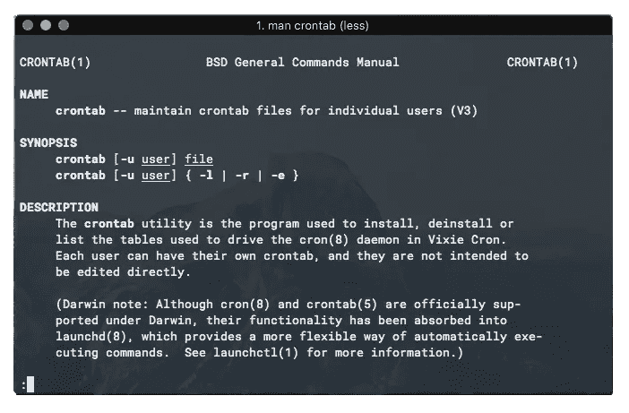
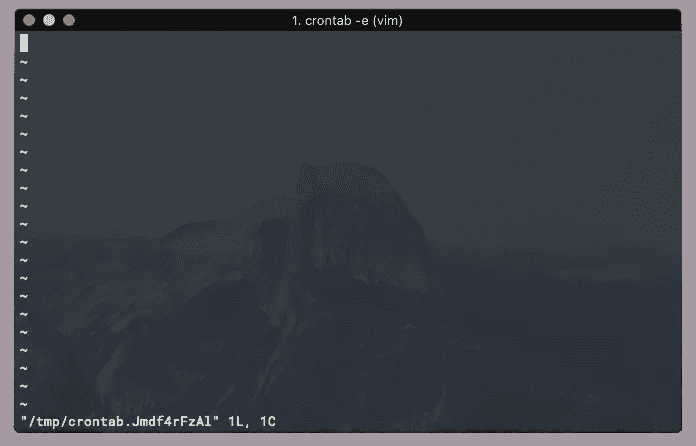
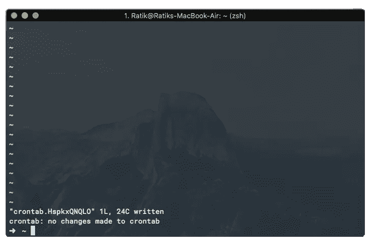

# 在 macOS 上使用 Crontab 调度作业

> 原文：<https://betterprogramming.pub/https-medium-com-ratik96-scheduling-jobs-with-crontab-on-macos-add5a8b26c30>

## 在你的电脑上运行脚本是很棒的。自动运行它们甚至更好



$ man crontab

通过创建 cron 作业可以在 macOS(和 Linux)上实现自动运行！让我们做一个例子。

假设您想运行一个名为`work.sh`的脚本，它会为您做一些工作——不管是什么工作。你想每小时每十五分钟，每天都做这项“工作”。

我会这样做来实现这个目标。

# 第一步

确保`work.sh`正常工作，并且在你保存助手脚本的地方。对我来说，他们通常在`~/.scripts`。

# 第二步

接下来，启动终端并运行`crontab -e`。这将为您在`vim`打开一个文件。这个文件实质上是您可以列出 cron 作业的地方——每个作业占一行。



crontab -e 的结果。

设置 cron 作业需要特定的格式。

```
* * * * * command* - minute (0-59)
* - hour (0-23)
* - day of the month (1-31)
* - month (1-12)
* - day of the week (0-6, 0 is Sunday)
command - command to execute(from left-to-right)
```

你也可以使用像 [Crontab.guru](https://crontab.guru/) 这样的网站来生成 cron 表达式。

# 第三步

一旦你进入`vim`屏幕，点击`i`将编辑器置于`INSERT`模式，然后将`0,15,30,45 * * * * cd ~/.scripts && ./work.sh`放在第一行。这个表达式评估我们想要的工作。

抓住你了…

*   确保`work.sh`可执行。

# 第四步

键入 cron 表达式后，点击`esc`，然后键入`:wq`保存并退出`vim`。

如果你做了所有正确的事情，你应该看到终端告诉你它安装了一个新的`crontab`。如果它告诉您安装失败，请仔细检查您的 cron 表达式。



成功！

# 第五步

就是这样！全部完成！

# 奖金

1.  要查看您的活动 cron 作业，您可以使用`crontab -l`命令。
2.  例如，如果你想使用 cron 作业*，*运行 Python 脚本，你将不得不处理一些额外的复杂性。您应该通过两个脚本来进行设置，即 Python 脚本和运行 Python 脚本的可执行 shell 脚本。这样，您可以保持 cron 表达式简短，甚至可以增加一些模块化。
3.  在上面提到的场景中，在执行 Python 脚本的调用中，确保您指向的是 Python 可执行文件在 shell 脚本中的位置，而不是 Python 别名。所以，应该是类似`usr/bin/python script.py`的东西，而不是`python script.py`。
4.  您可以通过运行`which python`找到您的 Python 可执行文件的位置。

希望这篇帖子有所帮助！祝你好运，继续黑客！