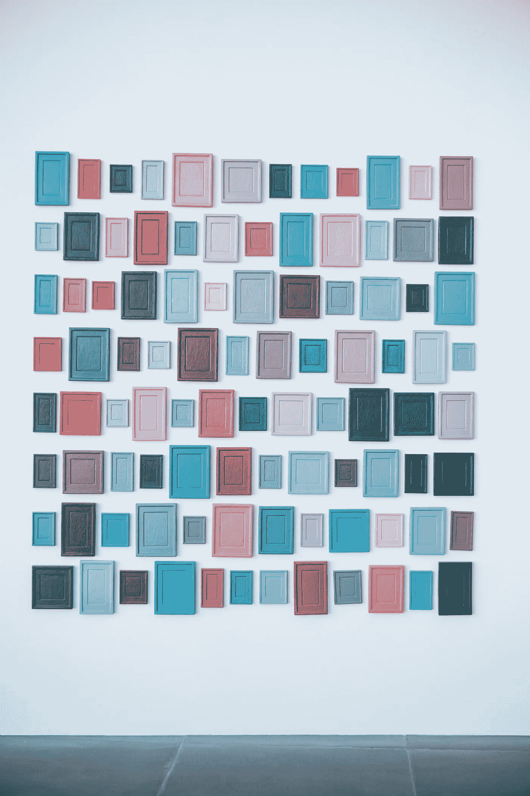

# 针对新兵训练营学生和新程序员的 37 个应用创意

> 原文：<https://betterprogramming.pub/https-medium-com-sylwiavargas-37-app-ideas-for-bootcamp-students-code-newbies-5000f4b6dba9>

## 用激情项目练习你的编码技能

马库斯·斯皮斯克在 [Unsplash](https://unsplash.com/s/photos/frames-wall?utm_source=unsplash&utm_medium=referral&utm_content=creditCopyText) 上的照片

以下是我想到的一些应用程序创意。随意拿走它们，尝试它们，做一些能照亮你内心的东西。

我添加表情符号是为了让你更容易识别那些可能成为你的激情项目的应用:
💕帮助他人/更多朋友
🌍可持续发展的世界
👩🏾‍⚖️社会正义
🧞‍♂️日常实用
🎁多方面的

# 37 个应用创意:

1.  👩🏾‍⚖️ 🧞‍♂️ 💕一个定位最近的 MTA 电梯站的应用程序。
2.  🌍 💕食物分享应用——分享你不会吃的食物。*加成:*也许是餐厅加入的选项和单独的 UI？
3.  💕一款帮助你与陌生人进行随机即兴游戏/挑战/对话的应用程序——它可以使用地理定位来查看是否有其他应用程序用户在附近。
4.  🧞‍♂️是一款为无聊的人设计的应用程序，可以发送有趣的活动、脑筋急转弯或愚蠢的挑战。
5.  🧞‍♂️ 💕结对编程应用程序，帮助你建立富有成效的合作*奖金:*责任检查。
6.  🎁像这样的免提游戏:[https://duck hunt-handsked . glitch . me](https://duckhunt-handsfree.glitch.me/)。
7.  🎁类似于 https://www.affirmations.madewithtech.com/的 lorem ipsum 生成器
8.  🧞‍♂️ 💕一个基于测验的网站，挑战你将函数转换为箭头函数，在 JavaScript 和 Ruby 之间使用析构或转换方法
9.  🧞‍♂️是一个新闻网站，它使用 IBM Watson 来判断一条给定的新闻是否感到愤怒，等等。
10.  🧞‍♂️ 👩🏾‍⚖️ 💕帮助患有计算障碍的人确定他们钱包里有多少钱的页面
11.  🎁生成蒙德里安随机绘画的页面。或者索尔·路易特。或者波拉克。
12.  🧞‍♂️一个应用程序/扩展，可以帮助你保存书签的链接。
13.  🧞‍♂️ 💕一个 Alexa 的技能，告诉你每天美好的事情。也许它们在某种程度上是个性化的？
14.  🎁某种网上寻宝。*奖励:*💕有一个与他人交流的选项？
15.  🌍一个应用程序，可以计算你的购物/一般习惯会产生多少碳足迹，并教育你生态生活方式。
16.  🌍一个计算你的衣服过去用了多少水的应用程序(也许邀请其他人也这样做？)
17.  🎁一些音乐史/游戏史/社会公正的互动时间线。
18.  🎁创建报纸头版的网站，包含您选择的新闻或您上传的媒体。
19.  🎁一个为刚搬到这个城市的人开发的应用程序，可以响应地理定位并发送关于这个地区的信息。
20.  🎁一种游戏，你得到某人的浏览器搜索历史，并在此基础上，邀请你对这个人进行一些猜测。
21.  👩🏾一款名为[游戏 Reddit](https://www.reddit.com/r/gaming/) 的扫描应用程序会寻找最常见的性别歧视评论，然后检查一个宾果棋盘，如果超过 30%的棋盘被检查，就会自动发送评论，就像这样:[https://www.pinterest.com/pin/195625177536611475/](https://www.pinterest.com/pin/195625177536611475/)
22.  👩🏾‍⚖️ 💕只需点击一下，一个应用程序就可以帮助你立即报告不平坦的人行道。
23.  🎁一款运动鞋/万智牌卡片交易应用。
24.  🎁一款帮你建立电影制作点名的 app。
25.  🧞‍♂️是一款帮助你跟踪在线订阅的应用。*好处:*免费试用结束时，它会发送通知。
26.  💕一个应用程序，可以帮助你和你的团队记录本周你得到的错误 bug，并邀请你在每 100 个 bug 时作为一个团队庆祝。
27.  🎁一个每天给你发送推送通知/邮件的网站，里面有一些非常具体的琐事。
28.  🎁 🧞‍♂️ 💕产生 app 创意的 app。
29.  🧞‍♂️一款提醒你给植物浇水/移动的应用程序。
30.  🎁一个疯狂的占星应用程序。
31.  👩🏾‍⚖️ 🧞‍♂️ 💕一个应用程序，可以帮助你找到最近的可用浴室，允许你对其清洁度/可达性进行评级，留下评论，并有一个不分性别的浴室过滤器。
32.  🎁 👩🏾任何 [OpenDataNYC](https://opendata.cityofnewyork.us/) 的‍⚖️数据可视化。
33.  👩🏾‍⚖️ 🧞‍♂️ 💕社会正义战士的约会应用。
34.  🧞‍♂️ 💕一个会议安排应用程序，迫使你在议程中加入每 3 小时 15 分钟的休息时间和一小时的午餐休息时间。
35.  👩🏾‍⚖️ 🧞‍♂️ 💕一种拼车应用程序，可以防止司机取消对残疾人或 PoC 的预订。
36.  👩🏾‍⚖️是一个松散的聊天机器人，它可以纠正你的信息中的包容性语言。
37.  🧞‍♂️是一个天气应用程序(推迟判断),它实际上告诉你如何穿衣——由于湿度的原因，纽约的 50 华氏度和柏林的 50 华氏度差别很大。